# Incident Response Agent — Product Requirements Document

**Single consolidated document: Part 1 (Product) · Part 2 (Technical) · Part 3 (Architecture & Diagrams)**

| Field | Value |
| --- | --- |
| Product name | Incident Response Agent |
| Document | PRD — consolidated single file |
| Hackathon theme | **AI Agents That Learn Using Hindsight** |
| Mandatory technology | Hindsight (by Vectorize) as the agent memory system |
| Team size | 6 |
| Status | Part 1 and Part 2 — accepted as the source of truth. Part 3 — architecture and visual specification. |

---

## DOCUMENT MAP

| Part | Scope | Sections | Role |
| --- | --- | --- | --- |
| **Part 1** | Product requirements | 1 – 18 | Source of truth for product intent, scope, workflow, success criteria, and acceptance. |
| **Part 2** | Technical requirements | 1 – 28 | Source of truth for how the product is built. |
| **Part 3** | Architecture and visual specification | 1 – 32 | Visual specification of the system defined by Parts 1 and 2. Adds no new capability. |

### Reading conventions used across all three parts

1. **Section numbering restarts in each part.** A reference such as "§11.2" is always qualified by its part when ambiguity is possible: "Part 2 §11.2". Part 3 states its own convention in §0.3.
2. **Identifier prefixes are globally unique** and are never redefined outside their defining part (Part 2 §0.3).
3. **Precedence:** Part 1 governs product intent and scope; Part 2 governs technical construction; Part 3 governs visualization only. Where Part 3 appears to conflict with Part 1 or Part 2, **Parts 1 and 2 win** and the diagram is a defect to be corrected.
4. **No new capability, endpoint, field, or tool may originate in Part 3.** Every element shown in Part 3 exists in Part 1 or Part 2, or is explicitly marked as a proposal or a future possibility.

---
# Product Requirements Document — Part 1

## Incident Response Agent

**Hindsight-Enabled Incident Memory and Resolution Assistant for Site Reliability Engineers**

---

# 1. DOCUMENT CONTROL

| Field | Value |
| --- | --- |
| Product name | Incident Response Agent |
| Project type | AI agent prototype / MVP (hackathon project) |
| Project status | Draft — pre-build specification, Part 1 of 2 |
| PRD version | v0.1 (Part 1) |
| Target submission date | To be confirmed against the official hackathon submission deadline (see OQ-01) |
| Hackathon theme | **AI Agents That Learn Using Hindsight** |
| Mandatory technology | Hindsight (by Vectorize) as the agent memory system |
| Team size | 6 |
| Primary product owner | Product/Engineering lead (role-based designation; individual names are intentionally not recorded in this document) |
| Intended audience of this PRD | Hackathon judges and reviewers; the build team (engineering, demo scripting, documentation); anyone evaluating scope, feasibility, and alignment with the hackathon theme |
| Document purpose | Define **what** the Incident Response Agent must do, for **whom**, and how success will be judged — without prescribing system architecture, which is specified separately in Part 2 |
| Companion document | PRD Part 2 — Technical Architecture and Implementation Design (not covered here) |
| Related artefacts (planned) | Demo script, demo dataset, README, walkthrough video, submission write-up |

### 1.1 Scope of this document

Part 1 covers: product definition, user definition, workflow definition, functional requirements, and demonstrable acceptance criteria.

Part 1 deliberately excludes: system architecture, component design, model selection, memory-schema internals, data-store design, interface technology choices, and deployment topology. These are deferred to Part 2.

### 1.2 Convention used in this document

- **MUST / SHOULD / MAY** — RFC 2119 style requirement strength.
- Requirement IDs (`FR-xxx`), use case IDs (`UC-xx`), goal IDs (`G-xx`), non-goal IDs (`NG-xx`), success criteria IDs (`SC-xx`), acceptance criteria IDs (`AC-xx`), and open question IDs (`OQ-xx`) are stable and SHOULD NOT be renumbered once referenced elsewhere.
- All identifiers are scoped to Part 1.

---

# 2. EXECUTIVE SUMMARY

The Incident Response Agent is an AI-powered assistant for Site Reliability Engineers (SREs) and DevOps engineers who are investigating a live production incident. It is not a monitoring tool and not a general-purpose chat assistant. It is a **memory-driven investigation partner**: it reads the current incident, recalls how *this class of incident was actually resolved in the past*, compares the two, proposes likely root causes, and recommends the specific resolution procedures that are known to have worked — and then, after the incident is closed, it writes the outcome back into memory so the next occurrence of a similar incident starts from accumulated organizational experience rather than from zero.

**The operational problem.** Incident knowledge is produced constantly and then lost. Root causes, resolution steps, and post-mortem conclusions live in scattered post-mortem documents, runbooks, chat threads, and individual memory. The engineer who learned the hard lesson is often no longer on the team. When a similar incident recurs, the investigation restarts from generic hypotheses: "restart it," "roll back," "scale up." The time-consuming part of incident response is not executing a fix — it is re-deriving *which* fix is correct for *this* symptom pattern, and the evidence for it.

**Why AI is appropriate.** Incident analysis is a natural-language reasoning task over heterogeneous evidence: alert text, error messages, metric descriptions, deployment and configuration changes, service topology, and free-text operator notes. The inputs are ambiguous, incomplete, and expressed differently every time. Deterministic matching against a runbook catalogue does not perform well here, because the surface form of an incident never exactly repeats. A language model can interpret novel symptom descriptions, generalize across wording, and reason over heterogeneous evidence.

**Why persistent memory is essential.** A language model alone is amnesiac. Without an external memory, the agent produces a plausible generic answer every single time: general troubleshooting advice disconnected from what this organization has actually observed. Generic advice is precisely what an SRE already does not need — they need the answer to "we saw exactly this in March, and this is what fixed it." Memory is what converts a capable model into a *useful organizational asset*.

**Why Hindsight is central.** Hindsight is the memory substrate for this product, and it is the part of the system that creates compounding value. The product's core loop is: incident → experience → memory → recall → better future response. Without Hindsight the system is a decent chatbot with a documentation search feature. With Hindsight it is an agent that measurably changes behaviour after each incident. The demo must make this loop visible, because the loop *is* the product.

**How this differs from a chatbot or a dashboard.** An incident dashboard shows *current system state* — it is forward-looking, observational, and memoryless. A chatbot generates plausible text in response to a prompt, with no persistence of experience and no accountability for its claims. The Incident Response Agent differs on three axes:

1. **It is grounded in organizational memory, not in general knowledge.** Its output is derived from retained past incidents of this specific system.
2. **It is evidence-traceable.** Every root-cause hypothesis and recommendation must be attributable to a specific retained memory record, so the engineer can verify the reasoning rather than trust it.
3. **It closes the loop.** It writes back. Post-mortem output is not a document that gets filed; it is structured memory that changes the next investigation.

**One sentence.** An Incident Response Agent that remembers this organization's past incidents, recalls them at the moment they matter, and gets more useful with every incident it survives.

---

# 3. PRODUCT VISION

### 3.1 Vision statement

> Over time, every incident this organization survives becomes experience that makes the *next* incident cheaper to resolve. The Incident Response Agent is the mechanism that converts incident experience into retained, retrievable, actionable organizational memory.

### 3.2 The compounding loop

The product is defined by a closed loop, not by a feature list. Each pass through the loop raises the quality of the next one.

```
        ┌──────────────────────────────────────────────────────────┐
        │                                                          │
        ▼                                                          │
   INCIDENT  ──►  EXPERIENCE  ──►  MEMORY  ──►  RECALL  ──►  BETTER RESPONSE
   (signal)     (investigation     (Hindsight   (context    (faster, better-
                 + resolution)      retained)    retrieval)   justified fix)
```

1. **Incident** — a production problem occurs and is reported to the agent.
2. **Experience** — an engineer investigates; a resolution is found; a post-mortem is produced.
3. **Memory** — the root cause, the fix, and the evidence are retained in Hindsight as structured, retrievable experience.
4. **Recall** — a *later* incident triggers retrieval of the relevant prior experience, automatically and before any human has to think to look for it.
5. **Better future response** — the agent's analysis is grounded in what actually worked here before, so the recommendation is narrower, better supported, and accompanied by proof that this approach succeeded previously.

The value is **compounding**. The first incident handled by the agent is the weakest. The tenth is materially better, not because the model got smarter, but because the organization has ten recorded experiences to draw on. This is the substance of the hackathon theme: *agents that learn using Hindsight*.

### 3.3 What the vision explicitly is not

- It is not a conversational assistant. Conversation is an interface detail, not the product.
- It is not a knowledge-base search box. Retrieval alone is a component, not a product.
- It is not a place where post-mortems go to be written. Writing the post-mortem is how memory is produced; memory is the asset.
- It is not autonomous. The agent reasons and recommends; a human decides and acts.

### 3.4 Long-term trajectory (out of MVP scope, stated for direction only)

- Support for multiple services and environments, with per-service memory scoping.
- Post-hoc accuracy tracking: record which recommendations were followed and whether they resolved the incident, and let historical success rates influence future ranking.
- Proactive surfacing of known failure modes before an incident is declared.
- Organizational knowledge decay detection: gaps in runbook coverage for recurring incident classes.

---

# 4. PROBLEM STATEMENT

### 4.1 Current situation

Production incidents are a routine, unavoidable cost of operating software systems. The current response process is built around a small number of experienced engineers, tribal knowledge, and manual investigation.

**a. Incidents are recurring, not novel.** Organizations run the same software with the same failure modes. A database connection exhaustion incident, a certificate expiry, a memory leak in a specific service, a queue backlog — these are *classes* of incident that recur. Most incidents an organization experiences have been experienced before.

**b. Incident knowledge is fragmented.** When an incident is resolved, the knowledge produced is real but scattered across:
- Post-mortem documents in wikis, documents, or repository files.
- Runbooks and operational guides that are often stale, incomplete, or only superficially related to the actual failure.
- Incident channels and chat threads that are effectively write-once and never indexed for retrieval.
- Configuration-management history, dashboards, and log queries that were useful once and are not preserved as conclusions.
- The individual memory of the engineers who participated.

**c. Troubleshooting is repeated from scratch.** For each new incident, the investigation restarts. The engineer must re-read the runbook, form hypotheses, rule them out, and test changes — even when the answer was determined by a colleague during a similar incident months earlier. The organization pays the full investigation cost repeatedly for the same class of problem.

**d. Post-mortems are produced but not operationalized.** Post-mortem documents are frequently written, filed, and then not consulted again. The blameless post-mortem is excellent at producing *understanding* and weak at producing *retrievable operational knowledge at the moment of need*. A post-mortem is indexed by date and title; an incident is indexed by symptom. The retrieval keys do not match.

**e. Runbooks are not reliably matched to reality.** A runbook may describe a procedure that is plausible, approved, and did not actually resolve the incident it was written for — or was written after the fact from incomplete recollection. Engineers cannot tell which of these is true, so they treat runbook content as a hypothesis to test rather than as knowledge to apply.

**f. The knowledge is per-person and non-transferable.** The engineer who knows that a specific metric always leads a specific failure is the single point of failure. When they are unavailable, on leave, or have moved on, the knowledge is unavailable at the exact moment it is needed.

### 4.2 Core problem

**Engineers are forced to rediscover conclusions the organization has already paid to learn.**

The cost of an incident is not only the duration of the outage. It is the reasoning cost — the hypothesis generation, the elimination, the risky experiments — which is repeated from first principles on every occurrence. When the relevant prior experience exists but is not retrievable at the moment of investigation, that cost is paid again in full, under time pressure, with production at stake, and by an engineer who may not know the answer is already known.

The specific failure is a **retrieval failure, not a knowledge failure**. The organization possesses the answer. It cannot get it out at the right moment, in the form needed, attached to the evidence.

### 4.3 Impact

The consequences are operational and human:

- **Longer time-to-mitigation** caused by re-deriving known diagnosis, not by execution difficulty.
- **Wasted effort on already-refuted hypotheses** that previous incidents had already ruled out.
- **Inconsistent resolution quality.** The response to a recurring incident depends heavily on which engineer is on call, because the reusable knowledge is unevenly distributed rather than uniformly available.
- **Riskier production changes.** Acting on a generic hypothesis under pressure, without a reference point for "this worked last time and this did not," increases the chance that a diagnostic change makes the incident worse.
- **Unrealized compounding value.** Every incident produced lessons; almost none of those lessons reached the next engineer who needed them. The organization learns, but not fast enough to benefit.
- **Onboarding and attrition cost.** Tribal operational knowledge is expensive to recreate when it leaves the team.
- **Post-mortem fatigue.** Because post-mortems do not visibly change future outcomes, they are treated as a compliance artefact rather than an operational tool.

---

# 5. TARGET USERS

### 5.1 Primary persona

**Site Reliability Engineer / DevOps Engineer (on call during a production incident)**

#### Responsibilities

- Maintain availability, reliability, and performance of production systems.
- Own alerting, runbooks, deployment and rollback procedures, and on-call rotation.
- Lead or support incident response: triage, mitigation, communication, and follow-up.
- Author or maintain runbooks and post-mortems.
- Participate in blameless post-mortems and convert findings into corrective actions.
- Balance mitigation speed against risk, under incomplete information.

#### Typical incident-response workflow

1. **Detection** — an alert fires or a colleague reports a problem. Severity and scope must be established quickly.
2. **Triage** — determine blast radius: which service, which users, which region or environment; is the system degraded, partially degraded, or down.
3. **Information gathering** — pull recent deploys, configuration changes, dependency status, relevant metrics, and logs; restate observed symptoms in technical terms.
4. **Hypothesis formation** — propose candidate causes. This is the highest-leverage and most experience-dependent step, and the point at which prior experience is most valuable.
5. **Mitigation** — apply a remedy, either a corrective change or a rollback. Monitor to confirm effect.
6. **Resolution and validation** — confirm the system is healthy, watch for recurrence, close out alerting.
7. **Follow-up** — document, write the post-mortem, convert findings into runbook updates and durable fixes.

#### Pain points

- Symptoms are described in inconsistent, vague, or misleading language, which makes pattern matching hard.
- The prior experience needed at step 4 is rarely in front of them at step 4.
- Runbooks exist but cannot be confidently trusted or may not match the actual symptom.
- Past post-mortems exist but are hard to find at the exact moment they are relevant.
- The most valuable colleague may be asleep, on a different rotation, or unavailable.
- Diagnosis is conducted under time pressure, which reduces the quality of reasoning and increases the risk of a change that worsens the incident.
- Repetitive incident classes make repetition of investigation feel like avoidable waste.
- Documentation after the incident competes with remediation work for the same limited time.

#### Information required during an incident

- A description of the observed symptoms, in whatever form it is available (alert text, log excerpt, error message, user report).
- Affected service(s), environment, and region.
- Recent changes: deployments, configuration edits, feature-flag changes, infrastructure or dependency changes.
- Relevant telemetry: error rates, latency, saturation, logs.
- Known dependency relationships for the affected service.
- Organization-specific operational context: what this service has done historically, what has broken it before, what fixed it.

#### Decisions the engineer must make

- **Is this severe, and how?** What is the blast radius and the appropriate urgency?
- **Is this a known problem?** Has this happened before, to this service, with these symptoms?
- **What is the most likely root cause?** And what is the second-most-likely?
- **What is the lowest-risk next diagnostic step?** Which change is safe to make under pressure?
- **Mitigate or roll back or wait?** Rollback is fast but has its own risk; waiting has its own cost.
- **Do I need to escalate, and to whom?**
- **What do I record afterwards so the next engineer benefits?**

#### How the agent assists

The agent assists across the entire investigation, and specifically at the three points where prior experience has the highest marginal value:

| Decision point | Agent contribution |
| --- | --- |
| "Is this a known problem?" | Recall of prior incidents in this organization with matching symptom/service profile, retrieved from Hindsight. |
| "What is the most likely cause?" | Ranked root-cause hypotheses, each traced to a retained prior incident with matching evidence. |
| "What do I do next?" | Recommended resolution procedures, ordered by precedent — with explicit indication of whether a retained runbook previously succeeded. |
| "What do I record?" | Post-mortem draft assembled from the actual investigation, retained as memory for the next incident. |

The agent assists; it does not act. The engineer remains the decision-maker and the executor.

### 5.2 Secondary personas (not the focus of the MVP)

Identified for completeness only. The MVP is built and demonstrated for the single primary persona.

| Persona | Relevance | MVP status |
| --- | --- | --- |
| Incident Commander / On-call Manager | Owns coordination, prioritization, and communication during an incident. | Secondary. Their information needs are a subset of the primary persona's. |
| Engineering Manager / Tech Lead | Owns the corrective-action follow-through, including runbook improvement. | Secondary. Benefits from the retained organizational record. |
| Junior or newly onboarded engineer | Carries the highest proportion of the knowledge gap; benefits most from recall. | Secondary. The strongest conceptual case for the product, but not the primary demo persona. |
| Platform / Infrastructure operator | Similar workflow against a different service layer. | Secondary. Not separately designed for. |

**MVP focus rule:** one workflow, one persona, one value proposition. All other personas are out of scope for the MVP (§7, §14).

---

# 6. PRODUCT GOALS

Goals are stated as observable capabilities. No numeric targets are committed in this document; metric thresholds require the baseline study described in OQ-07.

| ID | Goal | Observable expression |
| --- | --- | --- |
| G-01 | **Analyze incoming incidents.** | The agent accepts a submitted production incident and produces a structured interpretation of the affected service, environment, observed symptoms, and severity-relevant facts. |
| G-02 | **Retrieve relevant historical experience.** | Given an incident, the agent returns prior incident experience that is relevant to it, and relevance is explainable (why each record was retrieved). |
| G-03 | **Use Hindsight memory during incident analysis.** | The incident-analysis path performs a Hindsight recall against the submitted incident. The demo can show the recall request and the returned records. |
| G-04 | **Identify possible root causes.** | The agent produces one or more ranked root-cause hypotheses, each linked to the evidence in the current incident and, where available, to a matching prior incident. |
| G-05 | **Recommend relevant resolution procedures and runbooks.** | For the leading hypotheses, the agent recommends specific resolution procedures or runbooks, distinguishing procedures with prior success from untested or generic ones. |
| G-06 | **Capture incident outcomes.** | The actual resolution — what was done, in what order, by whom, and the result — is recorded against the incident, not left implicit. |
| G-07 | **Generate useful post-mortem information.** | A post-mortem artifact is produced from the actual investigation data: timeline, impact, symptoms, root cause, resolution, and follow-up items. |
| G-08 | **Retain useful experience for future incidents.** | Selected post-mortem conclusions are retained in Hindsight in a form that a later, independent recall can successfully retrieve — as a structured incident-experience record, not as free text alone. |
| G-09 | **Demonstrate that memory changes future agent behaviour.** | Two comparable incidents are analyzed, the first without relevant memory present and the second with a matching prior incident retained. The difference in agent output is shown in the demo: the second investigation surfaces the earlier incident, cites it, and recommends the previously successful procedure. |

### 6.1 Goal priority

G-03, G-08, and G-09 are the differentiating goals required by the hackathon theme and take precedence in trade-offs. A feature that improves convenience but weakens the memory loop is out-ranked by one that strengthens the loop.

---

# 7. NON-GOALS

These are explicit constraints on scope, recorded to prevent scope expansion during a time-boxed build. Anything listed here MUST NOT be built or demonstrated as part of the MVP.

| ID | Non-goal | Rationale |
| --- | --- | --- |
| NG-01 | **A complete monitoring platform.** | Alerting, metric storage, dashboarding, and telemetry pipelines are mature, existing categories. The product consumes a described incident; it does not instrument systems. |
| NG-02 | **A complete Kubernetes or infrastructure management platform.** | No cluster operations, workload scheduling, autoscaling control, or infrastructure provisioning. |
| NG-03 | **A complete CI/CD platform.** | No pipeline execution, build orchestration, or deployment automation. Deploy history is treated as incident *input*, supplied by the engineer. |
| NG-04 | **A complete ticketing or incident-management platform.** | No assignment, escalation workflow, status bureaucracy, or on-call scheduling. The agent maintains only a minimal internal incident state required to close the memory loop. |
| NG-05 | **Autonomous production modification.** | The agent MUST NOT execute changes against production systems. It produces recommendations for a human to evaluate and apply. |
| NG-06 | **Autonomous destructive remediation.** | No automatic restarts, rollbacks, deletions, scaling, or configuration writes — under any confidence level. This is a hard boundary, not a roadmap item. |
| NG-07 | **An enterprise observability replacement.** | No substitute for existing dashboards, log stores, or tracing systems. The product layers experience recall on top of information the engineer already has. |
| NG-08 | **A large multi-persona enterprise platform.** | One primary persona and one workflow in the MVP. No multi-tenant model, no role hierarchy, no permission system, no organization management. |
| NG-09 | **A general-purpose assistant.** | No open-domain question answering, no code-generation assistant, no general chat. Scope is incident investigation and the experience derived from it. |
| NG-10 | **A replacement for human incident command.** | No automated severity declaration, no automated incident declaration, no automated communication or status-page output. |
| NG-11 | **A guaranteed-correct root-cause oracle.** | The agent produces *hypotheses with evidence*, not certainty. A prior incident matching on symptoms is a strong signal, not proof. |
| NG-12 | **A performance or reliability benchmark against real production systems.** | The MVP runs against a curated, realistic synthetic incident corpus. Benchmark claims about real estates are not in scope. |

---

# 8. VALUE PROPOSITION

### 8.1 Core distinction

| | Without memory | With Hindsight memory |
| --- | --- | --- |
| **Starting point** | Current incident only | Current incident **+** relevant historical experience |
| **Knowledge source** | Model's general training knowledge | This organization's retained incident experience |
| **Root-cause output** | Generic candidate causes, the same ones for every incident | Causes ranked by precedent in *this* system, with matched prior incidents cited |
| **Recommendation output** | Generic troubleshooting advice, plausible but untested here | Specific procedures that previously resolved this class of incident here, labelled by prior success |
| **Evidence trail** | None; the text stands alone | Every claim traceable to a named prior incident record |
| **Across repeated incidents** | Identical output each time; no improvement | Output improves as experience accumulates |
| **Usefulness to an SRE** | Marginal — confirms what they already know to do | High — supplies what they cannot recall under pressure |

### 8.2 Value for the primary persona

The engineer on call does not need a system that can tell them that high database latency is caused by connection pool exhaustion. They know that. What they cannot do, under incident pressure, is recall that *this specific service* hit pool exhaustion in a prior incident, that the obvious cause was a leaked connection introduced by a specific change, that the workaround of raising the pool size masked the symptom rather than fixing it, and that the durable fix took a different shape. **The product's value is in the second layer — organizational, not general — and that second layer is exactly what a memory system provides and a stateless model cannot.**

### 8.3 Value for the organization

Every resolved incident becomes a retrievable asset. The organization stops paying the full investigation cost per occurrence of a known failure mode, response quality stops depending on which engineer happens to be on call, and post-mortems become an operational input instead of a filing obligation.

### 8.4 Claim discipline

This document makes **no claim** that the system guarantees faster incident resolution, prevents incidents, or reduces mean time to recovery. Faster resolution is a *hypothesis* to be tested, and the MVP's responsibility is to build a system capable of demonstrating a before/after difference in agent behaviour (§15, SC-09). Any performance claim in submission material must be supported by evidence actually produced during the project, or must be omitted.

---

# 9. CORE PRODUCT WORKFLOW

**Workflow ID:** WF-01 — *Incident investigation, resolution, and experience capture*

**Trigger:** An engineer reports a production incident to the agent.
**Outcome:** The incident is resolved, the outcome is recorded, the post-mortem is produced, and the useful experience is retained in Hindsight so that a future similar incident retrieves it.

This is the single product workflow for the MVP.

| Step | Actor | Action | Result / artefact |
| --- | --- | --- | --- |
| **W-01** | System | **An incident occurs.** | A production fault produces symptoms: alerts, error rates, latency, failed requests, user reports, or an engineer-observed degradation. |
| **W-02** | Engineer | **Engineer submits incident information.** The engineer describes what is happening, in whatever form the information exists: alert text, a log excerpt, an error message, a symptom description, plus whatever context they can supply — affected service, environment, and recent changes. | A new incident record exists, in the engineer's own words. No rigid schema is required at this point. |
| **W-03** | System | **The system normalizes the incident.** The submitted description is parsed into a consistent internal representation: service, environment, symptom description, error signatures, mentioned components, observed time, and any change references. A stable incident identifier is assigned. | A normalized incident record that can be compared, stored, and used as a retrieval key. |
| **W-04** | Agent | **The agent analyses symptoms.** The agent interprets what is being observed, characterizes the failure mode, and states what is known versus unknown. | A structured analysis: affected scope, symptom characterization, and explicitly listed gaps in information. |
| **W-05** | Agent | **The agent identifies relevant historical context.** The agent determines *what kind of experience* would be relevant to this incident — the failure class, the service, the symptom pattern. This defines the recall intent. | An explicit retrieval intent, expressed in the vocabulary of past incidents, prior to any retrieval. |
| **W-06** | Hindsight | **Hindsight recalls relevant experiences.** The recall intent is issued against Hindsight, which returns retained incident experiences judged relevant to the current incident. | A set of prior incident-experience records, ranked by relevance, each addressable as a retrievable reference. |
| **W-07** | Agent | **The agent compares the current incident with the historical ones.** Retrieved experience is assessed against the current incident: how closely the symptoms match, whether the service and component match, whether the prior root cause is consistent with present evidence, and whether the prior resolution is applicable. | An explicit comparison per candidate: match on service, match on symptoms, similarity of root cause, applicability of the prior fix, and discrepancies worth flagging. |
| **W-08** | Agent | **The agent identifies possible root causes.** Candidate causes are produced and ranked. Each hypothesis is supported by evidence from the current incident and, where one exists, by a matching prior incident. | A ranked root-cause hypothesis list, each entry carrying its supporting evidence and its source (current evidence, prior incident, or both). |
| **W-09** | Agent | **The agent recommends relevant actions and runbooks.** For the leading hypotheses, specific resolution procedures are recommended, with known runbooks surfaced where they exist. Recommendations are ordered by precedent, and any relevant prior outcome (successful, ineffective, or untried) is stated explicitly. | A recommended action list / runbook recommendation, each item linked to the hypothesis it addresses and to the evidence behind it. |
| **W-10** | Engineer | **Engineer reviews the recommendation.** The engineer reads the analysis, the recalled experience, the hypotheses, and the recommendations, and decides what to do. The agent is advisory; it does not act on production. | A human decision: proceed with a recommendation, pursue another line of investigation, or dismiss. Feedback on the recommendation's usefulness may be captured. |
| **W-11** | Engineer | **The incident is resolved.** The engineer applies the fix, or finds another. The incident moves to resolved state when the system is healthy and verified. | A resolved incident, with the applied resolution known. |
| **W-12** | System + Engineer | **Resolution information is recorded.** What was actually done, in what order, and with what result — including any recommendation that was followed, ignored, or found not to work. | A resolution record attached to the incident. Recommendations that did not work are as valuable to retain as those that did. |
| **W-13** | Agent | **Post-mortem information is generated.** A post-mortem is assembled from the actual incident data and the recorded resolution: timeline, impact, symptom description, root cause, resolution, contributing factors, and follow-up items. | A post-mortem artefact derived from real data, not a template filled with guesses. Anything not established is marked unknown rather than invented. |
| **W-14** | Hindsight | **Useful experience is retained in Hindsight.** The root cause, the resolution procedure, the runbooks that worked or did not, the symptom signature, and the success outcome are retained as a structured incident-experience record suitable for future recall. | A new, retrievable memory record for this incident class. |
| **W-15** | System | **Future incidents can recall this experience.** A later, similar incident runs the same path; step W-06 returns this retained record, and steps W-07 through W-09 cite it. | A demonstrable before/after difference in agent behaviour, attributable to memory rather than to prompt wording (§15, SC-09). |

### 9.1 Workflow invariants

1. **Recall precedes recommendation.** No root-cause hypothesis or resolution recommendation may be presented without a memory recall having been performed for the current incident. This is what makes the product memory-driven rather than memory-decorated.
2. **No unreferenced claims.** Every hypothesis and recommendation carries a provenance marker: current-incident evidence, recalled incident record, or runbook reference. Unsupported assertions are not permitted in the output.
3. **Unknown is a valid output.** Where the evidence does not support a conclusion, the agent states that. Post-mortems and analyses may not contain invented specifics.
4. **Human decision precedes action.** The agent never applies a change to production (NG-05, NG-06).
5. **Write-back is mandatory for closure.** An incident is not considered complete until its outcome is recorded and its experience has been retained, or a deliberate decision not to retain it is recorded.

---

# 10. USER JOURNEY

The journey is presented stage by stage. Each stage states the user action, the system action, the AI action, the Hindsight memory action, and the expected result.

---

### Stage 1 — Incident Detection

| Aspect | Description |
| --- | --- |
| **User action** | Observes an alert, degraded metrics, an error spike, or a user report. Recognizes a production problem. |
| **System action** | None. The agent is not yet involved. Detection is out of scope (NG-01). |
| **AI action** | None. |
| **Hindsight action** | None. |
| **Expected result** | The engineer is aware that an incident exists and starts an investigation. |

---

### Stage 2 — Investigation (Symptom Capture)

| Aspect | Description |
| --- | --- |
| **User action** | Submits what is known: symptom description, alert text, error excerpt, affected service, environment, and available recent changes. Improvised input is expected and acceptable. |
| **System action** | Accepts the submission, assigns an incident identifier, persists the raw input, and normalizes it into the internal incident representation (W-02, W-03). |
| **AI action** | Interprets the submitted description, characterizes the failure mode, and separates established facts from unknowns (W-04). |
| **Hindsight action** | None yet. |
| **Expected result** | A normalized incident record and a readable symptom analysis the engineer can correct if misinterpreted. |

---

### Stage 3 — Historical Memory Recall

| Aspect | Description |
| --- | --- |
| **User action** | None required. Recall is automatic. Optionally, the engineer can request a wider or narrower historical search. |
| **System action** | Issues the recall against Hindsight using the incident-derived retrieval intent (W-05, W-06). |
| **AI action** | Derives the retrieval intent — failure class, service, symptom signature — and plans what kind of prior experience is relevant. |
| **Hindsight action** | **Central action of the stage.** Retrieves retained incident experiences relevant to the current incident, ranked by relevance, and returns addressable records. |
| **Expected result** | A set of prior incidents relevant to this one, each with enough context to judge applicability. If nothing relevant exists, that is stated plainly — a cold-start incident is a valid and expected outcome, and the system must behave correctly in that case. |

---

### Stage 4 — Comparison and Hypothesis Formation

| Aspect | Description |
| --- | --- |
| **User action** | Assesses whether the recalled incidents resemble the current problem. Provides missing detail or corrects the agent's reading. |
| **System action** | Presents the current incident and the recalled experience in a comparable form. |
| **AI action** | Compares current symptoms, service, and components against each recalled incident; evaluates whether prior root causes are consistent with current evidence; flags matching and non-matching attributes (W-07); produces ranked root-cause hypotheses with evidence (W-08). |
| **Hindsight action** | Supplies the content being compared. The comparison is only as good as the recall. |
| **Expected result** | A ranked hypothesis list where the engineer can see *why* each cause is proposed and which prior incident supports it. |

---

### Stage 5 — Recommendation

| Aspect | Description |
| --- | --- |
| **User action** | Reads the recommended procedures and runbooks. Decides what to attempt, in what order, and what is too risky while the incident is open. |
| **System action** | Presents recommendations with their provenance and prior-outcome labels. |
| **AI action** | Maps recommendations to the ranked hypotheses, surfaces matching runbooks where they exist, and orders procedures by precedent — proven-before ahead of plausible-but-unproven (W-09). Recommends *investigation* steps as well as remediation steps. |
| **Hindsight action** | Provides the prior-outcome signal: which procedures previously resolved this class of incident, and which did not. |
| **Expected result** | A short, prioritized, evidence-linked action list — a starting point for the engineer rather than a menu to be read exhaustively. |

---

### Stage 6 — Resolution

| Aspect | Description |
| --- | --- |
| **User action** | Applies the fix (or another remedy), monitors the effect, and confirms the system is healthy. |
| **System action** | Tracks the incident state, prompts for the outcome when the incident is marked resolved, and records the applied resolution (W-11, W-12). |
| **AI action** | Available for follow-up questions about the incident; does not act on production. |
| **Hindsight action** | None. |
| **Expected result** | A resolved incident with an explicit, recorded resolution — including which recommended actions were followed, skipped, or tried and failed. |

---

### Stage 7 — Post-Mortem

| Aspect | Description |
| --- | --- |
| **User action** | Reviews the generated post-mortem, corrects anything the system inferred incorrectly, and confirms the root-cause statement. |
| **System action** | Assembles the post-mortem from actual incident data, the recorded resolution, and the agent's own analysis, and marks unsubstantiated fields as unknown (W-13). |
| **AI action** | Drafts the post-mortem: timeline, impact, symptom description, root cause, resolution and its effect, contributing factors, and follow-up items. |
| **Hindsight action** | May consult prior post-mortems of the same incident class for structural consistency and to avoid restating a previously identified contributing factor. |
| **Expected result** | An accurate post-mortem derived from the real investigation, requiring correction rather than authoring from scratch. |

---

### Stage 8 — Learning (Experience Retention)

| Aspect | Description |
| --- | --- |
| **User action** | Confirms the root cause and resolution, and confirms that the experience is worth retaining. May reject retention of incident-specific detail that is not reusable. |
| **System action** | Extracts the reusable elements of the incident into an incident-experience record and submits them for retention (W-14). |
| **AI action** | Distinguishes reusable experience from incident-specific detail, and composes the memory record: symptom signature, service, root cause, resolution procedure, runbooks that worked or did not, and outcome. |
| **Hindsight action** | **Central action of the stage.** Retains the incident-experience record so that a future independent recall can retrieve it for a similar incident. Retention is confirmed and its retrievability is verifiable. |
| **Expected result** | A persisted, retrievable memory of this incident's experience, distinguishable from the raw incident record and reusable by a future investigation. |

---

### Stage 9 — Future Incident

| Aspect | Description |
| --- | --- |
| **User action** | Investigates a new incident with similar symptoms, and sees prior experience surfaced without having asked for it. |
| **System action** | Runs the same workflow (WF-01) for the new incident. |
| **AI action** | Produces a materially different and better-supported output: the earlier incident is recalled and cited, the earlier root cause is raised as a hypothesis with precedent, and the previously successful procedure is recommended first. |
| **Hindsight action** | **The loop closes.** Recalls the experience retained at Stage 8 and returns it for this incident. |
| **Expected result** | The engineer starts the investigation from prior organizational experience rather than from first principles — the outcome the entire product exists to produce. |

---

### 10.1 Journey summary

| # | Stage | User | System | AI | Hindsight |
| --- | --- | --- | --- | --- | --- |
| 1 | Detection | Detects | — | — | — |
| 2 | Investigation | Submits symptoms | Normalizes | Interprets symptoms | — |
| 3 | Historical recall | — | Issues recall | Derives retrieval intent | **Retrieves prior experience** |
| 4 | Comparison | Validates | Presents comparison | Compares, hypothesizes | Supplies comparison material |
| 5 | Recommendation | Decides | Presents provenance | Ranks procedures by precedent | Supplies prior-outcome signal |
| 6 | Resolution | Applies fix, confirms | Records resolution | Supports follow-up | — |
| 7 | Post-mortem | Reviews, corrects | Assembles artefact | Drafts post-mortem | Consults prior post-mortems |
| 8 | Learning | Confirms retention | Extracts experience | Builds memory record | **Retains experience** |
| 9 | Future incident | Investigates | Runs workflow | Grounds output in precedent | **Recalls retained experience** |

---

# 11. CORE USE CASES

---

## UC-01 — Create Incident

| Field | Detail |
| --- | --- |
| **Use Case ID** | UC-01 |
| **Name** | Create Incident |
| **Actor** | Site Reliability Engineer (primary persona) |
| **Trigger** | The engineer has identified a production problem and wants the agent to help investigate it. |
| **Preconditions** | An engineer is authenticated to the system (single-persona MVP; no role model — see OQ-06). A service and environment exist in the reference data available to the system. |
| **Main flow** | 1. Engineer opens a new incident.<br>2. Engineer enters a free-text description of the problem, plus affected service, environment, and observed time.<br>3. Engineer optionally includes error text, a log excerpt, or recent changes.<br>4. Engineer submits.<br>5. System assigns an incident identifier and persists the raw submission.<br>6. System normalizes the submission into the internal incident representation (W-03).<br>7. System confirms creation and displays the normalized record for verification. |
| **Alternative flow** | A-1. **Minimal input.** The engineer submits only a symptom description. The system creates the incident with unknown service/environment explicitly marked as unknown and prompts for the missing fields later.<br>A-2. **Structured input.** The engineer pastes an alert or an error message. The system extracts what it can from the pasted text and presents the extraction for confirmation. |
| **Exception flow** | E-1. **Empty or unintelligible description.** The system rejects submission with a clear message stating the minimum required input, and creates nothing.<br>E-2. **Ambiguous service identification.** The system cannot confidently resolve the service. The incident is created, and the ambiguity is recorded and surfaced rather than guessed.<br>E-3. **Duplicate suspicion.** The submitted symptoms closely resemble a recently created incident. The system flags the possible duplicate and lets the engineer create a new incident anyway. |
| **Postconditions** | A persisted, normalized incident record exists in state *created*, with a unique identifier, and no memory has been written. |
| **Expected result** | The engineer has a stable incident record they can return to, and the agent has a structured basis for every subsequent step. |

---

## UC-02 — Analyze Incident

| Field | Detail |
| --- | --- |
| **Use Case ID** | UC-02 |
| **Name** | Analyze Incident |
| **Actor** | Site Reliability Engineer |
| **Trigger** | The engineer requests analysis of the current incident, immediately after creation or at any later point during the investigation. |
| **Preconditions** | A normalized incident record exists (UC-01 completed). The incident is not in a terminal state. |
| **Main flow** | 1. System loads the normalized incident record.<br>2. System issues a Hindsight recall for this incident (W-05, W-06) — recall precedes analysis by design (invariant 9.1.1).<br>3. Agent characterizes the failure mode from the current symptoms (W-04).<br>4. Agent states established facts separately from unknowns.<br>5. Agent reports whether relevant historical experience was found, and identifies the gaps in the submitted information that most affect the analysis.<br>6. System presents the analysis alongside the recalled experience summary. |
| **Alternative flow** | A-1. **Cold start.** Hindsight returns no relevant experience. The agent proceeds with symptom analysis alone and states explicitly that no prior experience is available for this incident class.<br>A-2. **Re-analysis.** The engineer supplies additional information. The incident record is updated and analysis is re-run. |
| **Exception flow** | E-1. **Hindsight recall unavailable.** The agent does not silently proceed as if no prior experience existed. It reports the failure, marks the analysis as degraded and memory-free, and offers to retry.<br>E-2. **Symptom description too ambiguous to characterize.** The agent asks the engineer for the specific discriminating detail needed rather than producing a confident but unfounded analysis. |
| **Postconditions** | A stored analysis exists for the incident, together with a record of the recall that was performed and what it returned. |
| **Expected result** | The engineer has a characterization of the problem, an explicit statement of what is not known, and immediate visibility into whether prior experience is available. |

---

## UC-03 — Recall Historical Experience

| Field | Detail |
| --- | --- |
| **Use Case ID** | UC-03 |
| **Name** | Recall Historical Experience |
| **Actor** | Site Reliability Engineer (indirectly); executed by the agent against Hindsight |
| **Trigger** | Any incident analysis request (UC-02), or an explicit request from the engineer to widen or narrow the historical search. |
| **Preconditions** | A normalized incident record exists. Hindsight contains at least one retained incident-experience record, or none (cold-start case). |
| **Main flow** | 1. Agent derives a retrieval intent from the current incident: failure class, service, component, symptom signature (W-05).<br>2. System issues the recall against Hindsight.<br>3. Hindsight returns relevant retained incident-experience records, ranked by relevance.<br>4. System makes each returned record addressable and inspectable by the engineer.<br>5. System reports the recall as performed, including the number of records considered and returned. |
| **Alternative flow** | A-1. **Explicit engineer-controlled search.** The engineer supplies an additional filter, such as service or failure class, and the recall is re-issued with that constraint.<br>A-2. **No relevant results.** The system reports zero relevant results plainly. Absence of prior experience is information, not an error. |
| **Exception flow** | E-1. **Recall returns results that are not relevant.** The system surfaces the irrelevance honestly rather than presenting weak matches as relevant. Relevance is judged against the current incident, and weak matches are labelled as weak.<br>E-2. **Hindsight unavailable or returning an error.** The system surfaces the failure, does not substitute fabricated history, and marks the analysis as degraded (UC-02, E-1). |
| **Postconditions** | The set of retrieved records, and the fact that a recall occurred, are recorded against the incident. |
| **Expected result** | The engineer can see, at the moment of investigation, which previous incidents in this organization are relevant — without having to search for them. |

---

## UC-04 — Compare Current and Historical Incidents

| Field | Detail |
| --- | --- |
| **Use Case ID** | UC-04 |
| **Name** | Compare Current and Historical Incidents |
| **Actor** | Site Reliability Engineer |
| **Trigger** | Analysis is requested and at least one relevant prior incident has been recalled (UC-03). |
| **Preconditions** | A normalized incident record and at least one recalled incident-experience record exist. |
| **Main flow** | 1. System selects the recalled records warranting comparison, by relevance.<br>2. Agent compares each against the current incident across defined attributes: service, environment, component, symptom signature, error signature, and mentioned recent changes (W-07).<br>3. Agent states, per compared incident, what matches, what does not match, and how significant each difference is.<br>4. Agent judges whether the prior root cause is consistent with the current evidence, and whether the prior resolution is applicable.<br>5. System presents the comparison so the engineer can verify the judgement. |
| **Alternative flow** | A-1. **Partial match.** The prior incident matches on symptom but not on service, or vice versa. The agent presents the partial match with the discrepancy made explicit and does not overstate similarity.<br>A-2. **Contradicting prior experience.** A prior incident with matching symptoms had a *different* root cause. The agent surfaces this contradiction rather than suppressing it. |
| **Exception flow** | E-1. **Comparison not supportable.** Evidence is insufficient to compare. The agent states that and identifies what additional information would enable a comparison.<br>E-2. **Engineer disputes the comparison.** The engineer corrects the system's reading; the correction is recorded on the incident. |
| **Postconditions** | A stored comparison exists for each candidate, with matches, mismatches, and applicability judgement. |
| **Expected result** | The engineer sees precisely how this incident relates to previous ones, and can reject a spurious analogy in one glance. |

---

## UC-05 — Identify Possible Root Cause

| Field | Detail |
| --- | --- |
| **Use Case ID** | UC-05 |
| **Name** | Identify Possible Root Cause |
| **Actor** | Site Reliability Engineer |
| **Trigger** | The engineer requests root-cause analysis, or the agent presents it as part of the investigation output. |
| **Preconditions** | A normalized incident record and an analysis exist (UC-02). A recall has been performed for this incident, successful or not (invariant 9.1.1). |
| **Main flow** | 1. Agent enumerates candidate root causes consistent with the current symptoms.<br>2. Agent ranks candidates by strength of support, factoring in precedent from recalled incidents (W-08).<br>3. For each candidate, agent states the supporting evidence from the current incident.<br>4. Where a matching prior incident exists, agent cites it and explains the connection.<br>5. Where evidence is absent, agent marks the candidate as unconfirmed and states what would confirm or refute it.<br>6. System presents the ranked hypotheses with their evidence. |
| **Alternative flow** | A-1. **No relevant memory.** Hypotheses are derived from symptom analysis alone and are labelled as such, without invented precedent.<br>A-2. **Strong precedent.** A recalled incident matches closely; its root cause is presented as the leading hypothesis with the precedent stated, and the differences that could invalidate it are stated as well. |
| **Exception flow** | E-1. **Evidence insufficient to hypothesize.** The agent asks for the discriminating information it needs rather than producing a generic hypothesis list.<br>E-2. **Conflicting hypotheses from memory.** Retained experience points to different causes for similar symptoms. The agent presents the conflict explicitly and explains which evidence discriminates between them. |
| **Postconditions** | A ranked hypothesis list exists, each entry carrying evidence, provenance, and confirmation status. |
| **Expected result** | The engineer has a small, ordered, evidence-backed set of candidate causes — and can see the reasoning rather than being asked to trust it. |

---

## UC-06 — Recommend Resolution / Runbook

| Field | Detail |
| --- | --- |
| **Use Case ID** | UC-06 |
| **Name** | Recommend Resolution / Runbook |
| **Actor** | Site Reliability Engineer |
| **Trigger** | Root-cause hypotheses exist (UC-05) and the engineer requests recommended actions. |
| **Preconditions** | Ranked hypotheses exist. Where runbooks are available, a runbook reference set has been made available to the system. |
| **Main flow** | 1. Agent maps each leading hypothesis to candidate resolution procedures (W-09).<br>2. Agent surfaces matching runbooks where a runbook corresponds to the failure mode.<br>3. Agent orders procedures by precedent: previously successful in this organization first, then previously ineffective (flagged as such), then untested.<br>4. For each recommendation, agent states which hypothesis it addresses, its risk consideration, and its evidence source.<br>5. Agent separates diagnostic steps (to confirm the cause) from remediation steps (to resolve it).<br>6. System presents the recommendation set. |
| **Alternative flow** | A-1. **No matching runbook.** The agent says so and proposes the procedure from recalled experience without pretending a runbook exists.<br>A-2. **Retained runbook found.** The agent presents it and reports its recorded history: previously succeeded, previously ineffective, or never used. |
| **Exception flow** | E-1. **Retained experience contradicts a runbook.** A prior incident showed the runbook did not resolve the failure. The agent reports this prominently rather than deferring to the document.<br>E-2. **Recommendation is potentially dangerous.** The agent flags the risk explicitly and presents the safer diagnostic alternative. It does not execute anything (NG-05, NG-06). |
| **Postconditions** | A stored, ordered recommendation set exists, each item linked to a hypothesis, a risk note, and an evidence source. |
| **Expected result** | The engineer receives a prioritized, honest action list in which "we know this worked here before" is distinguished from "this is a reasonable general guess." |

---

## UC-07 — Record Resolution

| Field | Detail |
| --- | --- |
| **Use Case ID** | UC-07 |
| **Name** | Record Resolution |
| **Actor** | Site Reliability Engineer |
| **Trigger** | The incident has been mitigated and the engineer is closing it out. |
| **Preconditions** | The incident exists and is not resolved. The applied resolution is known. |
| **Main flow** | 1. Engineer marks the incident resolved.<br>2. System prompts for the resolution actually applied (W-12).<br>3. Engineer records which recommendations were followed, which were skipped, and — where an action was attempted and failed — that fact.<br>4. System records outcome, time to resolution, and the current incident state.<br>5. System triggers post-mortem generation (UC-08) and offers experience retention (UC-09). |
| **Alternative flow** | A-1. **Partial mitigation.** The incident is recorded as mitigated rather than fully resolved, with the residual risk stated. Retention may still proceed.<br>A-2. **No recommendation followed.** The system records that fact. It is valid, high-value data — it indicates the recalled experience did not match reality. |
| **Exception flow** | E-1. **Engineer closes without recording anything.** The system does not mark the incident complete; it prompts for a minimal outcome, and the gap remains visible.<br>E-2. **Resolution unknown.** The incident is recorded with outcome unknown, and the retained experience is marked as low-confidence so it does not mislead future investigations. |
| **Postconditions** | The incident is closed with an explicit, recorded resolution and a known recommendation-outcome history. |
| **Expected result** | The incident's outcome is durable and specific — including the negative results, which are the ones most often lost. |

---

## UC-08 — Generate Post-Mortem

| Field | Detail |
| --- | --- |
| **Use Case ID** | UC-08 |
| **Name** | Generate Post-Mortem |
| **Actor** | Site Reliability Engineer; reviewed and corrected by the same persona |
| **Trigger** | The incident is resolved or mitigated (UC-07). |
| **Preconditions** | The incident record, analysis, and resolution record exist. |
| **Main flow** | 1. System assembles incident data: submission, normalized record, analysis, comparisons, hypotheses, recommendations, resolution record, timeline (W-13).<br>2. Agent drafts the post-mortem: summary, impact, timeline, symptom description, root cause, resolution and effectiveness, contributing factors, what went well, what did not, follow-up items.<br>3. Agent marks any field it cannot support from data as unknown. No content is invented (invariant 9.1.3).<br>4. System presents the draft for engineer review and correction.<br>5. Engineer corrects and confirms.<br>6. System stores the confirmed post-mortem and passes its reusable content to UC-09. |
| **Alternative flow** | A-1. **Incomplete incident data.** The post-mortem is still produced, with gaps explicitly marked, so the engineer edits rather than authors.<br>A-2. **Similar prior post-mortem exists.** The agent may reference it for structural consistency and flags previously identified contributing factors relevant to this occurrence. |
| **Exception flow** | E-1. **Engineer disputes the root cause.** The engineer's stated root cause takes precedence; the agent's hypothesis is retained as a hypothesis and not asserted as the conclusion.<br>E-2. **Generation fails.** The incident data is preserved and the failure is surfaced; the incident is not left in a state that silently blocks closure. |
| **Postconditions** | A confirmed post-mortem artefact exists, attributable to real incident data, and is available as a source for retention. |
| **Expected result** | A post-mortem that reflects what actually happened and required review rather than assembly, with no fabricated content. |

---

## UC-09 — Retain New Experience

| Field | Detail |
| --- | --- |
| **Use Case ID** | UC-09 |
| **Name** | Retain New Experience |
| **Actor** | Site Reliability Engineer (confirms); agent (composes); Hindsight (stores) |
| **Trigger** | A post-mortem is confirmed (UC-08) or an incident is closed with a confirmed resolution. |
| **Preconditions** | A confirmed post-mortem or resolution record exists. Hindsight is available for writes. |
| **Main flow** | 1. Agent extracts reusable elements from the incident: symptom signature, service and component, root cause, resolution procedure, runbooks used and their outcomes, and the success outcome (W-14).<br>2. Agent separates reusable experience from incident-specific detail that would not generalize.<br>3. Agent presents the memory record to the engineer for confirmation.<br>4. Engineer confirms, edits, or declines retention.<br>5. System retains the record in Hindsight.<br>6. System reports the retention as completed and verifiable. |
| **Alternative flow** | A-1. **Partial retention.** The engineer retains the root cause and resolution but omits incident-specific detail.<br>A-2. **Declined retention.** The engineer declines; the system records the decision. The incident still closes.<br>A-3. **Low-confidence outcome.** The record is retained with a confidence marker so it does not mislead future investigations (see UC-07, E-2). |
| **Exception flow** | E-1. **Retention fails.** The system surfaces the failure and keeps the composed record locally so the engineer can retry; the experience is not silently lost.<br>E-2. **Engineer attempts to retain sensitive data.** The system flags content that appears to contain credentials or secrets and blocks retention pending removal. |
| **Postconditions** | A structured incident-experience record exists in Hindsight, composed of reusable elements, confirmed by the engineer. |
| **Expected result** | This incident's lessons are stored in a form a future, independent recall can find and use — the closing of the memory loop. |

---

## UC-10 — Use Previous Experience During a Future Incident

| Field | Detail |
| --- | --- |
| **Use Case ID** | UC-10 |
| **Name** | Use Previous Experience During a Future Incident |
| **Actor** | Site Reliability Engineer; agent; Hindsight |
| **Trigger** | A new incident is created whose symptoms, service, or failure mode resemble a previously resolved incident. |
| **Preconditions** | At least one confirmed, retained incident-experience record exists from an earlier incident (UC-09). |
| **Main flow** | 1. Engineer creates and submits the new incident (UC-01).<br>2. System issues the recall (UC-03); Hindsight returns the earlier retained experience as relevant.<br>3. Agent compares the incidents (UC-04) and reports the degree of similarity, including any material differences.<br>4. Agent raises the earlier root cause as a leading hypothesis, citing the prior incident as precedent (UC-05).<br>5. Agent recommends the previously successful procedure first, labelled with its prior outcome (UC-06).<br>6. Engineer follows or departs from the recommendation, based on the stated material differences.<br>7. Resolution and retention proceed as in UC-07 through UC-09. |
| **Alternative flow** | A-1. **Near match with material differences.** The agent presents the prior experience together with the differences that could invalidate it, and does not overstate the analogy.<br>A-2. **Multiple relevant prior incidents.** The agent presents the closest matches, and where prior incidents disagree on root cause, presents the disagreement explicitly. |
| **Exception flow** | E-1. **Prior experience is contradicted by current evidence.** The current evidence wins; the agent states the contradiction and does not force the prior conclusion.<br>E-2. **Prior experience did not work previously.** The agent reports that this approach previously failed here and does not present it as a proven fix. |
| **Postconditions** | A second experience record is retained. The memory base has grown, and the loop has completed at least one full cycle. |
| **Expected result** | The engineer begins the second investigation from organizational experience rather than from first principles, with the earlier incident visibly cited — the demonstrable before/after behaviour difference required by the theme. |

---

# 12. FUNCTIONAL REQUIREMENTS

Requirements are grouped by capability. Priority uses **M** (Must have — MVP) and **S** (Should have — stretch or time-permitting). Each requirement is written to be testable.

### 12.1 Incident creation and input

| ID | Requirement | Priority | Testable by |
| --- | --- | --- | --- |
| FR-001 | The system MUST allow an engineer to create a new incident and assign it a unique, durable incident identifier. | M | Create two incidents; identifiers are distinct and persist across sessions. |
| FR-002 | The system MUST accept incident input as free-form text describing observed symptoms, without requiring a rigid template. | M | Submit an unstructured symptom description; it is accepted without validation failure. |
| FR-003 | The system MUST accept, in addition to the description, the affected service, the environment, and the time the problem was observed; each MUST be individually optional and explicitly markable as unknown. | M | Submit with fields omitted; the incident is created and the missing fields are marked unknown. |
| FR-004 | The system MUST accept supplementary input including pasted error text, log excerpts, and descriptions of recent deploys, configuration changes, or infrastructure changes. | M | Submit each supplementary input type; it is stored and associated with the incident. |
| FR-005 | The system MUST preserve the raw submitted input verbatim alongside the normalized representation. | M | Inspect the stored record; the original text is recoverable unmodified. |
| FR-006 | The system MUST normalize the submitted input into a consistent internal incident representation containing at minimum: service, environment, symptom description, extracted error or symptom signatures, mentioned components, and observation time. | M | Create an incident from varied input styles and confirm the normalized record is populated and consistent. |
| FR-007 | The system MUST present the normalized incident record to the engineer for verification and MUST allow correction of normalization errors. | M | Deliberately mis-normalize; the engineer corrects it and the correction persists. |
| FR-008 | The system MUST flag a newly created incident as a possible duplicate when its symptom profile closely matches a recent existing incident, while still permitting creation. | S | Submit a near-identical incident; a duplicate flag appears and creation still completes. |
| FR-009 | The system MUST track incident state through at minimum: created, investigating, mitigated, resolved, and closed. | M | Progress an incident through each state and confirm the transitions are valid and recorded. |

### 12.2 Incident analysis

| ID | Requirement | Priority | Testable by |
| --- | --- | --- | --- |
| FR-010 | On analysis request, the system MUST produce a structured interpretation of the incident identifying the affected scope, characterizing the observed failure mode, and enumerating what information is missing. | M | Request analysis; a scope interpretation, failure-mode characterization, and information-gap list are produced. |
| FR-011 | The system MUST explicitly separate established facts from inferences and unknowns in its analysis output. | M | Inspect the analysis; facts, inferences, and unknowns are in distinguishable sections. |
| FR-012 | The system MUST support re-analysis after the engineer supplies additional information, and MUST reflect the new information in the updated analysis. | M | Add information and re-run; the output changes accordingly. |
| FR-013 | The system MUST record, against each incident, that an analysis was performed and which recall it depended on. | M | Inspect the incident record after analysis; the analysis event and its recall reference are present. |

### 12.3 Historical experience retrieval and Hindsight recall

| ID | Requirement | Priority | Testable by |
| --- | --- | --- | --- |
| FR-014 | The system MUST use Hindsight as the system of record for retained incident experience; no alternative or secondary memory store may hold experience records. | M | Inspect the implementation; all experience reads and writes go to Hindsight. |
| FR-015 | The system MUST issue a Hindsight recall as part of every incident analysis, prior to presenting any root-cause hypothesis or recommendation. | M | Instrument the analysis path and confirm recall precedes hypothesis generation. |
| FR-016 | The system MUST derive the recall query from the current incident's normalized content — at minimum service, symptom description, and extracted error or symptom signatures. | M | Vary the incident symptom and confirm the recall query changes accordingly. |
| FR-017 | The system MUST present the returned historical experiences in a ranked order with the relevance basis stated for each. | M | Run analysis on an incident with prior experience; ranked results each show a stated reason for relevance. |
| FR-018 | The system MUST make each returned experience record addressable and inspectable, showing the prior incident's symptoms, root cause, resolution, and outcome. | M | Open a returned record; all four elements are visible. |
| FR-019 | The system MUST explicitly report when no relevant historical experience was found, distinguishing this from a recall failure. | M | Run analysis with an empty memory; the output states "no relevant experience found" and does not imply an error. |
| FR-020 | The system MUST surface a recall failure to the engineer as a failure, MUST NOT substitute fabricated historical content, and MUST mark the resulting analysis as memory-degraded. | M | Make Hindsight unavailable; the failure is reported, no history is invented, the analysis is labelled degraded. |
| FR-021 | The system MUST allow the engineer to request a recall with additional constraints, such as service or failure class, without altering the current incident. | S | Apply a filter; results narrow accordingly and the incident record is unchanged. |
| FR-022 | The system MUST support a memory-isolated analysis mode in which Hindsight recall is deliberately skipped, for before/after demonstration. | M | Run analysis with memory disabled; no recall occurs and the output is marked memory-free. |

### 12.4 Incident comparison

| ID | Requirement | Priority | Testable by |
| --- | --- | --- | --- |
| FR-023 | The system MUST compare the current incident with each selected recalled incident across a defined attribute set including service, environment, component, symptom signature, and error signature. | M | Run analysis with recalled experience; per-attribute comparison output is produced. |
| FR-024 | For each comparison, the system MUST state both what matches and what does not match. | M | Inspect a comparison; mismatches are explicitly listed, not omitted. |
| FR-025 | The system MUST assess and state whether a prior root cause is consistent with current evidence and whether the prior resolution is applicable. | M | Inspect the comparison output; both judgements are present per prior incident. |
| FR-026 | The system MUST NOT present a partial or weak match as a strong match, and MUST grade the strength of the match. | M | Supply a partially matching prior incident; it is graded as partial, not full. |
| FR-027 | The system MUST surface contradicting prior experience explicitly rather than suppressing it. | M | Retain two prior incidents with the same symptoms and different root causes; the conflict is shown. |
| FR-028 | The system MUST allow the engineer to dispute a comparison and MUST record the dispute against the incident. | S | Dispute a comparison; the dispute is recorded and visible. |

### 12.5 Root-cause analysis

| ID | Requirement | Priority | Testable by |
| --- | --- | --- | --- |
| FR-029 | The system MUST produce one or more ranked root-cause hypotheses for the current incident. | M | Request analysis; a ranked hypothesis list is produced. |
| FR-030 | Each hypothesis MUST cite the current-incident evidence that supports it. | M | Inspect each hypothesis; supporting evidence is present. |
| FR-031 | Where a recalled prior incident supports a hypothesis, the hypothesis MUST cite that prior incident, and the system MUST mark it as precedent-based. | M | Run against an incident with matching history; precedent citation is present and labelled. |
| FR-032 | Hypotheses without confirming evidence MUST be labelled unconfirmed and MUST state what would confirm or refute them. | M | Inspect an unconfirmed hypothesis; the label and the confirming condition are present. |
| FR-033 | Where no relevant memory exists, the system MUST produce hypotheses from current-evidence analysis alone and MUST label them as not informed by prior experience. | M | Run with memory disabled; the memory-free label is present. |
| FR-034 | The system MUST NOT assert a root cause as confirmed fact. Hypotheses are always presented as candidate explanations. | M | Review output language across the demo; no hypothesis is presented as certain. |

### 12.6 Runbook and resolution recommendation

| ID | Requirement | Priority | Testable by |
| --- | --- | --- | --- |
| FR-035 | The system MUST recommend specific resolution procedures, each linked to the hypothesis it addresses. | M | Request recommendations; each item is linked to a hypothesis. |
| FR-036 | The system MUST surface matching runbooks where a runbook corresponds to the current failure mode. | M | Provide a runbook set containing a matching runbook; it is surfaced for the matching incident. |
| FR-037 | The system MUST label each recommended procedure with its prior outcome where one is known, using the categories: previously successful, previously ineffective, or untested. | M | Retain experience with known outcomes; each recommendation carries the correct label. |
| FR-038 | The system MUST order recommendations by precedent, placing previously successful procedures ahead of untested ones. | M | Retain both a successful and an untested procedure; ordering is correct. |
| FR-039 | The system MUST separate diagnostic steps, which confirm a cause, from remediation steps, which resolve the incident. | M | Inspect recommendations; the two categories are distinguished. |
| FR-040 | The system MUST state, per recommendation, the evidence source it derives from: current incident, recalled prior incident, or runbook. | M | Inspect each recommendation; a source is present. |
| FR-041 | The system MUST explicitly state when no matching runbook exists, rather than presenting a runbook-derived recommendation as if a runbook existed. | M | Query an incident with no matching runbook; the absence is stated. |
| FR-042 | The system MUST flag a recommendation as higher risk where the retained experience indicates a risk, and MUST present a safer diagnostic alternative. | M | Supply a high-risk procedure in the runbook set; the risk flag and alternative are shown. |
| FR-043 | The system MUST NOT execute any recommended action against any production system under any condition. | M | Inspect all agent capabilities; no production write or execution path exists. |
| FR-044 | The system MUST record engineer feedback on a recommendation, including whether it was followed, skipped, or attempted and failed. | M | Submit feedback on a recommendation; it is stored against the incident. |

### 12.7 Recommendation evidence and explainability

| ID | Requirement | Priority | Testable by |
| --- | --- | --- | --- |
| FR-045 | Every root-cause hypothesis and every recommendation MUST carry a provenance marker identifying its source. | M | Audit all generated output; every claim carries provenance. |
| FR-046 | The system MUST allow the engineer to view the specific historical evidence behind any hypothesis or recommendation, in one step, without leaving the analysis view. | M | From a recommendation, open its underlying evidence. |
| FR-047 | The system MUST display a statement of the recall that was performed for the current incident, so the engineer can see that memory was consulted and what it returned. | M | Inspect the analysis view; the recall and its result set are visible. |
| FR-048 | The system MUST NOT present a claim whose supporting evidence cannot be identified. | M | Audit the demo output; every claim resolves to evidence. |

### 12.8 Resolution recording

| ID | Requirement | Priority | Testable by |
| --- | --- | --- | --- |
| FR-049 | The system MUST allow the engineer to mark an incident mitigated or resolved and MUST record the resolution actually applied. | M | Resolve an incident; the applied resolution is stored. |
| FR-050 | The system MUST record which recommended actions were followed, skipped, or attempted and unsuccessful, for the incident. | M | Record a mixed outcome; all three categories are captured. |
| FR-051 | The system MUST support recording an incident outcome as unknown or low-confidence, and MUST propagate that confidence marker into any experience retained from it. | M | Close an incident with unknown outcome; retained experience carries the low-confidence marker. |
| FR-052 | The system MUST NOT permit an incident to reach the closed state without either a recorded resolution or an explicit recorded decision to close without one. | M | Attempt to close without resolution; the system requires an explicit decision. |

### 12.9 Post-mortem generation

| ID | Requirement | Priority | Testable by |
| --- | --- | --- | --- |
| FR-053 | The system MUST generate a post-mortem artifact derived from the actual incident data and recorded resolution. | M | Resolve an incident; a post-mortem is generated containing incident-specific content. |
| FR-054 | The post-mortem MUST contain at minimum: summary, impact statement, timeline, symptom description, root cause, resolution and its effectiveness, contributing factors, and follow-up items. | M | Inspect each generated post-mortem against the required sections. |
| FR-055 | The system MUST mark any post-mortem field it cannot support from recorded data as unknown, and MUST NOT generate invented specifics. | M | Generate a post-mortem for an incident with incomplete data; unsupported fields are marked unknown. |
| FR-056 | The system MUST present the generated post-mortem for engineer review and correction before it is treated as final. | M | Review and correct a draft; the corrections persist. |
| FR-057 | Where the engineer states a root cause differing from the agent's hypothesis, the engineer's statement MUST take precedence and the agent's hypothesis MUST remain labelled as a hypothesis. | M | Override the root cause; the override is recorded and the hypothesis stays labelled. |

### 12.10 Hindsight retain

| ID | Requirement | Priority | Testable by |
| --- | --- | --- | --- |
| FR-058 | The system MUST retain a structured incident-experience record in Hindsight following a confirmed post-mortem or a confirmed resolution. | M | Complete a post-mortem; an experience record is written to Hindsight. |
| FR-059 | The retained record MUST contain, at minimum, the reusable elements: symptom signature, service, root cause, resolution procedure, runbooks used and their outcomes, and the success outcome. | M | Inspect a retained record against the required fields. |
| FR-060 | The retained record MUST be composed in a form suitable for retrieval by a later independent recall, and MUST NOT be stored only as an unstructured narrative. | M | Confirm the retained record is structured and is retrievable by a fresh recall. |
| FR-061 | The system MUST require engineer confirmation of the composed memory record before retention. | M | Attempt to retain without confirmation; retention does not proceed. |
| FR-062 | The system MUST allow the engineer to edit or decline the composed record before retention. | M | Edit and decline; both paths behave as specified. |
| FR-063 | The system MUST report the retention operation as completed or failed, and MUST NOT report success when the write did not succeed. | M | Simulate a write failure; the failure is reported. |
| FR-064 | The retained record MUST be distinguishable from the raw incident record and MUST be the sole basis for future experience recall. | M | Recall a future incident; results come from retained experience records, not raw incident records. |
| FR-065 | The system MUST NOT retain content that appears to contain credentials or secrets. | M | Attempt retention of a record containing a secret-like value; retention is blocked pending removal. |
| FR-066 | The system MUST distinguish reusable experience from incident-specific detail and MUST present both for confirmation. | S | Review the composed record; incident-specific detail is separated from reusable content. |

### 12.11 Future recall

| ID | Requirement | Priority | Testable by |
| --- | --- | --- | --- |
| FR-067 | A newly created incident MUST automatically trigger a Hindsight recall, without requiring the engineer to request historical search. | M | Create a similar incident; recall occurs without an explicit search request. |
| FR-068 | Where a recalled prior incident matches, the system MUST surface that prior incident prominently in the analysis output. | M | Run the before/after pair; the earlier incident is visibly surfaced. |
| FR-069 | Where a recalled prior incident provides a root cause, the system MUST raise it as a candidate hypothesis cited as precedent. | M | Inspect the second incident's hypothesis list; the prior root cause is present and marked as precedent. |
| FR-070 | Where a recalled prior incident records a successful resolution, the system MUST recommend that procedure and MUST label it as previously successful. | M | Inspect the second incident's recommendations; the prior successful procedure leads and is labelled. |
| FR-071 | Where current evidence contradicts a recalled prior incident, the system MUST privilege the current evidence and MUST state the contradiction. | M | Supply contradicting evidence; the output follows current evidence and notes the conflict. |
| FR-072 | The system MUST support demonstrating the effect of memory by presenting the analysis of two comparable incidents, one analyzed without memory and one with a matching retained record, and showing the difference. | M | Run the demo comparison; both outputs and the difference are shown. |

### 12.12 User feedback and oversight

| ID | Requirement | Priority | Testable by |
| --- | --- | --- | --- |
| FR-073 | The system MUST allow the engineer to provide feedback on the incident analysis, on individual hypotheses, and on individual recommendations. | M | Submit feedback at each level; it is stored and visible. |
| FR-074 | The system MUST allow the engineer to report an incident-experience record as incorrect, inapplicable, or outdated. | S | Flag a record; the flag is recorded and shown. |
| FR-075 | The system MUST allow the engineer to inspect all experience records retained for a given incident class. | S | List records by class; the list is shown. |
| FR-076 | The system MUST make clear, at the point of any recommendation, that the agent is advisory and that a human decides and acts. | M | Review the recommendation presentation; the advisory status is explicit. |

---

# 13. USER STORIES

Each story is stated as: *As a [persona], I want [capability], so that [benefit].* The primary persona throughout is the Site Reliability Engineer (SRE) / DevOps Engineer on call. Acceptance notes reference functional requirement IDs.

| ID | User story | Acceptance summary | Related FRs |
| --- | --- | --- | --- |
| US-01 | **As an SRE, I want to create an incident by describing the problem the way I actually observe it, so that I do not have to translate my diagnosis into a form before I even understand the problem.** | The system accepts free-form description plus optional structured fields, normalizes it, and shows me the normalized record for correction. | FR-001–FR-008 |
| US-02 | **As an SRE, I want the agent to tell me what it understands about the symptoms, and to tell me what it does not understand, so that I can correct it early instead of debugging a wrong interpretation.** | The analysis separates facts, inferences, and unknowns, and lists the missing information. | FR-010–FR-012 |
| US-03 | **As an SRE, I want the agent to automatically recall previous incidents relevant to the one I am working, so that I do not have to search documents and threads while the system is degraded.** | A Hindsight recall is issued automatically on every analysis, results are ranked, and "no relevant experience" is stated when true. | FR-014–FR-019 |
| US-04 | **As an SRE, I want to see whether a recalled incident really resembles mine, including where it differs, so that I do not act on a false analogy.** | Each comparison states matches, mismatches, match strength, and applicability of the prior resolution. | FR-023–FR-028 |
| US-05 | **As an SRE, I want ranked root-cause hypotheses with the evidence behind each, so that I can direct the investigation instead of reading a generic list of possibilities.** | Hypotheses are ranked, each cites current-incident evidence, and unconfirmed ones state what would confirm them. | FR-029–FR-034 |
| US-06 | **As an SRE, I want recommended runbooks and procedures ordered by what has actually worked here before, so that I do not spend the incident testing a plausible but unproven approach.** | Recommendations map to hypotheses, carry prior-outcome labels, and place previously successful procedures first. | FR-035–FR-040 |
| US-07 | **As an SRE, I want to see the exact historical evidence behind any recommendation in one click, so that I can judge whether to trust it without leaving the analysis.** | Provenance is present on every claim and the underlying evidence is one step away. | FR-045–FR-048 |
| US-08 | **As an SRE, I want to record what actually fixed the incident, including what I tried that did not work, so that this incident is not lost and the next engineer inherits the negative results too.** | Resolution is recorded with followed, skipped, and failed actions, and an incident cannot close silently without an outcome. | FR-049–FR-052, FR-044 |
| US-09 | **As an SRE, I want a post-mortem draft assembled from the real investigation, so that documentation is a by-product of the work rather than a separate task competing with it.** | A post-mortem is generated from actual data, gaps are marked unknown, and I review and correct it before it is final. | FR-053–FR-057 |
| US-10 | **As an SRE, I want the useful parts of this incident retained as experience, with the incident-specific noise left out, so that the memory stays worth trusting.** | A structured, reusable experience record is composed for my confirmation, and I can decline it. | FR-058–FR-066 |
| US-11 | **As an SRE, I want a future similar incident to surface this one automatically, with the earlier root cause and the fix that worked, so that I start from experience instead of from zero.** | A comparable later incident recalls this experience, cites it as precedent, and recommends the previously successful procedure first. | FR-067–FR-071 |
| US-12 | **As an SRE, I want to be able to see the analysis without memory, so that the value of what memory adds is verifiable rather than asserted.** | A memory-isolated mode skips recall and marks the output memory-free, enabling a direct comparison. | FR-022, FR-072 |
| US-13 | **As an SRE, I want the agent to flag risk and never act on production, so that I keep full control of anything that could make the incident worse.** | Higher-risk recommendations are flagged with a safer alternative, and no production action path exists. | FR-042, FR-043, FR-076 |
| US-14 | **As an SRE, I want to flag a remembered experience as wrong or outdated, so that bad memory degrades rather than accumulating.** | I can report a record as incorrect, inapplicable, or outdated, and the flag is visible. | FR-074, FR-075 |

---

# 14. MVP SCOPE

### 14.1 MUST HAVE — the memory loop

These constitute the minimum viable product. **The Hindsight memory loop is the product; if the loop is not demonstrable end to end, the MVP is not complete, regardless of other capabilities.** Effort should be allocated to the loop before anything else.

| # | Item | Notes |
| --- | --- | --- |
| M-01 | Incident creation with free-form symptom input and normalization | WF-01 W-01→W-03; FR-001–FR-009 |
| M-02 | Hindsight recall on every incident analysis, with ranked results | FR-014–FR-019; WF-01 W-05→W-06 |
| M-03 | Historical experience display with inspectable prior-incident records | FR-018 |
| M-04 | Current-versus-historical comparison with matches, mismatches, and match strength | FR-023–FR-027; WF-01 W-07 |
| M-05 | Ranked root-cause hypotheses with evidence and precedent citation | FR-029–FR-033; WF-01 W-08 |
| M-06 | Runbook / procedure recommendation with prior-outcome labels and precedent ordering | FR-035–FR-039; WF-01 W-09 |
| M-07 | Resolution recording, including recommendations followed, skipped, and failed | FR-049–FR-052; WF-01 W-11→W-12 |
| M-08 | Post-mortem generation from real incident data, with unknown-marking | FR-053–FR-057; WF-01 W-13 |
| M-09 | Hindsight retain of structured, reusable incident experience | FR-058–FR-064; WF-01 W-14 |
| M-10 | Future-incident recall of that experience, changing the agent's output | FR-067–FR-071; WF-01 W-15 |
| M-11 | Provenance and evidence traceability on every hypothesis and recommendation | FR-045–FR-048 |
| M-12 | Memory-isolated analysis mode enabling the before/after demonstration | FR-022, FR-072 |
| M-13 | Explicit recall-failure handling with no fabricated history | FR-020; FR-019 |
| M-14 | Human-in-the-loop: advisory only, no production action path | FR-043, FR-076; NG-05, NG-06 |
| M-15 | A realistic, curated synthetic incident corpus sufficient to demonstrate the loop at least twice | Enables M-10, M-12, SC-09 |

### 14.2 SHOULD HAVE — time-permitting

Ordered by value if time allows. These must not be started at the cost of breaking a MUST HAVE.

| # | Item | Notes |
| --- | --- | --- |
| S-01 | Engineer feedback capture on analysis, hypotheses, and recommendations | FR-073; also useful to show the loop learning from correction |
| S-02 | Duplicate-incident flagging at creation | FR-008 |
| S-03 | Engineer-constrained recall with service / failure-class filters | FR-021 |
| S-04 | Ability to report a retained record as incorrect, inapplicable, or outdated | FR-074 |
| S-05 | Ability to browse experience records by incident class | FR-075 |
| S-06 | Separation of incident-specific detail from reusable content in the composed memory record | FR-066 |
| S-07 | Comparison-dispute capture | FR-028 |
| S-08 | Multi-incident experience view showing an incident class accumulating | Strengthens the compounding-value narrative |
| S-09 | Low-confidence propagation into retained experience from unresolved outcomes | FR-051, if resolvable in time |

### 14.3 NICE TO HAVE — only after the loop is solid

| # | Item | Notes |
| --- | --- | --- |
| N-01 | Multi-service / multi-environment incident corpus | Broadens demo but does not strengthen the loop |
| N-02 | Proactive known-failure-mode surfacing before an incident is declared | Vision item; needs memory maturity |
| N-03 | Timeline reconstruction visualization | Valuable for the post-mortem, not for the memory loop |
| N-04 | Recommendation-success tracking and ranking over time | Long-horizon compounding demonstration |
| N-05 | Post-mortem structural consistency check against prior post-mortems of the same class | Already lightly supported in UC-08 A-2 |
| N-06 | Comparative "confidence in memory" indicator | Presentation nicety |

### 14.4 OUT OF SCOPE

Everything in §7 (NG-01 through NG-12), plus:

| # | Item | Reason |
| --- | --- | --- |
| X-01 | Integration with real monitoring, alerting, or paging systems | Not required to demonstrate the loop; NG-01, NG-03 |
| X-02 | Live production data or live production system access | Contradicts the human-in-the-loop boundary and NG-05, NG-12 |
| X-03 | Multi-user accounts, roles, permissions, or organization management | NG-08 |
| X-04 | Automated incident declaration, severity assignment, or status communication | NG-10 |
| X-05 | Any autonomous remediation capability, including "safe" read-then-act flows | NG-05, NG-06 |
| X-06 | Public deployment, SaaS hosting, or multi-tenant operation | NG-08 |
| X-07 | Definitive, automated root-cause certification | NG-11 |
| X-08 | Performance benchmarking against a real production estate | NG-12 |
| X-09 | Any capability not required by the single workflow WF-01 | Scope discipline |

### 14.5 Scope-change rule

Any proposed addition must answer three questions before it enters the backlog: (a) does it strengthen the memory loop; (b) can it be demonstrated inside WF-01; (c) can it be completed and demonstrated within the remaining build time. A "no" to (a) or (b) is sufficient to decline it.

---

# 15. SUCCESS CRITERIA

Success is defined as **demonstrable capability**, not as an unmeasured performance claim. Each criterion is something that can be shown on screen during the demo.

| ID | Criterion | How it is demonstrated | Evidence |
| --- | --- | --- | --- |
| SC-01 | **Hindsight retain works.** The system successfully writes an incident-experience record to Hindsight. | Complete an incident; the retention operation reports success and the record is visible in Hindsight. | Retained record retrievable outside the app session. |
| SC-02 | **Hindsight recall works.** The system successfully retrieves retained experience. | A recall is issued during analysis and returns records; the result set is shown. | Recall result set displayed with the query basis. |
| SC-03 | **Relevant historical experience can be retrieved.** Retrieved records are genuinely relevant to the current incident, not merely returned. | The engineer inspects a returned record and judges it applicable. | Each returned record shows why it matched. |
| SC-04 | **The agent demonstrably uses historical context in its response.** Retrieved experience changes the analysis output, not just an adjacent panel. | The analysis cites a specific prior incident, and the prior root cause appears as a precedent-marked hypothesis. | Provenance markers point to the recalled record. |
| SC-05 | **Post-mortem information can become future memory.** Confirmed post-mortem content is retained and later recalled. | A post-mortem is confirmed; its root cause and resolution reappear in a later incident's recall. | The later recall contains the earlier post-mortem's conclusions. |
| SC-06 | **A later similar incident demonstrates changed behaviour.** The second analysis differs from the first because memory now exists. | Two comparable incidents are analyzed; the second surfaces, cites, and acts on the first. | Side-by-side output difference. |
| SC-07 | **The before/after comparison is visible without narration.** The memory effect is self-evident to a viewer. | The same incident class is shown analyzed with and without memory; the difference is apparent. | Two outputs displayed together. |
| SC-08 | **The user can understand why a recommendation was made.** Recommendations are traceable to evidence. | From a recommendation, the engineer opens the underlying prior incident or runbook. | Evidence panel displays the source. |
| SC-09 | **The complete demo workflow runs end to end.** WF-01 executes without manual intervention, failure, or improvisation. | A full run: incident → analysis → recall → hypotheses → recommendations → resolution → post-mortem → retain → second incident recall. | Successful uninterrupted run. |
| SC-10 | **The system behaves honestly under weak or absent memory.** Cold start and recall failure are handled visibly and correctly. | An incident with no relevant history and a simulated recall failure both produce clearly labelled, non-fabricated output. | Output states "no relevant experience" and "recall failed — analysis memory-degraded" respectively. |
| SC-11 | **Human control is preserved.** No agent action can modify production. | The recommendation path is shown to terminate at human decision. | No execution path exists in the product. |
| SC-12 | **The demo is reproducible.** Any reviewer can re-run the demonstration and observe the same behaviour. | The run is executed from a documented starting state, twice. | Second run reproduces the same outcomes. |

### 15.1 Explicitly not claimed as success

- No target for time-to-resolution improvement. Any such comparison requires a baseline study that is out of scope (OQ-07).
- No claim of root-cause accuracy rate.
- No claim of production-readiness, scalability, or enterprise suitability.
- No claim of incident-prevention capability.

---

# 16. ACCEPTANCE CRITERIA

Given / When / Then, stated for every major MVP capability.

### AC-01 — Incident creation from free-form input

**Given** the engineer is on the incident intake view
**And** no incident exists for the current problem
**When** the engineer submits a free-form symptom description with an affected service and environment
**Then** a unique incident identifier is assigned
**And** a normalized incident record is persisted containing service, environment, symptom description, extracted signatures, and observation time
**And** the raw submitted text is preserved verbatim
**And** the incident is in state *created*.

### AC-02 — Incident creation with missing information

**Given** the engineer has only an unstructured symptom description
**When** the engineer submits without service, environment, or time
**Then** the incident is created successfully
**And** each omitted field is stored as explicitly unknown
**And** the view prompts for the missing fields without blocking creation.

### AC-03 — Normalization correction

**Given** a created incident whose normalized record misidentifies the affected service
**When** the engineer corrects the service
**Then** the corrected value is persisted
**And** subsequent analysis uses the corrected value.

### AC-04 — Recall is performed on every analysis

**Given** an incident in state *created*
**When** the engineer requests analysis
**Then** a Hindsight recall is issued before any hypothesis or recommendation is produced
**And** the recall is recorded against the incident
**And** the analysis output indicates that memory was consulted and what it returned.

### AC-05 — Memory-isolated analysis

**Given** an incident and a memory-isolated mode
**When** the engineer requests analysis in that mode
**Then** no Hindsight recall is issued
**And** the analysis is produced from current-incident evidence only
**And** the output is explicitly labelled as memory-free
**And** any hypothesis produced is labelled as not informed by prior experience.

### AC-06 — Cold-start behaviour

**Given** Hindsight contains no experience relevant to the current incident
**When** the engineer requests analysis
**Then** the system states that no relevant historical experience was found
**And** the statement is distinguishable from a recall failure
**And** the analysis proceeds from current-incident evidence alone
**And** no historical content is fabricated.

### AC-07 — Recall failure handling

**Given** Hindsight is unavailable
**When** the engineer requests analysis
**Then** the failure is surfaced to the engineer as a failure
**And** no historical experience is presented or invented
**And** the analysis is labelled memory-degraded
**And** the engineer is offered a retry.

### AC-08 — Comparison of current and historical incidents

**Given** the current incident and at least one recalled prior incident
**When** the comparison is produced
**Then** each compared incident shows matched attributes, mismatched attributes, and a match-strength grading
**And** an applicability judgement is stated for the prior root cause and the prior resolution
**And** a partial match is not presented as a full match.

### AC-09 — Contradicting historical experience is surfaced

**Given** two retained prior incidents with matching symptoms and different root causes
**When** the current incident is analyzed
**Then** the conflict is explicitly presented
**And** the evidence that would discriminate between the two causes is stated
**And** neither prior conclusion is suppressed.

### AC-10 — Ranked root-cause hypotheses with provenance

**Given** an analyzed incident
**When** root-cause hypotheses are presented
**Then** they are ranked
**And** each cites evidence from the current incident
**And** each hypothesis supported by a recalled prior incident cites that prior incident and is marked as precedent-based
**And** each unconfirmed hypothesis states what would confirm or refute it
**And** no hypothesis is asserted as confirmed fact.

### AC-11 — Runbook recommendation with prior-outcome labels

**Given** retained experience recording a resolution for a matching incident class
**And** a runbook set containing a corresponding runbook
**When** recommendations are produced
**Then** the corresponding runbook is surfaced
**And** the previously successful procedure is ordered ahead of untested procedures
**And** each recommendation is labelled previously successful, previously ineffective, or untested
**And** each recommendation is linked to the hypothesis it addresses
**And** diagnostic steps and remediation steps are distinguished.

### AC-12 — Absent runbook is stated

**Given** no runbook corresponds to the current failure mode
**When** recommendations are produced
**Then** the system states that no matching runbook exists
**And** the procedure is attributed to recalled experience or to the agent's analysis, not to a runbook.

### AC-13 — Contradiction between runbook and experience

**Given** a runbook exists for the failure mode
**And** retained experience records that the runbook did not resolve a prior occurrence
**When** recommendations are produced
**Then** the conflict is presented prominently
**And** the runbook is not presented as a proven fix
**And** the recorded prior outcome is shown.

### AC-14 — Recommendation evidence traceability

**Given** a recommendation is presented
**When** the engineer requests its evidence
**Then** the specific historical record, runbook, or current-incident evidence behind it is displayed in one step
**And** the recommendation is not shown without a provenance marker.

### AC-15 — Human-in-the-loop boundary

**Given** any recommendation is presented
**When** the recommendation path is inspected
**Then** no capability exists to apply it to a production system
**And** the recommendation is labelled advisory
**And** the engineer performs all production actions.

### AC-16 — Risk flagging

**Given** a recommended procedure carries a known risk
**When** it is presented
**Then** the risk is explicitly flagged
**And** a safer diagnostic alternative is offered
**And** the risk flag accompanies the procedure wherever it is displayed.

### AC-17 — Resolution recording

**Given** the incident has been mitigated
**When** the engineer records the resolution
**Then** the applied resolution is stored
**And** the outcome of each recommendation — followed, skipped, or attempted and failed — is recorded
**And** the incident state advances to mitigated or resolved.

### AC-18 — Incident cannot close silently

**Given** an incident with no recorded resolution
**When** the engineer attempts to close it
**Then** closure requires either a recorded resolution or an explicit recorded decision to close without one
**And** the unresolved state remains visible until then.

### AC-19 — Post-mortem generation from real data

**Given** an incident with a recorded resolution
**When** post-mortem generation is requested
**Then** a post-mortem is produced containing summary, impact, timeline, symptoms, root cause, resolution and effectiveness, contributing factors, and follow-up items
**And** every substantive statement traces to recorded incident data
**And** fields not supported by data are marked unknown
**And** the draft is presented for engineer review before being treated as final.

### AC-20 — Post-mortem never invents specifics

**Given** an incident with incomplete recorded data
**When** post-mortem generation is requested
**Then** unsupported fields are marked unknown
**And** no impact figure, timestamp, or contributing factor is generated without a recorded source.

### AC-21 — Engineer root cause overrides the agent's hypothesis

**Given** the agent's analysis asserts a leading hypothesis
**When** the engineer states a different root cause during review
**Then** the engineer's root cause is recorded as the conclusion
**And** the agent's hypothesis is retained and remains labelled as a hypothesis.

### AC-22 — Hindsight retain

**Given** a confirmed post-mortem
**When** the engineer confirms the composed memory record
**Then** a structured incident-experience record is written to Hindsight containing symptom signature, service, root cause, resolution procedure, runbooks used with their outcomes, and the success outcome
**And** the record is stored in a retrievable form rather than as an unstructured narrative
**And** the operation reports completed.

### AC-23 — Retention requires confirmation

**Given** a composed memory record
**When** retention is attempted without engineer confirmation
**Then** retention does not proceed
**And** the record can be edited or declined by the engineer.

### AC-24 — Retention failure is reported honestly

**Given** Hindsight is unavailable for writing
**When** retention is attempted
**Then** the failure is reported
**And** success is not reported
**And** the composed record is preserved for retry.

### AC-25 — Retention blocks secrets

**Given** a composed record containing a value that appears to be a credential or secret
**When** retention is attempted
**Then** retention is blocked
**And** the blocking content is identified
**And** retention proceeds once the content is removed.

### AC-26 — Future incident automatically recalls prior experience

**Given** an experience record was retained from Incident A
**When** a new Incident B is created with a similar symptom profile
**Then** a Hindsight recall is issued automatically without an explicit engineer request
**And** Incident A's experience is returned
**And** Incident A is prominently surfaced in Incident B's analysis.

### AC-27 — Prior experience changes the recommendation

**Given** Incident A's experience records a successful resolution
**When** Incident B's recommendations are produced
**Then** Incident A's successful procedure is recommended
**And** it is labelled previously successful
**And** it is ordered ahead of untested procedures.

### AC-28 — Current evidence overrides prior experience

**Given** Incident A's experience records a root cause
**And** Incident B's current evidence contradicts it
**When** Incident B is analyzed
**Then** the analysis follows the current evidence
**And** the contradiction with the prior experience is explicitly stated
**And** the prior conclusion is not forced.

### AC-29 — Before/after demonstration is supported

**Given** a comparable incident class with a retained prior experience record
**When** the same incident is analyzed once with memory and once with memory isolated
**Then** the two outputs differ in the ways attributable to memory
**And** the difference is demonstrable without narration.

### AC-30 — End-to-end workflow

**Given** a clean starting state
**When** WF-01 is executed for a first incident and then for a comparable second incident
**Then** the sequence completes: create → analyze → recall → compare → hypothesize → recommend → resolve → post-mortem → retain → future recall
**And** no step requires manual intervention outside the intended engineer actions
**And** the second incident's analysis reflects the experience retained from the first.

### AC-31 — Demo reproducibility

**Given** a documented starting state and the prepared incident corpus
**When** the demonstration is executed
**Then** it produces the same observations on repeated runs
**And** it does not depend on undocumented manual steps
**And** no step requires an external service beyond those required by the product itself.

---

# 17. PRODUCT CONSTRAINTS

| ID | Constraint | Implication for the product |
| --- | --- | --- |
| C-01 | **Hindsight by Vectorize is mandatory.** | Hindsight is the system of record for incident experience. No substitute or parallel memory store is permitted. FR-014. |
| C-02 | **Fixed hackathon deadline.** | Scope must be the memory loop, not a broad platform. Time-based cut-off rules apply to the SHOULD HAVE list. |
| C-03 | **Team of 6.** | Parallel work requires clean interface boundaries; scope is limited by coordination cost as much as by time. Part 2 addresses decomposition. |
| C-04 | **Limited development time; prototype/MVP posture.** | Prototype-quality UX is acceptable. Correctness of the memory loop is not negotiable. |
| C-05 | **Realistic or synthetic incident data is permitted.** | The demo uses a curated synthetic corpus modelled on realistic failure modes, services, and runbooks. No production data required. Dataset preparation is a work item. |
| C-06 | **The demo must be reproducible.** | Deterministic starting state, documented run order, prepared data, no dependence on live external services beyond Hindsight. AC-31, SC-12. |
| C-07 | **Human review before potentially dangerous production actions.** | The agent is advisory only. It produces no action against production under any circumstance. NG-05, NG-06, FR-043. |
| C-08 | **One workflow, one persona, one value proposition.** | Only WF-01 is designed. All secondary personas are out of MVP scope. NG-08. |
| C-09 | **Memory must be central, not an added feature.** | Recall precedes every hypothesis and recommendation (§9.1). A feature that weakens the memory loop is outranked by one that strengthens it (G-03, G-08, G-09). |
| C-10 | **Before/after behaviour must be demonstrable.** | The memory-isolated mode (FR-022) and the paired-incident demonstration (FR-072) are MVP requirements, not optional analysis. SC-07. |
| C-11 | **No unsupported claims in submission material.** | Numerical performance claims require measured evidence produced during the project; otherwise they are omitted (§8.4). |
| C-12 | **Deliverables include repository, demo, documentation, and content.** | The MVP must be runnable and its documentation produced as part of the build, not deferred to after it. |

---

# 18. OPEN QUESTIONS

These require decisions but are explicitly **not** answered in this document. Each is recorded with what it blocks and when it must be resolved.

| ID | Question | Blocks | Resolve by |
| --- | --- | --- | --- |
| OQ-01 | What is the confirmed hackathon submission deadline and milestone schedule? | Build sequencing and scope cut-off (§14, C-02). | Immediately — everything else depends on it. |
| OQ-02 | How will the synthetic incident corpus be constructed, and how many incidents must it contain to demonstrate the loop convincingly at least twice? | SC-06, SC-09, M-15. | Early — the dataset is on the critical path. |
| OQ-03 | What retrieval strategy will Hindsight use, and what is the expected quality and latency of recall for the incident-experience record shape? | Whether FR-016, FR-017, and the before/after demonstration are achievable within time. | Early — informs Part 2. |
| OQ-04 | What exact structure should a retained incident-experience record have to maximise both retention fidelity and future recall quality? | FR-059, FR-060; core loop quality. | Before build of the retain path. |
| OQ-05 | Which interface form best communicates value fastest to a judge: guided web UI, terminal, or chat-driven flow? | Demo communication speed; §14.2/§14.3 trade-offs. | Before UI build begins. |
| OQ-06 | Does the MVP need a real user model at all, or is a single implicit operator sufficient? | FR set in §12.1; scope. | Before build. |
| OQ-07 | Will any quantitative comparison be attempted, and if so what baseline and measurement method? | §8.4, §15.1 claim discipline. | Before any submission material is written. |
| OQ-08 | How will the demo handle a cold start — is the pre-seeded memory set disclosed as pre-seeded, and is that disclosure made explicit to judges? | Demo credibility and honesty; SC-10. | Before demo scripting. |
| OQ-09 | What is the agreed definition of "relevant" for recall, and who adjudicates it in the demo? | SC-03, FR-017, AC-08. | Before demo scripting. |
| OQ-10 | Should retention be fully automatic after post-mortem confirmation, or always engineer-confirmed? | FR-061, UC-09; friction versus control. | Before build of the retain path. |
| OQ-11 | What is the retention policy for incorrect or outdated experience records — who may remove them, and does removal affect auditability? | FR-074, FR-075; memory quality over time. | Post-MVP unless time permits. |
| OQ-12 | How are runbooks supplied to the system in the MVP, and are they treated as retained memory or as a static reference set? | FR-036, FR-041; boundary between memory and reference data. | Before build. |
| OQ-13 | Is the primary demonstration persona the experienced on-call SRE, or the engineer lacking that experience? | Framing of the demo narrative; §5 and §5.2. | Before demo scripting. |
| OQ-14 | What must be included in the "content deliverables" beyond the repository, demo, and PRD? | Content planning and effort allocation (C-12). | Early. |
| OQ-15 | What team role owns each PRD section's verification — in particular, who signs off the acceptance criteria before the demo is recorded? | Verification discipline (§19). | At build kickoff. |

---

# PART 1 HANDOFF TO PART 2

Part 2 — Technical Architecture and Implementation Design — must preserve the following product decisions without alteration. Where architecture forces a change to any of them, the change is a scope decision that must be made explicitly, not a silent design choice.

### 19.1 Decisions Part 2 must preserve

| # | Decision | Requirement reference | Consequence for Part 2 |
| --- | --- | --- | --- |
| D-01 | **Hindsight is the only memory system.** There is no secondary or fallback experience store. | C-01, FR-014 | Every experience read and write routes to Hindsight. A cache or index may exist only as a derived view, never as the record of truth. |
| D-02 | **Recall precedes hypothesis and recommendation.** No hypothesis or recommendation may be produced without a recall for the current incident having been performed. | §9.1, FR-015 | This is a control-flow constraint, not a policy. The analysis path must be structured so recall failure yields a degraded, clearly-labelled result — never a silent fallback to memory-free analysis presented as complete. |
| D-03 | **Every claim carries provenance.** No hypothesis, recommendation, or post-mortem assertion exists without a resolvable evidence source. | FR-045–FR-048, §9.1 | Evidence must be a first-class, addressable output of the system, not an after-the-fact citation. Evidence references must survive from recall through to recommendation display. |
| D-04 | **Unknown is a valid output.** The system must be able to say "no relevant experience" and "this field is unknown" without manufacturing content. | §9.1, FR-019, FR-055, AC-06, AC-20 | The design must not depend on the model always having an answer. Cold start and incomplete data are normal operating conditions, not error paths to be hidden. |
| D-05 | **The agent never acts on production.** Advisory only. | C-07, FR-043, NG-05, NG-06 | No execution, mutation, or write path to any production system may exist in the design, at any confidence level. The recommendation flow must terminate at human decision. |
| D-06 | **Retention is a structured, reusable, retrievable record — not narrative text.** | FR-058–FR-060, FR-064 | The retained record shape is a design deliverable of Part 2 and is the highest-leverage decision in the whole system: it determines whether the loop actually closes. Must support both retention fidelity and future recall quality. |
| D-07 | **The memory loop is the product.** Effort and cut-lines protect it first. | C-08, C-09, §14.1 | M-01 through M-15 are the build priority. Any SHOULD HAVE or NICE TO HAVE item is deferred before any MUST HAVE item is compromised. |
| D-08 | **A memory-isolated mode must exist and be demonstrable.** | FR-022, FR-072, C-10, SC-07 | The architecture must support running the identical analysis path with recall deliberately suppressed, producing an output that is otherwise comparable. This is what makes the value claim verifiable. |
| D-09 | **One workflow, one persona.** | C-08, NG-08, NG-09 | WF-01 is the only designed flow. The architecture should not introduce capability that only serves a workflow, persona, or action outside WF-01 for the SRE persona. |
| D-10 | **The demo is reproducible from a documented starting state.** | C-06, AC-31, SC-12 | Part 2 must specify the deterministic starting state, prepared corpus, run order, and reset procedure. Reproducibility is an architectural property (seeded data, pinned versions, no dependence on live external state), not a documentation afterthought. |
| D-11 | **Honest failure over plausible output.** | FR-020, FR-063, SC-10 | Recall failure, write failure, and empty results must each have an explicit, visible, distinct representation. Silent degradation and fabricated substitutes are design defects. |
| D-12 | **Human confirmation governs what enters memory.** | FR-061, UC-09 | Retention is gated on engineer confirmation. Part 2 must place that gate in the write path, not in the UI alone. |
| D-13 | **Incident lifecycle is minimal and internal.** | FR-009, NG-04, X-03 | Enough state to close the memory loop. No assignment, escalation, scheduling, or ticketing model. |
| D-14 | **The MVP runs on a synthetic incident corpus.** | C-05, OQ-02 | Part 2 must specify how the corpus, the service reference data, and the runbook reference set are loaded and versioned, and how the corpus is built so the loop can be demonstrated at least twice. |

### 19.2 What Part 2 must produce

1. **Component decomposition** covering: incident intake and normalization, the analysis path, Hindsight recall, comparison, hypothesis generation, recommendation, resolution capture, post-mortem generation, Hindsight retain, and the memory-isolated path.
2. **The retained incident-experience record schema**, with the reasoning for how it maximises future recall quality (resolving D-06 and feeding OQ-04).
3. **The recall strategy and query construction**, mapping the normalized incident to the Hindsight query (feeding OQ-03).
4. **Explicit data flow for the full loop**, with the D-02 ordering constraint and the D-03 provenance chain visible end to end.
5. **The failure-mode design** for D-11: recall unavailable, recall empty, retain unavailable, malformed input, and cold start.
6. **The interface and interface technology choice** (feeding OQ-05).
7. **The build decomposition for a team of 6**, with interface boundaries defined early enough to permit parallel work (feeding C-03).
8. **The demo execution specification**: deterministic starting state, prepared corpus, run order, reset procedure, and the specific steps that demonstrate SC-01 through SC-12.
9. **Verification mapping** from Part 1 acceptance criteria (AC-01–AC-31) to the specific mechanism that will demonstrate each one.

### 19.3 What Part 2 must not do

- Must not introduce a memory system other than Hindsight.
- Must not add capabilities serving personas, workflows, or actions outside WF-01.
- Must not introduce any production write, execution, or actuation path.
- Must not trade away the memory-isolated demonstrability (D-08) or the provenance chain (D-03) for convenience.
- Must not optimize the design for demo convenience in a way that misrepresents capability — in particular, memory seeding must be disclosed rather than presented as live experience (feeding OQ-08).

### 19.4 Open questions carried into Part 2

OQ-03 (recall strategy and quality), OQ-04 (record shape), OQ-05 (interface form), OQ-06 (user model), OQ-10 (retention gating), and OQ-12 (runbook sourcing versus memory) are architectural inputs. Part 2 SHOULD propose a recommended answer for each and mark it as a proposal requiring confirmation, rather than resolving them silently.

---

**End of PRD Part 1.**

# Product Requirements Document — Part 2

## Incident Response Agent

**Technical Requirements: Memory, Agent, Data, Interface, Quality, and Delivery**

---

## DOCUMENT CONTROL

| Field | Value |
| --- | --- |
| Product name | Incident Response Agent |
| Document | PRD Part 2 — Technical Requirements |
| PRD version | v0.1 (Part 2) |
| Project status | Draft — pre-build technical specification |
| Hackathon theme | **AI Agents That Learn Using Hindsight** |
| Mandatory technology | Hindsight (by Vectorize) as the agent memory system |
| Team size | 6 |
| Upstream document | PRD Part 1 — Product Requirements (in this same file, above) |
| Downstream document | PRD Part 3 — Architecture and Visual Specification (in this same file, below) |
| Companion artefacts (planned) | Demo script, demo dataset, README, setup guide, demo guide, technical articles, team video |

### 0.1 Relationship to Part 1

Part 1 is the source of truth for product intent, scope, workflow, and acceptance. Part 2 specifies **how** that product is built. Part 2 does not introduce new product capabilities, change priorities, or relax any constraint defined in Part 1.

Where Part 2 is silent, Part 1 governs. Where Part 2 would appear to conflict with Part 1, **Part 1 wins** and the conflict is a defect to be corrected.

### 0.2 Decisions inherited from Part 1 (non-negotiable)

The following Part 1 handoff decisions (D-01 – D-14) are carried into Part 2 unchanged. Part 2 designs within them.

| ID | Inherited decision | Where Part 2 satisfies it |
| --- | --- | --- |
| D-01 | Hindsight is the only memory system; no secondary or fallback experience store. | §1, §5, §11, §12 |
| D-02 | Recall precedes hypothesis and recommendation; recall failure yields a visibly degraded result. | §3, §4, §6, §15 |
| D-03 | Every claim carries resolvable provenance. | §1, §6, §7, §9, §10 |
| D-04 | "Unknown" and "no relevant memory" are valid outputs. | §6, §15 |
| D-05 | The agent never acts on production. | §7, §14 |
| D-06 | Retention is a structured, reusable, retrievable record. | §1, §2, §9 |
| D-07 | The memory loop is the product; protect it first. | §24, §25 |
| D-08 | A memory-isolated mode must exist and be demonstrable. | §3, §6, §12, §17 |
| D-09 | One workflow, one persona. | §7, §10, §11 |
| D-10 | The demo is reproducible from a documented starting state. | §12, §17, §19 |
| D-11 | Honest failure over plausible output. | §15 |
| D-12 | Human confirmation governs what enters memory. | §2, §7, §14 |
| D-13 | Incident lifecycle is minimal and internal. | §9, §11 |
| D-14 | The MVP runs on a synthetic incident corpus. | §9, §12, §19 |

### 0.3 ID conventions used in Part 2

| Prefix | Meaning |
| --- | --- |
| `HM-nnn` | Hindsight memory content requirement |
| `RP-nnn` | Memory retention policy requirement |
| `RL-nnn` | Memory recall policy requirement |
| `LC-nnn` | Memory lifecycle requirement |
| `AIR-nnn` | AI agent requirement |
| `TL-nnn` | Agent tool requirement |
| `LLM-nnn` | LLM requirement |
| `DM-nnn` | Data model requirement |
| `FE-nnn` | Frontend screen requirement |
| `BE-nnn` | Backend requirement |
| `API-nnn` | API requirement |
| `SEC-nnn` | Security requirement |
| `HITL-nnn` | Human-in-the-loop requirement |
| `ERR-nnn` | Error-handling requirement |
| `NFR-nnn` | Non-functional requirement |
| `T-nnn` | Test requirement |
| `HT-nnn` | Hindsight-specific test |
| `EVAL-nnn` | Evaluation metric |
| `DEP-nnn` | Deployment requirement |
| `GH-nnn` | GitHub requirement |
| `DOC-nnn` | Documentation requirement |
| `CNT-nnn` | Content submission requirement |
| `TR-M1` – `TR-M6` | Team role requirement |
| `PH-0` – `PH-12` | Development phase |
| `RISK-nn` | Risk |
| `AC2-nn` | Part 2 acceptance criterion |
| `CHK-xx` | Final checklist item |
| `P2H-nn` | Handoff item for Part 3 |

Part 1 identifiers (`FR-`, `UC-`, `AC-`, `SC-`, `C-`, `D-`, `NG-`, `M-`, `X-`) are referenced, never redefined.

### 0.4 Proposals for open questions carried from Part 1

Part 1 §19.4 requires Part 2 to *propose* an answer for each carried open question and mark it as requiring confirmation. These are **proposals, not decisions.** Each must be confirmed in Phase 0.

| Part 1 OQ | Question | Part 2 proposal | Status |
| --- | --- | --- | --- |
| OQ-03 | Recall strategy and expected quality/latency. | Two-stage recall: (1) entity/metadata-scoped retrieval keyed by service + failure-mode label; (2) semantic recall over a natural-language query composed from the normalized incident. Our own deterministic ranking layer combines the two result sets. Concrete Hindsight call semantics are verified in Phase 1. No latency target is committed (C-11). | PROPOSED — requires confirmation |
| OQ-04 | Shape of the retained incident-experience record. | A **decomposed** experience record: one incident yields several focused, individually retrievable memory entries (symptom profile, root cause, resolution procedure, runbook outcome, lesson, preventive knowledge, failed action), each carrying shared provenance keys. Defined in §9.4. | PROPOSED — requires confirmation |
| OQ-05 | Interface form. | A guided web UI. It is the fastest way to show the before/after memory difference to a judge (C-10, D-08) and makes provenance and evidence one click away (D-03), which a terminal makes awkward. | PROPOSED — requires confirmation |
| OQ-06 | User model. | Single implicit operator. No login, no roles, no permissions (NG-08, X-03). A configured operator identity is applied to all actions for audit realism. | PROPOSED — requires confirmation |
| OQ-10 | Retention gating. | **Engineer-confirmed**, satisfying FR-061 and D-12. To keep the demo fast, the composed record is presented pre-filled for one-click acceptance rather than authored from scratch. Unattended automatic retention is NOT introduced. | PROPOSED — requires confirmation |
| OQ-12 | Runbook sourcing: memory or reference data. | Runbooks are **versioned structured reference data in the database**, seeded and immutable at runtime. What Hindsight holds is the *experience of runbook outcomes* — which runbook was used, and whether it worked. This keeps D-01 intact and satisfies FR-036/FR-041. | PROPOSED — requires confirmation |

### 0.5 What Part 2 deliberately does not do

- **No diagrams.** All visual architecture, data-flow, lifecycle, and deployment diagrams are deferred to Part 3.
- **No vendor or provider lock-in.** No LLM provider, database engine, or hosting vendor is mandated. All are configuration (LLM-001, DEP-004).
- **No claims about Hindsight internals.** Part 2 states the *contract* the product requires from the memory service and marks implementation-dependent details for Phase 1 verification. It does not assert how Hindsight stores, indexes, or retrieves internally.
- **No committed performance targets.** Per C-11, all targets are labelled as proposed and no results are asserted (§18).
- **No microservice decomposition.** One backend application (§11).

---

# 1. HINDSIGHT MEMORY REQUIREMENTS

## 1.1 Purpose of memory in this product

Part 1 established that memory is the product (D-07). In Part 2 terms, memory is the only component that makes the agent's output *specific to this organization* rather than generally plausible. Everything in this section answers one question: **what is worth carrying forward, and in what form will it be findable six months from now by a different engineer during a different incident?**

The design position is deliberately narrow. A memory system that stores everything retrieves nothing useful. The requirement is therefore not "remember more" but **"remember a small number of highly reusable facts, each independently retrievable, each traceable to the incident that produced it."**

## 1.2 What should be remembered

Each item below is a required memory content type. The "why it earns memory" column is the justification for retaining it at all; content that cannot be justified as reusable does not enter memory.

| ID | Memory content | What it records | Why it earns memory | Entry type |
| --- | --- | --- | --- | --- |
| HM-001 | **Incident experience** | The overall reusable account of one resolved incident: what failed, why, and what fixed it, condensed to the transferable parts. | The primary unit of organizational learning. Without it, the next occurrence of a known failure class is investigated from zero. | `incident_experience` |
| HM-002 | **Symptoms** | Normalized symptom profile: failure-mode label, error/signature strings, observed behaviour, error-rate or latency character. | Symptoms are the retrieval key. A future incident rarely repeats the wording, so the stored profile must be normalized enough to match varied phrasing. | `symptom_profile` |
| HM-003 | **Affected service** | Service, environment, and component involved. | Enables service-scoped recall and is a strong relevance signal, since the same symptom behaves differently in different services. | Carried on every entry as a provenance key |
| HM-004 | **Root cause** | The confirmed root cause, or — where unconfirmed — an explicitly labelled provisional explanation. | The single most valuable item. Root cause is what a future investigation most needs and is least likely to be independently re-derived under pressure. | `root_cause` |
| HM-005 | **Contributing factors** | Conditions that made the failure possible or likely: configuration, capacity, dependency state, latent code behaviour. | Often the actual fix point. A future engineer who knows the root cause but not the contributing factor may fix the symptom and leave the trigger intact. | `contributing_factor` |
| HM-006 | **Resolution steps** | The ordered actions that resolved the incident. | The deliverable an on-call engineer reaches for. Ordered and specific, not a general description. | `resolution_procedure` |
| HM-007 | **Successful actions** | Individual actions confirmed to have worked, with the context in which they worked. | Distinguishes *this works* from *this is generally reasonable*. This distinction is the product's main value over a chatbot. | `successful_action` |
| HM-008 | **Failed actions** | Actions attempted and observed not to work, with the symptom context. | Negative results are the most frequently lost and the most expensive to rediscover. Retaining them prevents an entire class of wasted debugging and is an explicit Part 1 requirement (UC-07 main flow 3). | `failed_action` |
| HM-009 | **Runbook used** | Which runbook was applied, and its identifier and version. | Connects experience to the documented procedure so that the runbook's real-world track record becomes visible. | Carried on `runbook_outcome` |
| HM-010 | **Outcome** | Success, ineffective, inconclusive, or unknown, with confidence. | The label that makes precedence meaningful. An experience record without an outcome cannot be ranked against an untested alternative. | Carried on every entry as `outcome_label` |
| HM-011 | **Post-mortem lessons** | Durable lessons: what made detection hard, what made mitigation slow, what was missing. | Lessons about the *response process* generalize further than lessons about one bug, and are usually absent from root-cause notes. | `lesson` |
| HM-012 | **Recurring patterns** | An explicit marker that this incident class has occurred before, with a count and a list of linked incident references. | Lets the agent say "this is the third occurrence", which reframes the investigation from discovery to confirmation. Requires support from the database to detect, then written to memory. | `recurring_pattern` |
| HM-013 | **Preventive knowledge** | What would have prevented recurrence: a missing validation, a missing alert, a missing limit, a needed test. | Converts memory from a fix-lookup tool into a source of durable prevention. Feeds follow-up items in the post-mortem. | `preventive_knowledge` |

## 1.3 What must NOT be remembered

This is a normative list, not a preference. Each item is a specific failure mode observed in incident-documentation systems generally.

| ID | Exclusion | Reason |
| --- | --- | --- |
| HM-014 | **Raw log output, metric dumps, or stack traces retained as memory.** | Volume destroys retrieval precision. Logs are *inputs* to an investigation, not experience. They belong in the log system and in the database record, not in the memory corpus. **An agent MUST NOT turn every raw log it sees into a memory entry.** |
| HM-015 | **Credentials, tokens, keys, connection strings, or secret-like values.** | Security, and it poisons future recall by embedding noise. Blocked pre-write (SEC-008, FR-065). |
| HM-016 | **Customer-identifying data or real production customer content.** | Out of scope and unnecessary (X-02). The corpus is synthetic (C-05, D-14). |
| HM-017 | **Unconfirmed speculation presented as fact.** | A wrong root cause retained as a root cause is worse than no memory: it will be recalled as precedent and mislead a future incident. Speculation is retained only if explicitly labelled provisional with its confidence (HM-004). |
| HM-018 | **Transient operational state** (current queue depth, current replica count, current load). | True when written, false within minutes, and actively misleading when recalled. Current state belongs in the database. |
| HM-019 | **Absolute timestamps presented as if they were failure characteristics.** | Retains noise and hurts recall. Temporal facts are incident metadata in the database; memory holds relative and structural facts. |
| HM-020 | **The same fact stored at multiple levels of abstraction.** | Duplicates compete during recall and dilute ranking. One fact, one entry, at the granularity actually reused. |
| HM-021 | **Narrative post-mortem prose as the memory form.** | Long documents retrieve poorly and cannot be attributed field-by-field. Post-mortem *prose* is stored in the database; the *reusable conclusions* extracted from it enter memory (D-06). |
| HM-022 | **Unresolved incidents or unknown outcomes retained as if resolved.** | Permitted only as an explicitly low-confidence entry carrying an `unknown` outcome label (FR-051), or not retained at all. |

## 1.4 Required contract with the Hindsight memory service

The product depends on the memory service providing the following capabilities. These are stated as **interface requirements on the integration**, not as assertions about Hindsight's internals. Concrete call shapes, parameter names, filtering capabilities, and limits MUST be verified against the Hindsight documentation in **Phase 1 (Hindsight POC)**, and the findings recorded before Phase 3 begins (LC-001, RISK-01).

| ID | Required capability | Why the product needs it |
| --- | --- | --- |
| HM-023 | **Retain a new memory entry** and return a stable, addressable identifier for it. | Provenance (D-03) requires referencing a specific retained entry from a hypothesis or recommendation. |
| HM-024 | **Recall entries by a query**, where the query may be natural language. | Symptom matching across varied wording is the core retrieval problem (HM-002). |
| HM-025 | **Scope recall to an entity/namespace key** — e.g. per service, per incident class, or per operator scope. | Enables service-scoped and class-scoped recall and prevents unrelated experience being mixed in. The exact scoping mechanism must be confirmed in Phase 1. |
| HM-026 | **Return entries with stored content and metadata**, including entry type, service, outcome label, confidence, and provenance reference back to the source incident. | Required to satisfy D-03, render prior-outcome labels (FR-037), and display inspectable prior incidents (FR-018). |
| HM-027 | **Support retrieval constrained by stored metadata** where the underlying interface permits it. | Enables the first recall stage in the proposed two-stage strategy (OQ-03 proposal). If unavailable, the strategy degrades to semantic-only recall with our own filtering; recorded as a Phase 1 finding. |
| HM-028 | **Return a distinguishable empty result** rather than an error when nothing matches. | Cold start and "no relevant experience" are normal operating states, not failures (D-04, FR-019, ERR-02). |
| HM-029 | **Report failure explicitly** on unavailable, unreachable, or errored conditions. | D-11 — the system must never present a failed lookup as successful or empty (ERR-01). |
| HM-030 | **Support update or superseding of a prior entry** for the same incident class. | Part 1 requires the ability to report a record as incorrect or outdated (FR-074) and to prevent memory degradation (US-14). |
| HM-031 | **Allow enumeration of retained entries** for inspection. | Supports browsing experience by incident class (FR-075, S-05) and demo verification. |
| HM-032 | **Behave deterministically enough to support a reproducible demo.** | D-10, AC-31. If underlying retrieval is non-deterministic, our own ranking layer and a fixed corpus must make the demonstrated outcome reproducible. Recorded as a Phase 1 finding. |

## 1.5 Entry granularity rules

| ID | Rule |
| --- | --- |
| HM-033 | A retained memory entry MUST express exactly one reusable fact, at the granularity at which that fact would be *independently searched for*. A long incident summary is NOT an acceptable single entry. |
| HM-034 | Each entry MUST be independently retrievable and independently interpretable: the agent and the engineer must be able to look at one entry and know what it is, why it matched, and whether it worked. |
| HM-035 | Entries derived from the same incident MUST share a provenance group, so the agent can present a prior incident as a coherent story while still citing individual entries. |

---

# 2. MEMORY RETENTION POLICY

## 2.1 Core principle

> **Retain conclusions, not activity.** Memory is written at the moment a conclusion becomes *confirmed*, not at the moment information becomes *available*.

The failure mode this policy exists to prevent is indiscriminate retention: capturing everything the agent saw. That produces a memory corpus that is large, low-precision, and — critically — a corpus whose failures get recalled as precedent, actively degrading future investigations (HM-017).

## 2.2 When should the agent retain memory?

Retention occurs only on an explicit trigger, and only for a memory candidate that has passed validation. The default action is **do not retain**.

| ID | Retention trigger | Fires when |
| --- | --- | --- |
| RP-001 | **Incident successfully resolved** | The engineer records the resolution and confirms the outcome as successful. |
| RP-002 | **Root cause confirmed** | The engineer states or confirms the root cause during resolution or post-mortem review. |
| RP-003 | **Useful resolution discovered** | The applied resolution is non-trivial, is not already covered by an existing runbook, and represents a reusable procedure. |
| RP-004 | **Runbook succeeded** | A runbook was applied and its outcome is confirmed effective, establishing that runbook's positive track record. |
| RP-005 | **Runbook failed and produced useful learning** | A runbook was applied and did not resolve the incident; the learning is retained together with the runbook's negative outcome. |
| RP-006 | **Post-mortem completed** | The post-mortem is confirmed by the engineer (UC-08). |
| RP-007 | **New operational lesson identified** | A lesson about detection, mitigation, or the response process is identified that is not merely a restatement of the root cause. |
| RP-008 | **Failure pattern recurrence detected** | The database indicates this incident class has occurred before, updating the recurring-pattern entry (HM-012). |

## 2.3 Trigger specifications

Each trigger specifies source information, the memory candidate produced, the validation applied, the retain action, and the expected future value.

### RP-001 — Incident successfully resolved

| Attribute | Specification |
| --- | --- |
| **Source information** | Incident record (DM-001), recorded resolution (DM-002), confirmed outcome label, engineer confirmation. |
| **Memory candidate** | `incident_experience` entry summarizing what failed, why, and what fixed it; plus a `resolution_procedure` entry with the ordered actions. |
| **Validation** | Resolution recorded and non-empty (FR-049); outcome label is `successful`; the experience is expressed as a transferable fact rather than an incident narrative (HM-033); secret scan passes (SEC-008); engineer confirmation present (D-12, FR-061). |
| **Retain action** | Retain both entries with a shared provenance group and shared incident reference. |
| **Expected future value** | A future incident of the same class recalls a known-cause, known-fix starting point instead of an open investigation. This is the primary value path of the entire product. |

### RP-002 — Root cause confirmed

| Attribute | Specification |
| --- | --- |
| **Source information** | Engineer-stated root cause (FR-057), supporting evidence references, incident record. |
| **Memory candidate** | `root_cause` entry, plus a `symptom_profile` entry if one does not already exist for this class. |
| **Validation** | Root cause is engineer-confirmed, or explicitly labelled provisional with reduced confidence if not (HM-004, FR-032); is not a restatement of the symptom; secret scan passes; engineer confirmation present. |
| **Retain action** | Retain with confidence `confirmed` if engineer-stated, `probable` if agent-proposed and accepted, `low` if unconfirmed. |
| **Expected future value** | Root cause is the highest-value, lowest-recall item. A future incident can raise it as a precedent-backed hypothesis (FR-069) and design a confirming test rather than starting from generic causes. |

### RP-003 — Useful resolution discovered

| Attribute | Specification |
| --- | --- |
| **Source information** | Resolution steps, runbook comparison, post-mortem resolution section. |
| **Memory candidate** | `resolution_procedure` entry with ordered, specific steps. |
| **Validation** | Steps are concrete and ordered, not "restarted the service" alone; not already covered by an existing runbook (avoids duplication, HM-020); judged reusable by the composing step; engineer confirmation present. |
| **Retain action** | Retain as a standalone `resolution_procedure` entry with a note that no runbook covers this class. |
| **Expected future value** | Supplies the specific fix for a gap in the runbook set, which is the case where generic advice is most likely to be wrong. |

### RP-004 — Runbook succeeded

| Attribute | Specification |
| --- | --- |
| **Source information** | Runbook reference (ID and version), confirmation the runbook was applied, confirmed successful outcome. |
| **Memory candidate** | `runbook_outcome` entry with outcome `successful`; and a `successful_action` entry for the specific step(s) that mattered. |
| **Validation** | Runbook reference resolves to a real runbook in the reference set (OQ-12 proposal); outcome confirmed by the engineer, not inferred; the incident outcome is not `unknown`. |
| **Retain action** | Retain with `outcome_label = successful`, bound to runbook ID and version. |
| **Expected future value** | Directly produces the precedence signal required by FR-037 and FR-038: a future recommendation can state "this runbook resolved a prior occurrence" instead of "this runbook exists". |

### RP-005 — Runbook failed and produced useful learning

| Attribute | Specification |
| --- | --- |
| **Source information** | Runbook reference, confirmed unsuccessful outcome, description of what was learned, the actual action that did work if known. |
| **Memory candidate** | `runbook_outcome` entry with outcome `ineffective`; a `failed_action` entry; and, if the real fix was found, a `resolution_procedure` or `successful_action` entry. |
| **Validation** | The failure is confirmed by the engineer; the learning is stated as a conclusion, not as a complaint; the entry is not retained if the failure is purely a misuse of the runbook with no transferable lesson. |
| **Retain action** | Retain the negative outcome explicitly. **This trigger MUST NOT be skipped because it was a failure** — it is the trigger that protects against trusting a runbook that does not work (AC-13), and is among the strongest differentiators in the demo. |
| **Expected future value** | Prevents a future engineer from spending incident time executing a procedure already known to be ineffective here, and surfaces the runbook/reality conflict (AC-13). |

### RP-006 — Post-mortem completed

| Attribute | Specification |
| --- | --- |
| **Source information** | Confirmed post-mortem (FR-056): timeline, impact, root cause, resolution, contributing factors, lessons, follow-up items. |
| **Memory candidate** | `lesson` entries (durable, response-process-level); `contributing_factor` entries; `preventive_knowledge` entries; and the `recurring_pattern` entry update (HM-012, HM-013). |
| **Validation** | Post-mortem is engineer-confirmed; each extracted item traces to a specific post-mortem field (D-03); items that are not transferable are excluded (FR-066); secret scan passes. |
| **Retain action** | Retain each lesson as an individual entry referencing the post-mortem and the incident. Retain the post-mortem *document* in the database, not in memory (HM-021). |
| **Expected future value** | Converts the post-mortem from a filed document into operational memory (SC-05). Lessons about detection and mitigation generalize beyond the specific bug. |

### RP-007 — New operational lesson identified

| Attribute | Specification |
| --- | --- |
| **Source information** | Engineer feedback, post-mortem review comments, or an agent-requested reflection. |
| **Memory candidate** | One `lesson` entry. |
| **Validation** | The lesson is not a duplicate of an existing entry (HM-020); is stated in transferable terms; engineer-authored or engineer-accepted. |
| **Retain action** | Retain as a `lesson` entry. |
| **Expected future value** | Captures knowledge that would otherwise be lost because it is not part of the root cause — for example, that a specific alert was missing, or that no dashboard existed for this class. |

### RP-008 — Failure pattern recurrence detected

| Attribute | Specification |
| --- | --- |
| **Source information** | A database comparison of the new incident's symptom profile and service against prior incidents. |
| **Memory candidate** | `recurring_pattern` entry with an occurrence count and linked incident references. |
| **Validation** | The match is a genuine class match, not merely a shared service; the recurrence count is derived from stored data, not estimated. |
| **Retain action** | Retain or update the `recurring_pattern` entry for the class. |
| **Expected future value** | Lets the agent state "this class has occurred N times" and, where a class keeps recurring without a durable fix, makes that itself a visible finding. |

## 2.4 Retention policy rules

| ID | Rule |
| --- | --- |
| RP-009 | **Default is no retention.** A memory write requires an explicit trigger from §2.2. Absence of a trigger means no write. |
| RP-010 | **Validation precedes the write.** No candidate reaches the memory service until validation has passed, including the secret scan (SEC-008) and engineer confirmation (D-12, FR-061). |
| RP-011 | **Confidence is mandatory.** Every entry carries a confidence label. Unconfirmed knowledge is either not retained or retained at `low` confidence and labelled as such in output (HM-017, FR-051). |
| RP-012 | **Outcome label is mandatory.** Every entry describing an action or procedure carries an outcome label from `successful`, `ineffective`, `inconclusive`, or `unknown` (HM-010, FR-037). |
| RP-013 | **Provenance is mandatory.** Every entry references the incident ID, and where relevant the post-mortem or runbook reference (D-03). |
| RP-014 | **Failure to retain MUST be visible.** A failed write reports failure and preserves the composed candidate for retry (FR-063, AC-24). It is never reported as success (D-11). |
| RP-015 | **Retention is idempotent per incident.** Re-running composition for the same incident does not create duplicate entries (D-10). |
| RP-016 | **Duplicate and supersession are supported.** Retaining a corrected conclusion supersedes or updates the prior entry rather than adding a contradictory one (HM-030, FR-074). |

---

# 3. MEMORY RECALL POLICY

## 3.1 Core principle

> **Recall is a required step in the analysis path, not an optional enrichment.**

Per D-02 and FR-015, a recall is issued for every analysis before any hypothesis or recommendation is produced. This is a control-flow property of the system. It is what makes the product memory-driven rather than memory-decorated, and it is what makes the before/after demonstration (D-08, SC-07) a controlled comparison rather than an anecdote.

## 3.2 When should the agent call recall?

| ID | Recall trigger | Context |
| --- | --- | --- |
| RL-001 | **New incident created** | Immediately after normalization, as the first step of analysis (W-06). |
| RL-002 | **Similar symptoms** | The normalized symptom profile matches a known failure-mode label or signature. |
| RL-003 | **Similar error messages** | Extracted error or signature strings overlap prior stored signatures (HM-002). |
| RL-004 | **Same service** | Prior experience exists for the affected service even when symptoms differ — a weaker but still valuable signal. |
| RL-005 | **Related failure pattern** | A different symptom with a plausibly related underlying cause, retrieved to test whether a prior cause applies. |
| RL-006 | **Possible recurring root cause** | The incident class has a recorded recurrence history (HM-012), making prior experience strongly relevant. |
| RL-007 | **Request for historical resolution** | The engineer explicitly asks what was done previously for this class. |
| RL-008 | **Request for previous runbook** | The engineer explicitly asks which runbook was used previously and whether it worked. |

**Trigger relationship.** RL-001 is the operational trigger and always fires. RL-002 – RL-006 are *relevance signals* that inform query construction and ranking rather than separate calls. RL-007 and RL-008 are operator-initiated refinements of the same capability. All are satisfied by the same recall path; they differ in what the operator or the derived context emphasizes.

## 3.3 Trigger specifications

### RL-001 — New incident created (baseline trigger)

| Attribute | Specification |
| --- | --- |
| **Recall input** | The normalized incident record: service, environment, component, symptom description, extracted error/signature strings, failure-mode label, recent-change references (DM-001). |
| **Query / context** | A composed retrieval request combining (a) an entity scope of service, plus environment where known, (b) a primary natural-language query built from the symptom description and extracted signatures, and (c) optional metadata constraints on entry type and outcome label. The query is logged against the incident so the recall is auditable (FR-013, AC-04). |
| **Expected memory** | `symptom_profile`, `incident_experience`, and `root_cause` entries for the same service and a comparable failure class. |
| **Relevance filtering** | Service match required for inclusion as *strongly relevant*; entry-type weighting favours `root_cause` and `resolution_procedure`; outcome label `successful` is preferred for recommendations; `low` confidence is deprioritized but not excluded. |
| **How it enters reasoning** | Retrieved entries are injected into the agent's analysis context as a clearly delimited, labelled block — the *memory context* — with each entry attributed to its source incident. The agent is instructed to treat it as evidence to be weighed, not as fact to be copied. |
| **No-result behaviour** | Analysis proceeds memory-free and every output is labelled memory-free (FR-033, AC-06). This is a normal state, not an error. |

### RL-002 — Similar symptoms

| Attribute | Specification |
| --- | --- |
| **Recall input** | The normalized failure-mode label and symptom signature of the current incident. |
| **Query / context** | A narrowed query emphasizing the failure-mode label and the most distinctive signature strings, with the service scope retained. |
| **Expected memory** | `symptom_profile` entries for the same failure class, plus the `incident_experience` and `root_cause` entries those profiles belong to. |
| **Relevance filtering** | Failure-mode label match is the primary signal; signature-token overlap is secondary; service match breaks ties and grades match strength (FR-026). |
| **How it enters reasoning** | Feeds the comparison stage (W-07) as the candidate prior-incident set. The agent assesses whether the prior cause is consistent with *current* evidence and reports both matches and mismatches (FR-024). |
| **No-result behaviour** | Fall back to RL-001's broader behaviour; report no comparable prior incident for this failure class. |

### RL-003 — Similar error messages

| Attribute | Specification |
| --- | --- |
| **Recall input** | Extracted error or exception signature strings from the incident input. |
| **Query / context** | A signature-focused query. Signature strings are normalized (case, punctuation, volatile identifiers) before use so a different instance ID or timestamp does not prevent a match (HM-002). |
| **Expected memory** | `symptom_profile` and `root_cause` entries whose stored signatures overlap. |
| **Relevance filtering** | Token/phrase overlap on normalized signatures. Volatile substrings (timestamps, UUIDs, memory addresses, line numbers) are excluded from matching. |
| **How it enters reasoning** | Provides direct evidence that a known failure signature has been seen before — the strongest available signal short of an identical match. It raises the confidence of any root cause the prior record carries. |
| **No-result behaviour** | Treated as an additional signal only; RL-001's broader recall still applies. Absence of a signature match is not evidence of novelty and is not reported as such. |

### RL-004 — Same service

| Attribute | Specification |
| --- | --- |
| **Recall input** | The service, and environment where known, of the current incident. |
| **Query / context** | A service-scoped recall, used both as a standalone signal and as a scope constraint on the primary query. |
| **Expected memory** | All retained experience for the service, across failure classes. |
| **Relevance filtering** | Service match alone yields *weak* relevance only. Entries with a matching failure-mode label are graded higher. Weakly relevant service matches MUST be labelled as such and MUST NOT be presented as strong matches (FR-026, AC-08). |
| **How it enters reasoning** | Supplies background service knowledge — known fragile components, prior recurring classes, runbooks with a mixed track record. It informs the failure characterization (W-04) but must not by itself support a root-cause hypothesis. |
| **No-result behaviour** | Reported as "no prior experience for this service", which is itself informative for a new service. |

### RL-005 — Related failure pattern

| Attribute | Specification |
| --- | --- |
| **Recall input** | The current agent's provisional failure-mode characterization, where no exact symptom match was found. |
| **Query / context** | A broader conceptual query derived from the characterization rather than the literal symptom text. |
| **Expected memory** | Experience from an adjacent failure class that may share an underlying cause. |
| **Relevance filtering** | Deliberately permissive, but results MUST be labelled *related class* rather than *same class*, and the distinction MUST be visible in the comparison (FR-024, FR-026). |
| **How it enters reasoning** | Used to *generate* candidate root causes the current evidence does not yet suggest, presented explicitly as transferred from a different failure class and requiring local confirmation. |
| **No-result behaviour** | Normal. The agent proceeds on current evidence only. |

### RL-006 — Possible recurring root cause

| Attribute | Specification |
| --- | --- |
| **Recall input** | A database-derived recurrence signal for the incident's class and service (HM-012). |
| **Query / context** | The primary query, with the recurrence signal recorded as a relevance amplifier. |
| **Expected memory** | The full experience set for the recurring class, including every prior occurrence's root cause and resolution. |
| **Relevance filtering** | High relevance is expected by construction. Filtering still applies, since recurrence of a *symptom* does not guarantee recurrence of a *cause*. |
| **How it enters reasoning** | Permits the agent to say this is a known recurring class and present prior causes as leading candidates with their precedent. It does not permit asserting the prior cause is correct (AC-28). |
| **No-result behaviour** | A recurrence signal with no matching memory indicates inconsistent data. It is surfaced as a data-quality observation, not silently ignored. |

### RL-007 — Request for historical resolution

| Attribute | Specification |
| --- | --- |
| **Recall input** | The operator's explicit request, scoped to the current incident. |
| **Query / context** | A query weighted toward `resolution_procedure`, `successful_action`, and `failed_action` entries. |
| **Expected memory** | What was done previously for this class, and what worked. |
| **Relevance filtering** | Outcome `successful` ranked first; `ineffective` included because it prevents wasted work; `unknown` included with a clear caveat. |
| **How it enters reasoning** | Directly shapes the recommendation set (W-09) and the ordering within it (FR-038). |
| **No-result behaviour** | States that no prior resolution is recorded for this class, and that recommendations therefore carry no organizational precedent and are labelled as such. |

### RL-008 — Request for previous runbook

| Attribute | Specification |
| --- | --- |
| **Recall input** | The operator's explicit request, scoped to the current incident and, where known, the failure mode. |
| **Query / context** | A query weighted toward `runbook_outcome` entries, joined at presentation time against the runbook reference set (OQ-12 proposal). |
| **Expected memory** | Which runbooks were used for this class and whether each worked. |
| **Relevance filtering** | Runbook match plus failure-mode match. Where memory records a runbook as ineffective, that record is shown alongside the runbook itself. |
| **How it enters reasoning** | Determines the prior-outcome label attached to a runbook recommendation (FR-037) and surfaces runbook/reality conflicts (AC-13). |
| **No-result behaviour** | States that no runbook has a recorded track record for this class. The runbook may still be surfaced, explicitly labelled as untested in this organization. |

## 3.4 Recall policy rules

| ID | Rule |
| --- | --- |
| RL-009 | **A recall MUST be issued for every analysis** before any hypothesis or recommendation is produced (D-02, FR-015, AC-04). |
| RL-010 | **The recall request and its outcome MUST be recorded against the incident** — issued, scope, result count, and status (FR-013, AC-04). |
| RL-011 | **Recall status MUST be explicit and distinguishable across four states**: `ok`, `empty` (no relevant memory found), `degraded` (recall failed; analysis proceeded without memory), `suppressed` (memory-isolated mode). This status travels with the analysis output to the UI and API. |
| RL-012 | **Ranking is performed by our own deterministic layer**, combining memory-service results with entry-type weight, service match, signature overlap, outcome label, confidence, and relevance — so the demonstrated outcome is reproducible (D-10) and does not depend on undocumented retrieval internals. |
| RL-013 | **Retrieved entries are evidence, not truth.** They are injected as a labelled memory-context block, and the agent is instructed to verify them against current evidence and privilege current evidence on conflict (AC-28). |
| RL-014 | **Weak matches MUST be labelled weak** and MUST NOT be presented as strong matches (FR-026). |
| RL-015 | **Contradicting memory MUST be surfaced, not reconciled silently** (FR-027, AC-09). |
| RL-016 | **A recall failure MUST NEVER be reported as an empty result, and an empty result MUST NEVER be reported as a failure** (D-11, ERR-01, ERR-02). |
| RL-017 | **Memory-isolated mode** suppresses recall entirely and marks all output memory-free (D-08, FR-022, AC-05). The rest of the analysis path is identical, so the two outputs are comparable. |

---

# 4. MEMORY LIFECYCLE

## 4.1 The lifecycle in narrative form

The lifecycle is the core mechanism of the product (D-07). It is described as continuous text because the transitions carry the meaning.

An **incident** is created from a free-form engineer report and normalized (LC-001). The system does not write to memory at this point — there is no conclusion to retain, and the raw submission is explicitly excluded by HM-014 and HM-021. Memory is written by the investigation, not by the alert.

The incident is then **analyzed**. The first substantive action of analysis is a recall (LC-002), because the analysis must be informed by prior experience before it can form any hypothesis (D-02). Recall returns previously retained experience: symptom profiles, root causes, resolutions, runbook outcomes, and lessons. Each returned entry is attributed to the incident that produced it, so the agent can cite specific prior incidents rather than a vague sense of history. Retrieved entries are assembled into a memory context, injected into the agent's reasoning as evidence.

The agent then **compares** the current incident with what was recalled, producing **candidate experience** (LC-003) — a structured, provisional set of conclusions: ranked root-cause hypotheses, resolution procedures, runbook assessments, and lessons. Candidate experience is explicitly *provisional*. It is not memory and does not enter the memory system. It is stored against the incident in the database as analysis output, with its provenance.

The incident is **resolved** by the engineer, who applies a remedy and records the outcome (LC-004). The record distinguishes what was recommended from what was actually done, and captures actions attempted and failed. This distinction is what separates useful experience from a self-fulfilling record: a system that only remembers that its own recommendation worked learns nothing.

The resolution is followed by a **post-mortem**, generated from actual incident data and confirmed by the engineer (LC-005). The post-mortem produces durable lessons, contributing factors, and preventive knowledge.

At this point **candidate experience becomes retainable memory** (LC-006). The system composes memory candidates by extracting the *reusable* elements — the symptom profile, the confirmed root cause, the ordered resolution procedure, the runbook outcome including any negative outcome, the lessons, the preventive knowledge — and discarding incident-specific detail that would not generalize. Each candidate is validated: is the root cause confirmed or provisionally labelled, does the resolution consist of ordered specific steps, does the secret scan pass, and has the engineer confirmed this content. Only then does the retain operation write to Hindsight, producing **stored experience** (LC-007) as individually addressable entries sharing a provenance group. Retention failure is reported as failure, and the candidate is preserved for retry (LC-008).

A **future incident** arrives and the loop repeats (LC-009). The new incident is normalized and recall runs again. This time, the experience stored at LC-007 is returned. The agent performs **contextual reasoning** (LC-010) against the new incident: comparing symptoms, services, and components with the prior incident; judging whether the prior root cause is consistent with current evidence; and identifying where the prior incident differs in ways that could invalidate the analogy. The output is a **recommendation** (LC-011) in which the previously successful procedure leads, labelled with its prior outcome, cited to the prior incident, and accompanied by the stated differences that could make it inapplicable.

Where prior experience is absent, contradictory, or contradicted by current evidence, the lifecycle degrades honestly: the analysis is labelled memory-free, or the conflict is surfaced, or current evidence wins and the contradiction is stated (LC-012). A lifecycle that produces a confident answer in these situations is a broken lifecycle, not a successful one.

When the new incident is resolved it produces **new experience** (LC-013), and the memory corpus has grown by one incident-class occurrence. This is the compounding property of Part 1 §3.2: the system is not "smarter" after ten incidents, but it has ten experiences to draw on, and the tenth investigation is materially better founded than the first.

## 4.2 Lifecycle requirements

| ID | Requirement |
| --- | --- |
| LC-001 | **Incident creation produces no memory write.** Raw incident input is stored in the database, never in the memory system (HM-014). |
| LC-002 | **Analysis begins with recall.** No hypothesis or recommendation is produced before a recall has been issued and its status recorded (D-02, RL-009). |
| LC-003 | **Candidate experience is a distinct, provisional state.** It is stored in the database as analysis output, never in the memory system, and is never presented as learned experience. |
| LC-004 | **Resolution records recommended-versus-actually-applied.** Actions attempted and failed are captured, not only actions that worked (FR-050, HM-008). |
| LC-005 | **Post-mortem output is engineer-confirmed** before any of it becomes retainable (FR-056, D-12). |
| LC-006 | **Retention is gated on validation and engineer confirmation**, and writes only to the memory system (RP-010, D-12). |
| LC-007 | **Stored experience is individually addressable and shares a provenance group** with its source incident, and is the sole basis for future recall (D-01, D-06, FR-064). |
| LC-008 | **Every lifecycle transition is recorded with its outcome**, including failures, so a broken transition is visible rather than inferred (D-11). |
| LC-009 | **The future-incident leg is the same code path** as the first-incident leg, differing only in the presence of stored memory. This is what makes the before/after comparison controlled (D-08). |
| LC-010 | **Contextual reasoning is comparison, not copying.** The agent must assess the prior incident against current evidence and state discrepancies (FR-023–FR-025). |
| LC-011 | **Recommendations cite their provenance and carry a prior-outcome label** (FR-037, FR-040, FR-045). |
| LC-012 | **Degraded lifecycle states are first-class and visible**: cold start, recall failure, conflicting memory, contradicted memory, unknown outcome, low confidence (D-04, D-11). |
| LC-013 | **The loop is closed and repeatable.** Incident N produces experience that incident N+1 of the same class recalls (SC-05, SC-06). |
| LC-014 | **No lifecycle stage may be skipped by proceeding silently.** If a stage cannot complete, the incident's state reflects it and the UI shows why. |

---

# 5. HINDSIGHT VERSUS DATABASE

## 5.1 The distinction

The product uses two categories of storage for two fundamentally different kinds of knowledge. Confusing them is the most common architectural mistake in memory-augmented systems, and it is worth stating precisely.

| Dimension | **Structured database** | **Hindsight (agent memory)** |
| --- | --- | --- |
| **Holds** | Facts about *this* system, *right now* | Experience derived from *past* incidents |
| **Content** | Incidents, resolutions, post-mortem documents, runbook definitions, service registry, user feedback, audit records | Symptom profiles, root causes, resolution procedures, runbook outcomes, lessons, failed actions, preventive knowledge, recurring patterns |
| **Schema** | Fixed, typed, queryable | Flexible content with attached metadata, optimized for retrieval by meaning rather than exact field match |
| **Accessed by** | Equality and range queries: "all open incidents for service X", "incident 42" | Similarity and relevance queries in natural language: "prior incidents with this error signature" |
| **Truth status** | Authoritative record of what was entered | Interpretive, retrieved context that must be weighed against current evidence (RL-013) |
| **Write pattern** | Append/update by the system and the engineer | Curated writes only, on a validated trigger, after engineer confirmation |
| **Failure cost** | An unavailable database loses records | An unavailable memory system degrades answer quality but does not lose the incident record |
| **Part 1 reference** | FR-001–FR-013, FR-049–FR-057 | FR-014–FR-022, FR-058–FR-072 |

## 5.2 What belongs in each

| Knowledge | Store | Reason |
| --- | --- | --- |
| Incident record, status, timestamps, severity | Database | Current factual state, queried by field (FR-009) |
| Resolution record and outcome | Database | Authoritative record of what happened (FR-049) |
| Post-mortem document | Database | A document, not a memory entry (HM-021, D-06) |
| Runbook definitions, steps, applicable symptoms | Database | Versioned reference data, stable content (OQ-12 proposal) |
| Service and component registry | Database | Reference data used to normalize and validate incident input |
| Recurrence counts derived across incidents | Database | Requires a cross-record query, which is a structured operation |
| What the symptoms *were* | **Hindsight** | Must be retrievable by meaning, since future wording varies (HM-002) |
| What the root cause *was* | **Hindsight** | Must be retrievable by description, to seed a future hypothesis (HM-004) |
| What fixed it, in order | **Hindsight** | Must be retrievable by description of the procedure (HM-006) |
| What did not work | **Hindsight** | Retrieval by description; the reason it must be memory is that a database query cannot express "what tends to fail for this class" (HM-008) |
| Runbook *track record* | **Hindsight** | The runbook text is data; the fact that it worked or did not work here is experience (HM-009, HM-010) |
| Lessons, contributing factors, prevention | **Hindsight** | Generalized knowledge, retrieved contextually (HM-011, HM-013) |
| Agent feedback and record flags | Database, with effect on memory | The feedback is a record; the correction it causes is a memory update (HM-030) |

## 5.3 Why a database alone does not demonstrate the intended workflow

This matters for the hackathon theme, so it is stated directly.

A relational database is an excellent fit for structured incident data and is required by this product. But a database alone cannot demonstrate agent learning, for four specific reasons.

**First, retrieval by equality does not transfer to incidents.** A future incident is not the same incident. It is the same *kind* of incident, described differently, with different wording, different error text, and different incidental detail. A database can find prior incidents whose `service` field equals a given service, and it can find incidents whose root-cause string contains a given substring. It cannot answer "has this class of failure happened before in a way that resembles what I am seeing now", which is the only question that matters at recall time. That is a semantic retrieval problem.

**Second, a database stores what was recorded, not what is reusable.** A post-mortem document in a `postmortems` table contains a root cause buried in prose alongside timeline minutiae, impact figures, and discussion. Extracting the reusable fact is an interpretation step. Doing that interpretation at write time and storing the *result* as a retrievable, attributed memory entry is what makes the knowledge available at recall time. A database row containing a document does not do this.

**Third, accumulation requires curation, which is an agent behaviour.** For the corpus to remain useful, each incident must add knowledge without adding noise. That requires deciding what is reusable, labelling confidence, recording negative results, discarding incident-specific detail, and superseding corrected conclusions. None of that is a storage operation; all of it is agent judgement. A database accumulates rows. An agent accumulates experience.

**Fourth, and decisively for this project: the value claim is about behaviour change over time.** The claim is not "we stored the incident" — a database does that. The claim is "the agent's recommendation for a later similar incident is different, better grounded, and cites a prior incident, *because* of what was retained". Demonstrating that requires a memory system whose purpose is experience retrieval, written to on a curated basis and read to change reasoning. Using Hindsight is mandatory (C-01).

**What the database is for, then.** The database holds the authoritative, queryable, human-auditable record. The memory system holds the interpreted, reusable, retrievable experience. The product needs both, and the demonstration is worthless if the memory side is a database join — because then nothing is being learned, only looked up.

---

# 6. AI AGENT REQUIREMENTS

## 6.1 Agent responsibilities

| ID | Responsibility | Part 1 trace |
| --- | --- | --- |
| AIR-001 | **Incident analysis** — interpret the normalized incident, characterize the failure mode, and separate established facts, inferences, and unknowns. | W-04, FR-010, FR-011 |
| AIR-002 | **Memory recall** — issue recall, record its status, and assemble the memory context. Recall is the agent's first action in analysis, not an optional step. | W-05, W-06, D-02, RL-009 |
| AIR-003 | **Historical comparison** — compare the current incident with each recalled incident, stating matches, mismatches, match strength, and applicability. | W-07, FR-023–FR-027 |
| AIR-004 | **Root-cause reasoning** — produce ranked, evidence-cited, non-asserted hypotheses, distinguishing precedent-backed from evidence-only. | W-08, FR-029–FR-034 |
| AIR-005 | **Recommendation generation** — produce ordered, hypothesis-linked procedures and runbook recommendations with prior-outcome labels and risk flags. | W-09, FR-035–FR-042 |
| AIR-006 | **Evidence presentation** — attach resolvable provenance to every claim and make the underlying evidence one step away. | D-03, FR-045–FR-048 |
| AIR-007 | **Post-mortem generation** — draft a post-mortem strictly from recorded incident data, marking unsupported fields unknown. | W-13, FR-053–FR-056 |
| AIR-008 | **Memory retention composition** — extract reusable elements, separate them from incident-specific detail, validate, and present for confirmation. | W-14, RP-006, FR-058–FR-066 |
| AIR-009 | **Uncertainty handling** — state what is unknown, what is uncertain, and what would resolve the uncertainty. | D-04, FR-019, FR-032 |
| AIR-010 | **Conflict handling** — surface disagreement between memory and current evidence, and between two memory records, without silent reconciliation. | FR-027, AC-09, AC-28 |
| AIR-011 | **Advisory boundary enforcement** — never propose or take an action against production; frame all output as advice for a human decision. | D-05, FR-043, FR-076 |

## 6.2 System prompt responsibilities

The system prompt enforces the behavioural constraints that cannot be enforced by code alone.

| ID | System prompt requirement |
| --- | --- |
| AIR-012 | **Persona and scope.** The agent is an incident investigation assistant for SRE/DevOps engineers. It investigates, compares, hypothesizes, and recommends. It is not a general assistant (NG-09). |
| AIR-013 | **Memory is a required input.** The agent is instructed that a recall result is provided to it during analysis, and that it must use recalled experience and cite it explicitly when relevant. |
| AIR-014 | **Never fabricate historical incidents.** The agent is explicitly prohibited from describing a prior incident, a prior runbook outcome, or a prior resolution that is not present in the supplied memory context. This is a hard constraint (§6.5). |
| AIR-015 | **Provenance on every claim.** Every hypothesis, comparison, and recommendation must carry a source: current-incident evidence, a specific recalled entry, a runbook reference, or `general_reasoning` explicitly labelled as carrying no organizational precedent. |
| AIR-016 | **Hypotheses are never certainties.** The agent must present root causes as ranked candidates and use calibrated language. It is instructed never to state a root cause as confirmed fact (FR-034). |
| AIR-017 | **Unknown is an acceptable answer.** The agent is instructed that stating "insufficient evidence" is correct behaviour and preferable to producing a plausible answer. |
| AIR-018 | **Current evidence overrides memory.** When recalled experience conflicts with the current incident, the agent follows the current evidence and states the conflict explicitly (AC-28). |
| AIR-019 | **Distinguish precedent from reasoning.** The agent must mark content derived from memory as precedent-based and must state the material differences that could invalidate it. |
| AIR-020 | **Advisory only.** The agent must state that it cannot and will not apply changes, and must frame destructive or high-risk procedures with an explicit risk warning and a safer diagnostic alternative (FR-042, FR-076). |
| AIR-021 | **No invented specifics in post-mortems.** The agent must mark any post-mortem field not supported by recorded data as unknown (FR-055, AC-20). |
| AIR-022 | **Output schema adherence.** The agent must return output in the structured schema defined in §8.5, and must not add unsupported fields. |

## 6.3 Agent reasoning flow

The agent's reasoning follows the Part 1 workflow, with the ordering constraints of D-02 enforced structurally in code rather than requested in the prompt.

| Order | Step | Output artefact | Constraint |
| --- | --- | --- | --- |
| 1 | Interpret the normalized incident | Symptom analysis, established facts, unknowns | Runs regardless of memory status (AC-05, AC-06) |
| 2 | Assess the recall result | Memory status: `ok` / `empty` / `degraded` / `suppressed` | Set by the recall layer, not by the model (RL-011) |
| 3 | Compare against each recalled incident | Per-incident match/mismatch/strength/applicability | Must state mismatches, not only matches (FR-024) |
| 4 | Produce ranked root-cause hypotheses | Ranked, evidence-cited, confidence-marked | Must not assert certainty (FR-034) |
| 5 | Produce ordered recommendations | Hypothesis-linked, prior-outcome-labelled, risk-flagged | Precedent ordering (FR-038); diagnostics separated from remediation (FR-039) |
| 6 | State what is unknown and what would resolve it | Information-gap list | Required, not optional (AIR-009) |

## 6.4 Behaviour when evidence is insufficient

This is first-class specified behaviour, not an error path. The agent has five defined insufficiency responses.

| Situation | Required agent behaviour | Prohibited behaviour |
| --- | --- | --- |
| No relevant memory found | State plainly that no prior experience is available for this class; proceed on current evidence only; label all output memory-free; label recommendations as carrying no organizational precedent. | Implying a history exists; presenting generic advice as org-specific; silently omitting the absence. |
| Recall failed | State that the memory lookup failed, that the analysis is memory-degraded, and offer retry. Analysis proceeds only if it can be clearly labelled. | Presenting a failed lookup as empty; presenting a memory-free analysis as complete. |
| Current evidence insufficient to hypothesize | Ask the engineer for the specific discriminating information needed — the error text, the failing component, the change that preceded onset. | Producing a generic hypothesis list to fill the gap. |
| Prior experience matches partially | Present the partial match with the discrepancies made explicit, and grade the match as partial. | Presenting a partial match as equivalent to a full match. |
| Memory contradicts current evidence | Follow the current evidence, state the contradiction, and identify what would discriminate. | Forcing the prior conclusion; suppressing the contradiction. |

## 6.5 Anti-fabrication controls

| ID | Control |
| --- | --- |
| AIR-023 | **The agent's input is constructed by the system, not by the user.** Only memory entries actually returned by the recall layer are placed in the memory context. There is no mechanism by which the agent can obtain a "prior incident" that was not recalled. This is the structural anti-fabrication control. |
| AIR-024 | **Referenced memory entries are identified by their stored identifiers.** The agent must cite an entry identifier when referring to prior experience. Citations are validated after generation: a citation to an identifier absent from the recall result is a defect, detected by test (T-AB-05). |
| AIR-025 | **Post-hoc provenance validation.** Every claim in the output is checked for the presence of a resolvable source. A claim with no resolvable source is a defect (FR-048). |
| AIR-026 | **Determinism controls on temperature and seed** where the provider supports them, to make the demo reproducible (D-10). Recorded as a Phase 2 finding. |
| AIR-027 | **No external retrieval.** The agent has no web access, no general search, and no access to systems outside the incident, runbook, and memory context (NG-09, D-09). |

---

# 7. AGENT TOOLS

## 7.1 Tool set

The MVP tool set is deliberately small: six tools. Each is either essential to the memory loop or to a specific Part 1 requirement. Tools that would be natural additions but are out of scope are listed in §7.3 with reasons, so the boundary is explicit rather than accidental.

| ID | Tool | Purpose |
| --- | --- | --- |
| TL-001 | **Incident Analyzer** | Produce the structured interpretation of the current incident: scope, failure-mode characterization, established facts, inferences, unknowns, information gaps. |
| TL-002 | **Hindsight Recall** | Issue a recall against the memory service, apply deterministic relevance ranking, and return ranked, attributed memory entries plus an explicit status. |
| TL-003 | **Incident History Retrieval** | Read structured prior-incident records from the database for context the memory layer does not cover: incident existence, status, chronology, recurrence counts, incident-to-incident references. |
| TL-004 | **Runbook Retrieval** | Read runbook definitions from the reference set and join them with retained runbook outcome memory to produce a track record per runbook. |
| TL-005 | **Post-Mortem Generator** | Generate a post-mortem draft strictly from recorded incident data, with unsupported fields marked unknown. |
| TL-006 | **Hindsight Retain** | Compose memory candidates from a confirmed incident, validate them, and write the validated entries to the memory service, reporting success or failure honestly. |

## 7.2 Tool specifications

### TL-001 — Incident Analyzer

| Attribute | Specification |
| --- | --- |
| **Purpose** | Establish what the current incident is, before any hypothesis is formed (AIR-001, W-04). |
| **Input** | Normalized incident record (DM-001); optional retrieval status context, used for labelling only. |
| **Output** | Structured: `affected_scope`, `failure_mode_characterization`, `established_facts[]`, `inferences[]`, `unknowns[]`, `information_gaps[]` (each gap with why it matters and what would resolve it). All items carry a source marking of `current_incident`. |
| **When called** | First step of the analysis path, on every analysis request, in every mode including memory-isolated mode. |
| **Failure behavior** | On model failure: return an error with status `failed`; the analysis is not produced partially and never presented as complete (ERR-04). On malformed input: rejected at normalization before this tool is invoked (ERR-05). |

### TL-002 — Hindsight Recall

| Attribute | Specification |
| --- | --- |
| **Purpose** | Retrieve relevant retained experience. The central memory-loop tool (AIR-002, D-01, D-02). |
| **Input** | Recall scope (service, environment); a composed natural-language query derived from the normalized incident; optional metadata constraints (entry type, outcome label); and a memory-isolated flag. |
| **Output** | Structured: `status` ∈ {`ok`, `empty`, `degraded`, `suppressed`}; `entries[]` where each entry carries `entry_id`, `entry_type`, `service`, `body`, `outcome_label`, `confidence`, `source_incident_ref`, `relevance_score`, `relevance_basis`; `query_recorded` (the issued query, for audit — FR-013). |
| **When called** | Automatically on every analysis request, before hypotheses and recommendations. Also called for operator-initiated historical resolution or runbook requests (RL-007, RL-008). Suppressed entirely when memory-isolated mode is active, in which case status is `suppressed` and output is marked memory-free (D-08). |
| **Failure behavior** | Memory service unavailable or errored: return `status = degraded` with an explicit error cause; the analysis continues and is labelled memory-degraded (ERR-01, FR-020). No relevant results: return `status = empty` — a normal state, distinctly not a failure (ERR-02). Metadata filtering unavailable: proceed with semantic recall only and record the degraded strategy for the incident. **A failed recall MUST NOT be returned as `empty`, and an `empty` result MUST NOT be returned as a failure** (RL-016, D-11). |

### TL-003 — Incident History Retrieval

| Attribute | Specification |
| --- | --- |
| **Purpose** | Supply structured historical context that is a database concern, not a memory concern: prior incident existence, status, chronology, recurrence counts, and incident-to-incident references (HM-012, §5.2). |
| **Input** | Service, environment, normalized symptom signature or failure-mode label, optional time range, optional incident-exclude filter to exclude the current incident. |
| **Output** | Structured: `records[]` with `incident_id`, `occurred_at`, `status`, `severity`, `service`, `root_cause_summary`, `resolution_summary`, `outcome`; a `recurrence` block with `occurrences` and `linked_incident_ids`. |
| **When called** | After TL-002 within the analysis path, to establish structured history and recurrence, and to supply the evidence display for a recalled entry's `source_incident_ref` (FR-018, D-03). Also used for the recurring-pattern retention trigger RP-008. |
| **Failure behavior** | Database unavailable: return an error; the analysis continues with a visibly reduced history section, labelled as such, and does not fabricate history (ERR-06). A database failure does **not** substitute for a memory recall — they are independent systems with independent statuses. |

### TL-004 — Runbook Retrieval

| Attribute | Specification |
| --- | --- |
| **Purpose** | Provide runbook definitions and, critically, join each with its retained outcome memory to produce a per-runbook track record for this organization (OQ-12 proposal, HM-009, HM-010). |
| **Input** | Service, environment, normalized symptom signature or failure-mode label, optional runbook ID. |
| **Output** | Structured: `runbooks[]` with `runbook_id`, `name`, `version`, `purpose`, `steps[]`, `applicable_symptoms[]` from the reference set, and `track_record` containing `times_applied`, `times_successful`, `times_ineffective`, `last_outcome`, `outcome_source` = `retained_memory` or `no_record`. |
| **When called** | During recommendation generation, after hypotheses are produced, so recommendations can be matched to procedures and labelled with prior outcomes. Also on operator request for a previous runbook (RL-008). |
| **Failure behavior** | Reference set unavailable: return an error, and recommendations proceed labelled as having no runbook coverage, stating the absence explicitly (ERR-07, FR-041). Memory unavailable for the track record: the runbook is still returned with `outcome_source = no_record` and an explicit "no recorded track record" label — the runbook's existence is never fabricated. Where a retained record says a runbook was ineffective, that record MUST be shown alongside the runbook (AC-13). |

### TL-005 — Post-Mortem Generator

| Attribute | Specification |
| --- | --- |
| **Purpose** | Produce a post-mortem draft from actual recorded incident data (AIR-007, W-13). |
| **Input** | Incident record, analysis output, comparison results, hypotheses, recommendations with their outcomes, resolution record, timeline, and the memory context for structural reference only. |
| **Output** | Structured: `summary`, `impact` (with explicit unknowns), `timeline[]`, `symptom_description`, `root_cause` (with `source` = `engineer_confirmed` or `agent_hypothesis`, and a `confidence`), `resolution` with `effectiveness`, `contributing_factors[]`, `what_went_well[]`, `what_did_not[]`, `lessons[]`, `preventive_actions[]`. Unsupported fields return the explicit value `unknown`, never a plausible guess. |
| **When called** | On request after the incident is resolved or mitigated, and on regeneration after correction. |
| **Failure behavior** | On model failure: return an error, preserve all incident data, and do not leave the incident in a state that blocks closure (ERR-04, UC-08 E-2). Where the engineer's stated root cause differs from the agent's hypothesis, the engineer's is authoritative and the hypothesis is retained labelled as a hypothesis (AC-21, FR-057). |

### TL-006 — Hindsight Retain

| Attribute | Specification |
| --- | --- |
| **Purpose** | Compose, validate, and write reusable experience to the memory service (AIR-008, W-14, D-06). |
| **Input** | Confirmed incident data: confirmed root cause, resolution record with ordered actions, runbook references with outcomes, failed actions, confirmed post-mortem lessons and contributing factors, preventive knowledge, symptom profile, recurrence data. Plus engineer confirmation of the composed record and any confidence overrides. |
| **Output** | Structured: `composed_entries[]` (each with a local `entry_id`, `entry_type`, `body`, `outcome_label`, `confidence`, `provenance`), `validation_report` (per entry pass/fail with reasons), `retain_result` per entry ∈ {`retained`, `failed`}, `memory_entry_ids[]` for successfully written entries, and `skipped[]` with reasons. |
| **When called** | After the post-mortem is confirmed, or after a resolution is confirmed where the engineer elects to retain without a full post-mortem. Never before engineer confirmation (D-12, FR-061, RP-010). |
| **Failure behavior** | Secret scan failure: block retention of the offending entry, identify it, do not write (SEC-008, AC-25). Validation failure: do not write the failing entry, report which validation failed, and keep the composed record for correction. Memory write failure: report `failed` for that entry, never report success (FR-063, RP-014), preserve the composed record for retry, and surface a retry affordance. Partial success: report per-entry results honestly; never present a partial write as complete. Idempotency: re-running composition for the same incident does not create duplicates (RP-015). |

## 7.3 Tools deliberately excluded from the MVP

| Excluded capability | Reason |
| --- | --- |
| **Execute remediation, run command, apply change** | Prohibited absolutely. D-05, NG-05, NG-06, C-07. Its absence is the enforcement mechanism. |
| **Create ticket, page a human, notify on-call** | Out of scope. NG-04, D-09. |
| **Query monitoring, metrics, or logs directly** | Out of scope. NG-01, NG-07. The engineer supplies observations. |
| **Web search or external documentation fetch** | Out of scope. NG-09, AIR-027. |
| **Delete or purge an incident** | Not required by WF-01; destructive capability without an audit need. NG-04, D-09. |
| **Auto-resolve the incident without engineer confirmation** | Breaks D-12 and the advisory boundary. |
| **Learn silently from failed recommendations** | Would make the memory corpus un-auditable and would violate D-12. Failures are recorded, not auto-absorbed. |
| **General-purpose database query tool exposed to the agent** | Would blur the memory/database distinction (§5) and weaken the provenance model. Structured access is via TL-003, which returns a fixed, typed shape. |

---

# 8. LLM REQUIREMENTS

## 8.1 Provider and model configuration

| ID | Requirement |
| --- | --- |
| LLM-001 | **The LLM provider and model MUST be fully configurable via environment variables.** Part 1 specifies no provider, so none is hard-coded. The provider adapter is selected at runtime from configuration. |
| LLM-002 | **Configuration surface:** provider identifier, model identifier, API base URL, API key, generation parameters (temperature, max output tokens, timeout), and optional structured-output mode. All read from environment; none hard-coded in source. |
| LLM-003 | **The provider adapter must be isolated behind a single interface** so that changing provider requires configuration only, not code changes across the agent, tools, or tests. |
| LLM-004 | **Provider selection is a Phase 0 configuration decision, not an architectural commitment.** A default MAY be chosen for local development and demo reproducibility, but the system MUST run with an alternative provider without code modification. |
| LLM-005 | **An unavailable or misconfigured provider MUST fail loudly at startup** with a clear configuration error, not silently degrade at analysis time. |
| LLM-006 | **The model identifier and parameters actually used MUST be recorded on each generated artifact** (analysis, post-mortem) so demo output is attributable to a specific configuration (D-10). |

## 8.2 Prompt strategy

| ID | Requirement |
| --- | --- |
| LLM-007 | **Three prompt roles, kept separate:** (a) a system prompt enforcing persona, memory discipline, provenance, and calibration (AIR-012–AIR-022); (b) a task prompt carrying the step's instructions and output schema; (c) a context block carrying structured inputs and the labelled memory context. |
| LLM-008 | **The memory context MUST be a clearly delimited, explicitly labelled block**, structurally separate from current-incident evidence, and labelled as recalled experience subject to verification against current evidence (RL-013, AIR-018). |
| LLM-009 | **Current-incident evidence and recalled memory MUST be visually and structurally distinguishable** in the context, so the model does not conflate a prior incident's property with the current incident's. |
| LLM-010 | **Prompts are versioned in the repository** so a demo run is attributable to a specific prompt version (D-10). |
| LLM-011 | **No prompt may request information the system does not supply.** The agent is not told to look up something absent from context, which would invite fabrication. |
| LLM-012 | **Prompt length management:** context is assembled from a deterministic, ordered section list with bounded per-section limits, so recall result size cannot starve current-incident evidence. Current evidence retains priority over memory volume. |

## 8.3 Structured outputs

| ID | Requirement |
| --- | --- |
| LLM-013 | **All agent outputs MUST be produced as structured output conforming to a defined schema** — the analysis, comparison, hypothesis, recommendation, and post-mortem objects. Free-form prose is permitted only as a field *within* the structure, never as the structure itself. |
| LLM-014 | **Schemas are versioned and validated at the boundary.** Output failing validation is a hard error, not a best-effort parse (ERR-04). |
| LLM-015 | **Schema validation failure MUST NOT result in partially-trusted output.** Either the artifact validates and is stored, or it is rejected with the raw output preserved for diagnosis. |
| LLM-016 | **Explicit `unknown` is a schema-permitted value** for any field that cannot be supported by evidence, so the model has a valid way to express absence (D-04). This is a schema-level anti-fabrication provision. |

## 8.4 Tool calling

| ID | Requirement |
| --- | --- |
| LLM-017 | **Tool calling MUST be used for the tool set in §7**, so tool invocation is explicit, logged, and auditable rather than implicit. |
| LLM-018 | **Tool invocations MUST be logged** with name, inputs, outputs, outcome, and duration, for every run (NFR-007, EVAL-009). |
| LLM-019 | **The model MUST NOT be able to invoke a tool that is not in the exposed set.** The exposed set is fixed per request and is the only surface through which the agent reaches memory, database, or runbook data. |
| LLM-020 | **The memory-isolated flag MUST remove TL-002 from the exposed set entirely** for that request, rather than instructing the model to ignore it (D-08). Enforcement is structural, not prompt-based. |
| LLM-021 | **Retries against a failing tool MUST be bounded** and MUST NOT silently produce a different outcome than a successful call (D-11). |

## 8.5 Response format

The agent's structured output is the mechanism that satisfies D-03. Required properties:

| ID | Requirement |
| --- | --- |
| LLM-022 | **Every claim-bearing object carries a `provenance` field**, with values from a closed set: `current_incident` (with a field reference), `memory` (with a memory entry identifier), `runbook` (with runbook ID and version), or `general_reasoning` (explicitly labelled as carrying no organizational precedent). |
| LLM-023 | **Every hypothesis carries** rank, evidence list, confidence (`confirmed` / `probable` / `low`), and a `precedent_backed` boolean referencing a memory entry identifier when true. |
| LLM-024 | **Every recommendation carries** the hypothesis it addresses, an `outcome_label`, an `evidence_source`, a risk flag with a safer alternative where applicable, and a `provenance`. |
| LLM-025 | **The analysis response carries the memory status** (`ok` / `empty` / `degraded` / `suppressed`) set by the recall layer, so the UI can never present a memory-free analysis as memory-informed (D-11, D-02). |
| LLM-026 | **Every analysis response carries the recall record** — query issued, scope, result count, status — so the engineer can verify memory was consulted (FR-047, AC-04). |
| LLM-027 | **The format is stable and machine-checkable**, so provenance validation, citation validation, and evidence-traceability tests can be automated (T-AB-05, T-AB-06). |

## 8.6 Hallucination controls

| ID | Requirement |
| --- | --- |
| LLM-028 | **Structural grounding.** The agent's only source of historical facts is the recall result (AIR-023). There is no path by which it can produce a prior incident that was not retrieved. |
| LLM-029 | **Citation validation.** Every memory citation is checked against the recall result set. A citation to a non-existent entry is a validation failure, logged and surfaced as a defect. |
| LLM-030 | **Provenance completeness check.** Every claim is required to carry a provenance value; a claim without one fails validation (FR-048, AC-14). |
| LLM-031 | **Temperature and seed control** where supported, for demo reproducibility (AIR-026). |
| LLM-032 | **No external knowledge injection.** The agent has no web access (AIR-027), so fabricated external references are structurally impossible. |
| LLM-033 | **Unsupported-specific detection.** Post-mortem outputs are checked for claims requiring specific values — timestamps, counts, identifiers — that do not appear in the source incident data. Such claims are validation failures (T-AB-06, AC-20). |
| LLM-034 | **Review-before-demo gate.** Every demo-run output is inspected against the anti-fabrication checklist before it is recorded (T-DEMO-04, D-10). |

## 8.7 Uncertainty handling

| ID | Requirement |
| --- | --- |
| LLM-035 | **The agent is instructed to state uncertainty rather than resolve it silently**, and the system prompt defines calibrated language expectations (AIR-016). |
| LLM-036 | **Confidence is a required output dimension**, carried on hypotheses, recommendations, and post-mortem root cause, and propagated into any memory composed from them (FR-051). |
| LLM-037 | **`unknown` is a first-class, schema-valid value** at every point where a field cannot be supported (LLM-016, FR-055). |
| LLM-038 | **Uncertainty is surfaced in the interface, not only in the data.** A hypothesis at `low` confidence must be visibly distinguished from one at `probable`, in the UI and in the API response. |
| LLM-039 | **Escalation of uncertainty is a supported behaviour:** where evidence is insufficient, the agent asks for the specific discriminating information rather than proceeding (AIR-009, §6.4). |

---

# 9. DATA REQUIREMENTS

## 9.1 Storage split

Per §5, the data model is split explicitly. Every field is marked with its store: **DB** (structured database) or **MEM** (Hindsight memory). This marking is normative — placing a field in the wrong store is a defect.

## 9.2 Incident (DM-001)

| Field | Type | Store | Notes |
| --- | --- | --- | --- |
| `id` | identifier | DB | Unique and durable (FR-001) |
| `service` | string | DB + MEM | DB is authoritative; MEM carries it as a recall-scope key (HM-003) |
| `environment` | string (enum) | DB + MEM | e.g. production, staging |
| `severity` | enum | DB | Assigned by the engineer; not auto-asserted by the agent (NG-10) |
| `status` | enum | DB | `created`, `investigating`, `mitigated`, `resolved`, `closed` (FR-009, D-13) |
| `symptoms_raw` | text | DB | The engineer's verbatim submission; preserved unmodified (FR-005) |
| `symptoms_normalized` | text | DB | Normalized description produced at intake (FR-006) |
| `error_signatures[]` | string[] | DB + MEM | Extracted signatures, normalized for matching (HM-002) |
| `failure_mode_label` | string | DB + MEM | Normalized failure class; the primary recall-scope key |
| `detected_at` | timestamp | DB | When the problem was observed |
| `resolved_at` | timestamp | DB | When the incident was closed; `null` until then |
| `affected_components[]` | string[] | DB + MEM | Components involved |
| `recent_changes[]` | object[] | DB | Deploys, config edits, infrastructure changes supplied by the engineer (FR-004). Not memory — transient (HM-018) |
| `context` | text / object | DB | Free-form additional context |
| `operator` | string | DB | Single implicit operator (OQ-06 proposal) |
| `is_synthetic` | boolean | DB | True for demo corpus entries, enabling honest disclosure (OQ-08) |
| `recall_status` | enum | DB | `ok` / `empty` / `degraded` / `suppressed`, from TL-002 (RL-011) |
| `analysis_id` | identifier | DB | Reference to the analysis artefact |

## 9.3 Resolution (DM-002)

| Field | Type | Store | Notes |
| --- | --- | --- | --- |
| `incident_id` | identifier | DB | Parent incident |
| `root_cause` | text | DB + MEM | DB authoritative; MEM holds the reusable conclusion (HM-004) |
| `root_cause_source` | enum | DB | `engineer_confirmed` / `agent_hypothesis` (FR-057, AC-21) |
| `root_cause_confidence` | enum | DB | `confirmed` / `probable` / `low` (FR-032) |
| `contributing_factors[]` | string[] | DB + MEM | (HM-005) |
| `actions[]` | object[] | DB | Ordered list: description, actor, timestamp, whether it worked (HM-007, HM-008) |
| `actions_succeeded[]` / `actions_failed[]` | string[] | DB + MEM | Retained separately; failures are first-class (HM-008, RP-005) |
| `runbook_id` / `runbook_version` | identifier / string | DB + MEM | Which runbook was applied, if any (HM-009) |
| `result` | text | DB | What the resolution achieved |
| `duration` | duration | DB | Detection to mitigation, and to resolution |
| `outcome` | enum | DB + MEM | `successful` / `ineffective` / `inconclusive` / `unknown` (HM-010) |
| `recommendation_outcomes[]` | object[] | DB | Per recommendation: followed / skipped / attempted-and-failed (FR-050) |
| `operator_notes` | text | DB | Free-form closing notes |

## 9.4 Retained incident-experience record (DM-003) — the D-06 deliverable

This is the highest-leverage data design decision in the system (Part 1 §19.2 item 2). It defines OQ-04's answer.

**Design decision: the retained record is decomposed, not monolithic.** One incident produces multiple focused entries rather than one document. Rationale: entries are retrieved independently, so a focused entry competes less with irrelevant content and its relevance can be judged precisely; a single narrative entry retrieves as a blob and cannot be attributed field-by-field (HM-033, HM-034, D-06).

Every entry carries a common envelope:

| Field | Type | Notes |
| --- | --- | --- |
| `entry_id` | identifier | Stable, addressable (HM-023); the citation target (LLM-022) |
| `entry_type` | enum | One of: `incident_experience`, `symptom_profile`, `root_cause`, `contributing_factor`, `resolution_procedure`, `successful_action`, `failed_action`, `runbook_outcome`, `lesson`, `preventive_knowledge`, `recurring_pattern` (HM-002 – HM-013) |
| `provenance_group_id` | identifier | Shared across all entries from one incident, so a prior incident can be presented as a coherent story while entries remain individually citable (HM-035, LC-007) |
| `source_incident_id` | identifier | Link to the DB incident (D-03) |
| `source_postmortem_id` | identifier (optional) | When derived from a post-mortem (RP-006) |
| `service` / `environment` / `component` | string | Recall scope and relevance signals (HM-003) |
| `body` | text | Exactly one reusable fact, at reusable granularity (HM-033) |
| `outcome_label` | enum | `successful` / `ineffective` / `inconclusive` / `unknown`; required for action and procedure entries (RP-012) |
| `confidence` | enum | `confirmed` / `probable` / `low` (RP-011) |
| `retained_at` | timestamp | Provenance and staleness awareness |
| `is_synthetic` | boolean | Disclosure honesty (OQ-08) |
| `supersedes` | identifier (optional) | Correction chain (HM-030, RP-016) |
| `flagged` | object (optional) | Reported as incorrect / inapplicable / outdated (FR-074) |

Entry composition for a typical successful incident — an illustrative specification, not a fixed template:

| Entry type | Body content | Produced when |
| --- | --- | --- |
| `symptom_profile` | Normalized failure class, characteristic error signature, observed behaviour | Always (HM-002) |
| `incident_experience` | Condensed transferable account: what failed, why, what fixed it | RP-001 |
| `root_cause` | The confirmed cause statement | RP-002 |
| `contributing_factor` | One entry per distinct factor | RP-006 |
| `resolution_procedure` | Ordered specific steps | RP-001, RP-003 |
| `successful_action` | One entry per action confirmed to have worked | RP-004 |
| `failed_action` | One entry per action attempted and ineffective | RP-005 |
| `runbook_outcome` | Runbook ID/version and whether it worked here | RP-004, RP-005 |
| `lesson` | Durable response-process lesson | RP-006, RP-007 |
| `preventive_knowledge` | What would have prevented recurrence | RP-006 |
| `recurring_pattern` | Occurrence count and linked incidents | RP-008 |

**Retention policy on this schema:** no entry is retained without an `outcome_label` or an explicit exemption, without a `confidence`, and without `source_incident_id` (RP-011, RP-012, RP-013).

## 9.5 Post-Mortem (DM-004)

| Field | Type | Store | Notes |
| --- | --- | --- | --- |
| `id` | identifier | DB | |
| `incident_id` | identifier | DB | Parent |
| `status` | enum | DB | `draft` / `confirmed` |
| `summary` | text | DB | (FR-054) |
| `impact` | text | DB | Explicit `unknown` if unsupported (FR-055) |
| `timeline[]` | object[] | DB | Time, event, source |
| `symptom_description` | text | DB | |
| `root_cause` | text | DB | With `source` and `confidence` (AC-21) |
| `resolution` | text | DB | With effectiveness |
| `contributing_factors[]` | string[] | DB | Source for MEM entries (RP-006) |
| `lessons[]` | string[] | DB | Source for MEM `lesson` entries |
| `prevention[]` | string[] | DB | Source for MEM `preventive_knowledge` entries |
| `reviewed_by` / `confirmed_at` | string / timestamp | DB | Engineer confirmation gate (FR-056, D-12) |
| `model_metadata` | object | DB | Model, parameters, prompt version (LLM-006, LLM-010) |

**The post-mortem document lives in the database. Its extracted conclusions become memory entries (HM-021).**

## 9.6 Runbook (DM-005) — reference data

| Field | Type | Store | Notes |
| --- | --- | --- | --- |
| `id` | identifier | DB | (FR-036) |
| `version` | string | DB | Referenced in memory entries so outcomes are version-specific (HM-009) |
| `name` | string | DB | |
| `purpose` | text | DB | |
| `steps[]` | ordered object[] | DB | |
| `applicable_symptoms[]` | string[] | DB | Matched against `failure_mode_label` and signatures |
| `service_scope[]` | string[] | DB | |
| `risk_level` | enum | DB | Drives the risk flag (FR-042) |
| `is_destructive` | boolean | DB | Runbooks flagged destructive always surface the safer-alternative requirement (HITL-004) |
| `result` | derived | DB + MEM | **Runbook text is DB reference data; its outcome history is MEM** (OQ-12 proposal) |
| `track_record` | derived | DB (computed) | Assembled by TL-004 from MEM entries; not stored in the runbook row (D-01) |

## 9.7 Additional data objects

| ID | Object | Store | Purpose |
| --- | --- | --- | --- |
| DM-004a | **Analysis** | DB | Structured analysis, comparison, hypotheses, recommendations, recall record, memory status (FR-013, FR-047) |
| DM-004b | **Memory entry reference** | DB | Local mirror of what was retained and the memory entry IDs returned, for audit and for the "why this recommendation" trail (D-03) |
| DM-004c | **Feedback** | DB | Engineer feedback on analysis, hypotheses, recommendations; flags on memory entries (FR-073, FR-074) |
| DM-004d | **Service registry** | DB | Service, environment, and component definitions used to validate and normalize incident input |
| DM-004e | **Audit / event log** | DB | Lifecycle transitions with outcomes, including failures (LC-008, LC-014) |
| DM-004f | **Demo configuration** | DB | Corpus version, seed state, run order marker (D-10, D-14) |

## 9.8 Data requirements

| ID | Requirement |
| --- | --- |
| DM-007 | Every stored field MUST be marked DB or MEM, and the marking MUST be respected. Cross-store duplication of the *same* fact is prohibited except as a deliberate, documented reference (HM-020). |
| DM-008 | The database schema MUST support the full incident lifecycle including all five states and the full analysis and resolution record (FR-009, D-13). |
| DM-009 | Raw engineer input MUST be preserved verbatim and MUST NOT be mutated by normalization (FR-005). |
| DM-010 | The retained experience record MUST be decomposed into focused, individually addressable entries with a shared provenance group (D-06, LC-007). |
| DM-011 | Every memory entry MUST carry `source_incident_id`, `confidence`, and — for action and procedure entries — `outcome_label` (RP-011, RP-012, RP-013). |
| DM-012 | Generated artefacts (analysis, post-mortem) MUST record model, parameters, and prompt version (LLM-006, LLM-010). |
| DM-013 | The data model MUST support the memory-isolated mode without any data difference other than the suppressed recall (D-08). |
| DM-014 | The corpus, service registry, and runbook reference set MUST be loadable from a versioned, seeded source so the demo is reproducible (D-10, D-14). |
| DM-015 | No real customer data and no production secrets may be present in the dataset, the memory corpus, or the seed data (SEC-009, X-02). |

---

# 10. FRONTEND REQUIREMENTS

## 10.1 Screen inventory and navigation

Proposed interface form: a guided web UI (OQ-05 proposal). Seven screens, reflecting WF-01 exactly (D-09). No screen may introduce a capability outside the workflow.

| ID | Screen | Workflow position | Part 1 trace |
| --- | --- | --- | --- |
| FE-001 | **Incident Dashboard** | Entry point; incident list and status | W-11, FR-009 |
| FE-002 | **Create Incident** | W-02, W-03 | UC-01, FR-002–FR-007 |
| FE-003 | **Incident Analysis** | W-04 – W-08 | UC-02, UC-04, UC-05, AC-04 |
| FE-004 | **Historical Memory** | W-06, W-07 | UC-03, FR-017, FR-018, AC-08 |
| FE-005 | **Recommendation** | W-09, W-10 | UC-06, FR-035–FR-048 |
| FE-006 | **Resolution** | W-11, W-12 | UC-07, FR-049–FR-052 |
| FE-007 | **Post-Mortem** | W-13, W-14 | UC-08, UC-09, FR-053–FR-066 |

**Navigation model.** FE-001 lists incidents and links into FE-003 for any incident. FE-002 creates an incident and transitions to FE-003. FE-003 → FE-004 → FE-005 are views over a single analysis artefact, reachable as panels or tabs so the evidence trail is not lost. FE-006 and FE-007 follow resolution, and FE-007 ends with the retention confirmation action.

**Interface requirements applying to all screens:**

| ID | Requirement |
| --- | --- |
| FE-008 | **The memory status MUST be visible on every screen that displays agent output** — `ok`, `no relevant experience found`, `memory-degraded (recall failed)`, or `memory-isolated`. The engineer must never be unable to tell whether memory informed a result (D-11, RL-011, LLM-025). |
| FE-009 | **Every hypothesis and recommendation MUST display its provenance in the interface**, with the underlying evidence reachable in one interaction (D-03, FR-046, AC-14). |
| FE-010 | **Confidence and match strength MUST be visually distinct**, not conveyed by colour alone or by ordering alone (LLM-038, FR-026). |
| FE-011 | **Failure states MUST be rendered explicitly and distinctly from empty states.** A failed recall must never look like "no relevant memory" (D-11, ERR-01). |
| FE-012 | **The advisory boundary MUST be stated in the interface** wherever a recommendation is shown (FR-076, D-05). |
| FE-013 | **The memory-isolated control MUST be present and visibly active when in use**, so a before/after comparison cannot be misread (D-08, SC-07). |
| FE-014 | **Sensitive configuration MUST NOT be rendered in any screen.** API keys and endpoints are never displayed (SEC-005). |

## 10.2 Screen specifications

### FE-001 — Incident Dashboard

| Attribute | Specification |
| --- | --- |
| **Purpose** | Orient the engineer across incidents; show status; provide the entry point to the workflow. |
| **UI components** | Incident table (ID, service, environment, severity, status, detected/resolved timestamps, memory status of the last analysis); status filter; "Create Incident" primary action; empty state explaining that no incidents exist yet. |
| **User actions** | Create an incident; select an incident to open its analysis; filter by status. |
| **System behavior** | Lists incidents from the database, newest first, with the stored `recall_status` per incident. |
| **Data displayed** | DB only: incident identity, status, severity, timestamps, service, `recall_status`. |
| **Hindsight information displayed** | None. This screen is deliberately free of memory content so the memory-dependent screens have clear contrast. |
| **Part 1 trace** | FR-009, D-13. No assignment, escalation, or scheduling columns (NG-04). |

### FE-002 — Create Incident

| Attribute | Specification |
| --- | --- |
| **Purpose** | Capture an incident in the engineer's own words with minimal friction. |
| **UI components** | Required free-text symptom description; optional service, environment, observation time; optional error text, log excerpt, recent-changes fields; a "raw input is preserved verbatim" note; submit action. |
| **User actions** | Describe the problem in free text; optionally add structured detail and supplementary input; submit; review and correct the normalized record. |
| **System behavior** | Validates minimum input, rejecting an empty or unintelligible description with a clear message (ERR-05); assigns an ID; persists raw input verbatim; normalizes and presents the normalized record for verification and correction (FR-006, FR-007); flags a possible duplicate while still permitting creation (FR-008); transitions to FE-003. |
| **Data displayed** | Submitted raw text; the normalized record (service, environment, symptom normalization, extracted signatures, failure-mode label, affected components, time) with per-field edit affordances. |
| **Hindsight information displayed** | Optionally, a passive indication that prior experience exists for the selected service — a count only, with detail deferred to FE-004. No analysis is performed at creation (LC-001). |
| **Part 1 trace** | UC-01 A-1, A-2, E-1, E-2, E-3; AC-01, AC-02, AC-03. |

### FE-003 — Incident Analysis

| Attribute | Specification |
| --- | --- |
| **Purpose** | Present the agent's understanding of the incident, the recalled experience, the comparison, and the ranked hypotheses. |
| **UI components** | Memory status banner; recall record panel (query issued, scope, results returned, status); symptom analysis panel (established facts / inferences / unknowns as distinct sections); information-gaps list with "what would resolve this"; comparison list (one card per prior incident with matches, mismatches, match strength, applicability); ranked hypothesis list with evidence, confidence, and precedent citation; actions to open FE-004 and FE-005; a memory-isolated mode toggle with an explicit warning that it suppresses memory. |
| **User actions** | Request analysis; open any recalled entry's evidence; dispute a comparison; open FE-004; open FE-005; toggle memory-isolated mode and re-run; supply additional incident information and re-analyze. |
| **System behavior** | On analysis request: runs TL-001, then TL-002, then TL-003, then comparison and hypothesis generation; records the recall against the incident; renders the memory status banner honestly, including on degraded recall; on re-run, supersedes the previous analysis while preserving it for audit. |
| **Data displayed** | DB: incident record, analysis artefact, recall record, comparison records, dispute record. |
| **Hindsight information displayed** | The memory status banner; the recall record; per-entry content with `entry_type`, `outcome_label`, `confidence`, `relevance_basis`, and `source_incident_ref`; the precedent citation on each precedent-backed hypothesis. Each entry links through to its source incident's structured record. |
| **Part 1 trace** | UC-02, UC-03, UC-04, UC-05; FR-010–FR-034, FR-047; AC-04, AC-05, AC-06, AC-07, AC-08, AC-09, AC-29. |

### FE-004 — Historical Memory

| Attribute | Specification |
| --- | --- |
| **Purpose** | Let the engineer inspect recalled experience in full and judge its applicability independently of the agent's summary. |
| **UI components** | Retrieved-entry list with relevance ranking and stated relevance basis; per-entry detail (entry type, service, component, body, outcome label, confidence, retained-at, provenance); a "how this matched" explanation per entry; a filter control for service / entry type / outcome label (FR-021); an "irrelevant" flag action (FR-074); a link to the source incident's structured record. |
| **User actions** | Inspect any entry; filter results; flag an entry as incorrect, inapplicable, or outdated; request a re-recall with constraints; return to FE-003. |
| **System behavior** | Renders the ranked recall result set with deterministic ranking applied; supports constrained re-recall; records flags and reports the memory-update effect. |
| **Data displayed** | DB: recall record, flags, referenced incident records. |
| **Hindsight information displayed** | **The primary memory surface.** Full entry content, metadata, outcome labels, confidence, relevance basis, and provenance chain to the source incident. Where two entries conflict, the conflict is presented side by side rather than reconciled (FR-027, AC-09). |
| **Part 1 trace** | UC-03, UC-04; FR-017–FR-021, FR-074, FR-075; AC-08, AC-09. |

### FE-005 — Recommendation

| Attribute | Specification |
| --- | --- |
| **Purpose** | Deliver the ordered, evidence-linked action list for the engineer to evaluate, and make the reasoning behind each item inspectable. |
| **UI components** | Recommendation list ordered by precedent, each item showing: linked hypothesis, procedure or runbook reference, prior-outcome label (`previously successful` / `previously ineffective` / `untested`), evidence source, provenance, risk flag with safer alternative where applicable, and a "why?" control opening the underlying evidence; explicit advisory statement; separation of diagnostic and remediation steps. |
| **User actions** | Open the evidence behind any recommendation; mark a recommendation followed / skipped / attempted-and-failed; provide free-text feedback; acknowledge the advisory boundary before proceeding to resolution. |
| **System behavior** | Renders the recommendation set with prior-outcome labels derived from memory; surfaces runbook/reality conflicts prominently (AC-13); states explicitly when no matching runbook exists (FR-041); flags higher-risk procedures and presents the safer diagnostic alternative (FR-042); records feedback. |
| **Data displayed** | DB: recommendations, runbook reference data and steps, feedback records, risk metadata. |
| **Hindsight information displayed** | The prior-outcome label on each recommendation, with the memory entry that established it; for runbook recommendations, the retained runbook track record; citations to the prior incidents that supply the precedent. |
| **Part 1 trace** | UC-06; FR-035–FR-048, FR-076; AC-11, AC-12, AC-13, AC-14, AC-15, AC-16. |

### FE-006 — Resolution

| Attribute | Specification |
| --- | --- |
| **Purpose** | Capture the actual outcome, including negative results, and close the incident. |
| **UI components** | Resolution form (actions applied, in order); per-recommendation outcome selector (followed / skipped / attempted and failed); runbook reference selector with a "not applicable" option; outcome selector (`successful` / `ineffective` / `inconclusive` / `unknown`); resolved/mitigated action; an explicit "close without recording a resolution" option requiring deliberate confirmation. |
| **User actions** | Record the resolution; mark recommendation outcomes; select the runbook used, if any; mark the incident mitigated or resolved; close; or explicitly choose to close without a resolution. |
| **System behavior** | Validates the outcome fields; blocks closure without either a recorded resolution or an explicit recorded decision to close without one (FR-052, AC-18); propagates outcome and confidence into the post-mortem and retention stages; offers post-mortem generation on resolution. |
| **Data displayed** | DB: the recommendation set with their current outcome state; the resolution record as it is being built. |
| **Hindsight information displayed** | None directly. This screen's output becomes memory only in the retention step at the end of FE-007, and the engineer is told so. |
| **Part 1 trace** | UC-07; FR-044, FR-049–FR-052; AC-17, AC-18. |

### FE-007 — Post-Mortem and Retention

| Attribute | Specification |
| --- | --- |
| **Purpose** | Generate the post-mortem from real data, capture the engineer's corrections, and confirm what enters memory. This is where the loop closes. |
| **UI components** | Post-mortem draft with all required sections and explicit `unknown` markers where unsupported; per-field edit and override affordances; a root-cause override control; the **composed memory entries list**, each showing entry type, body, outcome label, confidence, and provenance, with edit and decline affordances per entry; a clearly separated "reusable" versus "incident-specific" presentation (FR-066); retain action; a retain result report showing per-entry success or failure. |
| **User actions** | Generate the post-mortem; correct any field; override the root cause; review the composed memory entries; edit or decline individual entries; confirm retention; retry a failed retention. |
| **System behavior** | Runs TL-005 then TL-006; marks unsupported fields `unknown`; honours the engineer's root cause as authoritative while retaining the agent's hypothesis labelled as a hypothesis (AC-21); presents pre-composed entries for one-click acceptance rather than requiring authoring (OQ-10 proposal); runs the secret scan and blocks offending entries (SEC-008); reports per-entry retain outcomes honestly and never reports success on failure (FR-063, AC-24); preserves the composed record for retry. |
| **Data displayed** | DB: incident, analysis, resolution, post-mortem draft and confirmed version, composed memory entries, retain results, local-to-memory entry reference map. |
| **Hindsight information displayed** | The composed entries about to be written, shown in the exact form they will be retained; on a later visit, the resulting memory entry identifiers confirming retention. |
| **Part 1 trace** | UC-08, UC-09; FR-053–FR-066; AC-19, AC-20, AC-21, AC-22, AC-23, AC-24, AC-25. |

---

# 11. BACKEND REQUIREMENTS

## 11.1 Shape

| ID | Requirement |
| --- | --- |
| BE-001 | **The backend MUST be a single deployable application.** No microservices. Module separation within one application provides the same maintainability without network boundaries, deployment overhead, or cross-service failure modes that a time-boxed team of six cannot absorb (C-03). |
| BE-002 | **Modules MUST be separable along the boundaries in §11.2**, so a future split is possible but not required now. |
| BE-003 | **The memory service is accessed only through the Hindsight service module**, which encapsulates the memory client, recall strategy, ranking, and retain orchestration. No other module may talk to the memory service directly (D-01). |
| BE-004 | **The memory client interface MUST conform to the contract in §1.4** and be independent of concrete Hindsight call shapes, so Phase 1 findings are accommodated in one module. |

## 11.2 Modules

| Module | Responsibilities | Key requirements |
| --- | --- | --- |
| **Incident service** | Create, normalize, validate, list, retrieve incidents; manage lifecycle state transitions; preserve raw input. | BE-005, DM-002, DM-009, FR-001–FR-009, D-13 |
| **Agent service** | Orchestrate the analysis path in D-02 order; construct context; manage the model provider adapter; execute the tool set; enforce memory status propagation. | BE-006, D-02, LLM-003, LLM-007, D-08 |
| **Hindsight service** | The only interface to the memory system: retain, recall, entity scoping, status normalization, deterministic ranking, failure mapping. | BE-003, D-01, HM-023–HM-032, RL-012 |
| **Database service** | All structured persistence and querying; transaction boundaries; no memory access. | BE-007, D-01, DM-007 |
| **Runbook service** | Serve the runbook reference set; join with retained runbook outcomes to produce track records. | BE-008, OQ-12 proposal, TL-004 |
| **Post-mortem service** | Generate, store, version, and confirm post-mortems; extract retainable conclusions. | BE-009, FR-053–FR-057 |
| **Validation service** | Input schema validation, secret scanning, output schema validation, provenance and citation checking. | BE-010, SEC-008, LLM-014, LLM-029, LLM-030 |
| **Observability service** | Structured logging, tool-call logging, latency and status metrics, audit event emission. | BE-011, NFR-007, LC-008 |

## 11.3 Cross-cutting backend requirements

| ID | Area | Requirement |
| --- | --- | --- |
| BE-012 | **Validation** | All API input is validated against a schema before any business logic runs. Malformed incident input is rejected with a specific, actionable message (ERR-05, FR-002, UC-01 E-1). |
| BE-013 | **Authentication** | **No user authentication in the MVP** (OQ-06 proposal; NG-08, X-03). A single configured operator identity is applied to all writes. The application MUST be deployable only behind an access-controlled boundary, and this MUST be stated in the README and deployment notes (SEC-002, SEC-003). If credential-based access is later added, it MUST be additive. |
| BE-014 | **Authorization** | **No role or permission model in the MVP.** The single implicit operator holds all capabilities. Recorded as a known limitation (SEC-004, DOC-009). |
| BE-015 | **Error handling** | A single error model is used across all endpoints: machine-readable `code`, human-readable `message`, `retryable` flag, and a `details` object. Every failure of an external dependency is mapped to a specific, documented code (ERR-01–ERR-09). |
| BE-016 | **Never-fake guarantee** | No failure of the memory system may be represented as an empty result, and no failure of any dependency may be represented as success. Enforced at the Hindsight service boundary and verified by test (T-IN-04, T-AB-05, AC-24). |
| BE-017 | **Logging** | Structured, level-based logging with request correlation IDs. Logs MUST NOT contain secrets, API keys, or full request bodies containing credentials (SEC-006, SEC-007). |
| BE-018 | **Configuration** | All environment-specific values — endpoints, keys, model identifiers, corpus version, feature flags including the memory-isolated default — are read from environment variables with documented defaults and validated at startup (LLM-001, LLM-005, DEP-006). |
| BE-019 | **Idempotency** | Retain operations are idempotent per incident (RP-015). Analysis re-runs supersede rather than corrupt prior artefacts, and prior versions remain retrievable for audit. |
| BE-020 | **Audit events** | Every lifecycle transition is recorded with actor, timestamp, action, and outcome, including failures (LC-008, LC-014). |
| BE-021 | **Determinism support** | Ranking, filtering, and context assembly are deterministic and, where practical, ordered so identical inputs produce identical outputs for the demo (D-10, RL-012). |
| BE-022 | **Rate and cost awareness** | Analysis requests are potentially expensive. The MVP records token or request counts per operation so cost and latency are observable, and the demo is sequenced to avoid unbounded repetition. |

---

# 12. API REQUIREMENTS

## 12.1 Status of this API

> **These are PROPOSED endpoints. None are implemented.** This document specifies the conceptual contract so frontend and backend work can proceed in parallel against a stable shape (C-03). Any deviation during implementation MUST be reflected here. Endpoint paths, payload shapes, and status codes are subject to change during Phase 3; the *semantics* are fixed by Part 1.

**Conventions.** Resource paths are versioned under `/api`. Requests and responses are JSON. Every response carries a request correlation ID. Every response containing agent output carries `memory_status` and the recall record (LLM-025, LLM-026). Error responses use the model in BE-015.

## 12.2 Incident endpoints

### API-001 — `POST /api/incidents`

| Attribute | Specification |
| --- | --- |
| **Purpose** | Create an incident from engineer input and normalize it (UC-01). |
| **Request** | `symptom_description` (string, **required**, free-form); optional `service`, `environment`, `observed_at`, `error_text[]`, `log_excerpt`, `recent_changes[]`, `context`. |
| **Response** | `201` with `id`, `status = "created"`, `symptoms_raw` (verbatim echo), normalized fields (`service`, `environment`, `symptoms_normalized`, `error_signatures[]`, `failure_mode_label`, `affected_components[]`, `observed_at`), `possible_duplicate` (boolean plus reference), `is_synthetic`. |
| **Errors** | `400` empty or unintelligible description with the minimum-input message; `422` field validation failure. Creation is **not** blocked by a duplicate flag (FR-008). |

### API-002 — `GET /api/incidents`

| Attribute | Specification |
| --- | --- |
| **Purpose** | List incidents for the dashboard (FE-001). |
| **Request** | Query: optional `status`, `service`, `limit`, `offset`. |
| **Response** | `200` with `incidents[]` (id, service, environment, severity, status, `detected_at`, `resolved_at`, `memory_status` of the last analysis, `is_synthetic`) and a count. |
| **Errors** | `422` invalid filter. |

### API-003 — `GET /api/incidents/{id}`

| Attribute | Specification |
| --- | --- |
| **Purpose** | Retrieve a full incident record. |
| **Request** | Path `id`. |
| **Response** | `200` with the complete incident record including raw and normalized input, the recall record, and references to analysis, resolution, post-mortem, and retained memory entry IDs (DM-004b). |
| **Errors** | `404` unknown id. |

### API-004 — `PATCH /api/incidents/{id}`

| Attribute | Specification |
| --- | --- |
| **Purpose** | Add information or correct normalization, enabling re-analysis (FR-007, FR-012). |
| **Request** | Any of `service`, `environment`, `error_text[]`, `log_excerpt`, `recent_changes[]`, `context`, `symptom_description_correction`. |
| **Response** | `200` with the updated record, `revision` incremented, and a flag indicating a re-analysis is now warranted. |
| **Errors** | `404` unknown id; `422` validation failure; `409` attempt to edit a closed incident. |

### API-005 — `POST /api/incidents/{id}/analyze`

| Attribute | Specification |
| --- | --- |
| **Purpose** | Run the analysis path: interpret, recall, compare, hypothesize (W-04 – W-08). |
| **Request** | Optional `memory_isolated` (boolean, defaulting from configuration), optional `recall_filters` (service, entry type, outcome label), optional `operator_note`. |
| **Response** | `200` with `analysis_id`, `memory_status` (`ok` / `empty` / `degraded` / `suppressed`), `recall_record` (query issued, scope, `result_count`, status, error cause if any), `symptom_analysis` (facts / inferences / unknowns / information gaps), `comparisons[]` (per prior incident: matches, mismatches, `match_strength`, applicability), `hypotheses[]` (rank, body, evidence[], `confidence`, `precedent_backed`, `provenance`), `unknowns[]`, and `model_metadata`. |
| **Errors** | `404` unknown id; `409` incident state does not permit analysis; `502` model provider failure — **with `memory_status` preserved if recall had already succeeded**, so the response never implies memory was not consulted; `503` memory service unavailable. |

**Note on the degraded case.** This is the D-02/D-11 crux. A recall failure with a completed, clearly-labelled memory-free analysis is a **successful request with a degraded result** — the analysis genuinely is less useful, and the response says so. A recall failure with no completed analysis is a **failed request**. The two are never conflated.

### API-006 — `GET /api/incidents/{id}/analysis`

| Attribute | Specification |
| --- | --- |
| **Purpose** | Retrieve the current analysis artefact, and prior versions for audit. |
| **Request** | Path `id`; optional query `revision`. |
| **Response** | `200` with the full analysis structure as in API-005, plus `created_at` and `revision`. |
| **Errors** | `404` unknown incident or no analysis. |

### API-007 — `GET /api/incidents/{id}/memory`

| Attribute | Specification |
| --- | --- |
| **Purpose** | Retrieve the memory entries recalled for this incident, with full detail (FE-004). |
| **Request** | Path `id`; optional query filters `entry_type`, `outcome_label`, `relevance_min`. |
| **Response** | `200` with `memory_status`, `recall_record`, and `entries[]` (entry_id, entry_type, service, component, body, outcome_label, confidence, `relevance_score`, `relevance_basis`, `source_incident_ref`, `retained_at`, `flagged`). |
| **Errors** | `404` unknown incident; `503` memory service unavailable with an explicit failure code — **never an empty array with a success status**. |

### API-008 — `POST /api/incidents/{id}/resolve`

| Attribute | Specification |
| --- | --- |
| **Purpose** | Record the actual resolution and close the incident (UC-07). |
| **Request** | `actions[]` (ordered, with `succeeded` boolean), optional `runbook_id` and `runbook_version`, optional `contributing_factors[]`, optional `root_cause` (engineer override), optional `result`, `outcome` ∈ {`successful`, `ineffective`, `inconclusive`, `unknown`}, `recommendation_outcomes[]` (`recommendation_id` + `state` ∈ {`followed`, `skipped`, `attempted_failed`}), optional `operator_notes`, optional `close_without_resolution` (boolean, requiring explicit confirmation). |
| **Response** | `200` with the updated incident `status`, the persisted resolution record, and `next_actions` indicating post-mortem generation is available. |
| **Errors** | `404` unknown id; `409` incident already closed; `422` missing required outcome or invalid state combination; `422` closing without a resolution without explicit confirmation (FR-052, AC-18). |

### API-009 — `POST /api/incidents/{id}/postmortem`

| Attribute | Specification |
| --- | --- |
| **Purpose** | Generate a post-mortem draft from recorded incident data (UC-08). |
| **Request** | Optional `include_memory_reference` (boolean; enables the structural-consistency reference, UC-08 A-2). |
| **Response** | `200` with the draft: `summary`, `impact`, `timeline[]`, `symptom_description`, `root_cause` (with `source` and `confidence`), `resolution` with `effectiveness`, `contributing_factors[]`, `what_went_well[]`, `what_did_not[]`, `lessons[]`, `preventive_actions[]`, and explicit `unknown` markers, plus `status = "draft"`. |
| **Errors** | `404` unknown id; `409` incident not resolved or mitigated; `502` model failure with incident data preserved (UC-08 E-2). |

### API-010 — `GET /api/incidents/{id}/postmortem` and `POST /api/incidents/{id}/postmortem/confirm`

| Attribute | Specification |
| --- | --- |
| **Purpose** | Retrieve the post-mortem and confirm it, the gate for retention (FR-056, D-12). |
| **Request** | `GET`: path `id`. `POST /confirm`: path `id`, body containing the reviewed post-mortem fields, including any engineer corrections. |
| **Response** | `GET` → `200` with the current post-mortem. `POST /confirm` → `200` with `status = "confirmed"`, `confirmed_at`, and the **composed memory candidates preview** (entry type, body, outcome label, confidence, provenance) so the engineer can review before the write. |
| **Errors** | `404` unknown id or no draft; `409` already confirmed; `422` validation failure on a corrected field. |

## 12.3 Memory endpoints

### API-011 — `POST /api/memory/recall`

| Attribute | Specification |
| --- | --- |
| **Purpose** | Explicit, operator-initiated recall independent of an incident analysis (RL-007, RL-008, FR-021). |
| **Request** | `service` (optional), `environment` (optional), `query` (string), optional `entry_types[]`, `outcome_labels[]`, `limit`. |
| **Response** | `200` with `memory_status`, `query_recorded`, and `entries[]` in the same shape as API-007. |
| **Errors** | `422` empty query with no service scope; `503` memory service unavailable with an explicit failure code — **never an empty array with a success status** (RL-016, D-11). |

### API-012 — `POST /api/memory/retain`

| Attribute | Specification |
| --- | --- |
| **Purpose** | Write validated memory entries for a confirmed incident (UC-09, TL-006). |
| **Request** | `incident_id`, `confirmed` (must be `true`; enforced **server-side**, not merely in the UI — D-12), and the composed `entries[]` with `entry_type`, `body`, `outcome_label`, `confidence`, `provenance`. |
| **Response** | `200` with `validation_report` (per entry), `results[]` each ∈ {`retained`, `failed`} with `memory_entry_id` where retained, `skipped[]` with reasons, and an overall `status` of `retained` / `partial` / `failed`. |
| **Errors** | `404` unknown incident; `409` incident not confirmed or post-mortem not confirmed; `422` secret-scan failure identifying the offending entry (SEC-008, AC-25); `503` memory write failure with per-entry detail and the composed record preserved for retry (FR-063, AC-24). |

### API-013 — `GET /api/memory/experience`

| Attribute | Specification |
| --- | --- |
| **Purpose** | Browse retained experience by service or incident class (FR-075). |
| **Request** | Query: optional `service`, `failure_mode_label`, `entry_type`, `outcome_label`, `include_flagged`. |
| **Response** | `200` with `entries[]` in the standard entry shape. |
| **Errors** | `503` memory service unavailable with an explicit failure code. |

### API-014 — `POST /api/memory/experience/{entry_id}/flag`

| Attribute | Specification |
| --- | --- |
| **Purpose** | Report a retained record as incorrect, inapplicable, or outdated (FR-074, HM-030, US-14). |
| **Request** | `reason` (string, required), `flag_type` ∈ {`incorrect`, `inapplicable`, `outdated`}, optional `note`. |
| **Response** | `200` with the updated flag state and the resulting effect on the entry, for example deprioritized in ranking or supersession proposed. |
| **Errors** | `404` unknown entry id; `503` memory service unavailable. |

## 12.4 Runbook endpoints

### API-015 — `GET /api/runbooks` and `GET /api/runbooks/{id}`

| Attribute | Specification |
| --- | --- |
| **Purpose** | Serve the runbook reference set, and a single runbook joined with its retained outcome track record (TL-004). |
| **Request** | `GET /api/runbooks`: optional `service`, `failure_mode_label`, `q`. `GET /api/runbooks/{id}`: path `id`. |
| **Response** | `200` with `runbooks[]` or a single runbook including `steps[]`, `applicable_symptoms[]`, `risk_level`, `is_destructive`, and `track_record` (`times_applied`, `times_successful`, `times_ineffective`, `last_outcome`, `outcome_source` ∈ {`retained_memory`, `no_record`}). |
| **Errors** | `404` unknown runbook. `track_record.outcome_source = no_record` is a **success** response explicitly stating no memory exists — never an error, never an invented track record (TL-004). |

## 12.5 Operational endpoints

### API-016 — `GET /api/health`

| Attribute | Specification |
| --- | --- |
| **Purpose** | Dependency health for the demo and for tests. |
| **Response** | `200` with per-dependency status: `database`, `memory`, `model_provider`, plus configuration validity and corpus version. `503` if a mandatory dependency is unavailable, with the same detail so the failure is diagnosable. |
| **Errors** | None; this endpoint reports errors rather than raising them. |

### API-017 — `POST /api/demo/reset` and `POST /api/demo/seed`

| Attribute | Specification |
| --- | --- |
| **Purpose** | Establish the deterministic starting state required for a reproducible demo (D-10, D-14, AC-31). |
| **Request** | Optional `corpus_version`. `reset` clears incident, analysis, resolution, post-mortem, and memory state; `seed` loads the versioned synthetic corpus, service registry, and runbook reference set. |
| **Response** | `200` with a summary of what was cleared or loaded, the resulting corpus version, and the resulting starting state. |
| **Errors** | `409` if invoked while a demo is in progress without an explicit `force`; `503` if the database is unavailable. |
| **Guardrail** | These endpoints MUST be disabled when `APP_ENV` is not a demo or development environment (SEC-003, DEP-007). |

## 12.6 API-level requirements

| ID | Requirement |
| --- | --- |
| API-018 | Every endpoint that triggers or depends on memory MUST return `memory_status` and the recall record (LLM-025, LLM-026). |
| API-019 | No endpoint may return a success status for a failed memory operation (BE-016, D-11). |
| API-020 | Error responses MUST be machine-distinguishable: `HINDSIGHT_UNAVAILABLE`, `HINDSIGHT_NO_RESULTS`, `MODEL_UNAVAILABLE`, `MODEL_OUTPUT_INVALID`, `DB_UNAVAILABLE`, `VALIDATION_FAILED`, `RUNBOOK_SET_UNAVAILABLE`, `CONFLICT`, `NOT_FOUND` (ERR-01–ERR-09). |
| API-021 | Retention confirmation MUST be validated server-side; a client-supplied `confirmed: true` without a confirmed post-mortem is rejected (D-12). |
| API-022 | The API contract MUST be published as an OpenAPI document generated from the implementation, and MUST NOT drift from it (DOC-004). |
| API-023 | All endpoints MUST be CORS-restricted to the configured frontend origin (SEC-003). |

---

# 13. SECURITY REQUIREMENTS

## 13.1 Principles

The MVP handles synthetic incident data and holds credentials for two external services. The threat surface is small but real: leaked keys, leaked secrets in long-lived memory, and an accidentally internet-exposed unauthenticated application. The requirements below address exactly these, and explicitly record what is *not* done.

| ID | Requirement | Detail |
| --- | --- | --- |
| SEC-001 | **All secrets are supplied via environment variables only.** No API key, token, or credential may appear in source, in committed configuration files, in the frontend bundle, or in documentation. | Applies to the memory service key and the model provider key. |
| SEC-002 | **Secrets are never logged.** Logging of request headers, environment values, and full request bodies containing credential-shaped fields MUST be redacted at the logging layer, not merely avoided by convention. | Redaction is implemented and tested (T-SEC-02). |
| SEC-003 | **The application is deployed behind an access-controlled boundary.** Since the MVP has no authentication (BE-013), network-level protection is the compensating control. The backend MUST NOT be exposed to the public internet without access control in front of it. | Deployment requirement (DEP-008) and a README warning (GH-006). |
| SEC-004 | **No role or permission model.** Recorded as a known limitation, not a solved problem (BE-014, DOC-009). | Stated explicitly in the README so the limitation is not discovered by a reviewer as a defect. |
| SEC-005 | **Frontend-side secrets are prohibited.** The frontend bundle contains no API keys, no memory credentials, and no privileged endpoint. It calls only the backend. | Verified by bundle inspection before the demo build (T-SEC-03). |
| SEC-006 | **Sensitive log handling.** Logs record incident identifiers, tool names, statuses, latencies, and correlation IDs. Logs MUST NOT record credentials, and MUST NOT record full log excerpts pasted by the engineer unless explicitly permitted by configuration; the default is database-only storage. | Configurable, defaulting to database-only. |
| SEC-007 | **Input validation on every write path.** All API input is schema-validated; free-text fields are length-bounded; the incident description is size-limited to prevent unbounded context growth. | BE-012. |
| SEC-008 | **Secret scanning before memory retention.** Every composed memory entry is scanned for credential-shaped patterns before the write. A match blocks retention of that entry, identifies it, and does not write it (RP-010, AC-25). This is the control that prevents credentials entering long-lived memory. | TL-006. |
| SEC-009 | **No real customer data anywhere.** The corpus, runbooks, and demo content are synthetic (C-05, DM-015, X-02). No production logs, no customer records, no real hostnames. | Verified during corpus review (T-SEC-04). |
| SEC-010 | **No production secrets and no production system access.** The application holds no credentials for, and makes no calls to, any production infrastructure or monitoring system (NG-05, NG-06, D-05). | Structural: no such integration exists. |
| SEC-011 | **No autonomous production action.** No endpoint, tool, or code path executes a change against any production system (HITL-001, FR-043). | |
| SEC-012 | **Repository secret protection.** A `.gitignore` excludes `.env` and all local secret files; an `.env.example` documents required variables with placeholder values only; a pre-commit secret scan is enabled for all contributors. | GH-008, GH-010. |
| SEC-013 | **Dependency hygiene.** Dependencies are pinned to exact versions and lockfiles are committed, so the build that produced the demo is reproducible and the dependency surface is auditable. | GH-011. |
| SEC-014 | **Least-privilege credentials.** The model provider key and the memory key are scoped to the minimum required capability. Documented in the setup guide as a deployment responsibility. | DOC-006. |
| SEC-015 | **No secret values in error messages or API responses.** Error responses return codes and sanitized messages; provider and memory errors are logged with redaction and surfaced to the client as a code plus a safe message. | BE-015, SEC-002. |

## 13.2 Security verification

| ID | Verification |
| --- | --- |
| SEC-016 | A repository-wide secret scan runs clean before submission. |
| SEC-017 | A frontend bundle inspection confirms no key material. |
| SEC-018 | A logged-run inspection confirms no credential values appear in logs. |
| SEC-019 | A retention test confirms a secret-shaped value is blocked and the memory corpus remains free of it (T-SEC-01, AC-25). |
| SEC-020 | A tool inventory confirms no execution, actuation, or production-access capability exists. |

---

# 14. HUMAN-IN-THE-LOOP REQUIREMENTS

## 14.1 The enforced chain

1. The agent produces a recommendation — **agent authority**.
2. The engineer reviews it, including its provenance and risk label — **human**.
3. The engineer makes an explicit decision to proceed, skip, or decline — **human**.
4. A human performs any resulting action, outside this system — **human**.

The chain terminates at a human decision. There is no fourth link that the system performs. The prototype MUST NOT autonomously execute dangerous production modifications (C-07, D-05, NG-05, NG-06).

## 14.2 Requirements

| ID | Requirement |
| --- | --- |
| HITL-001 | **The agent MUST NOT execute any action against a production system**, under any confidence level, including a procedure it has previously seen succeed. The absence of such a capability is the enforcement. |
| HITL-002 | **The system MUST NOT offer an "apply" or "execute" affordance** for any recommendation. Recommended actions are displayed and, at most, marked with the engineer's intent (followed / skipped / attempted-failed) — never dispatched. |
| HITL-003 | **Every recommendation MUST be labelled advisory** in the interface (FR-076, FE-012). |
| HITL-004 | **Destructive or high-risk procedures MUST carry an explicit, unmissable warning**, must state the potential impact, and MUST be accompanied by a safer diagnostic alternative (FR-042). Runbooks flagged `is_destructive` always trigger this. |
| HITL-005 | **Irreversible procedures MUST be labelled as such**, distinctly from merely risky ones, so the engineer can distinguish "hard to undo" from "could make things worse". |
| HITL-006 | **The engineer MUST confirm the advisory boundary before proceeding** from recommendation to resolution, so the transition is a deliberate acknowledgement rather than an accidental click-through (FE-005). |
| HITL-007 | **Resolution capture MUST be engineer-authored.** The system may pre-fill from the analysis but MUST NOT record a resolution the engineer did not state, and MUST NOT mark an incident resolved without an explicit engineer action (FR-052). |
| HITL-008 | **Root cause remains human-owned.** The engineer's stated root cause overrides the agent's hypothesis and is the authoritative conclusion (FR-057, AC-21). |
| HITL-009 | **Memory retention is human-gated.** No entry enters memory without engineer confirmation, validated server-side (D-12, API-021, FR-061). |
| HITL-010 | **The engineer may reject, edit, or decline any individual memory entry** before retention, and may flag a retained entry as incorrect, inapplicable, or outdated afterwards (FR-062, FR-074). |
| HITL-011 | **Dispute capture MUST be available** on comparisons and hypotheses, and disputes MUST be recorded (FR-028). |
| HITL-012 | **Agent feedback MUST be capturable** at the analysis, hypothesis, and recommendation levels (FR-073). |
| HITL-013 | **Uncertainty MUST be visible to the human, not resolved silently by the system.** Where the agent is uncertain, the interface must show that (LLM-038, FE-010). |
| HITL-014 | **The interface MUST NOT imply automation that does not exist** — no auto-remediation language, no "the system will apply this", no automation-status indicators. |

---

# 15. ERROR HANDLING

## 15.1 Principles

1. **Never fake success.** A failed memory lookup is never presented as empty, and empty is never presented as failed (D-11, BE-016, API-019).
2. **Never fabricate.** On any failure the system degrades to less information, never to invented information (D-04).
3. **Degrade visibly.** Every degraded state is named in the response, visible in the UI, and recorded in the audit log.
4. **Fail loudly at the boundary.** Provider and memory misconfiguration fails at startup (LLM-005), not mid-analysis.
5. **Preserve work.** A failure never destroys incident data, a composed memory record, or a generated artefact (UC-08 E-2, AC-24).

## 15.2 Error specifications

### ERR-01 — Hindsight unavailable

| Attribute | Specification |
| --- | --- |
| **Detection** | Connection failure, timeout, non-success response, or unparseable response from the memory service. |
| **System behaviour** | `memory_status = "degraded"` with an explicit cause code. The analysis MAY proceed from current-incident evidence, and every resulting output is labelled memory-degraded and memory-free in substance (FR-020, AC-07). A retry affordance is offered. |
| **Never** | Never return an empty result set. Never present a memory-free analysis as memory-informed. Never state or imply that no prior experience exists. |
| **Incident impact** | Analysis is possible but less useful; the incident is not blocked. Retain operations fail and are retried (ERR-03). |
| **User-visible text** | "Memory lookup failed — this analysis is based on the current incident only and does not reflect any prior experience." |
| **Tests** | T-IN-04, T-AB-04, T-API-06, T-DEMO-03. |

### ERR-02 — Hindsight returns no relevant memory

| Attribute | Specification |
| --- | --- |
| **Detection** | Successful call, valid response, zero relevant entries after filtering. |
| **System behaviour** | `memory_status = "empty"`. Analysis proceeds on current evidence. All hypotheses are labelled as not informed by prior experience (FR-033). Recommendations are labelled as carrying no organizational precedent. |
| **Never** | Never an error. Never an implied failure. Never a substituted generic answer presented as org-specific. Never silence — the absence is stated explicitly (FR-019, AC-06). |
| **Incident impact** | None. This is a normal operating state, including first-ever use of the system. |
| **User-visible text** | "No relevant prior experience found for this incident class. Analysis is based on the current incident only." |
| **Tests** | HT-04, HT-05, T-AB-03, T-DEMO-03. |

### ERR-03 — Hindsight retain fails

| Attribute | Specification |
| --- | --- |
| **Detection** | Write failure, timeout, or rejected entry. |
| **System behaviour** | Per-entry result of `failed` with a cause. Overall status `failed` or `partial`. The composed record is preserved for retry. Success is never reported for a failed write (FR-063, RP-014). |
| **Never** | Never report success on failure. Never discard the composed record. Never partially write without per-entry reporting. |
| **Incident impact** | The incident is closed; only the memory step is outstanding, and it is visibly outstanding. |
| **User-visible text** | "Memory retention failed for N of M entries. The composed record is preserved — retry." |
| **Tests** | T-IN-05, T-API-07, AC2-02b. |

### ERR-04 — LLM unavailable or output invalid

| Attribute | Specification |
| --- | --- |
| **Detection** | Provider unreachable, timeout, rate or quota rejection, or output failing schema validation. |
| **System behaviour** | Return `MODEL_UNAVAILABLE` or `MODEL_OUTPUT_INVALID`. The artefact is rejected, not partially accepted (LLM-015). Raw output is preserved for diagnosis. Incident data is untouched. A retry is offered. |
| **Never** | Never accept partially-valid output. Never substitute generated text from a prior run as if current. Never leave a partially-valid artefact in a state the UI could present as complete. |
| **Incident impact** | The workflow step fails visibly. The incident remains in its prior state and can be re-run. No data loss. |
| **User-visible text** | "The analysis model could not be reached. Nothing was changed — retry." |
| **Tests** | T-IN-06, T-AB-01, T-AB-07. |

### ERR-05 — Malformed incident input

| Attribute | Specification |
| --- | --- |
| **Detection** | Empty description, unintelligible text, oversized payload, or field validation failure. |
| **System behaviour** | Reject before any analysis or memory operation (LC-001). Return a specific message naming the minimum required input (BE-012). If normalization cannot confidently resolve the service, create the incident and mark the field unknown rather than guessing (UC-01 E-2). |
| **Never** | Never silently coerce invalid input. Never invent a service or component value. Never proceed to analysis with a rejected record. |
| **Incident impact** | None; nothing is created on rejection. |
| **User-visible text** | "A symptom description is required. Paste the alert text, error message, or a description of the problem." |
| **Tests** | T-API-01, T-IN-01, AC2-01a. |

### ERR-06 — Database unavailable

| Attribute | Specification |
| --- | --- |
| **Detection** | Connection failure or query failure. |
| **System behaviour** | Return `DB_UNAVAILABLE`. Read operations that depend on it fail explicitly. The memory service is unaffected and retains its own independent status — a database failure does not imply a memory failure, and a memory failure does not imply a database failure. |
| **Never** | Never report an empty incident list as success. Never proceed to retain (which requires a persisted, confirmed incident). |
| **Incident impact** | Analysis cannot begin, since the incident record is required. Existing records are not modified. |
| **User-visible text** | "The incident database is unavailable. No changes were made." |
| **Tests** | T-IN-07, T-API-06. |

### ERR-07 — Runbook unavailable or no matching runbook

| Attribute | Specification |
| --- | --- |
| **Detection** | Reference set unavailable, or no runbook matches the failure mode. |
| **System behaviour** | **Reference set unavailable:** return `RUNBOOK_SET_UNAVAILABLE`; recommendations proceed labelled as having no runbook coverage, stating the absence explicitly (FR-041). **No matching runbook:** this is a **success** path, not an error. The system states that no matching runbook exists and derives the procedure from recalled experience instead. |
| **Never** | Never invent a runbook, a step, or a runbook outcome. Never present recalled experience as if it were a documented runbook. Never present a runbook with no memory as having a track record. |
| **Incident impact** | None. Recommendations are still produced. |
| **User-visible text** | "No runbook matches this failure mode. The recommended procedure is derived from retained experience." |
| **Tests** | T-IN-08, T-AB-08, AC2-06a. |

### ERR-08 — Low-confidence analysis

| Attribute | Specification |
| --- | --- |
| **Detection** | No hypothesis reaches `probable` confidence, or all supporting evidence is weak or partial-match. |
| **System behaviour** | The analysis is returned and labelled low-confidence. Hypotheses are presented as unconfirmed with what would confirm or refute them (FR-032). The information-gaps list is presented prominently. Recommendations, if any, are labelled as not evidence-backed by precedent. |
| **Never** | Never suppress the result. Never upgrade confidence. Never present a low-confidence hypothesis in the same visual register as a precedent-backed one (FE-010). |
| **Incident impact** | None. Low confidence is a valid, visible outcome. |
| **User-visible text** | "Low confidence: evidence is insufficient to distinguish between these causes. See what would confirm each." |
| **Tests** | T-AB-02, HT-04, T-AB-03. |

### ERR-09 — Conflicting historical incidents

| Attribute | Specification |
| --- | --- |
| **Detection** | Two or more recalled entries assert different root causes or resolutions for the same failure class. |
| **System behaviour** | Surface the conflict explicitly. Present each entry with its provenance, service, and confidence. State what evidence would discriminate between them. Where the conflict concerns one runbook, show the runbook and the conflicting outcome record together (AC-13). |
| **Never** | Never reconcile silently. Never pick a winner without stating the basis. Never drop a conflicting entry from the result set. |
| **Incident impact** | None. The engineer is better informed, not blocked. |
| **User-visible text** | "Retained experience disagrees for this failure class. Both records are shown; current evidence should decide." |
| **Tests** | HT-06, T-AB-08, T-E2E-04. |

## 15.3 Error-handling requirements

| ID | Requirement |
| --- | --- |
| ERR-010 | Every error in §15.2 MUST be reachable as a test case, and the distinguishing behaviour MUST be asserted. |
| ERR-011 | The distinguishing test for ERR-01 vs ERR-02 is that the response differs in both status code and `memory_status` value. A test asserting only "not 200" is insufficient. |
| ERR-012 | All error paths MUST preserve user-entered data. No failure may discard an incident, a resolution, a post-mortem, or a composed memory record (ERR-03, ERR-04). |
| ERR-013 | Error responses MUST NOT contain secret values, internal stack traces, or provider-specific credential fragments (SEC-015). |
| ERR-014 | Every error occurrence MUST be recorded in the audit log with the incident ID, error code, and timestamp (LC-008). |

---

# 16. NON-FUNCTIONAL REQUIREMENTS

Per C-11, **no numeric target is committed as an achieved value.** Each requirement below states either a *proposed target* to be measured, or a *property* to be verified. Where a target appears, it is explicitly a proposal requiring confirmation, and the measurement method is specified so an actual can be recorded honestly in §18.

## 16.1 Performance

| ID | Requirement | Proposed target | Measurement |
| --- | --- | --- | --- |
| NFR-001 | Incident creation and normalization complete without a model call. | Proposed: sub-second. | API timing in T-API-02. |
| NFR-002 | A Hindsight recall completes within the analysis window. | Proposed: measured and reported; no threshold committed until the Phase 1 POC establishes the achievable range (OQ-03, RISK-01). | Instrumented at the Hindsight service boundary. |
| NFR-003 | A full analysis (interpret → recall → compare → hypothesize) completes in an interaction-appropriate time. | Proposed: measured and reported. | End-to-end timing recorded per analysis. |
| NFR-004 | Memory retain completes within an interaction-appropriate time for the composed entry set. | Proposed: measured and reported. | Instrumented at TL-006. |
| NFR-005 | **Current-incident evidence always takes priority in context assembly** when the memory result set is large. | Property, not a threshold (LLM-012). | Asserted by test T-AB-07. |

## 16.2 Reliability

| ID | Requirement |
| --- | --- |
| NFR-006 | **No single external dependency failure may cause a silent wrong answer.** Every dependency failure maps to a documented, distinguishable state (§15). |
| NFR-007 | **Every agent operation is observable.** Tool invocations, model calls, and memory operations are logged with outcome and duration (LLM-018, BE-017). |
| NFR-008 | **Retain operations are idempotent per incident**, so a retry after a partial failure does not duplicate memory (RP-015, BE-019). |
| NFR-009 | **The demo path is deterministic given the same corpus version and configuration** (D-10, BE-021). Verified by T-DEMO-01. |
| NFR-010 | **No operation leaves the system in a state where the incident appears more complete than it is** (LC-014). |

## 16.3 Maintainability

| ID | Requirement |
| --- | --- |
| NFR-011 | **Module boundaries follow §11.2.** Cross-module access is by interface, not by reaching into internals. |
| NFR-012 | **All configuration is externalized**; no environment-specific value is hard-coded (BE-018, LLM-001). |
| NFR-013 | **Prompts are versioned in the repository** and are not constructed by string concatenation scattered through code (LLM-010). |
| NFR-014 | **Schemas are the single source of truth for API and agent output shapes**, shared between the backend and frontend where possible (LLM-013, LLM-027). |
| NFR-015 | **The memory client is isolated**, so Phase 1 findings or a future memory-system change touch one module (BE-003, BE-004). |
| NFR-016 | **Code is readable over clever.** Given a six-person team and a short schedule, a colleague must be able to modify a module without a dedicated handover session. |

## 16.4 Scalability

| ID | Requirement | Note |
| --- | --- | --- |
| NFR-017 | The design MUST NOT assume a single engineer or a single demo. A second operator requires no schema change — only the operator identity field. | (BE-013, OQ-06) |
| NFR-018 | The design MUST tolerate a growing memory corpus without degrading relevance. | The deterministic ranking layer and entry-type weighting exist for this reason (RL-012). |
| NFR-019 | The design MUST tolerate a growing incident table. | Query patterns use indexes on service, status, and timestamps. |
| NFR-020 | **Scalability beyond a single-team operational scale is explicitly out of scope.** | This is a prototype; no claim of enterprise scale is made (NG-08). |

## 16.5 Usability

| ID | Requirement |
| --- | --- |
| NFR-021 | An SRE unfamiliar with the tool can complete the workflow in a single pass without instruction, given the README. |
| NFR-022 | **The engineer can always tell whether memory informed a result** (FE-008). This is a usability requirement as much as an honesty requirement. |
| NFR-023 | **Evidence is one interaction away from any claim** (FE-009, D-03). |
| NFR-024 | **Failure states are distinguishable from empty states without reading documentation** (FE-011). |
| NFR-025 | **Confidence and match strength are legible**, not conveyed by colour or ordering alone (FE-010). |
| NFR-026 | **The before/after comparison can be produced in the interface**, not only by re-running the backend manually (D-08, SC-07). |

## 16.6 Observability

| ID | Requirement |
| --- | --- |
| NFR-027 | **Structured logs with request correlation IDs**, spanning API request through tool calls to model calls (BE-017). |
| NFR-028 | **`/api/health` reports every mandatory dependency** independently (API-016). |
| NFR-029 | **The audit log records every lifecycle transition with its outcome**, including failures (BE-020, LC-008). |
| NFR-030 | **Latency and status are measurable per operation** so §18 actuals can be recorded from evidence rather than estimate (BE-022). |
| NFR-031 | **A single demo run produces a machine-readable trace** sufficient to verify SC-01 through SC-12 afterwards (D-10). |

## 16.7 Availability

| ID | Requirement |
| --- | --- |
| NFR-032 | The application degrades gracefully: a memory outage must not prevent incident creation, resolution recording, or post-mortem generation. |
| NFR-033 | A model outage must not lose incident data or prevent the engineer from recording what actually happened. |
| NFR-034 | **Health checks make dependency state explicit**, so a demo failure is diagnosable in the moment rather than post-mortem. |
| NFR-035 | No availability SLA is claimed. This is a prototype, not a production service. |

## 16.8 Error recovery

| ID | Requirement |
| --- | --- |
| NFR-036 | **Every error state offers a recovery action** — retry, correct, re-run, or escalate to the engineer. |
| NFR-037 | **Retries are bounded and idempotent** where the operation is a write (NFR-008, LLM-021). |
| NFR-038 | **Partial completion is always reported as partial**, never as complete (ERR-03, D-11). |
| NFR-039 | **A failed step can be re-run without redoing completed steps unnecessarily**, and prior versions remain auditable (BE-019). |

---

# 17. TESTING STRATEGY

## 17.1 Principles

1. **The memory loop is the priority.** The test suite is ordered to protect M-01 – M-15 (D-07).
2. **The dangerous failures are tested hardest.** A system that fakes a successful memory lookup would pass a happy-path demo and fail the product's core claim, so the failure paths carry more test weight than the success paths.
3. **Determinism over cleverness.** Tests assert the distinctions Part 1 cares about — memory-free versus memory-informed, empty versus failed, confirmed versus unconfirmed.
4. **No live-network tests in the default suite.** Tests run against a memory-service test double or a local instance, so the suite is fast, deterministic, and runnable by a reviewer (GH-012, D-10).

## 17.2 Unit tests

| ID | Scope | Assertion |
| --- | --- | --- |
| T-UT-01 | Incident normalization | Free-form text produces a normalized record; fields absent from the input are marked unknown, not guessed (AC-02). |
| T-UT-02 | Signature normalization | Volatile substrings (timestamps, UUIDs, addresses) are stripped; stable tokens survive (HM-002, RL-003). |
| T-UT-03 | Relevance ranking | Given a fixed result set, the deterministic ranking produces the specified order and a `relevance_basis` for each entry (RL-012). |
| T-UT-04 | Provenance validation | A claim missing provenance fails; a claim with a valid source passes (LLM-030). |
| T-UT-05 | Citation validation | A citation to an entry ID not in the recall result is rejected (LLM-029, AIR-024). |
| T-UT-06 | Secret scanner | Credential-shaped values are detected across the patterns in the test fixture (SEC-008). |
| T-UT-07 | Retention policy predicates | Each trigger in §2.2 fires only under its stated condition; default is no retention (RP-009). |
| T-UT-08 | Outcome label rules | Action and procedure entries without an `outcome_label` are refused (RP-012). |
| T-UT-09 | State machine | Only valid incident state transitions are accepted; terminal states are terminal (FR-009, D-13). |
| T-UT-10 | Error mapping | Each dependency failure maps to its documented error code (BE-015, API-020). |

## 17.3 Integration tests

Run against a memory-service test double and a real database.

| ID | Scope | Assertion |
| --- | --- | --- |
| T-IN-01 | Create → analyze flow | An incident is created, normalized, and analyzed with `memory_status` recorded against it (LC-001, LC-002). |
| T-IN-02 | Analysis ordering | The recall completes before any hypothesis is generated. Asserted by ordering of logged tool invocations, not by output content (D-02, RL-009). |
| T-IN-03 | Recall → context assembly | Retrieved entries reach the model context as a labelled, delimited block, distinct from current evidence (LLM-008, LLM-009). |
| T-IN-04 | **Memory-service outage** | With the double failing, `memory_status = degraded`, the analysis completes, and the output is labelled memory-free. The response is **not** an empty result set (ERR-01, AC-07). |
| T-IN-05 | Retain partial failure | With the double failing on write, the result is `partial` or `failed` per entry, success is not reported, and the composed record survives for retry (ERR-03, AC-24). |
| T-IN-06 | Model outage | Analysis returns a model error, incident data is intact, and a retry succeeds (ERR-04). |
| T-IN-07 | Database outage | Reads fail explicitly; an empty list is never returned as success; the memory service's status is unaffected and independently reported (ERR-06). |
| T-IN-08 | Runbook set unavailable | Recommendations are produced with an explicit no-coverage statement and no fabricated runbook (ERR-07, AC2-06a). |
| T-IN-09 | Idempotency | Running the same analysis twice does not mutate prior artefacts; running retain twice for one incident does not duplicate entries (BE-019, RP-015). |

## 17.4 API tests

| ID | Endpoint | Assertion |
| --- | --- | --- |
| T-API-01 | `POST /api/incidents` | 201 on valid input; 400 on empty description with the minimum-input message; normalized fields present; raw text echoed verbatim (AC-01, AC-02, ERR-05). |
| T-API-02 | `GET /api/incidents` | Filters work; NFR-001 timing recorded. |
| T-API-03 | `POST /api/incidents/{id}/analyze` | Response carries `memory_status`, `recall_record`, comparisons, and hypotheses with provenance; every case of `memory_status` is reachable (LLM-025, LLM-026, AC-04). |
| T-API-04 | `GET /api/incidents/{id}/memory` | Entries include entry_id, entry_type, outcome_label, confidence, relevance_basis, and source_incident_ref (FR-018). |
| T-API-05 | `POST /api/incidents/{id}/resolve` | Outcome and per-recommendation states persist; closing without a resolution requires explicit confirmation (FR-050, FR-052, AC-17, AC-18). |
| T-API-06 | `POST /api/memory/recall` | 200 with ranked entries; 503 with an explicit code on outage — **never 200 with an empty array** (API-019, D-11). |
| T-API-07 | `POST /api/memory/retain` | 409 without a confirmed post-mortem; 422 on secret-scan failure identifying the entry; per-entry results returned (AC-22, AC-23, AC-25). |
| T-API-08 | Contract conformance | The generated OpenAPI document matches the implemented routes and required fields (API-022). |
| T-API-09 | `POST /api/demo/reset`, `/api/demo/seed` | Reset and seed produce the documented deterministic starting state; both are refused when `APP_ENV` is not demo/development (DEP-007). |

## 17.5 Hindsight tests — the required set

These are the tests that directly protect the memory loop (D-07). HT-01 through HT-10 are mandatory MVP tests; a failure in any of them is a build blocker.

| ID | Test | Setup | Assertion |
| --- | --- | --- | --- |
| **HT-01** | **Retain test** | A confirmed incident with root cause and resolution. | Retain returns `retained` per entry; each entry is returned with a stable, addressable `entry_id`; the entry is retrievable by that ID afterwards (HM-023, AC2-02). |
| **HT-02** | **Recall test** | Memory populated by HT-01. | A recall for the same service and failure class returns the retained entries; `memory_status = ok`; the recall record is persisted against the incident (SC-02, AC2-03). |
| **HT-03** | **Similar wording recall** | Retain an entry describing a failure in one phrasing; query with a materially different phrasing of the same failure. | The entry is retrieved. Query wording differs while the normalized failure mode and signatures match (HM-002, RL-002, RL-003). |
| **HT-04** | **Relevant memory test** | Two incident classes retained for one service. | A query for class A returns class A entries and does not rank class B entries above them (FR-017, SC-03). |
| **HT-05** | **Irrelevant memory test** | Retain experience for service A. | A query for a different service and an unrelated failure mode returns either nothing (`memory_status = empty`) or clearly weak matches that are labelled weak — never presented as relevant (FR-026, ERR-02, AC2-03b). |
| **HT-06** | **Multiple memory test** | Three or more prior incidents of the same class with differing outcomes. | All are returned; the successful one is ranked first; outcomes are individually correct; where two disagree on root cause, the conflict is surfaced (FR-027, ERR-09, AC-09). |
| **HT-07** | **Failed resolution memory** | An incident where a runbook was applied and did not work, and a different action did. | `runbook_outcome` is retained with `ineffective`; the runbook recommendation in a later similar incident carries the `previously ineffective` label and is not presented as proven (HM-008, RP-005, AC-13). |
| **HT-08** | **Post-mortem memory** | A confirmed post-mortem with lessons, contributing factors, and prevention. | `lesson`, `contributing_factor`, and `preventive_knowledge` entries are retained and individually retrievable; the post-mortem document itself remains in the database and is not duplicated into memory (RP-006, HM-021, SC-05). |
| **HT-09** | **Future incident recall** | Incident A resolved and retained. Incident B created with a similar symptom profile, different wording. | Incident B's analysis recalls A's entries; A is surfaced in the comparison; A's root cause appears as a precedent-backed hypothesis; A's successful procedure is recommended first and labelled `previously successful` (SC-06, AC2-08, AC-26, AC-27). |
| **HT-10** | **Without-memory vs with-memory test** | The same incident analyzed twice: once with `memory_isolated`, once with memory populated. | Both responses carry correct `memory_status` (`suppressed` vs `ok`). The with-memory response contains prior-incident citations, a precedent-backed hypothesis, and a prior-outcome label that the without-memory response does not. The difference is attributable to memory, not to different incident input (D-08, SC-07, AC-29, RL-011). |

## 17.6 Agent behaviour tests

| ID | Behaviour | Assertion |
| --- | --- | --- |
| T-AB-01 | **No fabrication of prior incidents** | The agent's output references only entry IDs present in the recall result. A test prompt containing an invitation to invent a plausible prior incident must not produce one (AIR-014, AIR-023). |
| T-AB-02 | **Unknown handling** | Given deliberately sparse input, the agent states what is unknown and what would resolve it, rather than producing a confident generic hypothesis list (AIR-017, ERR-08). |
| T-AB-03 | **Cold start** | With empty memory, the output explicitly states no relevant experience and labels hypotheses as not informed by prior experience (AC-06, ERR-02). |
| T-AB-04 | **Degraded honesty** | With recall failing, no output asserts that no prior experience exists, and no prior-incident citation appears (ERR-01, D-11). |
| T-AB-05 | **Citation integrity** | Every `provenance` value referencing memory resolves to an entry in the recall result (LLM-029). |
| T-AB-06 | **Post-mortem honesty** | Generated post-mortems contain no specific value (timestamp, count, identifier) absent from the source incident data (LLM-033, AC-20). |
| T-AB-07 | **Schema conformance** | Every generated artefact validates against its schema; invalid output is rejected rather than partially accepted (LLM-014, LLM-015). |
| T-AB-08 | **Conflict surfacing** | Given two retained entries with different root causes, both appear in the output and the conflict is stated (ERR-09, AC-09). |
| T-AB-09 | **Precedent ordering** | A previously successful procedure is ordered ahead of an untested one (FR-038, AC2-06). |
| T-AB-10 | **Advisory framing** | Output contains no language implying the system will apply, execute, or automatically perform any action (HITL-014). |

## 17.7 Frontend tests

| ID | Scope | Assertion |
| --- | --- | --- |
| T-FE-01 | Memory status rendering | Each of `ok`, `empty`, `degraded`, `suppressed` renders distinctly; `degraded` is visually distinguishable from `empty` (FE-011, ERR-011). |
| T-FE-02 | Provenance display | Every hypothesis and recommendation renders a provenance indicator; activating it reaches the underlying evidence (FE-009, AC-14). |
| T-FE-03 | Memory-isolated indicator | The control is present and visibly active in isolated mode (FE-013, D-08). |
| T-FE-04 | Advisory notice | The advisory statement is present wherever recommendations render (FE-012, HITL-003). |
| T-FE-05 | Risk flagging | A high-risk or destructive recommendation renders a warning and a safer alternative (FE-005, FR-042). |
| T-FE-06 | Retention gate | Retain is not invocable before post-mortem confirmation; declines and edits are possible (HITL-009, HITL-010). |
| T-FE-07 | Form validation | Create-incident validation matches the API contract; the raw-versus-normalized distinction is visible (FR-007, ERR-05). |
| T-FE-08 | No secrets rendered | No API key, endpoint credential, or environment value appears in any view (SEC-005). |

## 17.8 End-to-end tests

| ID | Flow | Assertion |
| --- | --- | --- |
| T-E2E-01 | **Full loop** | Incident A: create → analyze (cold) → resolve → post-mortem → confirm → retain. Incident B similar: create → analyze (memory present) → recommend → resolve → post-mortem → retain. Every Part 1 step observed; memory is cited (AC-30, SC-09). |
| T-E2E-02 | **Before/after** | The same incident class analyzed with memory isolated and with memory present; the difference is observable in the interface without narration (AC-29, SC-07, HT-10). |
| T-E2E-03 | **Negative-result retention** | An incident where the recommended runbook failed; the later recommendation carries `previously ineffective` and the engineer is warned (HT-07, AC-13). |
| T-E2E-04 | **Conflicting memory** | Two retained records with different root causes; the later analysis surfaces both and states the conflict (AC-09). |
| T-E2E-05 | **Closed-loop determinism** | Running T-E2E-01 twice from a reset state produces equivalent observable outcomes (D-10, T-DEMO-01). |

## 17.9 Demo tests

These validate the presentation, not the system. They run immediately before recording the demo.

| ID | Assertion |
| --- | --- |
| T-DEMO-01 | The demo run completes from a clean reset with no manual intervention outside intended engineer actions (SC-09, AC-30). |
| T-DEMO-02 | The corpus, runbook set, and service registry are present and correctly versioned. |
| T-DEMO-03 | The cold-start, degraded-memory, and empty-memory states are visibly distinct on screen (SC-10). |
| T-DEMO-04 | Every generated artefact shown in the demo passes the anti-fabrication review checklist (LLM-034). |
| T-DEMO-05 | Pre-seeded memory is disclosed as pre-seeded, and the synthetic nature of the data is stated (OQ-08, DM-015). |
| T-DEMO-06 | Re-running from reset reproduces the same observations (AC-31, SC-12). |
| T-DEMO-07 | The demo script's stated claim matches what the screen shows at that moment. |

## 17.10 Security tests

| ID | Assertion |
| --- | --- |
| T-SEC-01 | A composed entry containing a credential-shaped value is blocked from retention and never appears in the memory corpus (SEC-008, AC-25). |
| T-SEC-02 | Logs from a full run contain no credential values (SEC-002, SEC-018). |
| T-SEC-03 | The frontend bundle contains no key material (SEC-005, SEC-017). |
| T-SEC-04 | A repository scan finds no real customer data, production hostnames, or production secrets (SEC-009, SEC-016). |
| T-SEC-05 | The tool inventory contains no execution, actuation, or production-access capability (SEC-011, SEC-020). |
| T-SEC-06 | `POST /api/demo/reset` and `/seed` are refused when `APP_ENV` is not demo or development (DEP-007). |

---

# 18. EVALUATION METRICS

## 18.1 Measurement discipline

Per C-11 and Part 1 §8.4, this section defines **how** each metric is measured and what a **proposed** target would be. **The ACTUAL column is deliberately empty.** No result is asserted in this document. Actual values are recorded only from measured runs, with the run identifier, corpus version, model configuration, and date.

Two rules govern the table:

1. A target is a **proposal**, not a commitment, and is marked as requiring confirmation.
2. An actual without a recorded measurement method and run reference is not acceptable and MUST NOT be published.

## 18.2 Metric definitions

| ID | Metric | Definition | Measurement method | Proposed target (requires confirmation) | Actual measured result |
| --- | --- | --- | --- | --- | --- |
| EVAL-001 | **Memory retrieval relevance** | Share of recalled entries judged relevant to the current incident. | For each evaluation incident, a reviewer marks each returned entry relevant / weak / irrelevant. Relevance is judged against the incident, not against our ranking (OQ-09). | Proposed: no numeric target until the evaluation set is defined and a baseline is measured (OQ-07). | Not measured. |
| EVAL-002 | **Recommendation relevance** | Share of recommendations that address a hypothesis the reviewer considers live for this incident. | Same reviewer protocol, applied to the recommendation set. | Proposed: no target until baseline. | Not measured. |
| EVAL-003 | **False / irrelevant memory rate** | Share of returned entries marked irrelevant, or of memory-informed outputs containing a claim not supported by evidence. | Derived from the EVAL-001 marking, plus the citation and provenance validation failures from T-AB-05. | Proposed: **zero fabricated citations is a hard requirement, not a target** (LLM-029). A rate target is deferred. | Not measured. |
| EVAL-004 | **Agent response quality** | Reviewer assessment of analysis usefulness, correct separation of facts from inference, and correct uncertainty handling. | Structured reviewer rubric applied to a fixed set of analysis outputs. Rubric defined before evaluation and stored with the results. | Proposed: no target until the rubric is baselined. | Not measured. |
| EVAL-005 | **Successful retain operations** | Share of retain operations completing with all entries written. | Counted from retain results: per operation, `retained` entries versus attempted, aggregated over a run. | Proposed: **100% in a clean run** — retain failures in a healthy environment indicate a defect, not an acceptable rate. | Not measured. |
| EVAL-006 | **Successful recall operations** | Share of recall operations completing without a memory-service error. | Counted from recall records, distinguishing `ok`, `empty`, `degraded`, and `suppressed`. `empty` is a **valid outcome**, not a failure. | Proposed: **100% `ok` or `empty` in a healthy run**; any `degraded` is an environment or defect finding. | Not measured. |
| EVAL-007 | **Recall latency** | Wall-clock time of the recall stage. | Instrumented at the Hindsight service boundary; reported as a distribution, not an average alone. | Proposed: measured and reported; **no threshold committed** until the Phase 1 POC establishes the achievable range (OQ-03, RISK-01). | Not measured. |
| EVAL-008 | **End-to-end completion** | Share of WF-01 runs that complete all stages without failure. | Run T-E2E-01 repeatedly from reset; record per-stage outcome. | Proposed: the demo path completes reliably in repeated runs (T-DEMO-06). | Not measured. |
| EVAL-009 | **Before/after memory behaviour** | Whether the same incident class produces materially different output with and without memory, attributable to memory. | HT-10 / T-E2E-02. The assertion is about **observable difference and attribution**, not a numeric score. | Proposed: a difference observable in the interface without narration (SC-07, D-08). | Not measured. |
| EVAL-010 | **End-to-end analysis latency** | Wall-clock time of a full analysis. | Instrumented per analysis; reported as a distribution. | Proposed: measured and reported; no threshold committed. | Not measured. |
| EVAL-011 | **Provenance coverage** | Share of claims in generated output carrying a resolvable provenance value. | Automated count from T-UT-04 and T-AB-05 over all generated artefacts in a run. | Proposed: **100%** — this is a correctness requirement (D-03, FR-048), not a performance target. | Not measured. |
| EVAL-012 | **Retention precision** | Share of retained entries later judged reusable rather than incident-specific noise. | Reviewer assessment of a sample of retained entries from a run, against the §1.2 justification for each entry type. | Proposed: no target until baselined; reported as an observed distribution. | Not measured. |

## 18.3 Reporting requirements

| ID | Requirement |
| --- | --- |
| EVAL-013 | Every actual MUST be reported with its run identifier, corpus version, model provider and model identifier, date, and the test or procedure that produced it. |
| EVAL-014 | Metrics with no measurement method defined in §18.2 MUST NOT be reported as results. |
| EVAL-015 | **No claim of faster incident resolution, reduced time-to-recovery, or prevented incidents may be made.** These require a baseline study outside MVP scope (Part 1 §15.1, OQ-07, C-11). |
| EVAL-016 | Where a target is missed, the result is reported as missed. Targets are not retrofitted to results. |
| EVAL-017 | Results from synthetic-corpus runs MUST be labelled as such wherever they are published (D-14, SEC-009). |

---

# 19. DEPLOYMENT REQUIREMENTS

## 19.1 Shape

| ID | Component | Deployment form |
| --- | --- | --- |
| DEP-001 | **Frontend** | Static asset bundle, served by a static host or the same application server, CORS-restricted to the backend origin (API-023). |
| DEP-002 | **Backend** | One deployable application, as a single service (BE-001). |
| DEP-003 | **Database** | A single relational instance, provisioned per environment. Engine is a configuration choice, not a mandate (DEP-004). |
| DEP-004 | **External services** | The memory service (Hindsight) and the model provider. Both are external dependencies reached over HTTPS, configured entirely by environment (LLM-001, DEP-006). |

## 19.2 Configuration

| ID | Requirement |
| --- | --- |
| DEP-005 | **Every environment-specific value is an environment variable.** No value is compiled in. |
| DEP-006 | **Required configuration surface:** `APP_ENV`; database connection string; memory service endpoint, API key, and entity/namespace identifier; model provider identifier, model identifier, API base URL, and API key; generation parameters; default `memory_isolated` behaviour; log level; CORS origin; corpus version. |
| DEP-007 | **Environment-gated capabilities.** `POST /api/demo/reset` and `/api/demo/seed` MUST be disabled unless `APP_ENV` is `dev` or `demo` (API-017, T-SEC-06). |
| DEP-008 | **Access-controlled deployment.** Because there is no authentication (BE-013), the deployment MUST sit behind an access control — a private network, basic auth at the edge, or an equivalent control — and this MUST be documented in the README and deployment notes (SEC-003, GH-006). |
| DEP-009 | **Separate environments for development and demo**, with separate credentials, separate memory namespaces, and separate databases. Demo data MUST NOT contaminate development memory. |
| DEP-010 | **Startup validation.** The application validates all required configuration at startup and fails fast with a clear message naming the missing variable (LLM-005). |
| DEP-011 | **Secret management.** Secrets are supplied by the platform's secret mechanism or environment injection. They are never written to the image, never committed, and never baked into the frontend bundle (SEC-001, SEC-005). |
| DEP-012 | **Versioned corpus and reference data.** The corpus, service registry, and runbook set are loaded from a versioned artefact, and the loaded version is reported by `/api/health` (DM-014, API-016). |

## 19.3 Deployment runbook requirements

| ID | Requirement |
| --- | --- |
| DEP-013 | A documented setup sequence exists covering: prerequisites, dependency installation, environment configuration, database initialization, reference-data seeding, and local run. Executable by someone who did not build it (DOC-005). |
| DEP-014 | A documented demo sequence exists covering: reset to the known state, start the application, run the workflow, and reset again. This is the reproducibility mechanism (DOC-007, D-10). |
| DEP-015 | A health check precedes the demo. A missing dependency is diagnosed before recording, not during (NFR-034, T-DEMO-02). |
| DEP-016 | **A deployment failure MUST NOT be recoverable only by ad-hoc manual steps.** Any step required to run the demo that is not in the documented sequence is a defect in the documentation (GH-007, D-10). |
| DEP-017 | **The demo environment is verified end to end before recording**, including a full workflow run and a reset-and-rerun (T-DEMO-01, T-DEMO-06). |

---

# 20. GITHUB REQUIREMENTS

## 20.1 Repository structure

Proposed file layout. Exact technology choices follow LLM-004 and DEP-004; the *shape* is what matters here. This is a file layout only — component boundaries, module responsibilities, and deployment topology are specified in §11.2 and visualized in Part 3 (P2H-01, P2H-02, P2H-16).

```
/
├─ README.md
├─ LICENSE
├─ .gitignore
├─ .env.example
├─ docs/
│  ├─ PRD-Incident-Response-Agent.md   (this document: Part 1, Part 2, Part 3)
│  ├─ setup-guide.md
│  ├─ demo-guide.md
│  ├─ testing.md
│  ├─ evaluation-results.md
│  └─ known-limitations.md
├─ backend/
│  ├─ src/
│  │  ├─ api/              (routes, validation, error model)
│  │  ├─ agent/            (orchestration, prompts, provider adapter)
│  │  ├─ tools/            (TL-001 … TL-006)
│  │  ├─ memory/           (Hindsight client, recall strategy, ranking, retain)
│  │  ├─ data/             (models, repositories, migrations)
│  │  ├─ runbooks/
│  │  └─ observability/
│  ├─ tests/
│  │  ├─ unit/  integration/  api/  hindsight/  agent/  e2e/
│  └─ requirements or package manifest
├─ frontend/
│  ├─ src/screens/         (FE-001 … FE-007)
│  ├─ src/components/
│  ├─ src/api/
│  └─ tests/
├─ data/
│  ├─ corpus/              (synthetic incidents, versioned)
│  ├─ runbooks/            (runbook reference set)
│  └─ services/            (service registry)
├─ scripts/
│  ├─ seed.py / seed.ts
│  ├─ reset_demo.*
│  └─ verify_setup.*
└─ docker-compose.yml       (local development only)
```

## 20.2 Requirements

| ID | Requirement |
| --- | --- |
| GH-001 | **The README is complete and self-sufficient**: what the project is, the problem, the memory-loop concept, the Hindsight role, quick start, screenshots, and links to docs (DOC-001). |
| GH-002 | **Setup instructions are exact and verified by a clean-clone run** by a team member who did not perform the original setup (DEP-013, DOC-005). |
| GH-003 | **The architecture is documented** in Part 3, with a link from the README (DOC-002). |
| GH-004 | **Screenshots are included in the README** showing: the incident analysis view with recalled memory, the historical memory view, and the recommendation view with prior-outcome labels (GH-012, P2H-01). |
| GH-005 | **A dedicated Hindsight explanation section** exists in the README covering: why a memory system is required, what is retained, what is deliberately not retained, how recall changes the agent's behaviour, and the before/after demonstration. This is the project's central technical claim and must be legible without reading the code (DOC-003). |
| GH-006 | **A security note states that the MVP has no authentication** and must be deployed behind an access control, and that no production credentials or real customer data are present (SEC-003, SEC-004, BE-013). |
| GH-007 | **A demo section** describes how to reach the known starting state and run the workflow (DOC-007, DEP-014). |
| GH-008 | **`.gitignore` excludes `.env` and all local secret files**; **`.env.example` lists every required variable with placeholder values only** (SEC-012). |
| GH-009 | **No secret is committed at any point in history**, not merely absent from the current tree. Verified by a repository scan (SEC-016). |
| GH-010 | **A pre-commit secret scan is configured** for all contributors (SEC-012). |
| GH-011 | **Dependencies are pinned and lockfiles are committed** (SEC-013). |
| GH-012 | **The test suite is runnable by a reviewer** with a single documented command, and the README states expected scope and runtime (DOC-008). |
| GH-013 | **Commit history is clean and readable**: meaningful messages, logical granularity, no unrelated changes bundled together, no committed build artefacts or editor state. |
| GH-014 | **The repository contains the PRD documents**, so the product reasoning is inspectable alongside the implementation. |
| GH-015 | **Issues or a project board track known limitations and deferred items**, so gaps are declared rather than discovered by a reviewer. |
| GH-016 | **A license file is present** appropriate for the submission. |

---

# 21. DOCUMENTATION REQUIREMENTS

| ID | Document | Content | Completion criterion |
| --- | --- | --- | --- |
| DOC-001 | **README** | Project summary, problem, memory-loop concept, Hindsight role, quick start, screenshots, doc links, security note, license. | A reviewer can understand the project's value and how to run it from the README alone (GH-001). |
| DOC-002 | **Architecture documentation** | Part 3, with all diagrams, plus a written component and data-flow description. | A reader can trace a request from the UI through the agent, the memory service, and the database (GH-003, P2H-01). |
| DOC-003 | **Hindsight documentation** | What is retained, what is not, the retention policy, the recall policy, the record schema, and the before/after demonstration. | Explains the memory loop and the evidence that it works, without requiring code reading (GH-005). |
| DOC-004 | **API documentation** | Generated OpenAPI reference plus prose for the memory endpoints and the `memory_status` semantics. | Matches the implementation exactly and explains the degraded-versus-empty distinction (API-022). |
| DOC-005 | **Setup guide** | Prerequisites, install, configuration, database initialization, seeding, local run, troubleshooting. | A clean clone reaches a running application following only this document (GH-002, DEP-013). |
| DOC-006 | **Security and configuration notes** | Required environment variables, secret handling, credential scoping, the no-authentication limitation, and deployment boundary requirements. | A deployer can configure the system without exposure (SEC-014, SEC-004). |
| DOC-007 | **Demo guide** | Reset procedure, run order, the exact steps for each Part 1 success criterion, and where each is visible on screen. | A presenter can run the demo cold and hit every SC-01 – SC-12 item (DEP-014, T-DEMO-01). |
| DOC-008 | **Testing documentation** | Test categories, how to run each, what the mandatory Hindsight tests cover, and how to interpret a failure. | A reviewer can run the suite and understand what it protects (GH-012). |
| DOC-009 | **Known limitations** | No authentication; no production integration; single implicit operator; synthetic data; non-enterprise scale; no autonomous remediation; no performance claims; memory-curation limits. | Every limitation visible in Part 1 or Part 2 is stated, so nothing is discovered as a defect (SEC-004, GH-015). |
| DOC-010 | **Future scope** | Items explicitly out of MVP scope that the architecture anticipates. | Consistent with Part 1 §3.4 and §14.3; no scope creep implied. |
| DOC-011 | **Evaluation results** | Measured metrics with method, run reference, and configuration. Empty until measured. | Contains no unmeasured claims (EVAL-013, C-11). |
| DOC-012 | **Contribution guide** | How to run, test, and propose changes. | Sufficient for an external contributor to make a small change (GH-013). |

---

# 22. CONTENT SUBMISSION REQUIREMENTS

This section reflects the provided Hindsight Hackathon Content Submission Guide. No additional submission requirements are invented; anything not stated in the guide and not already fixed by Part 1 is recorded as an open item.

## 22.1 Individual contributions

| ID | Requirement | Detail |
| --- | --- | --- |
| CNT-001 | **6 technical articles.** | One per team member, subject to the individual and per-member availability constraints in CNT-004. |
| CNT-002 | **Articles must be public and linkable.** | Published on a public platform and reachable without authentication. Unlisted, private, or draft articles do not satisfy this. |
| CNT-003 | **Articles must be technical and based on the actual project implementation.** | Written from work actually done in this repository. Speculative, tutorial-style, or generic AI content does not satisfy this. |
| CNT-004 | **Hindsight must be a major topic in the articles.** | Each article must substantively cover Hindsight: what was retained, what was recalled, and how it changed the agent's behaviour. A passing mention is insufficient. |
| CNT-005 | **Articles must include code.** | Real code from this project — memory entry schemas, the recall integration, the retain composition, the analysis orchestration, or relevant configuration. |
| CNT-006 | **Articles must include a before/after example.** | Showing the difference in agent behaviour with and without memory. This is the project's core claim and must be visible in the writing. |
| CNT-007 | **Articles must include screenshots.** | From the running application, not mock-ups. |
| CNT-008 | **Articles must cover lessons and limitations.** | What worked, what did not, what surprised the team, and what the approach cannot do. |

## 22.2 Social contributions

| ID | Requirement | Detail |
| --- | --- | --- |
| CNT-009 | **6 social posts.** | One per team member. |
| CNT-010 | **Social posts must focus on actual project behaviour.** | Concrete observations from the running system: what was retained, what was recalled, how a later incident's recommendation differed. |
| CNT-011 | **Social posts must not mention the hackathon.** | No hackathon name, no hackathon context, no submission framing. The posts describe the project and its behaviour only. |
| CNT-012 | **3–5 relevant hashtags per post.** | Hashtags relevant to the technical content — incident response, SRE, AI agents, memory, and so on. |

## 22.3 Team video

| ID | Requirement | Detail |
| --- | --- | --- |
| CNT-013 | **1 team video, 2–5 minutes long.** | Within the stated duration range. |
| CNT-014 | **The video must demonstrate the actual project.** | Screen recording of the running application, not slides describing it. |
| CNT-015 | **The video must demonstrate retain and recall.** | Both operations must be visibly shown, with the memory-loop effect clear to a viewer who has not seen the system before. |
| CNT-016 | **The YouTube video must be public.** | Published and reachable without authentication. |

## 22.4 Planning requirements

| ID | Requirement | Detail |
| --- | --- | --- |
| CNT-017 | **Content is written during the build, not after it.** Articles and posts require real implementation detail, code, and screenshots; authoring them at the end is the primary cause of content delay (RISK-08). Each member drafts their article during the phase in which they build the relevant component. |
| CNT-018 | **Each article has a named owner and a draft-by milestone**, agreed in Phase 0 (TR-M4, PH-8, PH-9). |
| CNT-019 | **Screenshots and code excerpts are captured as the system is built**, not reconstructed afterwards. |
| CNT-020 | **The before/after material is captured once and reused** across articles, posts, and the video, to avoid re-running the demo for each deliverable. |
| CNT-021 | **Content accuracy is verified against the running system before publication.** Any behaviour described in an article or post must be behaviour the system actually exhibits (D-10, C-11). |
| CNT-022 | **Only the submission requirements stated in the guide are treated as required.** Where the hackathon's own submission portal imposes additional requirements — poster, thumbnail, additional forms — these are tracked under OQ-14 and are not invented here. |

---

# 23. TEAM ROLES

## 23.1 Structure

Six members with the agreed role structure. Roles are accountability assignments, not siloing: the dependency column makes the required handoffs explicit, because a memory-loop product fails if one link is built by one person and misunderstood by another.

| Role | Title |
| --- | --- |
| M1 | AI + Hindsight |
| M2 | Backend + Agent Orchestration |
| M3 | Frontend + Product Demo |
| M4 | Documentation + Articles |
| M5 | Video + Presentation |
| M6 | Design + Social + Submission |

## 23.2 Responsibility matrix

| ID | Role | Accountable for | Supporting member | Key dependency | Deliverable | Completion criteria |
| --- | --- | --- | --- | --- | --- | --- |
| TR-M1 | **AI + Hindsight** | Hindsight integration (retain, recall, entity scoping, status mapping); the recall strategy and deterministic ranking; the retained entry schema; memory composition and validation; agent prompts and structured output schemas; anti-fabrication controls. | M2 (interface contract) | Requires HM-023 – HM-032 verified in Phase 1; requires the entry schema agreed with M2 before retain is built. | Hindsight service module; prompts; schemas; HT-01 – HT-10 passing; evaluation results recorded. | All ten Hindsight tests pass; no fabricated citation in any generated artefact; recall and retain statuses are distinguishable end to end (ERR-01 vs ERR-02, RL-016). |
| TR-M2 | **Backend + Agent Orchestration** | Backend application and all modules; the analysis orchestration enforcing D-02 ordering; incident, runbook, post-mortem, and validation modules; the API; configuration; error model; audit logging. | M1 (agent/memory), M3 (API contract) | Requires the API contract frozen in Phase 2; requires the memory-status semantics agreed with M1. | Working backend; all endpoints; the error model; `/api/health`; integration and API test suites passing. | The full workflow runs end to end via the API; recall demonstrably precedes hypotheses; no endpoint reports success for a failed memory operation (API-019). |
| TR-M3 | **Frontend + Product Demo** | All seven screens; the memory status and provenance presentation; the memory-isolated control; the before/after comparison view; the demo script and the live demo execution. | M6 (design), M2 (API) | Requires the API contract and the `memory_status` semantics; requires the design direction in Phase 0. | Seven screens working; the demo script; a clean live demo run recorded; screenshots for the README and articles. | Every screen meets FE-008 – FE-014; the before/after difference is visible without narration (SC-07); the demo runs twice from reset with the same observations (T-DEMO-06). |
| TR-M4 | **Documentation + Articles** | PRD accuracy and cross-document consistency; README; setup, demo, testing, and Hindsight documentation; the technical articles; the evaluation-results document. | All members, M5 | Requires implementation facts from M1 and M2; requires screenshots and code from M3 and M1; requires measured results before DOC-011 is populated. | Complete `docs/`; the README; the article set; the evaluation document. | A clean-clone setup works from the setup guide alone; every documented behaviour matches the running system; no unmeasured claim appears in any document (C-11). |
| TR-M5 | **Video + Presentation** | The team video; the live presentation; the demo narration; the before/after script for video; coordination with M3 for the recording. | M3, M6 | Requires a stable demo path and recorded demo footage from M3; requires a stable build. | A public team video within the duration range, demonstrating retain and recall; a presentation script. | The video is public, within 2–5 minutes, shows the real application, and visibly demonstrates retain and recall (CNT-013 – CNT-016). |
| TR-M6 | **Design + Social + Submission** | Visual design system for the UI; the social posts; submission packaging and portal compliance; the submission checklist. | M3, M4, M5 | Requires a working UI from M3; requires the submission portal's actual requirement list (OQ-14). | The design system; 6 social posts; the completed submission; any portal-required assets such as a poster or thumbnail. | Posts are 3–5 hashtags each, describe actual behaviour, and do not mention the hackathon (CNT-010 – CNT-012); the submission is complete against the portal's own checklist. |

## 23.3 Cross-role requirements

| ID | Requirement |
| --- | --- |
| TR-C-01 | **M1 and M2 must agree the memory-status contract before Phase 3.** `ok` / `empty` / `degraded` / `suppressed` semantics is the interface between the memory system and every other component. If this is ambiguous, the D-11 guarantee cannot hold. |
| TR-C-02 | **M2 and M3 must agree the API contract before Phase 4**, so frontend work proceeds in parallel with backend completion (C-03). |
| TR-C-03 | **M1 and M3 must agree the provenance and evidence presentation** so that "why this recommendation" is one interaction away in the UI (D-03, FE-009). |
| TR-C-04 | **M4 receives implementation facts from M1 and M2 continuously**, not in a final batch, so documentation tracks the implementation (CNT-017, RISK-08). |
| TR-C-05 | **Every member reviews the parts of the system they did not build.** In a six-person team on a short schedule, a single unread component is the most likely source of a demo failure. |
| TR-C-06 | **M5 and M6 begin content planning in Phase 0**, not at the end. Their deliverables depend on a stable build, so late start guarantees lateness (RISK-08). |

---

# 24. DEVELOPMENT PHASES

Thirteen phases, each with entry and exit criteria. Phases may overlap where the dependencies permit, but **no phase may exit on a partial criterion**, because the memory loop depends on every link being real (D-07).

## Phase 0 — Project Definition

| Aspect | Detail |
| --- | --- |
| **Work** | Confirm Part 1 and Part 2 as the source of truth; resolve the OQ proposals in §0.4; select the model provider and database engine as configuration decisions; define the memory-status contract; freeze the API contract; agree the design direction; create the task board; assign roles per §23; agree the content milestones. |
| **Entry criteria** | Part 1 and Part 2 exist and are accepted. |
| **Exit criteria** | All six §0.4 proposals confirmed or explicitly deferred with a decision recorded; API contract frozen; memory-status contract agreed; roles and content milestones assigned; the hackathon deadline confirmed (OQ-01). |

## Phase 1 — Hindsight POC

| Aspect | Detail |
| --- | --- |
| **Work** | Verify the contract in §1.4 against the real Hindsight interface. Determine: retain and recall call shapes; entity/namespace scoping; metadata filtering availability; returned entry shape; empty versus failure semantics; enumeration; update/supersede; determinism characteristics; achievable latency. Build a thin spike that retains a test entry and recalls it. |
| **Entry criteria** | Phase 0 exit met; Hindsight access provisioned. |
| **Exit criteria** | HM-023 – HM-032 each confirmed, supported, or explicitly marked unsupported with a workaround; the entry schema drafted and tested against a real retain/recall round trip; latency range observed and recorded (OQ-03, EVAL-007); findings written into the Hindsight service module design. **If retain/recall cannot be made to work, this is the stop point for reassessment — see RISK-01.** |

## Phase 2 — Agent Design

| Aspect | Detail |
| --- | --- |
| **Work** | Finalize the retained entry schema; design the structured output schemas; write the system, task, and context prompts; design context assembly including the labelled memory block; specify the recall query construction and the deterministic ranking function; specify the analysis orchestration enforcing D-02 ordering; define the memory-isolated mechanism. |
| **Entry criteria** | Phase 1 exit met, including the real retain/recall round trip. |
| **Exit criteria** | Entry schema agreed and frozen (OQ-04); output schemas versioned; prompts drafted; ranking function specified with its inputs; the D-02 ordering is specified as a code path, not a prompt instruction; memory-isolated mode specified as a tool-set restriction (LLM-020). |

## Phase 3 — Backend

| Aspect | Detail |
| --- | --- |
| **Work** | Implement all backend modules per §11; implement the six tools per §7; implement the API per §12; implement the error model per §15; implement configuration, validation, secret scanning, audit logging, and the demo reset/seed endpoints. |
| **Entry criteria** | Phase 2 exit met; API contract frozen. |
| **Exit criteria** | All endpoints implemented against the contract; the analysis path issues recall before hypotheses in code; error codes match §15.2; unit and integration test suites pass, including T-IN-04, T-IN-05, and T-IN-09; configuration validated at startup; `/api/health` reports each dependency. |

## Phase 4 — Frontend

| Aspect | Detail |
| --- | --- |
| **Work** | Implement the seven screens per §10; the memory status presentation; provenance and evidence panels; the memory-isolated control; the before/after comparison view; the retention confirmation flow. |
| **Entry criteria** | Phase 3 sufficiently complete to serve the contract; API contract frozen. |
| **Exit criteria** | All seven screens functional; FE-008 – FE-014 satisfied; the before/after difference is visible in the interface; frontend tests pass including T-FE-01 – T-FE-08; no secrets in the bundle. |

## Phase 5 — Integration

| Aspect | Detail |
| --- | --- |
| **Work** | Connect frontend and backend against the real memory service; load the corpus, service registry, and runbook set; run the full workflow end to end; implement and validate the demo reset and seed. |
| **Entry criteria** | Phase 3 and Phase 4 exit met. |
| **Exit criteria** | T-E2E-01 passes; the loop closes end to end with real memory retained and recalled; the demo reset produces a deterministic starting state; `/api/health` is green for all dependencies. |

## Phase 6 — Testing

| Aspect | Detail |
| --- | --- |
| **Work** | Complete the test suite per §17; run all ten Hindsight tests; run the agent behaviour tests; run security tests; measure and record the §18 metrics. |
| **Entry criteria** | Phase 5 exit met. |
| **Exit criteria** | HT-01 – HT-10 all pass; T-AB-01 – T-AB-10 all pass; T-SEC-01 – T-SEC-06 all pass; T-E2E-01 – T-E2E-05 all pass; any failure is fixed or explicitly accepted with a documented rationale; evaluation results recorded with method and run reference (EVAL-013). |

## Phase 7 — Demo

| Aspect | Detail |
| --- | --- |
| **Work** | Write the demo script mapped to SC-01 – SC-12; rehearse; record; verify the before/after demonstration reads without narration; prepare the cold-start and degraded-memory demonstrations. |
| **Entry criteria** | Phase 6 exit met. |
| **Exit criteria** | T-DEMO-01 – T-DEMO-07 all pass; the demo runs twice from reset with the same observations (AC-31, T-DEMO-06); every Part 1 success criterion is demonstrable on screen; pre-seeded memory and synthetic data are disclosed (OQ-08, T-DEMO-05). |

## Phase 8 — Documentation

| Aspect | Detail |
| --- | --- |
| **Work** | Write the README and all `docs/` per §21; verify the setup guide by clean-clone run; document the architecture inputs; write known limitations. |
| **Entry criteria** | Phase 5 exit met; documentation maintained in parallel throughout the build. |
| **Exit criteria** | DOC-001 – DOC-010 complete; a clean-clone setup works from the setup guide alone; the README explains the Hindsight role without requiring code reading; known limitations are complete and honest. |

## Phase 9 — Articles and Social

| Aspect | Detail |
| --- | --- |
| **Work** | Produce the technical articles and social posts per §22; each member writing from their own component; capturing code and screenshots from the real system. |
| **Entry criteria** | Substantial implementation exists (Phase 5 onward); draft milestones from Phase 0 in progress. |
| **Exit criteria** | Articles published, public, linkable, technical, Hindsight-centred, with code, a before/after example, screenshots, and lessons and limitations (CNT-002 – CNT-008); posts published with 3–5 relevant hashtags, describing actual behaviour and not mentioning the hackathon (CNT-009 – CNT-012). |

## Phase 10 — Video

| Aspect | Detail |
| --- | --- |
| **Work** | Record the team video from the stable demo; edit to demonstrate retain and recall; publish publicly. |
| **Entry criteria** | Phase 7 exit met; demo footage available. |
| **Exit criteria** | Video published, public, 2–5 minutes, showing the actual application and visibly demonstrating retain and recall (CNT-013 – CNT-016). |

## Phase 11 — Final QA

| Aspect | Detail |
| --- | --- |
| **Work** | Run the full test suite; run the complete Part 2 acceptance checklist (§26); run the final MVP checklist (§27); security scan; secret scan; verify the repository; verify every documentation claim against the running system; verify the demo one final time. |
| **Entry criteria** | Phases 6 – 10 exit met. |
| **Exit criteria** | All AC2 criteria pass; all checklist items in §27 either complete or explicitly accepted with a rationale; no open security finding; no secret in the repository; the demo verified in the final deployed state. |

## Phase 12 — Submission

| Aspect | Detail |
| --- | --- |
| **Work** | Assemble the submission per the portal's actual checklist; final commit; verify all links are public and reachable; verify all artefacts are present. |
| **Entry criteria** | Phase 11 exit met; OQ-14 resolved with the real portal checklist. |
| **Exit criteria** | Submission complete against the portal's own checklist; every link verified reachable; the repository is public; the video is public; all articles are public and linked. |

## 24.1 Phase dependency summary

| Phase | Hard prerequisite | Can overlap with |
| --- | --- | --- |
| 0 | — | — |
| 1 | 0 | — |
| 2 | 1 (real retain/recall round trip) | Documentation drafting |
| 3 | 2 (schemas, ordering design) | 4 (against the frozen contract) |
| 4 | 3 (contract frozen in Phase 0/2) | 3 |
| 5 | 3, 4 | 8 |
| 6 | 5 | 8, 9 (article drafting) |
| 7 | 6 | 9, 10 |
| 8 | 5 | 6, 7, 9, 10 |
| 9 | 5 (substantive implementation) | 6, 7, 8, 10 |
| 10 | 7 | 9 |
| 11 | 6, 7, 8, 9, 10 | — |
| 12 | 11 | — |

---

# 25. RISKS AND MITIGATION

Probability and impact are stated qualitatively. No numeric probability is asserted, and no risk is presented as eliminated — each carries a contingency.

## 25.1 Risk register

| ID | Risk | Impact | Probability | Mitigation | Contingency |
| --- | --- | --- | --- | --- | --- |
| RISK-01 | **Hindsight integration failure** — the interface does not provide a capability in §1.4, or retain/recall cannot be made to work within Phase 1. | **Critical.** The product premise fails; nothing else matters (C-01, D-07). | Low to moderate — unknown until Phase 1. | Phase 1 is a dedicated POC with a hard exit gate. The §1.4 contract is written as *requirements on the interface*, not assumptions, so unsupported capabilities are identified early. The spike is a real retain/recall round trip, not a reading exercise. | Re-scope recall to semantic-only (HM-027 unsupported) and compensate with the deterministic ranking layer. If scoping is the issue, adjust granularity (HM-033) or entity scoping (HM-025). **If retain/recall fundamentally cannot work, that is a Phase 1 stop point for escalation to the team, not a silent workaround** — the hackathon mandates Hindsight, so a substitute is not an acceptable contingency. |
| RISK-02 | **Irrelevant recall** — retrieval returns entries that are not relevant, degrading the analysis and the demo's credibility. | **High.** Undermines the core claim; a judge seeing irrelevant memory concludes the memory system is not helping. | Moderate — the most likely recurring quality problem. | Deterministic ranking layer with entry-type weighting, service match, signature overlap, and outcome weighting (RL-012). Weak matches labelled weak (RL-014, FR-026). Tune the ranking against a small evaluation set (EVAL-001). Corpus constructed with clear failure-class separation (OQ-02). | Show relevance honestly, including "no relevant experience found" as a *feature* (SC-10). If ranking cannot be tuned adequately, narrow the corpus to closely-related classes for the demo and state the limitation. |
| RISK-03 | **Hallucination / fabrication** — the agent invents a prior incident, a root cause, or a specific value not in evidence. | **Critical.** Directly violates D-03, D-04, and the project's honesty premise. A judge testing this would find it immediately. | Moderate — a known LLM failure mode, not an edge case. | Structural grounding: the agent's only source of historical facts is the recall result (AIR-023). Citation validation against the recall set (LLM-029). Provenance completeness checks (LLM-030). Unsupported-specific detection in post-mortems (LLM-033). Schema-permitted `unknown` (LLM-016). Mandatory T-AB-01, T-AB-05, T-AB-06, and the pre-demo review (LLM-034). | Treat any detected fabrication as a build blocker, not a known limitation. Tighten the prompt, reduce context scope, or add a deterministic post-check. Never present it as "model limitation, moving on". |
| RISK-04 | **Excessive scope** — the team builds beyond the memory loop. | **High.** A broader product with a broken memory loop fails the hackathon theme. | **High** — the most likely non-technical failure. | Part 1 non-goals NG-01 – NG-12; the §14.5 scope-change rule; D-07; the MUST HAVE list protecting the loop; Part 2's explicit tool exclusions (§7.3) and single-application rule (BE-001). | Cut SHOULD HAVE and NICE TO HAVE items first. If behind, cut interface polish before cutting memory-loop correctness. Part 1 governs: if a conflict appears, the loop wins. |
| RISK-05 | **API failures** — the external model or memory API fails, times out, or rate-limits. | **Moderate to high.** Blocks the demo; may corrupt a run mid-way. | High over many runs — external API reliability is not in our control. | Bounded retries with idempotency (LLM-021, NFR-037). Clear error codes (API-020). `/api/health` so a missing dependency is diagnosed before recording (NFR-034, DEP-015). Rehearse the full path repeatedly (T-DEMO-06). Prompt-version and configuration recording so a rerun is attributable (LLM-006, LLM-010). | Pre-record a backup run. Reduce the number of live API calls in the demo path by having the demo use pre-composed state where legitimate and disclosed. If a dependency is down at presentation time, demonstrate the documented degraded behaviour — which is itself a required scenario (ERR-01, SC-10). |
| RISK-06 | **Deployment failure** — the application does not start, does not configure, or cannot be reached at presentation time. | **High.** A working product that does not start scores zero. | Moderate. | Clean-clone setup verification (GH-002, DOC-005). Startup configuration validation failing fast (LLM-005, DEP-010). Separate dev and demo environments (DEP-009). Full deployment rehearsal in Phase 11. | A local run on the presenter's machine as a fallback, with the demo guide written for exactly that path (DOC-007). |
| RISK-07 | **Demo failure** — a live demonstration breaks at the moment it is being presented. | **Critical.** The demonstration is the primary evidence of the project's value. | Moderate. | Deterministic starting state with reset and seed (API-017, D-10). Rehearsal until the path is stable. Every Part 1 success criterion mapped to a documented screen (DOC-007). All degraded states rehearsed, not just the happy path (T-DEMO-03). | A pre-recorded run as the guaranteed artefact, with a live run attempted if time and connectivity allow. Rehearsed narration that does not depend on a specific response's exact wording. |
| RISK-08 | **Content delay** — articles, posts, and the video are not produced because the build consumed all the time. | **High.** Missing content deliverables lose points regardless of implementation quality. | **High** — content is systematically deprioritized until it is too late. | Content milestones agreed in Phase 0 (CNT-018, TR-C-06). Articles written from the member's own component during the phase they build it (CNT-017). Screenshots and code captured as work happens, not reconstructed (CNT-019). One before/after capture reused across all content (CNT-020). | Reduce article count per person to one strong article each rather than three thin ones. Cut the video to a short screen-recording with narration. Publish progressively as each item is finished. |
| RISK-09 | **Security leak** — a credential, secret, or real data is committed or exposed. | **High.** Damages the submission and is easy to prevent. | Low with controls; moderate without. | Secrets by environment only (SEC-001). `.gitignore` and `.env.example` with placeholders (SEC-012, GH-008). Pre-commit secret scan (GH-010). Log redaction at the logging layer (SEC-002). Secret scanning before memory retention (SEC-008). Repository scan before submission (SEC-016). Frontend bundle inspection (SEC-005, SEC-017). Synthetic data only (SEC-009). | Rotate the exposed credential immediately. Rewrite history if needed. Treat a leak in **memory** as a distinct incident: the offending entries must be identified and removed, and the memory corpus re-verified. |
| RISK-10 | **Insufficient testing** — the memory loop is not actually verified, and it fails under conditions the demo does not show. | **Critical.** The product's core claim is unverified; failure surfaces during judging. | Moderate. | The ten mandatory Hindsight tests (HT-01 – HT-10) as build blockers (§17.5). The D-11 distinction tested explicitly: `degraded` versus `empty` (ERR-011). Full workflow end to end (T-E2E-01). Reproducibility verified by rerunning from reset (T-DEMO-06). | Any failing mandatory test blocks Phase 6 exit. If a test cannot be completed, it is documented as an unverified area rather than removed from the list. |

## 25.2 Additional risks

| ID | Risk | Impact | Probability | Mitigation | Contingency |
| --- | --- | --- | --- | --- | --- |
| RISK-11 | **Non-deterministic output breaks the demo's reproducibility** (D-10). | Moderate. | Moderate. | Deterministic ranking and context assembly (BE-021). Temperature and seed control where supported (LLM-031). Fixed corpus version (DM-014). Recording model, parameters, and prompt version per artefact (LLM-006, LLM-010). | Rerun the demo path and use a run whose behaviour is stable. State reproducibility as a property of the deterministic components, and label the model-generated components as such. |
| RISK-12 | **Memory quality degrades over time** — wrong or outdated entries accumulate and mislead future incidents (HM-017). | High if it reaches the demo. | Low within MVP scope; high long-term. | Confidence labelling (RP-011). Outcome labels (RP-012). Engineer-confirmed retention (D-12). Flagging of incorrect or outdated records (FR-074). Explicitly recording failed actions (RP-005). | Demonstrate the flagging mechanism, and state memory curation as a known limitation (DOC-009) rather than claiming solved long-term memory quality. |
| RISK-13 | **Key-person dependency** — one member's component is understood only by them. | High. A single absence can block a phase. | Moderate in a six-person team. | Cross-review of every component (TR-C-05). Documentation produced during the build (TR-C-04, CNT-017). Explicit handoff points in the phase gates. | Pair ownership for the memory service and the analysis orchestration as the two highest-risk components. |
| RISK-14 | **Scope conflict between Part 1 and Part 2** — a technical constraint appears to force a product-scope change. | Moderate. | Low. | Part 1 §0.1 governs explicitly. The §0.4 proposals are marked as requiring confirmation rather than decided silently. Section references cross-check. | Treat any conflict as a scope decision requiring explicit team agreement, recorded in the PRD. Never a silent design choice (Part 1 §19 preamble). |

---

# 26. ACCEPTANCE CRITERIA

Part 2 acceptance criteria, in Given/When/Then form, covering every major capability. Part 1 AC-01 – AC-31 remain in force and are referenced where they overlap.

## 26.1 Incident creation

| ID | Criterion |
| --- | --- |
| AC2-01 | **Given** an engineer on the create-incident screen, **when** a free-form symptom description with an affected service and environment is submitted, **then** a unique incident ID is assigned, a normalized record is persisted, the raw text is preserved verbatim, and the incident is in state `created`. **And** **when** required fields are omitted, **then** the incident is created with those fields explicitly marked unknown. (AC-01, AC-02, AC-03) |
| AC2-01a | **Given** an empty or unintelligible description, **when** submitted, **then** it is rejected with a message naming the minimum required input and nothing is created. (ERR-05) |

## 26.2 AI analysis

| ID | Criterion |
| --- | --- |
| AC2-01b | **Given** a created incident, **when** analysis is requested, **then** the response contains a symptom analysis separating established facts, inferences, and unknowns, and an information-gaps list stating what would resolve each gap. **And** a recall is issued before any hypothesis is produced. (AC-04, FR-010, FR-011) |
| AC2-01c | **Given** memory-isolated mode, **when** analysis is requested, **then** no recall is issued, `memory_status` is `suppressed`, every output is labelled memory-free, and any hypothesis is labelled as not informed by prior experience. (AC-05, D-08) |
| AC2-01d | **Given** the memory service is unavailable, **when** analysis is requested, **then** `memory_status` is `degraded`, the analysis completes on current evidence, the output is labelled memory-degraded, the response is **not** an empty result set, and no output states that no prior experience exists. (AC-07, ERR-01) |

## 26.3 Hindsight retain

| ID | Criterion |
| --- | --- |
| AC2-02 | **Given** a confirmed post-mortem, **when** the engineer confirms the composed memory record, **then** a structured experience record is written to Hindsight containing symptom profile, service, root cause, resolution procedure, runbook outcomes, and outcome labels, each entry addressable and sharing a provenance group. (AC-22, FR-058 – FR-060) |
| AC2-02a | **Given** an unconfirmed post-mortem, **when** retain is requested, **then** it is rejected server-side. (AC-23, D-12, API-021) |
| AC2-02b | **Given** the memory write fails, **when** retain completes, **then** failure is reported per entry, success is not reported, and the composed record is preserved for retry. (AC-24, ERR-03) |
| AC2-02c | **Given** a composed entry containing a credential-shaped value, **when** retain is requested, **then** that entry is blocked and identified, and the memory corpus remains free of it. (AC-25, SEC-008) |

## 26.4 Hindsight recall

| ID | Criterion |
| --- | --- |
| AC2-03 | **Given** retained experience, **when** a new incident is analyzed, **then** a recall is issued automatically, `memory_status` is `ok` with a non-empty result, and the recall record is persisted against the incident. (AC-26, SC-02) |
| AC2-03a | **Given** a query with materially different wording for the same failure, **when** recall runs, **then** the retained entry is retrieved. (HT-03) |
| AC2-03b | **Given** experience exists only for a different service and failure mode, **when** recall runs, **then** the result is either empty with `memory_status = empty` or clearly weak matches labelled weak — never presented as relevant. (HT-05, ERR-02, FR-026) |
| AC2-03c | **Given** the memory service is unavailable, **when** recall is requested directly, **then** a failure code is returned; **never** a success status with an empty array. (API-019, D-11) |

## 26.5 Historical comparison

| ID | Criterion |
| --- | --- |
| AC2-04 | **Given** at least one recalled prior incident, **when** comparison is presented, **then** each shows matched attributes, mismatched attributes, a match-strength grading, and an applicability judgement, and a partial match is not presented as a full match. (AC-08, FR-023 – FR-026) |
| AC2-04a | **Given** two retained records with different root causes for the same class, **when** the current incident is analyzed, **then** both appear and the conflict is stated explicitly. (AC-09, ERR-09) |

## 26.6 Root-cause suggestion

| ID | Criterion |
| --- | --- |
| AC2-05 | **Given** an analyzed incident, **when** hypotheses are presented, **then** they are ranked, each cites current-incident evidence, unconfirmed ones state what would confirm or refute them, and no hypothesis is asserted as confirmed fact. (FR-029 – FR-034) |
| AC2-05a | **Given** a recalled prior incident supports a hypothesis, **then** it cites that prior incident and is marked precedent-backed. (FR-031, AC-26) |
| AC2-05b | **Given** current evidence contradicts a recalled root cause, **then** the analysis follows the current evidence and states the contradiction. (AC-28) |

## 26.7 Runbook recommendation

| ID | Criterion |
| --- | --- |
| AC2-06 | **Given** a matching runbook and retained experience, **when** recommendations are produced, **then** the runbook is surfaced, each recommendation is linked to a hypothesis, prior-outcome labels are correct, previously successful procedures are ordered ahead of untested ones, and diagnostic steps are separated from remediation steps. (AC-11, FR-035 – FR-039) |
| AC2-06a | **Given** no matching runbook, **then** the absence is stated explicitly and the procedure is attributed to recalled experience, not to a runbook. (AC-12, ERR-07) |
| AC2-06b | **Given** a runbook recorded as ineffective, **then** the conflict with the runbook is presented prominently and the runbook is not presented as proven. (AC-13, HT-07) |
| AC2-06c | **Given** a higher-risk procedure, **then** a risk flag and a safer diagnostic alternative are presented. (AC-16, FR-042) |
| AC2-06d | **Given** any recommendation, **then** the engineer can reach the underlying evidence in one interaction, and the recommendation is labelled advisory. (AC-14, AC-15, FR-076) |

## 26.8 Post-mortem

| ID | Criterion |
| --- | --- |
| AC2-07 | **Given** an incident with a recorded resolution, **when** post-mortem generation is requested, **then** a draft is produced containing every required section, derived from recorded data, with unsupported fields marked unknown and nothing invented. (AC-19, AC-20) |
| AC2-07a | **Given** the engineer states a different root cause, **then** the engineer's statement is the recorded conclusion and the agent's hypothesis remains labelled as a hypothesis. (AC-21, FR-057) |
| AC2-07b | **Given** the post-mortem is confirmed, **then** it becomes the source for retention, and its conclusions — not its prose — enter memory. (RP-006, HM-021, HT-08) |

## 26.9 Memory learning

| ID | Criterion |
| --- | --- |
| AC2-08 | **Given** Incident A resolved and retained, **when** Incident B with a similar symptom profile and different wording is analyzed, **then** A's experience is recalled, A is surfaced in the comparison, A's root cause appears as a precedent-backed hypothesis, and A's successful procedure is recommended first and labelled previously successful. (AC-26, AC-27, HT-09, SC-06) |
| AC2-08a | **Given** the same incident class, **when** it is analyzed with memory isolated and with memory present, **then** the difference is observable in the interface without narration, and every citation in the with-memory output resolves to a recalled entry. (AC-29, SC-07, HT-10) |
| AC2-08b | **Given** the memory service is unavailable during a recall, **then** the system does not present the result as empty, does not fabricate a prior incident, and does not report a failed lookup as successful. (ERR-01, D-11) |
| AC2-08c | **Given** a full workflow run from reset, **then** every Part 1 stage completes and the second incident's analysis reflects experience retained from the first. (AC-30, SC-09) |

## 26.10 Frontend

| ID | Criterion |
| --- | --- |
| AC2-09 | **Given** any screen displaying agent output, **then** the memory status is visible, every hypothesis and recommendation shows provenance with evidence one interaction away, and confidence and match strength are visually distinct. (FE-008 – FE-010) |
| AC2-09a | **Given** a failed recall versus an empty recall, **then** the two render distinctly in the interface. (FE-011, T-FE-01) |
| AC2-09b | **Given** memory-isolated mode, **then** the control is present and visibly active. (FE-013) |
| AC2-09c | **Given** the built frontend bundle, **then** it contains no key material. (SEC-005) |

## 26.11 Backend

| ID | Criterion |
| --- | --- |
| AC2-10 | **Given** the implemented API, **then** all endpoints match the frozen contract, the generated OpenAPI document matches the implementation, and all error codes are machine-distinguishable. (API-020, API-022) |
| AC2-10a | **Given** the analysis endpoint, **then** the recall completes before any hypothesis is generated, verifiable from the tool-invocation log. (D-02, T-IN-02) |
| AC2-10b | **Given** any dependency failure, **then** the corresponding documented error state is produced and incident data is preserved. (ERR-010, ERR-012) |
| AC2-10c | **Given** the same analysis is run twice, **then** prior artefacts are superseded but preserved, and retaining twice for one incident does not duplicate entries. (BE-019, RP-015) |

## 26.12 Deployment

| ID | Criterion |
| --- | --- |
| AC2-11 | **Given** a clean clone and the setup guide, **then** a reviewer reaches a running application following only the documentation. (GH-002, DOC-005) |
| AC2-11a | **Given** a configured environment, **then** `/api/health` reports every mandatory dependency and the loaded corpus version. (API-016, DEP-012) |
| AC2-11b | **Given** a non-demo `APP_ENV`, **then** the demo reset and seed endpoints are refused. (DEP-007, T-SEC-06) |
| AC2-11c | **Given** the deployed demo environment, **then** the full workflow runs and the reset reproduces the same starting state. (DEP-017, D-10) |

## 26.13 Demo

| ID | Criterion |
| --- | --- |
| AC2-12 | **Given** a clean reset, **when** the demo is executed, **then** SC-01 through SC-12 are each observable on a documented screen. (SC-09, DOC-007) |
| AC2-12a | **Given** the demo is run twice from reset, **then** the same observations are produced. (AC-31, SC-12, T-DEMO-06) |
| AC2-12b | **Given** the demo includes pre-seeded memory, **then** it is disclosed as pre-seeded, and the synthetic nature of the data is stated. (OQ-08, T-DEMO-05) |
| AC2-12c | **Given** the cold-start, empty-memory, and degraded-memory states, **then** each is visible and distinguishable on screen. (SC-10, T-DEMO-03) |
| AC2-12d | **Given** any claim made during the demo, **then** it matches what the screen shows at that moment. (T-DEMO-07, C-11) |

---

# 27. FINAL MVP CHECKLIST

Every MUST HAVE item from Part 1 §14.1 appears here. Items are completed only when the stated condition holds.

## 27.1 Technical

- [ ] `CHK-T01` Backend application runs as a single deployable unit (BE-001).
- [ ] `CHK-T02` All six tools implemented with the specified failure behaviour (§7.2).
- [ ] `CHK-T03` No tool performs execution, actuation, or production access (§7.3, SEC-011).
- [ ] `CHK-T04` Analysis path issues recall before hypotheses, enforced in code (D-02, T-IN-02).
- [ ] `CHK-T05` Memory-isolated mode implemented as a tool-set restriction, not a prompt instruction (LLM-020).
- [ ] `CHK-T06` Every agent output validated against a versioned schema (LLM-013, LLM-014).
- [ ] `CHK-T07` Provider and model configurable by environment; no provider hard-coded (LLM-001).
- [ ] `CHK-T08` Prompts versioned in the repository (LLM-010).
- [ ] `CHK-T09` Model, parameters, and prompt version recorded on each generated artefact (LLM-006).
- [ ] `CHK-T10` Error model applied consistently across all endpoints (BE-015, API-020).

## 27.2 Hindsight

- [ ] `CHK-H01` Hindsight is the only experience store; verified by inspection (D-01, FR-014).
- [ ] `CHK-H02` The §1.4 contract is verified item by item in Phase 1; unsupported items documented (HM-023 – HM-032).
- [ ] `CHK-H03` Retain writes structured, individually addressable entries sharing a provenance group (D-06, DM-010).
- [ ] `CHK-H04` Recall returns entries with content, metadata, and source-incident provenance (HM-026).
- [ ] `CHK-H05` Four recall states are distinguishable end to end: `ok`, `empty`, `degraded`, `suppressed` (RL-011, ERR-011).
- [ ] `CHK-H06` A failed recall is never returned as empty, and empty is never returned as failed (D-11, RL-016).
- [ ] `CHK-H07` Deterministic ranking layer in place, with a stated relevance basis per entry (RL-012).
- [ ] `CHK-H08` Memory-isolated mode demonstrable (D-08, SC-07).
- [ ] `CHK-H09` Secret scanning blocks credential-shaped values before write (SEC-008).
- [ ] `CHK-H10` Retain is idempotent per incident (RP-015).
- [ ] `CHK-H11` Failed-action experience is retained and surfaced (HM-008, RP-005).
- [ ] `CHK-H12` Pre-seeded memory is disclosed wherever it is used (OQ-08, T-DEMO-05).

## 27.3 AI

- [ ] `CHK-A01` System prompt enforces persona, memory discipline, provenance, and calibration (AIR-012 – AIR-022).
- [ ] `CHK-A02` Memory context is a labelled, delimited block, distinct from current evidence (LLM-008, LLM-009).
- [ ] `CHK-A03` Every claim carries resolvable provenance (D-03, LLM-030).
- [ ] `CHK-A04` Every memory citation validated against the recall result (LLM-029).
- [ ] `CHK-A05` Hypotheses never asserted as fact; confidence always present (FR-034, AIR-016).
- [ ] `CHK-A06` `unknown` used where evidence is insufficient, and this is a valid outcome (D-04, LLM-016).
- [ ] `CHK-A07` Conflicting memory surfaced, not reconciled silently (FR-027, ERR-09).
- [ ] `CHK-A08` Current evidence overrides memory on conflict (AC-28).
- [ ] `CHK-A09` Post-mortems contain no invented specifics (LLM-033, AC-20).
- [ ] `CHK-A10` No web access or external retrieval available to the agent (AIR-027).

## 27.4 Backend

- [ ] `CHK-B01` All Part 1 workflow actions have a corresponding endpoint (§12).
- [ ] `CHK-B02` `memory_status` and the recall record returned on every memory-touching response (API-018).
- [ ] `CHK-B03` No endpoint returns success for a failed memory operation (API-019).
- [ ] `CHK-B04` Retention confirmation validated server-side (API-021, D-12).
- [ ] `CHK-B05` Input validation on every write path (BE-012, SEC-007).
- [ ] `CHK-B06` Audit log records every lifecycle transition with outcome, including failures (BE-020, LC-008).
- [ ] `CHK-B07` Tool invocations logged with outcome and duration (LLM-018, NFR-007).
- [ ] `CHK-B08` Configuration validated at startup; missing variables fail fast (DEP-010, LLM-005).
- [ ] `CHK-B09` `/api/health` reports each mandatory dependency independently (API-016).
- [ ] `CHK-B10` Database stores all structured data; memory service holds no structured business data (D-01, DM-007).

## 27.5 Frontend

- [ ] `CHK-F01` All seven screens implemented (§10.1).
- [ ] `CHK-F02` Memory status visible on every screen showing agent output (FE-008).
- [ ] `CHK-F03` Provenance displayed on every hypothesis and recommendation, evidence one interaction away (FE-009).
- [ ] `CHK-F04` Failure states render distinctly from empty states (FE-011).
- [ ] `CHK-F05` Confidence and match strength visually distinct, not by colour or ordering alone (FE-010).
- [ ] `CHK-F06` Advisory statement present wherever recommendations are shown (FE-012).
- [ ] `CHK-F07` Memory-isolated control present and visibly active (FE-013).
- [ ] `CHK-F08` Risk warnings and safer alternatives shown for high-risk procedures (FE-005, HITL-004).
- [ ] `CHK-F09` Retention gate prevents retain before post-mortem confirmation (HITL-009).
- [ ] `CHK-F10` No secrets in the bundle or in any view (SEC-005, FE-014).

## 27.6 Database

- [ ] `CHK-D01` Schema supports all five incident states and the full analysis and resolution record (DM-008, D-13).
- [ ] `CHK-D02` Raw engineer input preserved verbatim and unmutated (DM-009, FR-005).
- [ ] `CHK-D03` Every field marked DB or MEM, and the marking respected (DM-007).
- [ ] `CHK-D04` No duplicate storage of the same fact across stores (HM-020).
- [ ] `CHK-D05` Corpus, service registry, and runbook set loadable from a versioned seeded source (DM-014, D-14).
- [ ] `CHK-D06` Only synthetic data present; no real customer data (DM-015, SEC-009).
- [ ] `CHK-D07` Recurrence counts derived from data, not estimated (RP-008).

## 27.7 Testing

- [ ] `CHK-S01` HT-01 through HT-10 all pass (§17.5).
- [ ] `CHK-S02` T-AB-01 through T-AB-10 all pass (§17.6).
- [ ] `CHK-S03` T-IN-01 through T-IN-09 all pass (§17.3).
- [ ] `CHK-S04` T-API-01 through T-API-09 all pass (§17.4).
- [ ] `CHK-S05` T-FE-01 through T-FE-08 all pass (§17.7).
- [ ] `CHK-S06` T-E2E-01 through T-E2E-05 all pass (§17.8).
- [ ] `CHK-S07` T-SEC-01 through T-SEC-06 all pass (§17.10).
- [ ] `CHK-S08` T-DEMO-01 through T-DEMO-07 all pass (§17.9).
- [ ] `CHK-S09` The full suite runs with one documented command (GH-012).
- [ ] `CHK-S10` Any failing test is fixed or explicitly accepted with a documented rationale.

## 27.8 Security

- [ ] `CHK-X01` No secret committed in the repository, including history (GH-009, SEC-016).
- [ ] `CHK-X02` `.gitignore` excludes `.env`; `.env.example` has placeholders only (GH-008, SEC-012).
- [ ] `CHK-X03` Pre-commit secret scan enabled for all contributors (GH-010).
- [ ] `CHK-X04` Dependencies pinned; lockfiles committed (GH-011, SEC-013).
- [ ] `CHK-X05` Logs contain no credential values (SEC-002, T-SEC-02).
- [ ] `CHK-X06` Error responses contain no secret values or internal traces (SEC-015).
- [ ] `CHK-X07` Demo reset and seed disabled outside demo/dev environments (DEP-007, T-SEC-06).
- [ ] `CHK-X08` The no-authentication limitation is documented in the README with the access-control requirement (SEC-003, SEC-004, GH-006).
- [ ] `CHK-X09` No production credentials or production system access exist (SEC-010).

## 27.9 Documentation

- [ ] `CHK-DC1` README complete and self-sufficient (DOC-001, GH-001).
- [ ] `CHK-DC2` Setup guide verified by a clean-clone run (DOC-005, GH-002).
- [ ] `CHK-DC3` Hindsight documentation explains the memory loop without requiring code reading (DOC-003, GH-005).
- [ ] `CHK-DC4` API documentation generated from the implementation and matching it (DOC-004, API-022).
- [ ] `CHK-DC5` Demo guide maps each success criterion to a screen (DOC-007).
- [ ] `CHK-DC6` Testing documentation explains scope, execution, and failure interpretation (DOC-008).
- [ ] `CHK-DC7` Known limitations complete and honest (DOC-009).
- [ ] `CHK-DC8` Architecture documentation (Part 3) complete and linked (DOC-002, GH-003).
- [ ] `CHK-DC9` Evaluation results contain only measured values with method and run reference (DOC-011, EVAL-013).

## 27.10 GitHub

- [ ] `CHK-GH01` Repository public and reachable (GH-001).
- [ ] `CHK-GH02` Screenshots included in the README showing memory-informed output (GH-004).
- [ ] `CHK-GH03` Repository structure matches §20.1 (GH-014).
- [ ] `CHK-GH04` Commit history clean, granular, and meaningful (GH-013).
- [ ] `CHK-GH05` PRD documents committed alongside the implementation (GH-014).
- [ ] `CHK-GH06` License present (GH-016).
- [ ] `CHK-GH07` Known limitations tracked and declared (GH-015).

## 27.11 Articles

- [ ] `CHK-ART1` Articles produced per the agreed per-member allocation (CNT-001, TR-C-06).
- [ ] `CHK-ART2` Every article published, public, and linkable (CNT-002).
- [ ] `CHK-ART3` Every article technical and based on actual implementation (CNT-003).
- [ ] `CHK-ART4` Hindsight is a major topic in every article (CNT-004).
- [ ] `CHK-ART5` Every article includes real code from this project (CNT-005).
- [ ] `CHK-ART6` Every article includes a before/after example (CNT-006).
- [ ] `CHK-ART7` Every article includes screenshots from the running application (CNT-007).
- [ ] `CHK-ART8` Every article covers lessons and limitations (CNT-008).
- [ ] `CHK-ART9` No article makes a claim not supported by measured evidence (C-11, EVAL-015).

## 27.12 Social

- [ ] `CHK-SOC1` Posts produced per the agreed per-member allocation (CNT-009).
- [ ] `CHK-SOC2` Every post focuses on actual project behaviour (CNT-010).
- [ ] `CHK-SOC3` No post mentions the hackathon (CNT-011).
- [ ] `CHK-SOC4` Every post carries 3–5 relevant hashtags (CNT-012).
- [ ] `CHK-SOC5` Every post is published and reachable (CNT-002 spirit, applied to posts).

## 27.13 Video

- [ ] `CHK-VID1` Team video produced, 2–5 minutes (CNT-013).
- [ ] `CHK-VID2` Video demonstrates the actual project, not slides (CNT-014).
- [ ] `CHK-VID3` Video visibly demonstrates retain and recall (CNT-015).
- [ ] `CHK-VID4` Video published on YouTube and public (CNT-016).

## 27.14 Presentation

- [ ] `CHK-PRS1` Presentation script written and rehearsed (TR-M5).
- [ ] `CHK-PRS2` The live demo is mapped to the presentation narrative (TR-M3, TR-M5).
- [ ] `CHK-PRS3` Every claim made in the presentation is one the system demonstrates (T-DEMO-07, C-11).
- [ ] `CHK-PRS4` Failure and degraded behaviours are presented as features of the design, not as defects (SC-10).

## 27.15 Poster and thumbnail

- [ ] `CHK-PST1` Poster produced, if required by the submission portal (OQ-14, CNT-022).
- [ ] `CHK-PST2` Thumbnail produced, if required by the submission portal (OQ-14, CNT-022).
- [ ] `CHK-PST3` Both assets show the real product and the memory loop, not generic stock imagery (D-10).

## 27.16 Deployment

- [ ] `CHK-DEP1` Frontend deployed and reachable (DEP-001).
- [ ] `CHK-DEP2` Backend deployed and reachable (DEP-002).
- [ ] `CHK-DEP3` Database provisioned and initialized (DEP-003).
- [ ] `CHK-DEP4` Memory service configured and verified (DEP-004, DEP-012).
- [ ] `CHK-DEP5` Model provider configured and verified (DEP-004, LLM-004).
- [ ] `CHK-DEP6` All environment variables set in the deployed environment; `.env.example` matches (DEP-006, GH-008).
- [ ] `CHK-DEP7` Dev and demo environments separated, with distinct credentials and namespaces (DEP-009).
- [ ] `CHK-DEP8` Access control in front of the deployment (DEP-008, SEC-003).
- [ ] `CHK-DEP9` Health check green before recording (DEP-015, T-DEMO-02).
- [ ] `CHK-DEP10` Full workflow and reset-and-rerun verified in the deployed environment (DEP-017).

## 27.17 Submission

- [ ] `CHK-SUB1` Submission completed against the portal's own checklist (CNT-022, OQ-14).
- [ ] `CHK-SUB2` All links verified reachable and public (CNT-002, CNT-016).
- [ ] `CHK-SUB3` Repository public (GH-001).
- [ ] `CHK-SUB4` Articles linked from the submission (CNT-002).
- [ ] `CHK-SUB5` Video linked and public (CNT-016).
- [ ] `CHK-SUB6` Final commit made and working tree clean (GH-013).
- [ ] `CHK-SUB7` All Part 2 acceptance criteria in §26 pass (AC2-01 – AC2-12).
- [ ] `CHK-SUB8` No unchecked technical, Hindsight, AI, testing, or security item remains without a recorded rationale.

---

# 28. PART 2 HANDOFF

Part 3 — Visual Architecture and Diagrams — must visualize the system defined here. This section lists everything Part 3 needs, and the constraints it must respect.

## 28.1 Diagrams required from Part 3

| ID | Diagram | What it must show | Source |
| --- | --- | --- | --- |
| P2H-01 | **System architecture** | The single backend application, its modules (§11.2), the database, the memory service, the model provider, the frontend, and their boundaries. Must show that there is one backend and not a microservice fleet. | BE-001, BE-003 |
| P2H-02 | **Component decomposition** | The eight backend modules and their interfaces, with the memory service as the only path to the memory system. | §11.2 |
| P2H-03 | **Agent tool architecture** | The six tools, what each reads and writes, and the store each touches (DB or MEM). Must make clear that no tool reaches the memory system except TL-002 and TL-006. | §7.1, §7.2 |
| P2H-04 | **Data flow — full workflow** | The complete WF-01 path from incident creation through resolution, post-mortem, retention, and a later recall. Must show where the DB is written and where Hindsight is written, as distinct acts. | W-01 – W-15, LC-001 – LC-013 |
| P2H-05 | **Hindsight memory flow** | Retain path and recall path in detail: what triggers each, what is composed, what is stored, what is queried, and what is returned. | §1.4, §2, §3 |
| P2H-06 | **Memory lifecycle** | The lifecycle states — candidate experience, stored experience, recalled context, new experience — and the valid transitions, including the degraded states. | §4, LC-001 – LC-014 |
| P2H-07 | **Retain and recall lifecycle** | Retain and recall as a closed loop across two incidents, showing the second incident benefiting from the first. This is the demo's central story. | D-07, SC-05, SC-06 |
| P2H-08 | **Agent reasoning flow** | The six ordered reasoning steps, with the recall position before any hypothesis, and where provenance attaches. Must make the D-02 ordering visible. | §6.3, D-02 |
| P2H-09 | **Before/after memory comparison** | The same incident path with memory isolated versus with memory present, showing the divergent outputs. | D-08, HT-10, SC-07 |
| P2H-10 | **Incident lifecycle** | The five incident states and the valid transitions, including the blocked close without a resolution. | FR-009, D-13, AC-18 |
| P2H-11 | **Frontend / backend interaction** | The seven screens, the API calls each makes, and which responses carry memory status. | §10, §12 |
| P2H-12 | **Database interaction** | The schema and which entities are read and written at each workflow step. | §9, DM-007 |
| P2H-13 | **Store separation** | The database-versus-memory boundary: what is authoritative, what is interpretive, and which direction data flows at each point. | §5 |
| P2H-14 | **Error and degradation flow** | How a failure at each external dependency propagates: memory, model, database, runbook set, and how each maps to a visible state. | §15 |
| P2H-15 | **External services** | The memory service and the model provider as external dependencies, with the configuration boundary and the credential boundary. | DEP-004, SEC-001 |
| P2H-16 | **Deployment topology** | Development and demo environments, the frontend, the backend, the database, and the access-control boundary. | §19 |
| P2H-17 | **Testing flow** | The test pyramid for this project: unit, integration, API, the ten Hindsight tests, agent behaviour, frontend, end to end, demo, and security. | §17 |
| P2H-18 | **Demo flow** | The ordered demo script mapped to the screens and to the Part 1 success criteria SC-01 – SC-12. | PH-7, DOC-007 |
| P2H-19 | **Human-in-the-loop boundary** | Where the agent's authority ends and the human's begins, with the advisory boundary marked. | §14, D-05 |
| P2H-20 | **Security boundary** | The credential boundary, the trust boundary, and the controls at each. | §13 |

## 28.2 Constraints Part 3 must respect

| # | Constraint |
| --- | --- |
| 1 | **Diagrams describe what Part 1 and Part 2 specify.** Part 3 does not introduce components, endpoints, or flows that are not documented here. |
| 2 | **Single backend application** must be depicted as such, with modules inside one boundary (BE-001). |
| 3 | **The memory service must appear as the only path to Hindsight**, with the memory client as the single integration point (BE-003, D-01). |
| 4 | **Recall must be shown before hypothesis and recommendation** in any flow diagram that includes the analysis path (D-02). |
| 5 | **The four recall states must be visible** — `ok`, `empty`, `degraded`, `suppressed` — wherever recall appears (RL-011). |
| 6 | **No diagram may imply an action path to production** (D-05, NG-05, NG-06). The human-in-the-loop boundary must be visible. |
| 7 | **No provider or vendor may be depicted as a mandated dependency.** All external services are configuration (LLM-001, DEP-004). |
| 8 | **No claim about Hindsight internals may be depicted.** The memory service is shown as a black box with the §1.4 contract as its interface. |
| 9 | **No numeric performance target may appear** in any diagram (C-11). |
| 10 | **The store separation must be visible** wherever data is shown, so database and memory content are never conflated (§5). |
| 11 | **The before/after comparison must be depicted** as a designed feature of the system, not a documentation artefact (D-08, SC-07). |

## 28.3 What Part 3 must produce beyond diagrams

1. A short written orientation at the top of the document explaining how to read the diagram set.
2. A traceability table mapping each diagram to the requirements it evidences.
3. A consistency check confirming every diagram agrees with §11.2 modules, §12 endpoints, and §10.1 screens.

## 28.4 Open items carried into Part 3

The §0.4 proposals must be confirmed before Part 3 diagrams are final, because four of them change what the diagrams show: OQ-03 (recall strategy) affects P2H-05 and P2H-08; OQ-04 (record shape) affects P2H-05, P2H-06, and P2H-12; OQ-05 (interface form) affects P2H-11 and P2H-18; OQ-06 (user model) affects P2H-11 and P2H-20. If a proposal changes, the affected diagrams are updated rather than the proposal forced to fit the diagram.

Remaining Part 1 open questions still unresolved and relevant to Part 3: OQ-07 (quantitative comparison) affects P2H-09; OQ-08 (pre-seeded disclosure) affects P2H-18; OQ-12 (runbook sourcing) affects P2H-12 and P2H-13.

---

**End of PRD Part 2.**


---

---

# PART 3 — ARCHITECTURE AND VISUAL SPECIFICATION

**Incident Response Agent — Component architecture, workflows, data flows, decision logic, deployment, testing, and the memory loop, in visual form.**

| Field | Value |
| --- | --- |
| Part | 3 of 3 |
| Scope | Architecture and visual specification only |
| Source of truth | Part 1 (product intent, scope, workflow) and Part 2 (technical construction) in this same file |
| Adds new capability? | **No.** Every element below exists in Part 1 or Part 2, or is explicitly marked `[P]` proposal or `[F]` future possibility |
| Prohibitions honoured | No diagram implies production execution (D-05). No Hindsight internals are asserted (Part 2 §1.4). No hosting or LLM provider is named (DEP-004, LLM-001). No performance or accuracy number is claimed (C-11) |

---

# 0. PART 3 CONVENTIONS

## 0.1 What Part 3 is for

Part 1 defines *what* the product is. Part 2 defines *how* it is built. Part 3 makes both **visible**, so that five different audiences can each do their job from the same document:

| Audience | What they take from Part 3 |
| --- | --- |
| **Developers** | Component boundaries, module responsibilities, the exact request path, the tool set and when each tool runs, the data model, the deployment topology |
| **Designers** | The screen inventory, navigation model, the screen-by-screen UI flow, the memory-status and provenance presentation rules, the design-system needs in §25 |
| **Testers** | Every failure mode with its detection point and required behaviour, the testing architecture, and the trace from each error to the test that must cover it |
| **Presenters** | The master workflow, the demo script mapped to the visible screens, and the two-path before/after comparison |
| **Judges** | The memory loop in one picture: what is retained, what is recalled, and how a later incident is changed by an earlier one |

## 0.2 Status markers — used on every component, decision, and diagram

| Marker | Meaning | Rule |
| --- | --- | --- |
| **[C] CONFIRMED** | Fixed by Part 1 or Part 2. Implemented as specified. | May not be varied by a diagram. |
| **[P] PROPOSED** | A design answer this document proposes, which the team must confirm in Phase 0. Traces to a Part 2 §0.4 proposal or a Part 1 open question. | May be changed by the team; the diagram changes with it. |
| **[F] FUTURE** | Explicitly out of MVP scope. Shown only where the architecture deliberately accommodates it. | Must not appear in the MVP demo, the checklist, or a claim. |

Nothing in Part 3 is invented implementation detail. Where a concrete value is not fixed — provider, engine, host, latency — the diagram says so in words rather than filling in a plausible value.

## 0.3 Reference convention inside Part 3

Part 3 section numbers restart at 1. Therefore:

- `§5` inside Part 3 means **Part 3 §5**.
- `Part 1 §15` and `Part 2 §11.2` always name their part explicitly.
- Identifiers (`D-`, `W-`, `FE-`, `BE-`, `API-`, `HM-`, `RL-`, `RP-`, `LC-`, `TL-`, `ERR-`, `SC-`, `AC-`, `T-`, `HT-`, `DEP-`, `SEC-`, `TR-M`) are defined in Parts 1 and 2 and are never redefined here.

## 0.4 Diagram identifiers

Every diagram has an ID of the form `D3-nn`. The index in §31 lists all of them. Where a diagram discharges a Part 2 §28 handoff item (`P2H-nn`), the index states so, so the two documents can be reconciled mechanically.

## 0.5 Rendering, styling, and animation

**Mermaid has no built-in animation.** What follows is what is actually achievable, and this document uses all three mechanisms. Nothing here is a placeholder for a feature that does not exist.

| # | Mechanism | What it does | Where it renders |
| --- | --- | --- | --- |
| 1 | **`%%{init}%%` directive with `themeCSS`** | Injects keyframe CSS: flowing dashed edges (`.edgePath path`) and a slow opacity pulse on memory and highlight nodes. | Renderers that pass `themeCSS` through: Mermaid Live Editor, Slidev, reveal.js, MkDocs/Docsify with Mermaid, GitLab. **GitHub's renderer sanitises injected styles, so GitHub shows the styled diagram without motion.** |
| 2 | **Semantic `classDef` colouring** | The same colour means the same thing in every diagram: purple = Hindsight memory, amber = AI agent, blue = UI/API, green = structured data, red = failure path, grey = external service. This is the "at a glance" layer and it is static everywhere. | Everywhere. |
| 3 | **Progressive animation frames** | The two most important journeys — the master workflow and the memory loop — are additionally given numbered frames (`F1`…`F4`) that a presenter advances like slides. This gives true step-by-step motion in any viewer, including GitHub. | Everywhere. |

The `%%{init}%%` block is the **first line inside every Mermaid fence** in Part 3. The convention for styling is:

```text
%%{init: {"theme":"base","themeVariables":{...},"themeCSS":"...","flowchart":{"curve":"basis","htmlLabels":true,"nodeSpacing":40,"rankSpacing":45,"padding":10}}}%%
```

Palette and class meanings, used identically in every diagram:

| Class | Colour | Meaning |
| --- | --- | --- |
| `human` | green | Engineer / SRE — the only actor who decides and acts |
| `ui` | blue | Frontend screens |
| `api` | indigo | API surface and backend application |
| `agent` | amber | AI agent, LLM reasoning, prompts |
| `mem` | purple + pulse | Hindsight memory — retain, recall, retained entries |
| `data` | green-grey | Structured database and reference data |
| `ext` | grey | External provider reached by configuration |
| `err` | red | Failure, degraded, or blocked state |
| `ok` | solid green | Verified, confirmed, or passed state |

---

# 1. ARCHITECTURE OVERVIEW

## 1.1 The one-sentence architecture

An SRE describes an incident in free-form text; a **single backend application** interprets it, **recalls what the organization already learned about this failure class from Hindsight**, compares past experience against present evidence, proposes ranked causes and procedures, and stops — every action and every confirmation stays with the human; when the incident is resolved, the reusable conclusions are **written back to Hindsight** so the next similar incident starts from experience instead of from nothing.

## 1.2 The eleven components

| # | Component | Status | What it is | What it owns | Trace |
| --- | --- | --- | --- | --- | --- |
| 1 | **User / SRE** | **[C]** | The single implicit operator. An engineer facing a live incident. | All judgement and all action: the symptom description, the correction of the agent's reading, the accept/skip decision, the resolution, the root-cause confirmation, the retention confirmation. The system cannot act without this person. | BE-013, BE-014, D-05, W-10, W-11 |
| 2 | **Frontend** | **[P]** guided web UI (OQ-05) | Seven screens covering exactly the workflow WF-01, with no screen that adds a capability. | Memory-status display on every screen showing agent output; provenance and evidence one interaction away; confidence and match strength visually distinct; failure rendered distinctly from empty; the memory-isolated control; the retention confirmation gate. | FE-001 – FE-014, D-09 |
| 3 | **Backend / API** | **[C]** | One deployable application, not a set of microservices. | HTTP API, input validation, the single error model, orchestration of the analysis path in the D-02 order, all structured persistence, audit logging, configuration, health reporting. | BE-001 – BE-022, API-001 – API-023 |
| 4 | **AI Agent** | **[C]** | The reasoning component. Orchestrates six tools, builds context, calls the model, validates output. | Producing the structured analysis: established facts, inferences, unknowns, information gaps, comparisons, ranked hypotheses, recommendations. Enforces that recall happens first and that every claim carries provenance. | AIR-001 – AIR-027, LLM-007 – LLM-039, D-02, D-03 |
| 5 | **LLM** | **[C]** configurable (LLM-001) | An external model provider reached over HTTPS. **No provider is named or mandated.** | Generating structured output for analysis and post-mortem. Behind one adapter interface so the provider is a configuration choice. Has no memory of its own and no authority. | LLM-001 – LLM-006, DEP-004 |
| 6 | **Hindsight** | **[C]** | The long-term agent memory. The only memory system in the product. | Retaining decomposed, individually addressable experience entries with provenance; recalling them by query and entity scope; returning entries with content, metadata, and source-incident reference. Accessed through exactly one module. | D-01, HM-023 – HM-032, BE-003 |
| 7 | **Structured Database** | **[C]** | The system of record. A single relational instance per environment. | Incidents (raw and normalized), lifecycle state, analyses, resolutions, post-mortem documents, retained-entry ID mirror, feedback, service registry, audit log, demo configuration. | DM-001 – DM-004f, D-01, DM-007 |
| 8 | **Incident Data** | **[C]** | The incident record itself, in two forms: the engineer's verbatim submission and the normalized representation. | The retrieval key (service, environment, error signatures, failure-mode label), the audit trail, and the raw evidence the post-mortem must be derived from. | DM-001, FR-005, FR-006, W-03 |
| 9 | **Runbook Repository** | **[P]** reference data in the database (OQ-12) | Versioned runbook definitions: purpose, ordered steps, applicable symptoms, service scope, risk level, destructive flag. | What a procedure *is*. **What a procedure *did* is memory** — Hindsight holds the outcome history, not the text. | DM-005, TL-004, OQ-12, FR-036 |
| 10 | **Post-Mortem** | **[C]** | A generated document, then an engineer-confirmed record. Lives in the database. | Timeline, impact, symptom description, root cause with its source and confidence, resolution and effectiveness, contributing factors, lessons, prevention. Its **conclusions** are extracted into memory; its prose is not. | DM-004, TL-005, HM-021, W-13 |
| 11 | **Deployment Environment** | **[C]** | A development instance and a demo instance, deliberately separate: separate databases, separate credentials, separate memory namespaces. | Configuration by environment variable only, startup validation, an access control in front of the app because the MVP has no authentication, and a reset-to-known-state capability for reproducible demos. | DEP-001 – DEP-017, SEC-003, D-10 |

## 1.3 High-level architecture diagram

### D3-01 — High-level system architecture

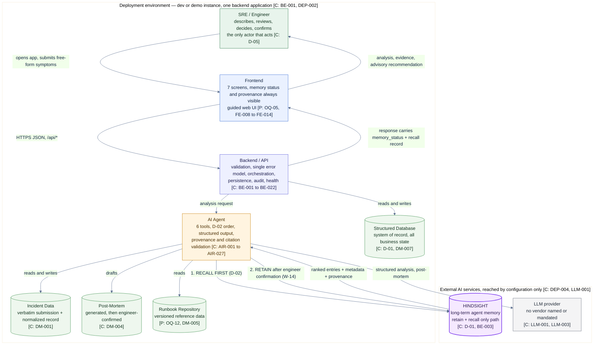

**Plain-English reading of D3-01.** The engineer sits outside the system boundary on the left and the action flows left to right: the frontend posts to the backend, the backend hands work to the agent, and the agent reaches two external services. The two Hindsight arrows are the whole product: the **upper** one is the recall that happens *before* any hypothesis exists, and the **lower** one is the retain that happens *after* the human confirms a post-mortem. Hindsight is deliberately not reachable from the frontend, from the API routes, or from the database — only the agent reaches it, through one module. The LLM produces text-shaped structure but holds nothing: every time the agent is restarted or the provider is changed, nothing is lost, because all durable knowledge sits in Hindsight and the database. The arrows back to the engineer are the only path to a production system, and that path is a person.

## 1.4 The three architectural commitments that everything else follows from

1. **One application, not microservices [C: BE-001].** Six engineers on a fixed schedule cannot afford network boundaries, distributed failure modes, or six deployments. Modules inside one application give the same separation with none of that cost.
2. **The database is the record; Hindsight is the experience [C: D-01, DM-007].** They are different systems with different failure modes and independent statuses. A database outage does not mean memory is gone, and a memory outage does not mean the incident record is gone.
3. **The agent has no authority [C: D-05, HITL-001].** There is no tool that executes, no endpoint that applies, and no path from a recommendation to a production system. The absence of the capability *is* the control.

---

# 2. COMPLETE SYSTEM ARCHITECTURE

## 2.1 The seven layers

| Layer | Components | Responsibility | Key constraints | Trace |
| --- | --- | --- | --- | --- |
| **Presentation** | Incident Dashboard, Create Incident, Incident Analysis, Historical Memory, Recommendation, Resolution, Post-Mortem; shared memory-status badge, provenance/evidence panel, confidence and match-strength indicators, memory-isolated control, retention confirmation dialog | Render the workflow and make the memory state unmistakable | No screen adds a capability outside WF-01; memory status on every agent-output screen; evidence one interaction away; failure ≠ empty | FE-001 – FE-014, D-09 |
| **API / Application** | HTTP routes; validation service; single error model; incident service; runbook service; post-mortem service; database service; observability service; demo reset/seed; health endpoint | Accept, validate, orchestrate, persist, and answer — one request lifecycle, one error vocabulary | Input validated before business logic; no success returned for a failed dependency; audit every transition; reset/seed refused outside dev/demo | BE-005 – BE-022, API-001 – API-023, BE-015 |
| **Agent** | Agent service; prompt set (system / task / context); structured output schemas; tool registry; context assembly; deterministic ranking; provider adapter; memory-status propagation | Reason over the current incident plus recalled experience and emit schema-valid, provenance-carrying output | Recall before hypotheses (D-02); six tools only; tool set is the only path to data; `unknown` is a valid value; every citation checked against the recall result | BE-006, LLM-007 – LLM-039, D-02, D-03, D-04 |
| **Memory** | Hindsight service module; memory client; recall strategy; deterministic ranking; retain orchestration; entry composition and validation; status normalisation | Be the **only** interface to Hindsight; produce the four memory states honestly | One module, no bypass (BE-003); `ok` / `empty` / `degraded` / `suppressed` never conflated; a failed recall is never an empty result | BE-003, HM-023 – HM-032, RL-011, RL-016, ERR-01, ERR-02 |
| **Data** | Relational database; incident, resolution, post-mortem, analysis, retained-entry-reference, feedback, service registry, runbook set, audit log, demo configuration; versioned synthetic corpus | Hold all authoritative state; keep the raw submission; never duplicate a memory fact | DB/MEM marking is normative; raw input immutable; no real customer data; reproducible from a versioned seed | DM-001 – DM-015, D-01, D-14 |
| **External / AI Services** | Hindsight memory service; LLM provider | Supply long-term memory and generation. Both are configuration, neither is owned | Provider-agnostic; single adapter interface; fail loudly at startup if misconfigured; never the source of a historical fact the agent did not retrieve | DEP-004, LLM-001 – LLM-006, LLM-032 |
| **Deployment** | Static frontend bundle; one backend process; one database instance; environment configuration; secret injection; access control; health check; reset/seed | Make the thing runnable, reproducible, and safely reachable | Separate dev and demo; no secret in the bundle; env-gated reset/seed; access control required because there is no auth | DEP-001 – DEP-017, SEC-001 – SEC-005 |

## 2.2 How the layers relate

- **Presentation → API/Application:** one direction only, over JSON. The frontend holds no business logic worth defending; every rule is enforced server-side because the API is the trust boundary.
- **API/Application → Agent:** the application layer calls the agent for the analysis path, the post-mortem path, and the retain path. The agent never calls the HTTP layer; there is no re-entrancy.
- **Agent → Memory → External:** the agent reaches Hindsight **only** through the memory layer. The agent has no knowledge of Hindsight's call shapes, which is what allows Phase 1 findings to be absorbed in one module (BE-004).
- **Agent → External (LLM):** the only generation path, behind an adapter, with prompts versioned in the repository.
- **API/Application → Data:** all structured reads and writes. The memory layer does not touch the database, and the database holds no memory entries beyond the ID mirror needed for audit (DM-004b).
- **Every layer → Observability:** tool invocations, latency, status, and audit events are emitted from the layer that knows them.

## 2.3 Layered component diagram

### D3-02 — Layered component architecture

```mermaid
%%{init: {"theme":"base","themeVariables":{"fontFamily":"Segoe UI, Helvetica, Arial, sans-serif","primaryColor":"#eaf1ff","primaryTextColor":"#10233f","primaryBorderColor":"#3b6fd4","lineColor":"#5c6f8f"},"themeCSS":".edgePath path{stroke-dasharray:6 5;animation:pr_flow 2.8s linear infinite}@keyframes pr_flow{to{stroke-dashoffset:-22}}.pulse{animation:pr_pulse 3.2s ease-in-out infinite}@keyframes pr_pulse{0%,100%{opacity:1}50%{opacity:.55}}","flowchart":{"curve":"basis","htmlLabels":true,"nodeSpacing":34,"rankSpacing":40,"padding":8}}}%%
flowchart TD
  subgraph L1["LAYER 1 — PRESENTATION"]
    direction LR
    F1["Dashboard<br/>FE-001"]
    F2["Create Incident<br/>FE-002"]
    F3["Analysis<br/>FE-003"]
    F4["Historical Memory<br/>FE-004"]
    F5["Recommendation<br/>FE-005"]
    F6["Resolution<br/>FE-006"]
    F7["Post-Mortem<br/>FE-007"]
    F8["Memory-status badge<br/>Provenance panel<br/>Isolated-mode control<br/>FE-008 to FE-014"]
  end

  subgraph L2["LAYER 2 — API / APPLICATION (one deployable application, BE-001)"]
    direction LR
    A1["HTTP routes<br/>API-001 to API-023"]
    A2["Validation service<br/>BE-010, BE-012"]
    A3["Error model<br/>BE-015, ERR-01 to ERR-014"]
    A4["Incident service<br/>BE-005"]
    A5["Runbook service<br/>BE-008"]
    A6["Post-mortem service<br/>BE-009"]
    A7["Database service<br/>BE-007"]
    A8["Observability service<br/>BE-011, BE-020"]
    A9["Health + demo reset/seed<br/>API-016, API-017"]
  end

  subgraph L3["LAYER 3 — AGENT"]
    direction LR
    G1["Agent service<br/>D-02 orchestration<br/>BE-006"]
    G2["Prompt set<br/>system / task / context<br/>LLM-007 to LLM-012"]
    G3["Tool registry<br/>TL-001 to TL-006<br/>LLM-017 to LLM-021"]
    G4["Context assembly<br/>labelled memory block<br/>LLM-008, LLM-009, LLM-012"]
    G5["Output schemas + validation<br/>LLM-013 to LLM-016"]
    G6["Provider adapter<br/>LLM-003"]
  end

  subgraph L4["LAYER 4 — MEMORY (only path to Hindsight, BE-003)"]
    direction LR
    M1["Memory client<br/>BE-004"]
    M2["Recall strategy + entity scope<br/>RL-001 to RL-011"]
    M3["Deterministic ranking<br/>RL-012, RL-013"]
    M4["Retain orchestration<br/>entry composition + validation<br/>RP-001 to RP-016"]
    M5["Status normalisation<br/>ok / empty / degraded / suppressed<br/>RL-011, RL-016"]
  end

  subgraph L5["LAYER 5 — DATA"]
    direction LR
    D1[("Incidents DM-001")]
    D2[("Resolutions DM-002")]
    D3[("Post-mortems DM-004")]
    D4[("Analyses DM-004a")]
    D5[("Retained-entry ID mirror DM-004b")]
    D6[("Runbook set DM-005")]
    D7[("Service registry DM-004d")]
    D8[("Audit log DM-004e")]
    D9[("Feedback DM-004c")]
  end

  subgraph L6["LAYER 6 — EXTERNAL / AI SERVICES"]
    direction LR
    X1[("HINDSIGHT<br/>retain + recall")]
    X2["LLM provider<br/>no vendor named"]
  end

  subgraph L7["LAYER 7 — DEPLOYMENT"]
    direction LR
    V1["Static frontend bundle<br/>DEP-001"]
    V2["One backend process<br/>DEP-002"]
    V3["One database instance<br/>DEP-003"]
    V4["Environment configuration<br/>+ secret injection<br/>DEP-005, DEP-006, DEP-011"]
    V5["Access control in front of the app<br/>DEP-008, SEC-003"]
    V6["Dev and demo environments kept separate<br/>DEP-009"]
  end

  L1 -->|"JSON over HTTPS"| L2
  L2 -->|"analysis / post-mortem / retain request"| L3
  L3 -->|"recall and retain only"| L4
  L4 -->|"contract in Part 2 §1.4"| X1
  L3 -->|"structured generation"| X2
  L2 -->|"reads and writes"| L5
  L2 -.->|"logs, audit, tool traces"| L7
  L3 -.->|"token and request counts"| L7
  L4 -.->|"recall status per incident"| L7

  classDef ui fill:#eaf1ff,stroke:#3b6fd4,stroke-width:1px,color:#10233f;
  classDef api fill:#eef0ff,stroke:#5b5bd6,stroke-width:1px,color:#1b1b4b;
  classDef agent fill:#fff4e0,stroke:#c9820a,stroke-width:1px,color:#4a2f00;
  classDef mem fill:#f5e9ff,stroke:#7c3aed,stroke-width:2px,color:#2b1b4d,animation:pr_pulse 3.2s ease-in-out infinite;
  classDef data fill:#eef7ee,stroke:#3f8f4f,stroke-width:1px,color:#12331f;
  classDef ext fill:#f4f4f5,stroke:#6b7280,stroke-width:1px,color:#1f2937;
  classDef dep fill:#f7f7f8,stroke:#8a8f98,stroke-width:1px,color:#24292f;

  class F1,F2,F3,F4,F5,F6,F7,F8 ui;
  class A1,A2,A3,A4,A5,A6,A7,A8,A9 api;
  class G1,G2,G3,G4,G5,G6 agent;
  class M1,M2,M3,M4,M5 mem;
  class D1,D2,D3,D4,D5,D6,D7,D8,D9 data;
  class X1 mem;
  class X2 ext;
  class V1,V2,V3,V4,V5,V6 dep;
```

**Plain-English reading of D3-02.** Read top to bottom. The engineer's browser touches only Layer 1. Layer 2 is the single door into the business logic and the only place that decides whether a request is valid and what a failure means. Layer 3 is where reasoning happens, and it is deliberately thin: prompts, six tools, context assembly, and schema validation — no data access of its own. Layer 4 is the memory brain: it owns the entire conversation with Hindsight, the ranking of what comes back, and the honest naming of the four memory states. Layer 5 is the record of everything that is fact rather than experience. Layer 6 is the outside world, drawn dashed to the deployment layer because neither external service is owned by this project — both are reached by configuration. Layer 7 is the plumbing that makes Layers 1–5 reproducible: one process, one database, environment-driven configuration, and a required access control because the MVP has no login.

## 2.4 One request, end to end — the layering in practice

A single `POST /api/incidents/{id}/analyze` traverses: **Layer 1** posts JSON → **Layer 2** validates the payload, confirms the incident state permits analysis, and calls the agent service → **Layer 3** runs the ordered path: interpret (TL-001) → derive retrieval intent → **Layer 4** recall and rank (TL-002) → structured history (TL-003) → context assembly with a labelled memory block → generation via the adapter → schema and citation validation → **Layer 2** persists the analysis, writes audit and tool logs, and returns the response **with `memory_status` and the recall record** → **Layer 1** renders status, comparisons, hypotheses, and evidence. Layer 6 is touched twice: Hindsight first, the LLM only afterwards. Layer 5 is written once, at the end, atomically.

---

# 3. INCIDENT CREATION WORKFLOW

This is the path from "an incident is happening" to "the engineer is reading a memory-informed analysis". It covers Part 1 steps W-02 through W-08 and Part 2 endpoints API-001 and API-005.

## 3.1 The twelve steps

| # | Step | Actor | What happens | Artefact produced | Trace |
| --- | --- | --- | --- | --- | --- |
| 1 | **Engineer opens the application** | Engineer | The dashboard lists existing incidents with their status and the memory status of their last analysis. | — | W-11, FE-001, API-002 |
| 2 | **Engineer creates an incident** | Engineer | Free-form submission: symptom description in the engineer's own words, plus whatever is known — service, environment, error text, log excerpt, recent changes. No rigid schema is demanded. | Raw submission | W-02, FE-002, FR-002, FR-003 |
| 3 | **Incident data is validated** | System | Schema validation and secret scanning run before any business logic. An empty or unintelligible description is rejected with the minimum required input named; a field that cannot be resolved is marked unknown rather than guessed. | Validation result | BE-012, BE-010, ERR-05, UC-01 E-2 |
| 4 | **Incident is stored** | System | A durable identifier is assigned, the raw text is preserved verbatim and never mutated, and the record is normalized: service, environment, normalized symptoms, error signatures, failure-mode label, affected components, observed time. A possible duplicate is flagged but never blocks creation. | Normalized incident record, status `created` | W-03, DM-001, FR-005, FR-006, FR-008, API-001 |
| 5 | **Agent is invoked** | System | The engineer triggers analysis. The agent service receives the normalized record and an optional `memory_isolated` flag, and fixes the order of operations: interpret → recall → compare → hypothesize. | Analysis request | API-005, BE-006, D-02 |
| 6 | **Agent analyzes the current incident** | Agent | TL-001 produces a structured reading: affected scope, failure-mode characterization, established facts, inferences, unknowns, and information gaps — each gap stating what would resolve it. Every item is marked as coming from the current incident. | Symptom analysis | TL-001, W-04, AIR-001, FR-010, FR-011 |
| 7 | **Agent prepares the memory query** | Agent | From the normalized record the agent derives the retrieval intent: failure class, service, environment, and normalized signatures. This is expressed in the vocabulary of past incidents, before anything is retrieved. | Recall intent + query | W-05, TL-002 input, HM-002, RL-001 |
| 8 | **Hindsight recall occurs** | Hindsight | The memory service is asked for entries matching that intent within the entity scope. It returns candidate entries with content and metadata. **If the service is unavailable, this step returns an explicit failure, not an empty set.** | Candidate entries, or an explicit failure | W-06, HM-023 – HM-029, ERR-01, ERR-02 |
| 9 | **Historical experiences are returned** | Memory layer | The memory layer normalises the status to exactly one of `ok`, `empty`, `degraded`, or `suppressed`, applies deterministic ranking with a stated relevance basis per entry, and attaches provenance. The recall record is persisted against the incident. | Ranked, attributed entries + recall record | RL-011 – RL-016, LLM-025, LLM-026, FR-013 |
| 10 | **Agent combines current and historical context** | Agent | Current-incident evidence and recalled experience are assembled as two structurally separate, labelled blocks. TL-003 adds structured history — recurrence counts, chronology, prior status — from the database. | Assembled context | LLM-008, LLM-009, LLM-012, TL-003, W-07 |
| 11 | **Agent generates analysis** | Agent + LLM | The agent compares the current incident with each candidate, produces ranked hypotheses with evidence and confidence, and marks any precedent-backed hypothesis with the memory entry that backs it. Runbook procedures are joined with retained outcome memory. Output is schema-validated, and every citation is checked against the recall result. | Comparison, hypotheses, recommendations, unknowns | W-07 – W-09, LLM-013 – LLM-016, LLM-022 – LLM-029, TL-004 |
| 12 | **UI displays the result** | Frontend | The engineer sees the memory status first, then facts / inferences / unknowns, information gaps, per-incident comparisons with match strength, ranked hypotheses with provenance, and recommendations labelled advisory. Every evidence reference is one interaction away. | Rendered analysis | FE-003, FE-004, FE-005, FE-008 – FE-012, W-10 |

## 3.2 Two-dimensional view

```text
 ┌─ 1. OPEN ─────────────────────────────────────────────────────────────────┐
 │  Engineer lands on the incident dashboard (FE-001)                        │
 └───────────────────────────────┬───────────────────────────────────────────┘
                                 v
 ┌─ 2. CREATE ──────────────────────────────────────────────────────────────┐
 │  Free-form symptom text + whatever is known  (FE-002, W-02)              │
 │  No rigid schema. The engineer's own words are kept verbatim.            │
 └───────────────────────────────┬───────────────────────────────────────────┘
                                 v
 ┌─ 3. VALIDATE ────────────────────────────────────────────────────────────┐
 │  Schema validation + secret scan BEFORE any business logic               │
 │  Empty input -> rejected, nothing created   (ERR-05)                     │
 └───────────────────────────────┬───────────────────────────────────────────┘
                                 v
 ┌─ 4. STORE ───────────────────────────────────────────────────────────────┐
 │  id assigned | symptoms_raw kept unmodified | normalized fields written  │
 │  status = created        (DM-001, FR-005, FR-006)                        │
 └───────────────────────────────┬───────────────────────────────────────────┘
                                 v
 ┌─ 5. INVOKE AGENT ────────────────────────────────────────────────────────┐
 │  Order is fixed by code, not by prompt:                                  │
 │      interpret -> recall -> compare -> hypothesize        (D-02)          │
 └───────────────────────────────┬───────────────────────────────────────────┘
                                 v
 ┌─ 6. ANALYZE CURRENT ────────────────────────────────────────────────────┐
 │  TL-001: scope | failure mode | facts | inferences | unknowns | gaps     │
 │  Everything marked source = current_incident                            │
 └───────────────────────────────┬───────────────────────────────────────────┘
                                 v
 ┌─ 7. BUILD RECALL QUERY ─────────────────────────────────────────────────┐
 │  failure class + service + environment + normalized signatures          │
 │  Expressed in the vocabulary of past incidents        (W-05, HM-002)     │
 └───────────────────────────────┬───────────────────────────────────────────┘
                                 v
 ┌─ 8. HINDSIGHT RECALL ──────────────────────────────────────────────────────┐
 │  THE PRODUCT'S CENTRAL CALL.  Scoped by entity.  Returns candidates.     │
 │  Unavailable -> explicit failure.  Never an empty set.     (ERR-01)     │
 └───────────────────────────────┬───────────────────────────────────────────┘
                                 v
 ┌─ 9. RANK + LABEL ───────────────────────────────────────────────────────┐
 │  status = ok | empty | degraded | suppressed   (exactly one, RL-011)    │
 │  deterministic ranking, relevance_basis per entry, provenance attached  │
 └───────────────────────────────┬───────────────────────────────────────────┘
                                 v
 ┌─ 10. COMBINE CONTEXT ────────────────────────────────────────────────────┐
 │  [CURRENT EVIDENCE BLOCK]  and  [RECALLED MEMORY BLOCK]  kept separate   │
 │  TL-003 adds structured history + recurrence          (LLM-008/009)      │
 └───────────────────────────────┬───────────────────────────────────────────┘
                                 v
 ┌─ 11. GENERATE ───────────────────────────────────────────────────────────┐
 │  compare -> ranked hypotheses w/ evidence + confidence -> procedures     │
 │  schema-validated; every citation checked against the recall result      │
 └───────────────────────────────┬───────────────────────────────────────────┘
                                 v
 ┌─ 12. DISPLAY ───────────────────────────────────────────────────────────┐
 │  memory status first, then facts/unknowns/gaps, comparisons, hypotheses, │
 │  advisory recommendations. Evidence one interaction away.   (FE-008..12)  │
 └───────────────────────────────────────────────────────────────────────────┘
```

## 3.3 Workflow diagram

### D3-03 — Incident creation and analysis workflow

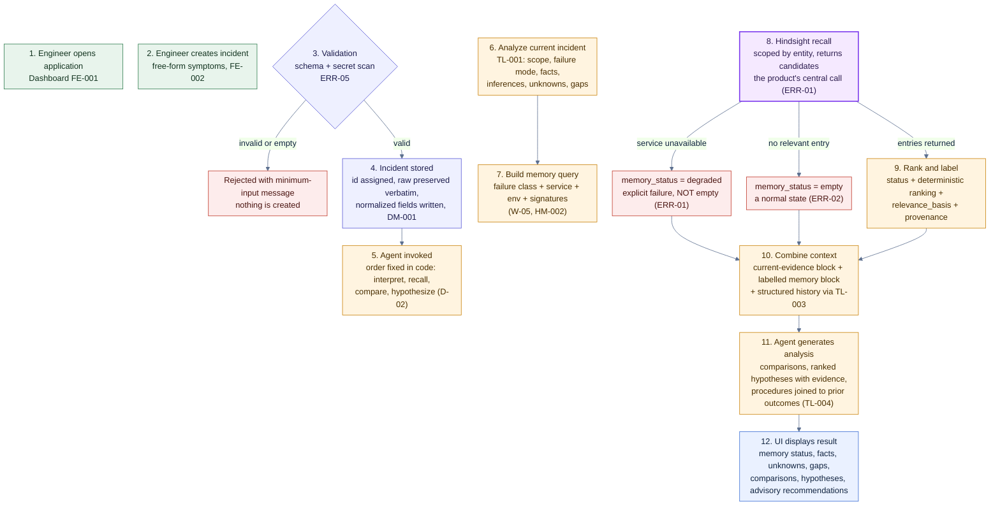

**Plain-English reading of D3-03.** The diagram is a single downward line with three honest exits. Steps 1–2 are human. Step 3 can stop the whole thing, and when it does, nothing is created — that is deliberate, because a half-created incident pollutes the record. Step 4 is where the raw text is frozen forever; normalization adds a parallel representation but never edits the original. Steps 5–7 are the agent preparing, and the ordering box at step 5 is the one that matters most: it says the sequence is enforced in code, because a prompt that merely asks for recall first is not a guarantee. Step 8 is the only place the purple node appears on this path, and it has two distinct failure exits — a red `degraded` exit and a red `empty` exit — which look different in the interface for the rest of the product's life. Steps 9–11 turn retrieved text into ranked, cited judgement. Step 12 is what the engineer actually sees, and memory status is the first thing on it.

---

# 4. HINDSIGHT RECALL WORKFLOW

## 4.1 What information enters the recall process

**Enters the recall — the retrieval key [C: TL-002, HM-002, HM-003, RL-001, RL-002]:**

| Input | Form | Why it is in the query |
| --- | --- | --- |
| `service` | Entity scope | Enables service-scoped recall and stops experience from other services dominating (HM-025) |
| `environment` | Entity scope | The same symptom behaves differently in production and staging |
| `failure_mode_label` | Primary key | The normalized failure class — the strongest single relevance signal |
| `error_signatures[]` | Normalized tokens, volatile substrings stripped | A future incident rarely repeats the wording, so signatures must survive re-wording (HM-002, RL-003) |
| Symptom description | Composed natural-language query | The recall interface accepts natural language, so the normalized text is the query (HM-024) |
| `affected_components[]` | Metadata signal | Narrows candidates where the component is known |
| Optional constraints | `entry_type`, `outcome_label` | Lets a caller ask for procedures with a recorded outcome, where the memory interface supports metadata filtering (HM-027 — a Phase 1 verification item) |
| `memory_isolated` | Flag | When set, the recall tool is removed from the tool set entirely and the status becomes `suppressed` (LLM-020, D-08) |

**Deliberately does NOT enter the recall [C: HM-018, HM-019, TL-002]:**

| Excluded | Reason |
| --- | --- |
| Recent changes (deploys, config edits) | Transient operational state. True when written, false within minutes, and misleading when recalled as experience (HM-018). It stays in the incident record and informs reasoning, but it is not a retrieval key |
| Raw logs, stack traces, metric dumps | Investigation inputs, not experience. Belong in the log system and the database (HM-014) |
| Absolute timestamps | Incident metadata, not a failure characteristic (HM-019) |
| The incident under analysis | Not yet retained; and structured history retrieval explicitly excludes the current incident (TL-003) |
| Any request to "look up" something the system does not hold | No prompt may ask for information the context does not contain, because that invites fabrication (LLM-011) |

## 4.2 What comes back, and what happens to it

| Stage | Behaviour | Requirement |
| --- | --- | --- |
| **Candidate entries** | Hindsight returns entries with stored content and metadata, including entry type, service, outcome label, confidence, and a reference back to the source incident | HM-026 |
| **Status normalisation** | Exactly one of `ok`, `empty`, `degraded`, `suppressed`. Set by the memory layer, never by the model | RL-011 |
| **Relevance filtering** | Deterministic ranking combining entry-type weighting, service match, signature overlap, and outcome weighting. Every entry carries a `relevance_basis` in words — not just a number | RL-012, RL-013, RL-014 |
| **Weak-match handling** | A weak match is labelled weak, or the result is `empty`. It is never presented as relevant | FR-026, HT-05 |
| **Conflict handling** | Where two retained entries disagree on root cause, both are returned and the conflict is stated — never silently reconciled | FR-027, ERR-09, HT-06 |
| **Recall record** | The query issued, the scope, the result count, the status, and any error cause are persisted against the incident, so the engineer can verify memory was consulted | LLM-026, FR-013 |
| **Context assembly** | Retrieved experience enters the model context as a clearly delimited, labelled block, structurally separate from current-incident evidence | LLM-008, LLM-009 |
| **Citation validation** | Every memory citation in the output is checked against the recall result. A citation to a non-existent entry is a validation failure, not a warning | LLM-029, T-AB-05 |

## 4.3 Recall workflow diagram

### D3-04 — Hindsight recall: from current incident to a cited recommendation

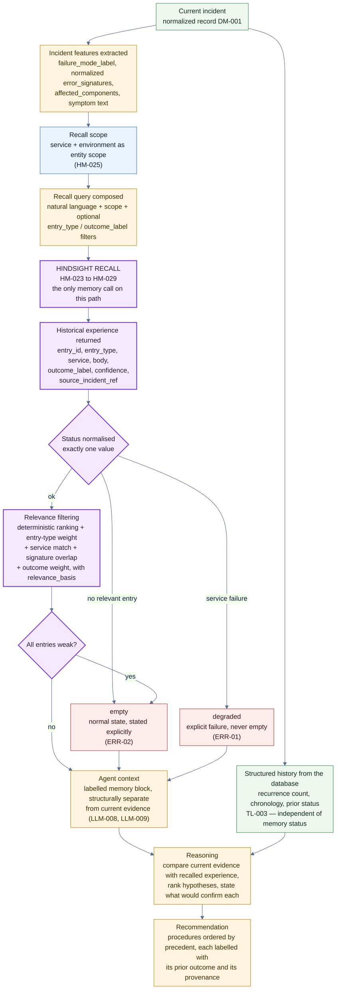

**Plain-English reading of D3-04.** Follow the purple path: features are extracted from the incident, turned into a scoped query, sent to Hindsight, and returned as attributed entries. The decision diamond in the middle is the honesty gate: whatever comes back, the system names it as exactly one of four states. `empty` and `degraded` are drawn in red not because they are errors in the everyday sense but because they are the two states a careless implementation would conflate — and this product treats that conflation as a defect. After filtering, the surviving entries enter the model's context in a separate labelled block, so the model cannot mistake a prior incident's property for the current one. The side branch from the incident into the database supplies structured history — recurrence counts and chronology — which is a database concern and keeps its own independent status. Only after all of that does reasoning happen, and the final box is a recommendation that is labelled, ordered by precedent, and attached to evidence.

---

# 5. HINDSIGHT RETAIN WORKFLOW

## 5.1 The retain path, step by step

| # | Step | What happens | Requirement |
| --- | --- | --- | --- |
| 1 | **Incident resolved** | The engineer records the actual resolution: ordered actions with what worked and what did not, the runbook used with its version, the root cause, contributing factors, and the outcome. Recommendations that were followed, skipped, or attempted-and-failed are recorded too. | W-11, W-12, DM-002, FR-049 – FR-052 |
| 2 | **Resolution information captured** | The resolution record is persisted. This is human-authored; the system may pre-fill but never records a resolution the engineer did not state. | HITL-007, FR-052 |
| 3 | **Post-mortem generated** | TL-005 drafts the post-mortem from recorded data only: timeline, impact, symptoms, root cause with its source and confidence, resolution and effectiveness, contributing factors, lessons, prevention. Unsupported fields are `unknown`, never a plausible guess. | W-13, DM-004, LLM-033, T-AB-06 |
| 4 | **Engineer reviews and corrects** | The engineer corrects anything inferred wrongly and confirms the root-cause statement. The engineer's statement becomes the recorded conclusion; the agent's hypothesis stays labelled as a hypothesis. | W-13, AC-21, FR-057, HITL-008 |
| 5 | **Post-mortem confirmed** | Status becomes `confirmed`. This is the state that makes retention possible; retention without it is refused server-side, not merely discouraged in the UI. | D-12, API-021, RP-010 |
| 6 | **Experience extraction** | The reusable conclusions are separated from the document. The post-mortem prose stays in the database; the conclusions are what enter memory. | HM-021, RP-006 |
| 7 | **Memory candidates composed** | One incident yields several focused entries — symptom profile, incident experience, root cause, contributing factors, resolution procedure, successful actions, failed actions, runbook outcome, lessons, preventive knowledge, recurring pattern. Each entry carries exactly one reusable fact and a shared provenance group. | D-06, HM-033 – HM-035, DM-003 |
| 8 | **Memory validation** | Every entry must carry a source incident, a confidence, and — for actions and procedures — an outcome label. Secret-shaped values are blocked pre-write. Excluded content is refused: raw logs, transient state, timestamps-as-characteristics, unlabelled speculation, duplicate abstractions. | RP-011 – RP-013, SEC-008, HM-014 – HM-022 |
| 9 | **Engineer confirmation gate** | The composed record is shown for review. The engineer may edit, reject, or decline individual entries, and may set confidence. No entry enters memory without this step. | D-12, HITL-009, HITL-010, FR-061, FR-062 |
| 10 | **Hindsight retain** | Validated entries are written. Per-entry results are reported. A failed write is reported as failed, never as success; a partial write is reported per entry and never presented as complete; the composed record is preserved for retry; retain is idempotent per incident. | W-14, RP-014, RP-015, ERR-03, AC-24 |
| 11 | **Stored experience** | Each entry has a stable, addressable identifier. The database keeps a mirror of what was retained and which IDs came back, for audit and for the "why this recommendation" trail. | HM-023, DM-004b, BE-019 |
| 12 | **Future incident** | A later, similar incident runs the same path; the recall at W-06 returns these entries and W-07 through W-09 cite them. | W-15, SC-05, SC-06, HT-09 |

## 5.2 Ordering note — a deliberate correction to the narrative order

Retention is **human-gated before the write**, not after it. The engineer's confirmation is a precondition of the Hindsight call, validated server-side (D-12, API-021). Any diagram or script that shows "retain, then ask" would describe a system that has already written to long-term memory without consent, which Part 1 prohibits. The confirmation that follows the write is a *different* confirmation: the retention report, and the engineer's ongoing ability to flag a retained entry as incorrect, inapplicable, or outdated (FR-074).

## 5.3 Retain workflow diagram

### D3-05 — Hindsight retain: from a resolved incident to reusable experience

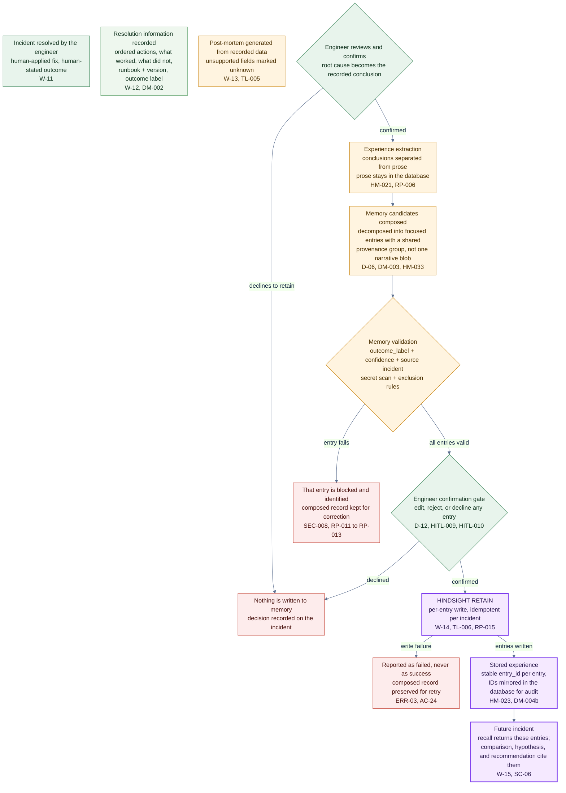

**Plain-English reading of D3-05.** Everything above the purple node is preparation and human judgement; everything below it is memory. Three gates protect the memory corpus, and all three are drawn as diamonds: the engineer must confirm the post-mortem, each candidate entry must pass validation, and the engineer must confirm the composed record. A blocked entry is blocked *individually* — the rest of the record is not silently dropped, and nothing is written that failed. When the write happens, the reporting is per entry, so a partial success is visible as a partial success. The final box is the payoff: these entries are what a later incident will retrieve, and the mirror of entry IDs in the database is what makes the citation trail auditable.

---

# 6. COMPLETE MEMORY LIFECYCLE

## 6.1 The loop, stage by stage

| Stage | What happens | Where knowledge lives at this point | Lifecycle rule |
| --- | --- | --- | --- |
| **Incident** | The engineer describes a live problem in free-form text | Database only — the raw submission and the normalized record. **Incident creation writes nothing to memory** | LC-001 |
| **Analyze** | TL-001 produces the structured reading of the current incident: facts, inferences, unknowns, gaps | Database — candidate analysis output, which is *not* learned experience | LC-003 |
| **Recall** | TL-002 asks Hindsight for relevant retained experience and records the status | Memory — read; four possible statuses, exactly one true | LC-002, RL-011 |
| **Historical context** | Ranked entries enter the model as a labelled block, separate from current evidence | Memory in context; the recall record persisted in the database | LLM-008, LLM-026 |
| **Recommendation** | Ranked hypotheses and procedures, each cited, each labelled with its prior outcome | Database — the analysis artefact | LC-011, LLM-022 |
| **Resolution** | The human applies a fix; what was actually done is recorded, including what failed | Database | LC-004, HITL-007 |
| **Post-mortem** | Generated from recorded data, corrected and confirmed by the engineer | Database — the document | LC-005, DM-004 |
| **Experience extraction** | Reusable conclusions are separated from incident-specific detail and from the prose | Database — candidate entries | RP-006, HM-021 |
| **Retain** | Validated, engineer-confirmed entries are written to Hindsight, per entry, idempotently | **Memory — the only write to experience** | LC-006, RP-010, RP-015 |
| **Future recall** | A later similar incident runs the *same code path* and retrieves those entries | Memory read again; the mirror of entry IDs lives in the database | LC-007, LC-009 |
| **Improved response** | The prior root cause appears as a precedent-backed hypothesis; the previously successful procedure is recommended first; failures are flagged as previously ineffective | Both — the reasoning is new, the experience is old | LC-010, LC-013, SC-06 |

The lifecycle is closed and repeatable: incident N produces experience that incident N+1 of the same class recalls (LC-013).

## 6.2 Memory states through the loop

| Memory state | Meaning | Where it is visible |
| --- | --- | --- |
| **Absent** | Nothing retained yet — a genuine cold start | `memory_status = empty` on the analysis; stated in the interface, not implied |
| **Candidate** | Composed but not retained: in the database, provisional, never presented as learned | The retention review screen |
| **Stored** | Validated, confirmed, written, individually addressable, sharing a provenance group | The memory view; the future recall |
| **Recalled** | Retrieved for a specific incident, ranked, attributed, with a relevance basis | The historical memory screen, next to the analysis |
| **Superseded / flagged** | Corrected, or reported as incorrect, inapplicable, or outdated | The memory view with its flag; recall reports the flag (HM-030, FR-074) |
| **Degraded** | The recall itself failed. Distinct from absent, and never rendered as absent | `memory_status = degraded`; the analysis is labelled memory-degraded |

## 6.3 The learning loop diagram

### D3-06 — The complete memory lifecycle

```mermaid
%%{init: {"theme":"base","themeVariables":{"fontFamily":"Segoe UI, Helvetica, Arial, sans-serif","primaryColor":"#eaf1ff","primaryTextColor":"#10233f","primaryBorderColor":"#3b6fd4","lineColor":"#5c6f8f"},"themeCSS":".edgePath path{stroke-dasharray:6 5;animation:pr_flow 2.8s linear infinite}@keyframes pr_flow{to{stroke-dashoffset:-22}}.pulse{animation:pr_pulse 3.2s ease-in-out infinite}@keyframes pr_pulse{0%,100%{opacity:1}50%{opacity:.55}}","flowchart":{"curve":"basis","htmlLabels":true,"nodeSpacing":26,"rankSpacing":30,"padding":8}}}%%
flowchart LR
  A["Incident<br/>engineer submits free-form symptoms"]
  B["Analyze<br/>TL-001: facts, inferences, unknowns, gaps"]
  C["Recall<br/>TL-002 against Hindsight"]
  D["Historical context<br/>ranked, attributed, labelled block"]
  E["Recommendation<br/>hypotheses + procedures with prior outcomes"]
  F["Resolution<br/>human applies and records what happened"]
  G["Post-mortem<br/>generated from data, confirmed by the engineer"]
  H["Experience extraction<br/>reusable conclusions only"]
  I["Retain<br/>validated, confirmed, written to Hindsight"]
  J["Future recall<br/>same code path, memory now present"]
  K["Improved response<br/>precedent-backed hypothesis,<br/>previously successful procedure first"]
  L["New incident of the same class"]

  A --> B --> C --> D --> E --> F --> G --> H --> I --> J --> K --> L
  L -->|"the loop repeats: incident N teaches incident N+1<br/>LC-013, SC-05, SC-06"| C

  N1["Memory state: absent or degraded<br/>recall status recorded honestly<br/>RL-011, LC-012"]
  N2["Memory state: candidate<br/>in the database, provisional<br/>LC-003, LC-006"]
  N3["Memory state: stored<br/>individually addressable,<br/>shared provenance group<br/>LC-007"]
  N1 -.-> C
  N2 -.-> I
  N3 -.-> J

  classDef human fill:#e8f4ec,stroke:#2f7d4f,stroke-width:1px,color:#12331f;
  classDef agent fill:#fff4e0,stroke:#c9820a,stroke-width:1px,color:#4a2f00;
  classDef mem fill:#f5e9ff,stroke:#7c3aed,stroke-width:2px,color:#2b1b4d,animation:pr_pulse 3.2s ease-in-out infinite;
  classDef data fill:#eef7ee,stroke:#3f8f4f,stroke-width:1px,color:#12331f;

  class A,F,G human;
  class B,D,E,H agent;
  class C,I,J,K mem;
  class L data;
  class N1,N2,N3 mem;
```

**Plain-English reading of D3-06.** This is one closed ring: analyse, recall, reason, recommend, resolve, post-mortem, extract, retain, and then a later incident of the same class runs the identical path with the stored experience now present. The long edge from the far right back to the recall node is the entire point of the product — nothing else in the loop is novel except the fact that it repeats. The three dashed notes track what memory *is* at each moment, which is what stops the common failure of treating a cold start, a proposed record, and a confirmed stored entry as the same thing. Note the two memory nodes that are not on the ring: analysis and recommendation write only to the database, and only the retain node writes to Hindsight.

## 6.4 Progressive frames — presenting the loop as animation

For viewers that do not honour `themeCSS`, the same loop can be advanced frame by frame, which works in any Markdown renderer including GitHub:

| Frame | Nodes visible | Narration |
| --- | --- | --- |
| **F1** | A, B | "An incident arrives. The agent reads the current evidence." |
| **F2** | + C, D | "Before it forms any opinion, it asks Hindsight what we already learned." |
| **F3** | + E, F | "It compares, ranks causes, proposes procedures. The engineer decides and fixes it." |
| **F4** | + G, H, I | "From the confirmed outcome we keep the reusable parts, and store them in memory." |
| **F5** | + J, K, L, loop edge | "The next incident of this class runs the same path — and starts from experience." |

---

# 7. BEFORE HINDSIGHT VS AFTER HINDSIGHT

## 7.1 What is actually being claimed

This comparison is about **context availability**, not about answer quality. The claim is narrow and defensible:

> Without retained experience, the agent can only reason from the current incident and general knowledge. With retained experience, the agent can additionally reason from **this organization's** prior incidents of the same failure class — which can change the hypotheses it raises, the procedures it recommends, and the order it recommends them in.

**Explicitly not claimed [C: Part 1 §15.1, C-11]:** that Hindsight always produces a better answer; that resolution is faster; that root causes are more often correct; that any metric improves. Prior experience can be irrelevant, partial, conflicting, or outdated — and the system is built to say so rather than to hide it. A run where memory returns nothing relevant is a *correct* run.

## 7.2 Two-path comparison

### D3-07 — Path A without Hindsight versus Path B with Hindsight

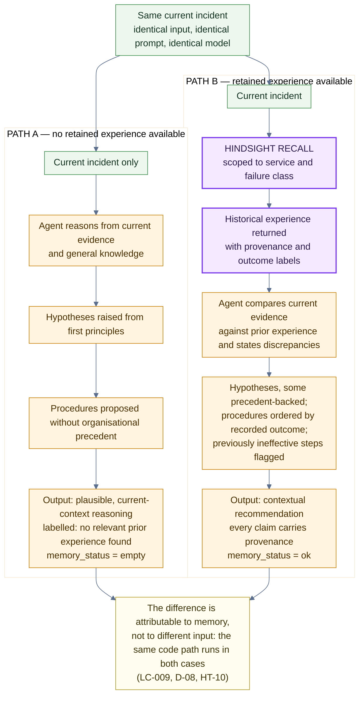

**Plain-English reading of D3-07.** Both paths start from the same incident box, which is the experimental control: the same input, the same prompt, the same model, the same code path. Path A is not "broken" — it is a working analysis of what is in front of the engineer right now, and it is labelled as carrying no organisational precedent. Path B inserts exactly one extra step, the purple recall, and everything after it is shaped by what came back: hypotheses can be marked precedent-backed, procedures can be ordered by recorded outcome, and a step that failed last time can be flagged before anyone wastes an hour on it. The bottom box is the claim boundary: the difference is attributable to memory because nothing else changed.

## 7.3 Two-dimensional comparison

```text
                        PATH A — memory not available          PATH B — memory available
                        ─────────────────────────────────    ────────────────────────────────────
 Input                  Current incident                      Current incident (identical)
                        ─────────────────────────────────    ────────────────────────────────────
 Extra step             (none)                                Hindsight recall, scoped
                        ─────────────────────────────────    ────────────────────────────────────
 Evidence available     Current evidence + general            Current evidence + this org's
                        reasoning                              prior incidents of this class
                        ─────────────────────────────────    ────────────────────────────────────
 Hypotheses             From first principles                 From first principles AND from
                        no prior precedent attached           precedent, with the supporting
                                                                entry cited
                        ─────────────────────────────────    ────────────────────────────────────
 Procedures             Plausible, no track record            Ordered by recorded outcome;
                                                                previously successful first;
                                                                previously ineffective flagged
                        ─────────────────────────────────    ────────────────────────────────────
 Provenance             current_incident / general_reasoning  current_incident / memory entry_id /
                                                                runbook id+version
                        ─────────────────────────────────    ────────────────────────────────────
 Status shown           memory_status = empty                 memory_status = ok
                        "no relevant prior experience found"  recall query + scope + count shown
                        ─────────────────────────────────    ────────────────────────────────────
 What is NOT claimed    that this path is wrong, or that       that this path is always better —
                        the agent is incompetent              relevance depends on what was
                                                                retained, and may be partial,
                                                                conflicting, or outdated
                        ─────────────────────────────────    ────────────────────────────────────
 Third honest path      —                                     memory_status = degraded (recall failed)
                                                                — a successful request with a
                                                                visibly less useful result
```

## 7.4 How the comparison is actually produced

| Requirement | How it is satisfied |
| --- | --- |
| **Same input on both paths** | The identical incident is analyzed twice; the difference is that TL-002 is removed from the exposed tool set on the isolated run (LLM-020) |
| **Same code path** | LC-009: the future-incident leg is the same code as the first-incident leg. The only difference is the presence of stored memory |
| **Observable difference** | The isolated run carries `memory_status = suppressed` and every output is labelled memory-free; the normal run carries `ok` and citations that resolve to recalled entries (HT-10, T-E2E-02) |
| **Attribution, not vibes** | The recall record — query, scope, count, status — is persisted and displayed, so a viewer can see *what memory was consulted* (FR-013, LLM-026) |
| **Honest when memory is unhelpful** | If nothing relevant is retained, Path A and Path B look the same, and the interface says memory had nothing to offer. That is a correct outcome, not a failure of the demo (ERR-02, SC-10) |

---

# 8. INCIDENT RESPONSE LIFECYCLE

## 8.1 The eleven stages, explained

| # | Stage | Who acts | What happens | What is recorded | Scope note |
| --- | --- | --- | --- | --- | --- |
| 1 | **Incident detection** | Engineer | An alert fires, metrics degrade, errors spike, or a user reports a problem. The engineer recognises a production problem. | — | The system is not connected to monitoring. Detection stays human (NG-01, NG-07) |
| 2 | **Triage** | Engineer | Initial judgement: how bad is this, which service, which environment, is this a known shape of problem. The engineer starts the investigation and reaches for the agent. | Incident created with severity assigned by the engineer | Severity is never auto-asserted by the agent (NG-10, DM-001) |
| 3 | **Investigation** | Engineer + system + agent | The engineer submits what is known — alert text, error excerpt, symptom description, recent changes. The system normalizes it. The agent produces the structured reading: scope, failure mode, established facts, inferences, unknowns, information gaps. | Normalized incident record; analysis artefact; the information-gap list | Raw submission preserved verbatim; unknowns are stated, not guessed (W-02 – W-04) |
| 4 | **Historical recall** | Hindsight | Automatic, before any hypothesis. The agent derives the retrieval intent, Hindsight returns candidate experience, the memory layer normalises the status and ranks the results. | Recall record: query, scope, count, status | Exactly one of `ok` / `empty` / `degraded` / `suppressed`; never skipped (W-05, W-06, D-02) |
| 5 | **Root-cause analysis** | Agent | Each candidate experience is compared against current evidence: symptom match, service and component match, prior root cause consistency, applicability of the prior fix, and discrepancies worth flagging. Ranked hypotheses are produced with evidence, confidence, and precedent marking. | Comparisons, hypotheses, unknowns | Conflicts between prior incidents are surfaced, never reconciled silently (W-07, W-08, FR-027) |
| 6 | **Recommendation** | Agent | For leading hypotheses, procedures are recommended. Matching runbooks are surfaced from the reference set and joined with retained outcome memory to give a track record. Diagnostic steps are separated from remediation steps. Previously successful procedures are ordered ahead of untested ones. | Recommendations with hypothesis link, outcome label, evidence source, risk flag, provenance | Advisory only. A higher-risk procedure carries a warning and a safer diagnostic alternative (W-09, FR-035 – FR-042) |
| 7 | **Engineer decision** | Engineer | The engineer reads the analysis, the recalled experience, the hypotheses, and the recommendations, and decides: proceed, investigate further, or dismiss. Feedback on usefulness can be captured. | Recommendation outcomes as they evolve; feedback record | The chain terminates here. No execution capability exists anywhere in the product (W-10, D-05, SC-11) |
| 8 | **Resolution** | Engineer | The engineer applies the fix, or finds another remedy, and records what was actually done — in what order, and with what result. | Resolution record: ordered actions, runbook + version, contributing factors, root cause with source, outcome | Recommended-versus-actually-applied is recorded. Failures are captured, not only successes (W-11, W-12, LC-004) |
| 9 | **Verification** | Engineer | The engineer confirms the system is healthy. The incident moves to resolved. | Resolution effectiveness; incident state transition to `resolved` | Verification is engineer-stated. There is no automated health-check integration in the MVP (NG-01, DM-002) |
| 10 | **Post-mortem** | Agent drafts, engineer confirms | A post-mortem is assembled from actual recorded data: timeline, impact, symptoms, root cause with its source and confidence, resolution and effectiveness, contributing factors, lessons, prevention. The engineer corrects anything inferred wrongly. | Post-mortem document, status `confirmed` | Unsupported fields are `unknown`. Prose stays in the database and does not enter memory (W-13, HM-021) |
| 11 | **Learning** | System + engineer | The reusable conclusions are extracted, composed into focused memory entries, validated, confirmed by the engineer, and written to Hindsight. The engineer may reject or flag entries. | Memory entries with stable IDs; retained-entry ID mirror | Memory-gated. This is the only write to experience in the entire system (W-14, D-12, LC-006) |

## 8.2 Two-dimensional lifecycle view

```text
   HUMAN                SYSTEM / AGENT                 HINDSIGHT            RECORDED
   ─────                ───────────────                 ─────────            ────────
 1 Detection ─────────────────────────────────────────────────────────────────────
 2 Triage    ─────────────────────────────────────────────────────────────────────
 3 Investigate ────────▶ normalize ──▶ analyze current
                          symptoms, facts, unknowns, gaps
 4 Recall    ◀─────────────────────────────────────────────────── RECALL ──▶ query, scope,
                          retrieval intent from failure class                 count, status
 5 RCA       ────────▶ compare current vs prior ──▶ ranked hypotheses
 6 Recommend ────────▶ procedures + runbook + retained outcome labels
 7 Decide    ◀─────────────────────────────────── advisory recommendation
                          (NO execution path exists)
 8 Resolve   ────────▶ record what was actually done, incl. failures
 9 Verify    ────────▶ engineer confirms healthy ──▶ status = resolved
10 Post-mortem ───────▶ generate from recorded data, engineer confirms
11 Learn     ◀────────────────────────────────────────────── RETAIN ──▶ entries +
                                                                            entry IDs
                          └───────────────── next incident of the same class ─────┘
```

## 8.3 Lifecycle diagram

### D3-08 — Incident response lifecycle

```mermaid
%%{init: {"theme":"base","themeVariables":{"fontFamily":"Segoe UI, Helvetica, Arial, sans-serif","primaryColor":"#eaf1ff","primaryTextColor":"#10233f","primaryBorderColor":"#3b6fd4","lineColor":"#5c6f8f"},"themeCSS":".edgePath path{stroke-dasharray:6 5;animation:pr_flow 2.8s linear infinite}@keyframes pr_flow{to{stroke-dashoffset:-22}}.pulse{animation:pr_pulse 3.2s ease-in-out infinite}@keyframes pr_pulse{0%,100%{opacity:1}50%{opacity:.55}}","flowchart":{"curve":"basis","htmlLabels":true,"nodeSpacing":26,"rankSpacing":32,"padding":8}}}%%
flowchart TD
  L1["1. Incident detection<br/>alert, error spike, or user report<br/>human — no monitoring integration (NG-01)"]
  L2["2. Triage<br/>judge severity, service, environment<br/>human assigns severity (NG-10)"]
  L3["3. Investigation<br/>free-form submission, normalized,<br/>agent analysis: facts, inferences,<br/>unknowns, information gaps"]
  L4["4. Historical recall<br/>Hindsight returns relevant prior experience<br/>status recorded as ok / empty /<br/>degraded / suppressed"]
  L5["5. Root-cause analysis<br/>compare current evidence with prior experience,<br/>rank hypotheses with confidence and precedent"]
  L6["6. Recommendation<br/>procedures + matching runbooks + retained<br/>outcome labels, ordered by precedent"]
  L7["7. Engineer decision<br/>proceed, investigate further, or dismiss<br/>advisory — the chain terminates here"]
  L8["8. Resolution<br/>record what was actually done,<br/>including actions that failed"]
  L9["9. Verification<br/>engineer confirms the system is healthy<br/>status becomes resolved"]
  L10["10. Post-mortem<br/>generated from recorded data,<br/>corrected and confirmed by the engineer"]
  L11["11. Learning<br/>experience extracted, validated,<br/>confirmed, retained in Hindsight"]
  L1 --> L2 --> L3 --> L4 --> L5 --> L6 --> L7 --> L8 --> L9 --> L10 --> L11
  L11 -.->|"a later incident of this class<br/>starts from experience (W-15)"| L4

  classDef human fill:#e8f4ec,stroke:#2f7d4f,stroke-width:1px,color:#12331f;
  classDef agent fill:#fff4e0,stroke:#c9820a,stroke-width:1px,color:#4a2f00;
  classDef mem fill:#f5e9ff,stroke:#7c3aed,stroke-width:2px,color:#2b1b4d,animation:pr_pulse 3.2s ease-in-out infinite;
  classDef data fill:#eef7ee,stroke:#3f8f4f,stroke-width:1px,color:#12331f;

  class L1,L2,L7,L8,L9,L10 human;
  class L3,L5,L6,L11 agent;
  class L4 mem;
```

**Plain-English reading of D3-08.** Green stages are human; amber stages are the agent; the purple stage is memory. Two boundaries matter. The first is between stage 6 and stage 7: the recommendation is produced by the machine and acted on by a person, and there is no arrow from stage 6 to any production system because none exists. The second is the dashed return edge from stage 11 to stage 4 — that edge is the learning, and it is the only way this product becomes more useful over time. Note also which stages write to memory: only stage 11. Stages 3, 5, 6, 8, 9, and 10 all write to the database, which is why the memory corpus stays small enough to retrieve precisely.

---

# 9. AGENT DECISION WORKFLOW

## 9.1 Ordering correction, stated up front

The requested flow puts "is historical context relevant?" *before* recall. That ordering cannot be implemented as drawn, because relevance is a property of **what recall returns** — you cannot judge the answer before asking the question, and skipping the recall would break D-02, LC-002, and the never-fake guarantee.

The diagram therefore keeps the recall unconditional and places the judgement immediately after it, where it belongs: **recall always happens first; then the agent judges whether the retrieved context is usable.** The four outcomes of that judgement — relevant, not relevant, conflicting, unavailable — are all first-class. This is the same behaviour, with the ordering that Parts 1 and 2 require.

## 9.2 Decision tree

### D3-09 — Agent decision workflow

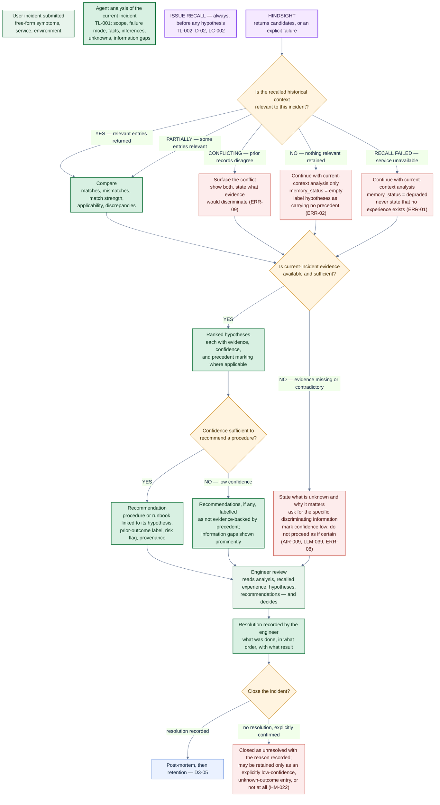

**Plain-English reading of D3-09.** The purple box is unconditional: every analysis issues a recall, even when the system already knows memory is empty, because the engineer must be able to verify that memory *was* consulted. The first diamond then has five exits rather than two, because "relevant" is not a yes/no property in practice — partial relevance, conflicting records, nothing retained, and a failed recall are all different situations with different honest labels. The second diamond protects against the most damaging failure mode in an agent: confident output from insufficient evidence. Its `NO` exit is a first-class outcome that asks a specific question rather than guessing. The third diamond decides whether a recommendation may be presented as evidence-backed or must be downgraded. Only after all three judgements does the request reach the engineer, and the engineer's decision — not the agent's — is what advances the incident.

---

# 10. AGENT TOOL-CALL WORKFLOW

## 10.1 The six tools, when each runs, and what it touches

| Tool | Fires when | Reads | Writes | Failure status it can produce |
| --- | --- | --- | --- | --- |
| **TL-001 Incident Analyzer** | First step of every analysis request, in every mode including memory-isolated | Normalized incident record (DM-001) | Analysis artefact in the database | `MODEL_UNAVAILABLE` / `MODEL_OUTPUT_INVALID` — never a partial analysis presented as complete (ERR-04) |
| **TL-002 Hindsight Recall** | Automatically on every analysis, **before** hypotheses and recommendations. Also on an operator request for historical resolutions or runbooks. Removed from the tool set entirely in memory-isolated mode | Memory service | Recall record in the database | `ok` / `empty` / `degraded` / `suppressed` — four states, never conflated (RL-011, ERR-01, ERR-02) |
| **TL-003 Incident History Retrieval** | After TL-002, to establish structured history and recurrence, and to supply the evidence display for a recalled entry's source incident | Incident and resolution tables | Nothing | Database unavailable → visibly reduced history section, labelled; **never fabricates history and never substitutes for the memory status** (ERR-06) |
| **TL-004 Runbook Retrieval** | During recommendation generation, after hypotheses exist, so procedures can be matched and labelled with prior outcomes. Also on operator request | Runbook reference set + retained runbook-outcome memory | Nothing | Reference set unavailable → recommendations proceed labelled as having no runbook coverage (ERR-07). Memory unavailable for the track record → `outcome_source = no_record`, stated explicitly |
| **TL-005 Post-Mortem Generator** | On request after the incident is resolved or mitigated, and on regeneration after correction | Incident, analysis, comparisons, hypotheses, recommendations with outcomes, resolution, timeline, memory context for structure only | Post-mortem document in the database | Model failure → error, all incident data preserved, incident not blocked from closure (ERR-04) |
| **TL-006 Hindsight Retain** | After the post-mortem is confirmed, or after a confirmed resolution where the engineer elects to retain without a full post-mortem. **Never before engineer confirmation** | Confirmed incident data, engineer confirmations and confidence overrides | Memory entries in Hindsight; retained-entry ID mirror in the database | Per-entry `retained` / `failed`; `partial` or `failed` overall; never success for a failure; composed record preserved for retry (ERR-03, AC-24) |

**Capabilities deliberately absent from the tool set [C: Part 2 §7.3]:** execute or apply a change; create tickets or page a human; query monitoring, metrics, or logs; web search or fetch external documentation; delete or purge an incident; auto-resolve without confirmation; silently learn from failed recommendations; a general-purpose database query tool. Each exclusion has a stated reason, and the first one is the enforcement mechanism for D-05.

## 10.2 Tool-call workflow diagram

### D3-10 — Agent tool-call workflow

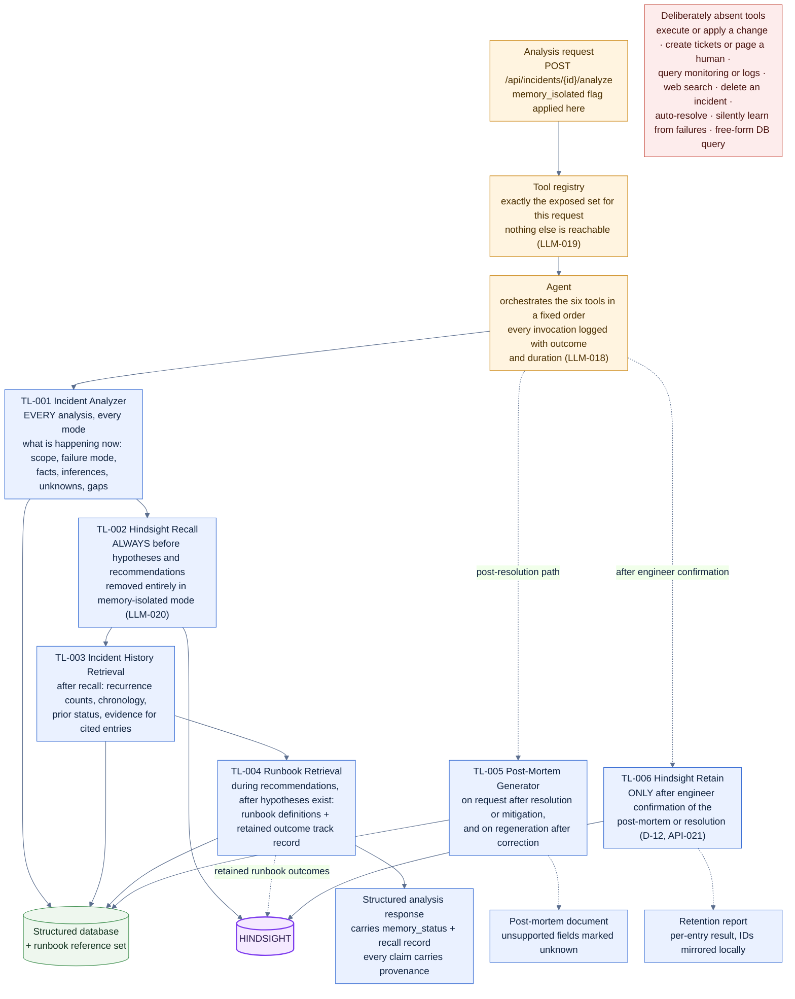

**Plain-English reading of D3-10.** The top row is control: a request arrives, the tool registry decides what the model may reach this time, and the agent walks a fixed sequence. Along the middle, the six tools are drawn in the order they fire. Only two of them touch the purple memory store, and only one of those two writes — which is why the memory corpus stays curated rather than accumulating every analysis. The bottom-left red box is as important as any of the green ones: the tools that are *not* there are the ones that would make this an autonomous production actor, and their absence is the control that enforces the advisory boundary. Every invocation is logged, so a tester can assert the ordering of TL-001 before TL-002 from the log rather than from the output text.

---

# 11. SEQUENCE DIAGRAM — NEW INCIDENT

## 11.1 Ordering note

The LLM appears **twice**: once to interpret the current incident (TL-001, which must happen before retrieval, because the retrieval intent is derived from that reading) and once after recall to compare and hypothesise. This is what keeps the required message order — *agent to LLM, then agent to Hindsight* — while still satisfying D-02, which requires **recall before any hypothesis or recommendation**, not recall before any model call.

### D3-11 — New incident: creation to a memory-informed analysis

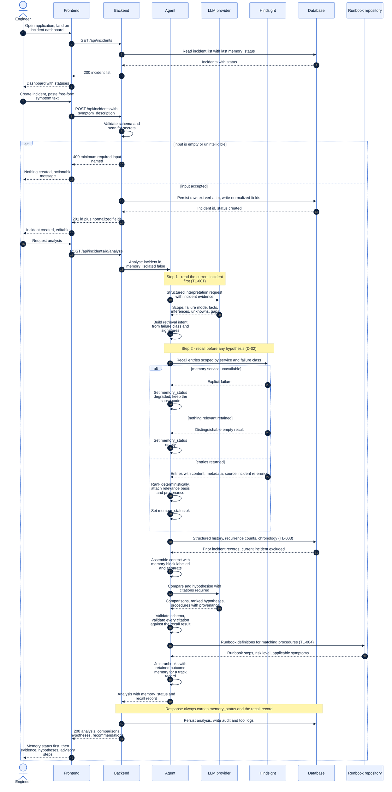

**Plain-English reading of D3-11.** Read it as two visits to the engineer. The first is administrative: the dashboard, then incident creation, with the validation branch showing that bad input creates nothing. The second is the substance. Inside the accepted branch, note the two `Note` blocks over the agent and the model: the first says *read the current incident first*, the second says *recall before any hypothesis*. That is the D-02 ordering drawn as a position in time rather than as a claim. The three-way `alt` over Hindsight is the honesty core — three different answers from one call, three different statuses, and in the failure case the agent keeps the cause code instead of inventing an empty result. Everything after that is assembly, comparison, and validation, and the response cannot reach the frontend without `memory_status` and the recall record attached.

---

# 12. SEQUENCE DIAGRAM — POST-MORTEM AND RETAIN

## 12.1 Ordering note

Engineer confirmation appears **twice, in two distinct roles**, and the order matters:

1. **Before the write** — the engineer confirms the post-mortem and confirms the composed memory record. This is a precondition of the Hindsight call, validated server-side (D-12, API-021). A system that retained first and asked afterwards would already have written to long-term memory without consent, which Part 1 prohibits.
2. **After the write** — the engineer sees the retention report and may flag any retained entry as incorrect, inapplicable, or outdated (FR-074).

### D3-12 — Post-mortem generation, experience extraction, and retain

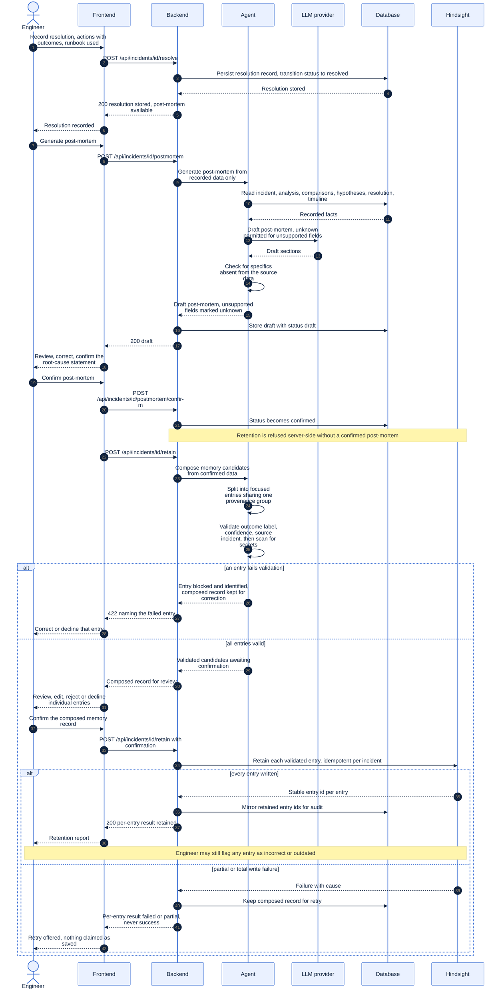

**Plain-English reading of D3-12.** Three phases. First, resolution: the human states what actually happened and the system records it, including the actions that did not work. Second, the post-mortem: generated strictly from recorded data, checked for invented specifics, stored as a draft, then corrected and confirmed by the engineer — and the engineer's root-cause statement becomes the recorded conclusion while the agent's stays labelled a hypothesis. Third, retention, which contains every gate that protects long-term memory: confirmed post-mortem, per-entry validation with secret scanning, engineer review of the composed record, and finally the write. The two failure branches are deliberately different in kind: a validation failure stops before anything is written and asks for a correction, while a write failure happens after a legitimate write attempt and offers a retry. Neither is ever reported as success.

---

# 13. SEQUENCE DIAGRAM — FUTURE SIMILAR INCIDENT

This is the **primary memory-learning diagram** of the PRD: the one that shows the product's reason for existing.

### D3-13 — A later, similar incident benefits from the earlier one

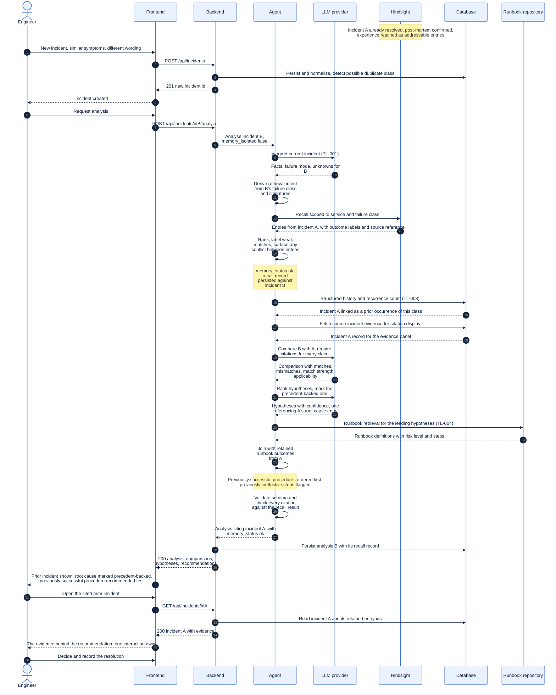

**Plain-English reading of D3-13.** Incident B is a different incident with different wording, and the note at the top tells you what already exists in memory from incident A. Everything after that is the ordinary path — the same code as the first incident, which is exactly what makes the comparison controlled (LC-009). The interesting moments are: the recall returning A's entries *without being asked for them*; the recurrence count linking the two incidents; the agent fetching A's record so the citation can be opened rather than merely asserted; the runbook being joined with A's recorded outcome so that "this worked last time" is evidence rather than opinion; and the engineer opening the cited prior incident in one interaction. If any of those purple steps returned nothing, the analysis would still complete and would say so — which is the behaviour the previous diagram showed and this one depends on.

---

# 14. DATA FLOW DIAGRAM

## 14.1 Level 0 — conceptual data flow

The whole product as a data pipeline, with no components named.

### D3-14 — Level 0 conceptual data flow

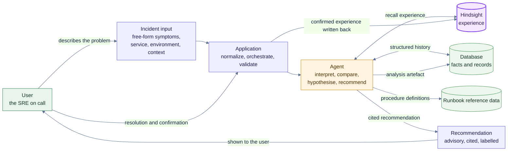

**Plain-English reading of D3-14.** Data enters as unstructured human speech and leaves as a cited recommendation. Three stores are involved, and the arrows show the discipline: the agent *reads* all three, but the only arrow leaving the system towards memory is the bottom one, and it starts from user confirmation rather than from the agent. The database receives the analysis artefact but never receives experience; the memory store receives experience but never receives the incident record.

## 14.2 Level 1 — detailed data flow

### D3-15 — Level 1 detailed data flow

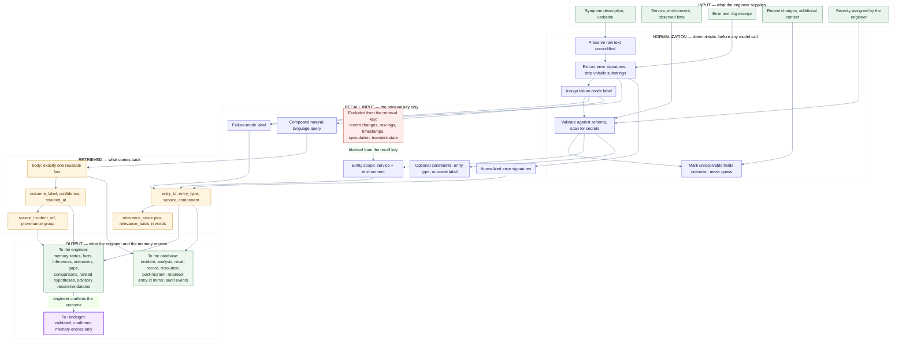

**Plain-English reading of D3-15.** Four stages left to right. The input stage is entirely human and untyped. The normalization stage is deterministic and runs before any model call, so the retrieval key is produced by code rather than guessed by a language model — and note the last normalization box, which marks unknowns instead of inventing values. The recall-input stage is deliberately narrow: only the four things that identify a *failure class* go in, and the red box lists what is refused and why. The retrieved stage is what Hindsight returns plus what the memory layer adds: a stated relevance basis in words, and a link back to the source incident. The output stage has three destinations, and only the last one is memory — and it is reached from the human's confirmation, not from the agent.

---

# 15. DATABASE / MEMORY SEPARATION

## 15.1 What each store holds

| | **Structured database** | **Hindsight memory** |
| --- | --- | --- |
| **Holds** | Incident metadata and identifiers; lifecycle status; timestamps; service, environment, and component; severity; the verbatim raw submission; the normalized representation; error signatures; failure-mode label; analysis artefacts including the recall record; resolution records; post-mortem documents; feedback; service registry; runbook definitions; audit events; demo configuration | Experience: condensed incident accounts; symptom profiles; confirmed root causes; contributing factors; resolution procedures; successful actions; failed actions; runbook outcomes; lessons; preventive knowledge; recurring patterns |
| **Nature of the content** | Facts about incidents, authoritative and complete | Interpretable experience, curated and partial |
| **Why it lives there** | It is the record of what happened and must be complete, queryable, and auditable | It is a retrieval corpus, and a corpus that stores everything retrieves nothing useful |
| **Written by** | The application, on every lifecycle transition | Only TL-006, after validation and engineer confirmation |
| **Read by** | The application, and the agent via TL-003 | The agent via TL-002 and TL-004 only |
| **Failure behaviour** | A failure is explicit; the memory service keeps its own independent status | A failure is explicit and is never presented as empty |
| **Explicitly excluded** | Experience, lessons, transferable conclusions | Raw logs, metric dumps, stack traces, secrets, customer data, transient state, unlabelled speculation, duplicated abstractions, narrative post-mortem prose |
| **Trace** | DM-001 – DM-004f, DM-007, LC-001 | HM-001 – HM-022, HM-033 – HM-035, LC-003, LC-006, LC-007 |

## 15.2 The one duplication that is allowed, and why

`DM-004b` keeps a **local mirror** of which memory entries were retained and which IDs came back. This is the single deliberate, documented cross-store reference permitted by DM-007, and it exists for audit: without it, "why does this recommendation cite that entry?" would be unanswerable after the fact. The *fact* lives in one place — Hindsight — and the database holds only the pointer.

## 15.3 Separation diagram

### D3-16 — Database and memory separation, with the agent's two independent paths

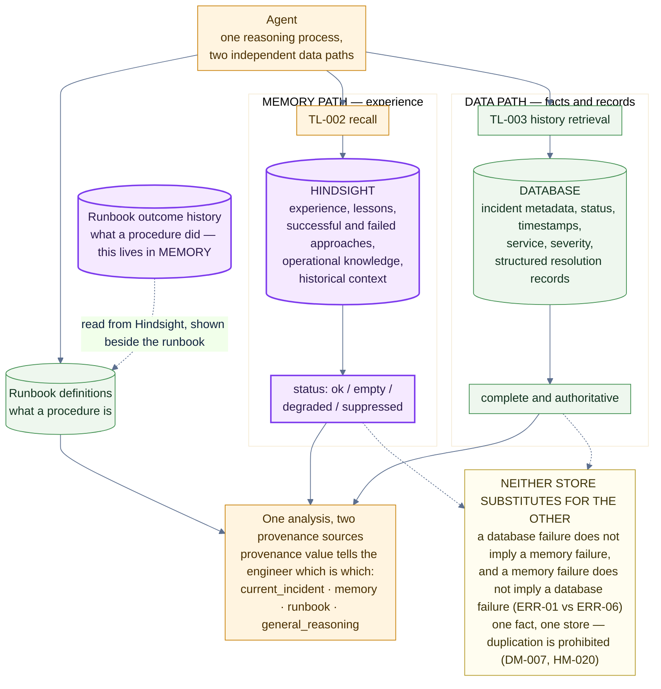

**Plain-English reading of D3-16.** The agent has two arms, and the diagram's main point is that they are genuinely separate. The purple arm goes to Hindsight and returns *experience* with a status that has four possible values. The green arm goes to the database and returns *facts*, which are complete and authoritative. They converge only at the end, in a single analysis whose every claim declares which arm it came from — and that declaration is what the engineer reads as provenance. The two small runbook boxes make a subtle point: the runbook's *steps* are reference data, while the runbook's *track record* is memory, which is why an ineffective runbook can be shown next to a correct one. The bottom note is the rule that keeps this honest: neither store stands in for the other, and the same fact is never written to both.

---

# 16. INCIDENT DATA MODEL

## 16.1 Entities and relationships

Only entities and fields defined in Part 2 §9 appear here. No field has been invented, and no field has been removed.

| Entity | Meaning | Key relationships |
| --- | --- | --- |
| `SERVICE` | The service registry: service, environment, and component definitions used to validate and normalize input (DM-004d) | Classifies many incidents |
| `INCIDENT` | The incident record, raw and normalized (DM-001) | Belongs to a service; has analyses, a resolution, a post-mortem, memory-entry references, and audit events |
| `ANALYSIS` | The generated analysis artefact with its recall record and memory status (DM-004a) | Belongs to one incident; carries many comparisons and hypotheses |
| `RESOLUTION` | What was actually done, with outcomes (DM-002) | Belongs to one incident; may reference a runbook |
| `POSTMORTEM` | The generated, then confirmed, document (DM-004) | Belongs to one incident; is the source of memory entries |
| `RUNBOOK` | Versioned procedure definitions (DM-005) | Referenced by resolutions; joined with retained outcome memory at query time |
| `MEMORY_ENTRY_REF` | Local mirror of retained entries and their IDs, for audit (DM-004b) | Belongs to an incident; may be sourced from a post-mortem |
| `AUDIT_EVENT` | Every lifecycle transition with its outcome, including failures (DM-004e) | Belongs to an incident |

**Not in this diagram, deliberately:** the memory entries themselves. They live in Hindsight, not in the relational store. The database holds only their identifiers, so that a citation can be resolved and audited without duplicating the content (HM-020, DM-004b).

### D3-17 — Entity-relationship model

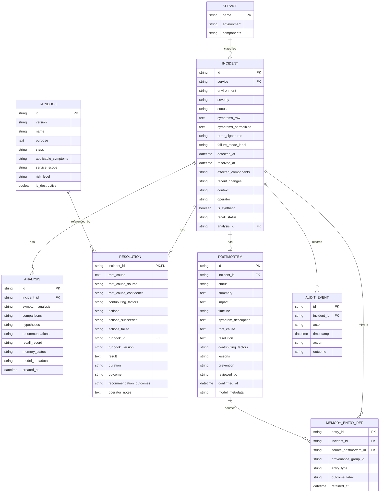

**Plain-English reading of D3-17.** The hub is `INCIDENT`, because everything in this product is about one incident. `SERVICE` sits beside it as the vocabulary that normalises free text into something comparable. Three children hang off an incident: the `ANALYSIS` that the agent produced, the `RESOLUTION` the human produced, and the `POSTMORTEM` that the human confirmed. `RESOLUTION` points outward to `RUNBOOK`, which is the only edge in the model that leaves the incident's own history — it is the link between what happened and the documented procedure. `MEMORY_ENTRY_REF` is the thin bridge to Hindsight: identifiers and provenance only, never content. `AUDIT_EVENT` records every transition including the failures, so "what happened to this incident" is answerable after the fact.

## 16.2 Which entity is read and written at each workflow step

The database read/write footprint of every step of WF-01. `R` = read, `W` = write, `—` = neither. The rightmost column is the part that matters most: it is the set of steps that touch Hindsight, and it contains exactly two.

| Step | `INCIDENT` | `SERVICE` | `ANALYSIS` | `RESOLUTION` | `POSTMORTEM` | `RUNBOOK` | `MEMORY_ENTRY_REF` | `AUDIT_EVENT` | Hindsight |
| --- | --- | --- | --- | --- | --- | --- | --- | --- | --- |
| W-01 List incidents | R | R | — | — | — | — | — | — | — |
| W-02 Create incident | W | R | — | — | — | — | — | W | — |
| W-03 Normalize | R/W | R | — | — | — | — | — | W | — |
| W-04 Trigger analysis | R | R | — | — | — | — | — | W | — |
| W-05 Interpret | R | — | W | — | — | — | — | W | — |
| W-06 Recall | R | — | W (recall record) | — | — | — | — | W | **R** |
| W-07 Compare and hypothesise | R | — | W | R (prior) | — | R | — | W | — |
| W-08 Recommend | R | — | W | — | — | R | — | W | — |
| W-09 Review evidence | R | — | R | R | R | R | R | — | — |
| W-10 Decide | — | — | — | — | — | — | — | W | — |
| W-11 Resolve | R/W | — | — | W | — | R | — | W | — |
| W-12 Assess effectiveness | R | — | — | W | — | R | — | W | — |
| W-13 Post-mortem | R | — | R | R | W | R | — | W | — |
| W-14 Confirm | R | — | — | — | W | — | — | W | — |
| W-15 Retain | R | — | — | R | R | R | W | W | **W** |
| Later recall (incident N+1) | R | R | W (recall record) | R | R | R | R | W | **R** |

Two observations the table makes that prose usually misses. First, `RUNBOOK` is read far more often than it is written — the reference set is loaded once and consulted on every analysis, which is why its version has to be pinned and reported (`DM-014`, `DEP-012`). Second, `MEMORY_ENTRY_REF` is written in exactly one row, W-15, and is read thereafter; if a proposed feature would write it anywhere else, that feature is proposing to duplicate memory content in the database, which `HM-020` and `DM-007` prohibit.


---

# 17. MEMORY MODEL

## 17.1 What one retained experience is made of

A single incident does not become one memory blob. It becomes a set of focused entries, each holding exactly one reusable fact, each independently retrievable, each able to answer "what is this, why did it match, and did it work?" — and all of them sharing one provenance group so the prior incident can still be told as a coherent story.

### D3-18 — The anatomy of a retained incident experience

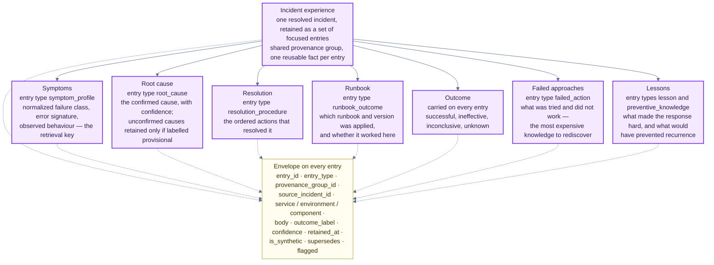

**Plain-English reading of D3-18.** The centre is one incident; the seven branches are the seven kinds of thing worth carrying forward. The branch most often missing from real incident systems is `failed approaches` — and it is the one that saves the most time, because a negative result is expensive to rediscover. The branch that makes ordering possible is `outcome`, which rides on every entry rather than living in one place: without it, "proven before" has no meaning. The yellow envelope is what makes the whole thing citable — an entry ID, a source incident, a confidence, and a flag for when someone later says this record is wrong.

## 17.2 From experience to future recall

### D3-19 — Experience to retained memory to future recall

```mermaid
%%{init: {"theme":"base","themeVariables":{"fontFamily":"Segoe UI, Helvetica, Arial, sans-serif","primaryColor":"#eaf1ff","primaryTextColor":"#10233f","primaryBorderColor":"#3b6fd4","lineColor":"#5c6f8f"},"themeCSS":".edgePath path{stroke-dasharray:6 5;animation:pr_flow 2.8s linear infinite}@keyframes pr_flow{to{stroke-dashoffset:-22}}.pulse{animation:pr_pulse 3.2s ease-in-out infinite}@keyframes pr_pulse{0%,100%{opacity:1}50%{opacity:.55}}","flowchart":{"curve":"basis","htmlLabels":true,"nodeSpacing":28,"rankSpacing":32,"padding":8}}}%%
flowchart LR
  E1["Confirmed experience<br/>extracted from a confirmed post-mortem"]
  E2["Validate<br/>one fact per entry · outcome label ·<br/>confidence · source incident · secret scan"]
  E3{"Engineer confirms<br/>or edits the composed record"}
  E3 -->|"declines"| E3X["Not retained<br/>decision recorded on the incident"]
  E3 -->|"confirms"| E4[("RETAIN in Hindsight<br/>stable entry id per entry,<br/>ids mirrored in the database")]
  E5["Future incident of the same class<br/>different wording, same failure class"]
  E6["RECALL returns the entries<br/>with provenance and outcome labels"]
  E7["Comparison, precedent-backed hypothesis,<br/>previously successful procedure first,<br/>previously ineffective step flagged"]
  E1 --> E2 --> E3
  E4 --> E5 --> E6 --> E7
  E7 -.->|"the engineer may flag any entry as<br/>incorrect, inapplicable, or outdated (FR-074)"| E4

  classDef mem fill:#f5e9ff,stroke:#7c3aed,stroke-width:2px,color:#2b1b4d,animation:pr_pulse 3.2s ease-in-out infinite;
  classDef agent fill:#fff4e0,stroke:#c9820a,stroke-width:1px,color:#4a2f00;
  classDef human fill:#e8f4ec,stroke:#2f7d4f,stroke-width:1px,color:#12331f;
  classDef err fill:#fdecec,stroke:#c0392b,stroke-width:1px,color:#4a1410;

  class E4,E6 mem;
  class E1,E2,E7 agent;
  class E3,E5 human;
  class E3X err;
```

**Plain-English reading of D3-19.** Left to right: experience is confirmed, validated, human-approved, written to memory, then encountered again by a different incident and returned with its provenance intact. The last dashed edge is the correction path — a retained entry is never permanent, because an engineer who discovers a record is wrong must be able to say so and have that visible on the next recall.

---

# 18. FRONTEND INFORMATION ARCHITECTURE

## 18.1 The seven screens

There are exactly seven screens in the MVP, and they follow the incident lifecycle in order. There is no eighth "settings" screen, because configuration is environment-driven and there is nothing for the engineer to configure in the product (DEP-005, FE-014).

| ID | Screen | What it exists for | Entry point |
| --- | --- | --- | --- |
| `FE-001` | **Incident Dashboard** | The single landing page: every incident with its lifecycle status and the memory status of its last analysis | Application root |
| `FE-002` | **Create Incident** | Capture the symptom in the engineer's own words, with service and environment | Dashboard |
| `FE-003` | **Incident Analysis** | Read the agent's analysis: symptom reading, comparisons, hypotheses | Create Incident, or an existing incident |
| `FE-004` | **Historical Memory** | See the retained entries that were recalled, with provenance, outcome, and match strength | Analysis, or the dashboard's memory view |
| `FE-005` | **Recommendation** | Read the advisory procedures and the evidence behind them | Analysis |
| `FE-006` | **Resolution** | Record what was actually done, including the actions that failed | Recommendation, or Analysis |
| `FE-007` | **Post-Mortem** | Generate, correct, and confirm the post-mortem; review and confirm the memory record | Resolution |

### D3-20 — Frontend information architecture

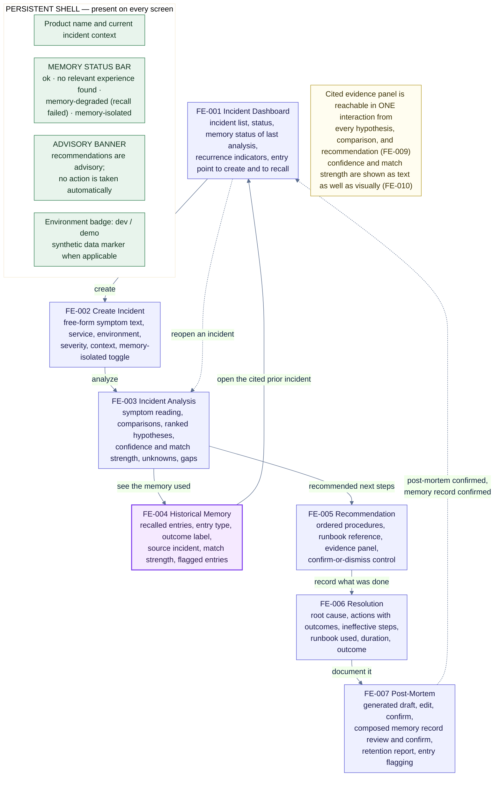

**Plain-English reading of D3-20.** The solid path is the happy path of the incident lifecycle, and the order of the seven boxes is the order of the engineer's work. The two dashed edges are the ones that make the product compound: after a post-mortem is confirmed the incident returns to the dashboard carrying its memory status, and any recalled entry links straight back to the incident it came from — so a citation is a link, not a claim. The green shell is the part that survives from screen to screen, and the memory status bar is the first thing in it: the engineer can never be in a position where they do not know whether memory informed what they are reading. The advisory banner is there for the same reason.

---

# 19. USER INTERFACE FLOW

## 19.1 What each screen must show, and what it must never hide

| Screen | Must show first | Must show with every claim | Failure rendering |
| --- | --- | --- | --- |
| Dashboard | Lifecycle status; memory status of the last analysis | Recurrence indicator linking similar incidents | A degraded last analysis is marked on the row, not only inside it |
| Create Incident | The raw text the engineer typed, unmodified | Service, environment, severity | Rejected input names the specific field and creates nothing |
| Incident Analysis | Memory status; unknowns; gaps | Provenance per hypothesis, confidence, and the cited source incident | Degraded and empty are two visibly different banners (FE-011) |
| Historical Memory | The memory status that produced this list | Entry type, outcome label, source incident, match strength, flag state | A suppressed or isolated run shows the list as intentionally withheld, not as empty |
| Recommendation | The advisory statement; risk level | Evidence panel one interaction away; provenance; the fact that nothing was executed | A runbook that has failed before is flagged in place, before it is followed |
| Resolution | Nothing pre-filled as fact | Which fields came from the engineer versus the agent | An action recorded as ineffective stays visible in the record |
| Post-Mortem | Draft status, explicitly labelled as generated | Which root cause is human-confirmed versus agent-proposed | An unconfirmed post-mortem cannot reach the retain control |

### D3-21 — Interface flow, with the four memory states made visible

```mermaid
%%{init: {"theme":"base","themeVariables":{"fontFamily":"Segoe UI, Helvetica, Arial, sans-serif","primaryColor":"#eaf1ff","primaryTextColor":"#10233f","primaryBorderColor":"#3b6fd4","lineColor":"#5c6f8f"},"themeCSS":".edgePath path{stroke-dasharray:6 5;animation:pr_flow 2.8s linear infinite}@keyframes pr_flow{to{stroke-dashoffset:-22}}.pulse{animation:pr_pulse 3.2s ease-in-out infinite}@keyframes pr_pulse{0%,100%{opacity:1}50%{opacity:.55}}","flowchart":{"curve":"basis","htmlLabels":true,"nodeSpacing":24,"rankSpacing":28,"padding":8}}}%%
flowchart TB
  A["FE-001 Dashboard"] -->|"create incident"| B["FE-002 Create Incident"]
  B -->|"submit"| C["FE-003 Analysis runs"]
  C --> D{"Memory status returned"}

  D -->|"ok"| E1["Analysis with a labelled memory block<br/>comparisons, precedent-backed hypotheses"]
  D -->|"no relevant experience found"| E2["Analysis still produced<br/>banner: nothing retained matched this failure class"]
  D -->|"memory-degraded"| E3["Analysis still produced<br/>red banner: recall failed, code shown,<br/>no historical claims may be made"]
  D -->|"memory-isolated"| E4["Analysis with no memory block at all<br/>control visibly active, comparison view enabled"]

  E1 --> F["FE-004 Historical Memory"]
  E2 --> F
  E3 --> F
  E4 -.->|"view explicitly withheld by the user"| F

  F --> G["FE-005 Recommendation"]
  E1 --> G
  E2 --> G
  E3 --> G
  E4 --> G

  G -->|"engineer decides, nothing is executed"| H["FE-006 Resolution"]
  H --> I["FE-007 Post-Mortem"]
  I -->|"confirm the post-mortem,<br/>then confirm the composed record"| J["Retention report<br/>per-entry result, entry IDs"]
  J -->|"flag any entry as incorrect,<br/>inapplicable, or outdated"| K["Flagged entry,<br/>visible on the next recall"]

  CANCEL["The engineer may stop at any point.<br/>Nothing is written to memory by leaving a screen (FR-074, D-12)"]
  H -.-> CANCEL

  classDef scr fill:#eef0ff,stroke:#5b5bd6,stroke-width:1px,color:#1b1b4b;
  classDef mem fill:#f5e9ff,stroke:#7c3aed,stroke-width:2px,color:#2b1b4d,animation:pr_pulse 3.2s ease-in-out infinite;
  classDef ok fill:#e8f4ec,stroke:#2f7d4f,stroke-width:2px,color:#12331f;
  classDef warn fill:#fff4e0,stroke:#c9820a,stroke-width:2px,color:#4a2f00;
  classDef err fill:#fdecec,stroke:#c0392b,stroke-width:2px,color:#4a1410;
  classDef note fill:#fffdf0,stroke:#b59b2a,stroke-width:1px,color:#3d3308;

  class A,B,C,F,G,H,I,J scr;
  class E1 ok;
  class E2 warn;
  class E3 err;
  class E4 mem;
  class K mem;
  class CANCEL note;
```

**Plain-English reading of D3-21.** The diamond is the important part. All four memory states converge on one thing — an analysis is still produced — but each arrives with a different banner, and the four branches are drawn in four different colours precisely because `degraded` and `empty` must never be mistaken for each other in a screenshot, in a test, or in a demo. The four branches then rejoin before the recommendation screen, so the engineer always reaches the same place. The bottom-left note is the human boundary stated as interface behaviour: leaving a screen writes nothing, and the only two confirmations that touch memory are the two on the post-mortem screen.

---

# 20. BACKEND REQUEST FLOW

## 20.1 The analysis request, request by request

This is the internal lifecycle of `POST /api/incidents/{id}/analyze`. It is the one request that touches every layer, and it is the request the D-02 ordering is enforced inside.

| # | Step | Owner | Rule applied |
| --- | --- | --- | --- |
| 1 | Route resolves and the request body is parsed | API layer | Rejected shapes never reach business logic (BE-005) |
| 2 | Incident is loaded by ID | Incident service | `404` with a machine-readable code if it does not exist |
| 3 | The normalized record is rebuilt from the stored raw text | Incident service | The stored raw text remains the source of truth; normalization is never re-invented |
| 4 | `memory_isolated` is resolved | Configuration | `true` in memory-isolated mode registers the recall tool and then refuses the call (D-08) |
| 5 | The orchestration order is fixed | Agent orchestration | interpret → recall → compare → hypothesise → recommend, enforced in code (BE-006, D-02) |
| 6 | TL-001 runs and its output is schema-validated | Agent | A schema failure is retried once, then surfaced as `MODEL_OUTPUT_INVALID` |
| 7 | The recall intent is derived from the interpretation | Memory module | The retrieval key is built from normalized features, not from the model's prose |
| 8 | TL-002 runs against Hindsight | Memory module | Four outcomes are distinguished: results, empty, unavailable, suppressed |
| 9 | The recall record is written | Audit service | The record is stored whether or not the caller will ever display it (RP-011) |
| 10 | TL-003 runs against the database | Database service | Independent status; a database failure does not become a memory failure |
| 11 | Context is assembled in labelled blocks | Agent orchestration | The memory block is separate and labelled, so prior properties cannot be read as current ones (HM-035) |
| 12 | Comparison, hypotheses, and recommendations are generated with citations required | Agent | Every claim without a citation is rejected by the anti-fabrication check (LLM-032) |
| 13 | TL-004 fetches runbook definitions; outcome history is joined from memory | Runbook service | Runbook steps and runbook outcomes come from different stores (D3-16) |
| 14 | The response is assembled with `memory_status` and the recall record, then persisted | API layer | The response cannot be constructed without them (API-018) |
| 15 | Tool calls, statuses, and timing are audited | Audit service | Ordering is assertable from the log (CHK-DC6) |

### D3-22 — Backend request lifecycle for one analysis request

```mermaid
%%{init: {"theme":"base","themeVariables":{"fontFamily":"Segoe UI, Helvetica, Arial, sans-serif","primaryColor":"#eaf1ff","primaryTextColor":"#10233f","primaryBorderColor":"#3b6fd4","lineColor":"#5c6f8f"},"themeCSS":".edgePath path{stroke-dasharray:6 5;animation:pr_flow 2.8s linear infinite}@keyframes pr_flow{to{stroke-dashoffset:-22}}.pulse{animation:pr_pulse 3.2s ease-in-out infinite}@keyframes pr_pulse{0%,100%{opacity:1}50%{opacity:.55}}","flowchart":{"curve":"basis","htmlLabels":true,"nodeSpacing":22,"rankSpacing":24,"padding":7}}}%%
flowchart TD
  REQ["POST /api/incidents/id/analyze<br/>memory_isolated optional"]
  V["Validate the request shape<br/>never reach business logic unparsed"]
  LOAD["Load the incident<br/>rebuild normalized fields from stored raw text"]
  GATE{"memory_isolated true?"}
  GATE -->|"yes"| ISO["Recall tool registered, then the call is refused<br/>status: suppressed, deliberately withheld"]
  GATE -->|"no"| ORDER["Fix the order: interpret, recall, compare,<br/>hypothesise, recommend — enforced in code"]
  ORDER --> T1["TL-001 interpret the current incident<br/>schema-validated, one retry, then MODEL_OUTPUT_INVALID"]
  T1 --> KEY["Derive the retrieval key from normalized features<br/>not from the model's prose"]
  KEY --> T2["TL-002 recall in Hindsight"]
  T2 --> FOUR{"Outcome"}
  FOUR -->|"entries"| R1["Rank deterministically<br/>attach relevance basis and provenance"]
  FOUR -->|"nothing relevant"| R2["Status: empty"]
  FOUR -->|"service unreachable"| R3["Status: degraded, cause code kept"]
  FOUR -->|"isolation requested"| R4["Status: suppressed"]
  R1 --> AUD1["Write the recall record"]
  R2 --> AUD1
  R3 --> AUD1
  R4 --> AUD1
  AUD1 --> T3["TL-003 structured history from the database<br/>independent status, own failure code"]
  T3 --> CTX["Assemble context in labelled blocks:<br/>current incident, memory block, history, runbooks"]
  CTX --> T5["TL-005 compare and hypothesise<br/>citations required by the schema"]
  T5 --> CHECK{"Every claim resolves<br/>to a retrieved entry?"}
  CHECK -->|"no"| REJ["Reject the unsupported claim<br/>LLM-034 anti-fabrication control"]
  CHECK -->|"yes"| T4["TL-004 runbook definitions from the database"]
  REJ --> T4
  T4 --> JOIN["Join runbook steps with retained runbook outcomes<br/>same tool call, two stores, one answer"]
  JOIN --> RESP["Assemble the response:<br/>analysis, memory_status, recall record, citations"]
  RESP --> PERSIST["Persist analysis, tool logs, audit event"]
  PERSIST --> OK["200 with the complete analysis"]
  V -->|"unparseable"| E400["400 VALIDATION_FAILED"]
  LOAD -->|"absent"| E404["404 NOT_FOUND"]

  classDef scr fill:#eef0ff,stroke:#5b5bd6,stroke-width:1px,color:#1b1b4b;
  classDef app fill:#eef0ff,stroke:#5b5bd6,stroke-width:1px,color:#1b1b4b;
  classDef mem fill:#f5e9ff,stroke:#7c3aed,stroke-width:2px,color:#2b1b4d,animation:pr_pulse 3.2s ease-in-out infinite;
  classDef ok fill:#e8f4ec,stroke:#2f7d4f,stroke-width:2px,color:#12331f;
  classDef warn fill:#fff4e0,stroke:#c9820a,stroke-width:2px,color:#4a2f00;
  classDef err fill:#fdecec,stroke:#c0392b,stroke-width:2px,color:#4a1410;

  class REQ,V,LOAD,CTX,JOIN,RESP,PERSIST,OK,KEY,CHECK scr;
  class T1,T3,T4,T5 app;
  class T2,R1,AUD1 mem;
  class R2,ISO warn;
  class R3,R4,REJ,E400,E404 err;
```

**Plain-English reading of D3-22.** This is D3-11 seen from inside the server. The gate near the top is memory-isolated mode, and note how it is implemented: the recall tool is *registered* and then refuses, rather than never being registered, because the log has to show that a recall was deliberately withheld. The four-way box after TL-002 is the same four states the interface showed, now as server-side branches, and the recall record is written in all four cases. The rejection diamond near the bottom is the anti-fabrication control in its strictest form: a claim that cannot be resolved to a retrieved entry is removed rather than softened. And the last two boxes before the response are what make the product auditable — the joined runbook answer, and the persistence of analysis, tool logs, and audit event.

## 20.2 Every screen, the calls it makes, and which responses carry memory status

This table discharges `P2H-11` completely: the screen inventory, the endpoints each screen uses, and the memory-status contract per response.

| Screen | Calls made | Carries `memory_status`? | Why |
| --- | --- | --- | --- |
| `FE-001` Dashboard | `API-002 GET /api/incidents`; `API-003 GET /api/incidents/{id}` | **Yes, indirectly.** Each row shows the stored `recall_status` of that incident's last analysis. | The dashboard renders stored status, it does not perform a recall |
| `FE-002` Create Incident | `API-001 POST /api/incidents`; `API-004 PATCH /api/incidents/{id}` | No | No agent output is produced here; no memory is consulted |
| `FE-003` Analysis | `API-005 POST /api/incidents/{id}/analyze`; `API-006 GET /api/incidents/{id}/analysis` | **Yes, always** (API-018) | This is the screen where D-02 is either honoured or broken, so the status must be present on the response itself, not inferred |
| `FE-004` Historical Memory | `API-007 GET /api/incidents/{id}/memory`; `API-011 POST /api/memory/recall`; `API-013 GET /api/memory/experience`; `API-014 POST /api/memory/experience/{entry_id}/flag` | **Yes, always** | A recalled list without its status is exactly the `degraded`-read-as-`empty` defect |
| `FE-005` Recommendation | `API-006 GET /api/incidents/{id}/analysis`; `API-015 GET /api/runbooks`, `GET /api/runbooks/{id}` | **Yes, always** | Recommendations are the highest-risk place to present precedent without stating its status |
| `FE-006` Resolution | `API-008 POST /api/incidents/{id}/resolve` | No | Human-authored record. The analysis's status is displayed as read-only context |
| `FE-007` Post-Mortem | `API-009 POST /api/incidents/{id}/postmortem`; `API-010 GET` and `POST /confirm`; `API-012 POST /api/memory/retain` | **Yes on retain** | Retain returns per-entry outcomes; the composed record itself is not a memory read, so it carries no recall status |
| Global, all screens | `API-016 GET /api/health`; `API-017 POST /api/demo/reset`, `/api/demo/seed` (demo environment only) | No | Operational endpoints, not analyst output |

Three rules fall out of the table and are worth stating because they are easy to get wrong:

1. **A response that displays agent output and does not carry `memory_status` is a contract violation**, not a UI omission (API-018). `FE-008` states the same rule from the interface side.
2. **`FE-002` and `FE-006` legitimately carry no status**, because no agent output is displayed on them. Adding a status there would be theatre.
3. **The retain call is the only one that writes to memory, and it is on exactly one screen.** That is the human-in-the-loop boundary expressed as an endpoint count.


---

# 21. ERROR HANDLING FLOW

## 21.1 The rule that shapes every branch

There is one error-handling rule in this product, and everything below is an instance of it: **never let a failure look like an answer.** A failed dependency is reported as a failure with a code; a genuinely empty result is reported as empty; a low-confidence result is reported as low-confidence; and the analysis continues in all three cases rather than aborting, because the engineer's incident is happening either way (D-11, BE-016, API-019).

| Code | Condition | What the system does | What the engineer sees | Test |
| --- | --- | --- | --- | --- |
| `ERR-01` | Hindsight unreachable, times out, or rate-limits | Bounded retry with idempotency; then `memory_status: degraded` with the cause code retained | Red banner: recall failed. Analysis continues. No statement about prior experience is permitted | T-E2E, T-API-06, AC2-03c |
| `ERR-02` | Recall returns nothing relevant | `memory_status: empty`, distinct from degraded | Neutral banner: nothing retained matched this failure class | HT-05, T-AB-03 |
| `ERR-03` | Retain fails, partially succeeds, or times out | Composed record kept; per-entry results; bounded retry; no success reported for a failed write | Per-entry report showing exactly what was and was not written, with a retry offered | HT-01, AC2-07a |
| `ERR-04` | Model provider unavailable, or output fails the schema | One retry; then a partial result with the affected section labelled, or a code if the section is mandatory | The affected section marked unavailable, with a reason. Never a plausible-looking substitute | T-AB-07 |
| `ERR-05` | Input empty, unintelligible, or over the size limit | Nothing is created or written | The specific field named; minimum required input explained | T-API-01, AC-01 |
| `ERR-06` | Database unavailable | History retrieval fails independently of memory; its own status and code | Structured history marked unavailable; memory results still shown if they exist | T-UT-10 |
| `ERR-07` | Runbook set unavailable, or no runbook matches | Recommendations come from retained experience and are labelled as having no runbook reference | Advisory steps without a runbook, explicitly labelled | T-E2E-03 |
| `ERR-08` | Evidence insufficient, or confidence low | Downgrade to observation; ask a specific question instead of guessing | Low-confidence marker plus the specific missing information | T-AB-02 |
| `ERR-09` | Two retained entries disagree on root cause | Both are returned and the conflict is stated; never silently reconciled | Both records shown side by side with the disagreement named | T-AB-08 |

### D3-23 — Error handling and safe fallback

```mermaid
%%{init: {"theme":"base","themeVariables":{"fontFamily":"Segoe UI, Helvetica, Arial, sans-serif","primaryColor":"#eaf1ff","primaryTextColor":"#10233f","primaryBorderColor":"#3b6fd4","lineColor":"#5c6f8f"},"themeCSS":".edgePath path{stroke-dasharray:6 5;animation:pr_flow 2.8s linear infinite}@keyframes pr_flow{to{stroke-dashoffset:-22}}.pulse{animation:pr_pulse 3.2s ease-in-out infinite}@keyframes pr_pulse{0%,100%{opacity:1}50%{opacity:.55}}","flowchart":{"curve":"basis","htmlLabels":true,"nodeSpacing":24,"rankSpacing":28,"padding":8}}}%%
flowchart TB
  START["Any memory-touching operation"] --> DEP{"Which dependency failed?"}

  DEP -->|"Hindsight unreachable"| E1["ERR-01<br/>bounded retry, keep the cause code"]
  E1 --> D1["memory_status: degraded<br/>FAILURE, not empty"]
  DEP -->|"Hindsight returns nothing relevant"| E2["ERR-02<br/>no retry, this is a real answer"]
  E2 --> D2["memory_status: empty"]
  DEP -->|"Retain fails, or partly fails"| E3["ERR-03<br/>keep the composed record, per-entry results"]
  E3 --> D3["Partial or failed report<br/>nothing claimed as saved"]
  DEP -->|"Model unavailable or output invalid"| E4["ERR-04<br/>one retry, then label the section"]
  E4 --> D4["Section marked unavailable with a reason"]
  DEP -->|"Input invalid"| E5["ERR-05<br/>write nothing at all"]
  E5 --> D5["Specific field named, nothing created"]
  DEP -->|"Database unavailable"| E6["ERR-06<br/>independent of memory status"]
  E6 --> D6["History unavailable, memory results still shown"]
  DEP -->|"Runbook missing"| E7["ERR-07<br/>recommend from experience, no runbook reference"]
  E7 --> D7["Advisory steps, runbook explicitly absent"]
  DEP -->|"Evidence insufficient"| E8["ERR-08<br/>downgrade to observation"]
  E8 --> D8["Low-confidence marker plus a specific question"]
  DEP -->|"Retained records disagree"| E9["ERR-09<br/>return both, state the conflict"]
  E9 --> D9["Both records shown, disagreement named"]

  D1 --> CONT["The analysis or report still completes<br/>with the affected part labelled"]
  D2 --> CONT
  D3 --> RETRY["Retry offered, idempotent,<br/>no duplicate entry"]
  D4 --> CONT
  D5 --> STOP["Stop cleanly. Nothing persisted."]
  D6 --> CONT
  D7 --> CONT
  D8 --> CONT
  D9 --> CONT
  CONT --> AUDIT["Audit the failure with its code,<br/>identifiers, and correlation ID"]
  RETRY --> AUDIT
  STOP --> AUDIT

  NEVER["THREE THINGS THAT MUST NEVER HAPPEN<br/>1. A failed memory call reported as a successful empty result<br/>2. A partial retain reported as a successful retain<br/>3. An unavailable section replaced by plausible generated text"]

  AUDIT -.-> NEVER

  classDef scr fill:#eef0ff,stroke:#5b5bd6,stroke-width:1px,color:#1b1b4b;
  classDef mem fill:#f5e9ff,stroke:#7c3aed,stroke-width:2px,color:#2b1b4d,animation:pr_pulse 3.2s ease-in-out infinite;
  classDef ok fill:#e8f4ec,stroke:#2f7d4f,stroke-width:2px,color:#12331f;
  classDef warn fill:#fff4e0,stroke:#c9820a,stroke-width:2px,color:#4a2f00;
  classDef err fill:#fdecec,stroke:#c0392b,stroke-width:2px,color:#4a1410;
  classDef note fill:#fffdf0,stroke:#b59b2a,stroke-width:1px,color:#3d3308;

  class START,CONT,RETRY,AUDIT scr;
  class D1 mem;
  class D2,D3,D6,D7 ok;
  class D4,D8 warn;
  class D5,D9 err;
  class NEVER note;
  class E1,E2,E3,E4,E5,E6,E7,E8,E9 err;
```

**Plain-English reading of D3-23.** Nine failures, one question. The design choice that matters is visible in what the branches do *not* do: none of them aborts the engineer's analysis, and none of them invents a substitute. The `ERR-01` and `ERR-02` branches are deliberately drawn in different colours because that is the single distinction the whole product is judged on — a purple `degraded` and a green `empty` are different facts and must never be merged. Every path ends at the audit box, so failures leave the same trace as successes, and the red note lists the three failures that would be defects rather than bugs to be tolerated.

---

# 22. SECURITY AND PRIVACY FLOW

## 22.1 The controls, in the order they apply

| Layer | Control | Requirement |
| --- | --- | --- |
| Edge | The deployment sits behind an access control because the MVP has no authentication | SEC-003, DEP-008 |
| Transport | CORS restricted to the configured frontend origin | SEC-003, API-023 |
| Input | Every write path schema-validated; free text length-bounded; description size-limited | SEC-007, BE-012 |
| Storage | Secrets only from the environment; never in source, image, bundle, or docs | SEC-001, SEC-011, GH-008 |
| Logging | Redaction implemented at the logging layer, not by convention; pasted log excerpts are database-only by default | SEC-002, SEC-006 |
| Memory | Secret scan of every composed entry before the write; a match blocks that entry and identifies it | SEC-008, AC-25 |
| Response | Codes and sanitized messages; provider errors logged redacted, surfaced safe | SEC-015 |
| Capability | No execution, actuation, or production-access tool exists in the inventory | SEC-011, SEC-020 |
| Data | Corpus, runbooks, and demo content are synthetic; no real customer data or hostnames | SEC-009, DM-015 |
| Repository | Pinned dependencies with committed lockfiles, `.gitignore` for `.env`, `.env.example` with placeholders, pre-commit secret scan | SEC-012, SEC-013 |
| Known gap | No authentication and no role model — stated in the README, not hidden | SEC-004, BE-014, DOC-009 |

### D3-24 — Security and privacy controls applied to one request

```mermaid
%%{init: {"theme":"base","themeVariables":{"fontFamily":"Segoe UI, Helvetica, Arial, sans-serif","primaryColor":"#eaf1ff","primaryTextColor":"#10233f","primaryBorderColor":"#3b6fd4","lineColor":"#5c6f8f"},"themeCSS":".edgePath path{stroke-dasharray:6 5;animation:pr_flow 2.8s linear infinite}@keyframes pr_flow{to{stroke-dashoffset:-22}}.pulse{animation:pr_pulse 3.2s ease-in-out infinite}@keyframes pr_pulse{0%,100%{opacity:1}50%{opacity:.55}}","flowchart":{"curve":"basis","htmlLabels":true,"nodeSpacing":22,"rankSpacing":24,"padding":7}}}%%
flowchart TB
  U5["Engineer"] --> EDGE2{"Access control at the edge<br/>private network or basic auth (SEC-003)"}
  EDGE2 -->|"refused"| X1["Request never reaches the application"]
  EDGE2 -->|"allowed"| CORS["CORS check<br/>only the configured frontend origin (API-023)"]
  CORS -->|"disallowed origin"| X2["Refused before any handler"]
  CORS --> VAL["Schema validation<br/>length-bounded, size-limited (SEC-007)"]
  VAL -->|"invalid"| X3["400, nothing written"]

  VAL --> PROC["Request processing<br/>no authentication, no roles (SEC-004, known gap)"]
  PROC --> LOG["Logging layer<br/>redaction of headers, environment values,<br/>credential-shaped fields (SEC-002)"]
  PROC --> PERS["Database write<br/>pasted log excerpts stored here, not in logs,<br/>unless configuration explicitly permits otherwise (SEC-006)"]
  PROC --> RET2["Compose memory entries"]
  RET2 --> SCAN{"Secret scan of the composed entry<br/>before any write (SEC-008)"}
  SCAN -->|"credential-shaped match"| X4["That entry is blocked, identified,<br/>and not written (T-SEC-01)"]
  SCAN -->|"clean"| WRITE["Retain to Hindsight"]
  WRITE --> RESP2["Response<br/>codes and sanitized messages only (SEC-015)"]
  RESP2 --> U5

  BOUND["STRUCTURAL LIMITS, NOT SETTINGS<br/>the tool inventory contains no execution, actuation,<br/>or production-access capability (SEC-011, SEC-020)<br/>the corpus, runbooks, and demo data are synthetic (SEC-009)<br/>secrets exist only in the environment (SEC-001)"]

  X1 -.-> BOUND
  X2 -.-> BOUND
  X3 -.-> BOUND
  X4 -.-> BOUND

  classDef scr fill:#eef0ff,stroke:#5b5bd6,stroke-width:1px,color:#1b1b4b;
  classDef mem fill:#f5e9ff,stroke:#7c3aed,stroke-width:2px,color:#2b1b4d,animation:pr_pulse 3.2s ease-in-out infinite;
  classDef ok fill:#e8f4ec,stroke:#2f7d4f,stroke-width:2px,color:#12331f;
  classDef err fill:#fdecec,stroke:#c0392b,stroke-width:2px,color:#4a1410;
  classDef note fill:#fffdf0,stroke:#b59b2a,stroke-width:1px,color:#3d3308;

  class VAL,PROC,RESP2,LOG,PERS scr;
  class WRITE mem;
  class EDGE2,CORS,SCAN ok;
  class X1,X2,X3,X4 err;
  class BOUND note;
```

**Plain-English reading of D3-24.** Read it as a series of doors, each of which can close the request before anything is stored. The three refusals on the left happen before business logic. The secret-scan diamond is the control that matters most for this specific product, because it is the one place where a mistake becomes permanent: a credential that reaches long-term memory stays there, so the scan happens on the composed entry immediately before the write, and a match blocks that entry and names it. The yellow box is the part that cannot be configured away — the absence of execution tooling and the syntheticity of the data are properties of the design, not settings someone could change later.

## 22.2 Trust boundaries and credential boundaries

`P2H-20` requires the credential boundary and the trust boundary to be shown separately, because they are not the same line.

| # | Boundary | Where it sits | What crosses it | What must never cross it | Control |
| --- | --- | --- | --- | --- | --- |
| 1 | **Network / access boundary** | In front of the application | The engineer's browser traffic | Any unauthenticated traffic | SEC-003, DEP-008 — private network or edge basic auth |
| 2 | **Browser → application** | The HTTP origin check | Requests from the configured frontend origin | Requests from any other origin | API-023, SEC-003 — CORS restricted to one origin |
| 3 | **Application → frontend bundle** | Build time | Public interface code | Any key, token, endpoint credential, or privileged route | SEC-005, T-SEC-03 — bundle inspection before the demo build |
| 4 | **Application → database** | The connection string | Queries and records | Credentials in code, images, or logs; credentials in the frontend | SEC-001, SEC-011 — environment injection only, redaction at the logger |
| 5 | **Application → Hindsight** | The memory client's credentials | Entries to retain; queries to recall | Any raw log, secret, customer record, or unlabelled speculation | SEC-001, SEC-008, SEC-009 — secret scan before the write; synthetic content only |
| 6 | **Application → model provider** | The provider API key | Context assembled for generation | Pastered log excerpts unless explicitly configured; credentials | SEC-006, SEC-014 — excerpts database-only by default; least-privilege key |
| 7 | **Application → logs** | The logging layer | Identifiers, tool names, statuses, latencies, correlation IDs | Credential values, environment dumps, unpermitted log bodies | SEC-002, SEC-006 — redaction implemented in the logger and tested (T-SEC-02) |
| 8 | **Application → any production system** | **Nowhere** | Nothing | Everything | SEC-010, SEC-011, T-SEC-05 — no such integration exists; the tool inventory proves it |
| 9 | **Repository → published bundle** | The commit | Source, lockfiles, `.env.example` with placeholders | `.env`, any real secret, any real customer datum | SEC-012, SEC-016 — `.gitignore`, pre-commit scan, repository-wide scan |

**What the trust model actually is.** There is exactly one identity, the configured operator (`BE-013`), and no role model (`BE-014`). That means the trust model is flat: every request reaching the application is treated as the operator. The consequence is stated rather than hidden — the product is usable only by a single trusted operator or a trusted team, and the perimeter is the only thing standing between the application and anyone else. This is a known limitation of the MVP, not a solved problem, and `DOC-009` requires it to be written in the README so that a reviewer does not discover it as a defect.


---

# 23. DEPLOYMENT ARCHITECTURE

The diagram below is **generic on purpose**. No cloud provider, host, container platform, or region is named, because the deployment target is an open question (`OQ-14`) and the specification deliberately stops at requirements (DEP-004, DEP-005).

### D3-25 — Generic deployment topology

```mermaid
%%{init: {"theme":"base","themeVariables":{"fontFamily":"Segoe UI, Helvetica, Arial, sans-serif","primaryColor":"#eaf1ff","primaryTextColor":"#10233f","primaryBorderColor":"#3b6fd4","lineColor":"#5c6f8f"},"themeCSS":".edgePath path{stroke-dasharray:6 5;animation:pr_flow 2.8s linear infinite}@keyframes pr_flow{to{stroke-dashoffset:-22}}.pulse{animation:pr_pulse 3.2s ease-in-out infinite}@keyframes pr_pulse{0%,100%{opacity:1}50%{opacity:.55}}","flowchart":{"curve":"basis","htmlLabels":true,"nodeSpacing":28,"rankSpacing":30,"padding":8}}}%%
flowchart TB
  ENG2["Engineer's browser"]

  subgraph BOUNDARY["ACCESS-CONTROLLED BOUNDARY — required because the MVP has no authentication (SEC-003, DEP-008)"]
    direction LR
    FE2["Static frontend bundle<br/>DEP-001<br/>no keys, no privileged endpoint"]
    BE2["Application<br/>ONE deployable service (BE-001, DEP-002)<br/>API, agent orchestration, memory module,<br/>validation, audit, demo reset/seed"]
  end

  subgraph STATE["STATE, PROVISIONED PER ENVIRONMENT"]
    direction LR
    DB2[("Relational database<br/>ONE instance (DEP-003)<br/>engine is a configuration choice")]
    CORPUS[("Versioned reference data<br/>corpus, service registry, runbook set (DEP-012)")]
  end

  subgraph EXTERNAL["EXTERNAL SERVICES — reached by configuration, not owned by this project (DEP-004)"]
    direction LR
    HS2[("Hindsight memory service<br/>endpoint, key, entity/namespace<br/>all environment variables")]
    LLM2[("Model provider<br/>provider, model, base URL, key,<br/>generation parameters")]
  end

  ENG2 -->|"HTTPS to the boundary"| FE2
  ENG2 -->|"HTTPS to the boundary"| BE2
  FE2 -->|"same-origin or configured origin only (API-023)"| BE2
  BE2 --> STATE
  BE2 -->|"HTTPS, credentials from the environment"| EXTERNAL
  EXTERNAL -->|"results and entries"| BE2

  subgraph ENVS["SEPARATE ENVIRONMENTS, NEVER SHARED"]
    direction LR
    E1["dev<br/>APP_ENV=dev<br/>demo endpoints enabled"]
    E2["demo<br/>APP_ENV=demo<br/>own database, own memory namespace, own keys<br/>demo data must not contaminate dev memory (DEP-009)"]
  end

  HEALTH["GET /api/health<br/>every mandatory dependency reported independently,<br/>plus the loaded corpus version (API-016, DEP-015)"]
  STARTUP["Startup validation<br/>fails fast, naming the missing variable (DEP-010)"]
  ENVS --> HEALTH
  HEALTH --> STARTUP

  classDef scr fill:#eef0ff,stroke:#5b5bd6,stroke-width:1px,color:#1b1b4b;
  classDef mem fill:#f5e9ff,stroke:#7c3aed,stroke-width:2px,color:#2b1b4d,animation:pr_pulse 3.2s ease-in-out infinite;
  classDef data fill:#eef7ee,stroke:#3f8f4f,stroke-width:1px,color:#12331f;
  classDef ext fill:#f5f5f5,stroke:#6b7280,stroke-width:1px,stroke-dasharray:4 3,color:#1f2937;
  classDef note fill:#fffdf0,stroke:#b59b2a,stroke-width:1px,color:#3d3308;

  class ENG2,FE2,BE2 scr;
  class HS2 mem;
  class DB2,CORPUS data;
  class LLM2 ext;
  class HEALTH,STARTUP,E1,E2 note;
```

**Plain-English reading of D3-25.** Two solid boxes inside a boundary, one state box, and two dashed external boxes. The boundary is drawn because the product has no login, so the control that replaces login is the network perimeter — if that is removed, the deployment is non-compliant, not merely weaker. The two grey dashed boxes are not ours: Hindsight and the model provider are configured in, never embedded, which is why no provider name appears anywhere in this document. The two environments at the bottom exist because a demo that shares a memory namespace with development will produce a demo that cannot be repeated, and reproducibility is a stated requirement.

---

# 24. TESTING ARCHITECTURE

## 24.1 Suites, and what each one protects

| Suite | Scope | Why it exists |
| --- | --- | --- |
| `T-UT-01` – `T-UT-10` | Pure functions: normalization, signature stripping, deterministic ranking, provenance and citation validation, secret scanning, retention predicates, outcome rules, the state machine, error mapping | The parts that must behave identically on every run, and whose failures are silent |
| `HT-01` – `HT-10` | The memory loop itself against a live or testable memory service | The product's core claim. A failure in any of the ten is a build blocker (D-07) |
| `T-AB-01` – `T-AB-10` | Agent behaviour: no fabrication, unknown handling, cold start, degraded honesty, citation integrity, post-mortem honesty, schema conformance, conflict surfacing, precedent ordering, advisory framing | Every anti-fabrication control, each as an executable assertion |
| `T-API-01` – `T-API-09` | Every endpoint, including the negative cases and the demo endpoints being refused outside dev/demo | The contract, and the "never fake success" rule, verified at the boundary |
| `T-SEC-01` – `T-SEC-06` | Secret blocking, log cleanliness, bundle inspection, synthetic data, tool inventory, environment gating | The controls that are otherwise only claims in a document |
| `T-E2E-01` – `T-E2E-05` | The full loop, before/after, negative-result retention, conflicting memory, closed-loop determinism | The product's claims, end to end, twice from reset |
| `T-DEMO-01` – `T-DEMO-07` | The demo path itself: clean reset, versioned data, distinct states, disclosure, reproducibility, script honesty | Because the demo is the evidence, the demo has to be tested like a feature |

### D3-26 — Testing layers mapped to the requirements they protect

```mermaid
%%{init: {"theme":"base","themeVariables":{"fontFamily":"Segoe UI, Helvetica, Arial, sans-serif","primaryColor":"#eaf1ff","primaryTextColor":"#10233f","primaryBorderColor":"#3b6fd4","lineColor":"#5c6f8f"},"themeCSS":".edgePath path{stroke-dasharray:6 5;animation:pr_flow 2.8s linear infinite}@keyframes pr_flow{to{stroke-dashoffset:-22}}.pulse{animation:pr_pulse 3.2s ease-in-out infinite}@keyframes pr_pulse{0%,100%{opacity:1}50%{opacity:.55}}","flowchart":{"curve":"basis","htmlLabels":true,"nodeSpacing":24,"rankSpacing":26,"padding":7}}}%%
flowchart TB
  REQS["Every requirement carries a test reference:<br/>FR, D, DM, HM, RP, RL, BE, API, SEC, ERR, NFR,<br/>FE, T-UT, HT, T-AB, T-API, T-SEC, T-E2E, T-DEMO, AC, AC2, CHK"]

  subgraph UNIT["UNIT — deterministic, no external calls"]
    U1["T-UT-01..10<br/>normalization, ranking,<br/>provenance, secret scan,<br/>state machine, error mapping"]
  end

  subgraph MEMT["MEMORY LOOP — the blocker gate"]
    H1["HT-01..HT-10<br/>retain, recall, similar wording,<br/>relevant, irrelevant, multiple,<br/>failed resolution, post-mortem,<br/>future incident, before/after"]
  end

  subgraph ABT["AGENT BEHAVIOUR — output quality controls"]
    A1["T-AB-01..10<br/>no fabrication, unknown handling,<br/>cold start, degraded honesty,<br/>citations, conflicts, ordering,<br/>advisory framing"]
  end

  subgraph CONTT["CONTRACT AND SECURITY"]
    P1["T-API-01..09<br/>including refusal outside dev/demo"]
    S1["T-SEC-01..06<br/>secret blocked, logs clean,<br/>bundle clean, synthetic data,<br/>no execution tool"]
  end

  subgraph E2ET["END TO END"]
    E1["T-E2E-01..05<br/>full loop A to B,<br/>before/after,<br/>negative result,<br/>conflict, determinism"]
    E2["T-DEMO-01..07<br/>the demonstration path itself"]
  end

  GATE["A failure in HT-01..HT-10 is a build blocker (D-07)"]
  CONC["Each suite is written from the requirement, not from the implementation:<br/>if a test cannot fail, the requirement it claims to cover is unverified"]

  REQS --> UNIT
  REQS --> MEMT
  REQS --> ABT
  REQS --> CONTT
  REQS --> E2ET
  UNIT --> GATE
  MEMT --> GATE
  ABT --> GATE
  CONTT --> GATE
  E2ET --> GATE
  GATE --> CONC

  classDef scr fill:#eef0ff,stroke:#5b5bd6,stroke-width:1px,color:#1b1b4b;
  classDef mem fill:#f5e9ff,stroke:#7c3aed,stroke-width:2px,color:#2b1b4d,animation:pr_pulse 3.2s ease-in-out infinite;
  classDef ok fill:#e8f4ec,stroke:#2f7d4f,stroke-width:2px,color:#12331f;
  classDef note fill:#fffdf0,stroke:#b59b2a,stroke-width:1px,color:#3d3308;

  class REQS,U1,A1,P1,S1,E1,E2 scr;
  class H1 mem;
  class GATE ok;
  class CONC note;
```

**Plain-English reading of D3-26.** The box at the top is the discipline that makes the rest of the diagram meaningful: tests are written from requirement IDs, so coverage is traceable in both directions and a requirement with no test reference is visible. The purple box is the memory loop, and it is the only one that gates the build — a failing `HT-*` test means the product's central claim is not currently true, which is different in kind from a failing unit test. The final note is the anti-pattern this structure is designed to prevent: tests written after the implementation tend to assert what the code does, whereas tests written from the requirement assert what the code must do.

---

# 25. DEMO FLOW

## 25.1 What the demonstration must prove

The demo is not a tour of screens. It is an argument, and the argument has one shape: **the same system, run twice, produces a different second answer because of what the first incident left behind.** Everything in the script exists to make that claim checkable rather than asserted.

| Step | What is shown | Screen | Success criterion |
| --- | --- | --- | --- |
| 0 | Reset to the documented starting state; health check green; corpus version stated | — | SC-12, T-DEMO-02 |
| 1 | **Cold start.** Incident A created and analyzed. The analysis states that no relevant experience exists. | `FE-002`, `FE-003` | SC-10, T-AB-03 |
| 2 | Hypotheses and advisory recommendations shown, labelled as not precedent-backed. | `FE-005` | SC-11 |
| 3 | Resolution recorded, including one action that did not work. | `FE-006` | — |
| 4 | Post-mortem generated, corrected by the engineer, confirmed. | `FE-007` | — |
| 5 | **Retain.** The composed memory record is reviewed entry by entry and confirmed; the retention report shows entry IDs. | `FE-007` | SC-01, SC-05 |
| 6 | Historical Memory screen shows what is now retained, with provenance. | `FE-004` | SC-03 |
| 7 | **Before/after.** The same incident class re-analyzed with `memory_isolated` on, side by side with the normal run. | `FE-003` | SC-07 |
| 8 | **Incident B**, same failure class, different wording. The analysis recalls A's experience without being asked to. | `FE-003`, `FE-004` | SC-02, SC-04, SC-06 |
| 9 | A hypothesis is marked precedent-backed; a previously successful procedure is ordered first; the ineffective action is flagged. | `FE-005` | SC-04, SC-08 |
| 10 | The engineer opens the cited prior incident. | `FE-001` | SC-08 |
| 11 | **Degraded behaviour.** Recall is made to fail; the interface shows `degraded`, not empty, and the analysis still completes. | `FE-003` | SC-10, T-AB-04 |
| 12 | The recommendation path terminates at a human decision. No execution path exists. | `FE-005` | SC-11 |
| 13 | Disclosure: the corpus is synthetic, any pre-seeded memory is disclosed, and no claim exceeds what the screen shows. | All | T-DEMO-05, T-DEMO-07, C-11 |

### D3-27 — Demo flow mapped to screens and success criteria

```mermaid
%%{init: {"theme":"base","themeVariables":{"fontFamily":"Segoe UI, Helvetica, Arial, sans-serif","primaryColor":"#eaf1ff","primaryTextColor":"#10233f","primaryBorderColor":"#3b6fd4","lineColor":"#5c6f8f"},"themeCSS":".edgePath path{stroke-dasharray:6 5;animation:pr_flow 2.8s linear infinite}@keyframes pr_flow{to{stroke-dashoffset:-22}}.pulse{animation:pr_pulse 3.2s ease-in-out infinite}@keyframes pr_pulse{0%,100%{opacity:1}50%{opacity:.55}}","flowchart":{"curve":"basis","htmlLabels":true,"nodeSpacing":20,"rankSpacing":22,"padding":6}}}%%
flowchart TB
  RESET["STEP 0 — reset to the documented state<br/>health check green, corpus version stated<br/>SC-12 · T-DEMO-02"]

  subgraph COLD["PART ONE — COLD START: incident A"]
    direction TB
    A1["STEP 1 — create and analyze incident A<br/>FE-002, FE-003<br/>no relevant experience exists — and it says so"]
    A2["STEP 2 — hypotheses and advisory recommendations<br/>FE-005 · not precedent-backed · SC-11"]
    A3["STEP 3 — record the resolution<br/>FE-006 · including the action that failed"]
    A4["STEP 4 — generate, correct, confirm the post-mortem<br/>FE-007"]
    A5["STEP 5 — RETAIN<br/>FE-007 · review each entry, confirm, see entry IDs<br/>SC-01 · SC-05"]
    A6["STEP 6 — show what is now retained, with provenance<br/>FE-004 · SC-03"]
    A1 --> A2 --> A3 --> A4 --> A5 --> A6
  end

  subgraph PROOF["PART TWO — THE SAME SYSTEM, DIFFERENT INPUT"]
    direction TB
    B1["STEP 7 — BEFORE/AFTER<br/>FE-003 · same class, memory_isolated on versus off<br/>SC-07 · difference visible without narration"]
    B2["STEP 8 — incident B, same failure class, different wording<br/>FE-003, FE-004 · A's experience recalled unprompted<br/>SC-02 · SC-04 · SC-06"]
    B3["STEP 9 — a hypothesis marked precedent-backed<br/>FE-005 · proven procedure ordered first<br/>the ineffective action flagged before it is followed"]
    B4["STEP 10 — open the cited prior incident<br/>FE-001 · SC-08"]
    B1 --> B2 --> B3 --> B4
  end

  subgraph HONEST["PART THREE — THE HONESTY CHECKS"]
    direction TB
    H1["STEP 11 — break recall deliberately<br/>FE-003 · shows degraded, never empty<br/>SC-10 · T-AB-04"]
    H2["STEP 12 — show that the path stops at the human<br/>FE-005 · SC-11 · no execution path exists"]
    H3["STEP 13 — disclose<br/>synthetic corpus, any pre-seeded memory,<br/>no claim beyond what is on screen · T-DEMO-05, T-DEMO-07"]
    H1 --> H2 --> H3
  end

  RESET --> COLD
  A6 --> B1
  B4 --> H1
  H3 --> END["The argument is complete:<br/>the second answer differs because of the first incident"]

  classDef scr fill:#eef0ff,stroke:#5b5bd6,stroke-width:1px,color:#1b1b4b;
  classDef mem fill:#f5e9ff,stroke:#7c3aed,stroke-width:2px,color:#2b1b4d,animation:pr_pulse 3.2s ease-in-out infinite;
  classDef ok fill:#e8f4ec,stroke:#2f7d4f,stroke-width:2px,color:#12331f;
  classDef warn fill:#fff4e0,stroke:#c9820a,stroke-width:2px,color:#4a2f00;
  classDef err fill:#fdecec,stroke:#c0392b,stroke-width:2px,color:#4a1410;

  class A1,A2,A3,A4,A6,B1,B2,B3,B4 scr;
  class A5 mem;
  class RESET,END ok;
  class B1 warn;
  class H1 err;
  class H2,H3 ok;
```

**Plain-English reading of D3-27.** The three shaded blocks are three arguments, not three sections. The first establishes that the system is honest when it knows nothing. The second is the payoff, and note the order inside it: the before/after comparison comes *before* incident B, so that the viewer has already seen the isolated path and cannot mistake the difference for a different model or a different prompt. The third block is the credibility block — the presenter breaks their own memory service on purpose, and then states what is synthetic. A demonstration that only ever shows the working case is not evidence of an honest system.

### D3-28 — Demo sequence, as a live run

```mermaid
%%{init: {"theme":"base","themeVariables":{"fontFamily":"Segoe UI, Helvetica, Arial, sans-serif","primaryColor":"#eaf1ff","primaryTextColor":"#10233f","primaryBorderColor":"#3b6fd4","lineColor":"#5c6f8f"},"themeCSS":".actor{animation:pr_pulse 3.2s ease-in-out infinite}@keyframes pr_pulse{0%,100%{opacity:1}50%{opacity:.6}}","sequence":{"useMaxWidth":true,"wrap":true,"diagramMarginX":20,"diagramMarginY":10}}}%%
sequenceDiagram
  autonumber
  actor PRES as Presenter
  actor ENG as Engineer on call
  participant FE as Frontend
  participant BE as Backend
  participant AG as Agent
  participant HS as Hindsight
  participant DB as Database

  PRES->>BE: POST /api/demo/reset
  BE-->>PRES: Deterministic starting state, corpus version
  PRES->>BE: GET /api/health
  BE-->>PRES: Every dependency reported independently

  ENG->>FE: Create incident A, database connection pool exhausted after a deploy
  FE->>BE: POST /api/incidents
  BE->>DB: Persist raw and normalized
  BE-->>FE: 201
  ENG->>FE: Analyze
  FE->>BE: POST /api/incidents/idA/analyze
  BE->>AG: Analyse A
  AG->>HS: Recall scoped to database and this failure class
  Note over HS: Cold start — the namespace holds nothing for this class
  HS-->>AG: Nothing relevant
  AG-->>BE: memory_status empty, no precedent, hypotheses labelled
  BE-->>FE: 200 with the empty banner
  Note over ENG: The system says it does not know.<br/>That is the first thing the audience sees.

  ENG->>FE: Record the resolution
  FE->>BE: POST /api/incidents/idA/resolve
  BE->>DB: Store resolution with per-action outcomes
  ENG->>FE: Generate post-mortem, correct it, confirm
  FE->>BE: POST postmortem, then confirm
  BE->>DB: Status confirmed

  ENG->>FE: Review the composed memory record
  BE->>AG: Compose entries from the confirmed post-mortem
  AG-->>BE: Focused entries, one fact each, with provenance
  ENG->>FE: Confirm the record
  FE->>BE: POST /api/incidents/idA/retain
  BE->>HS: Retain the validated entries
  HS-->>BE: Stable entry IDs
  BE->>DB: Mirror the entry IDs
  BE-->>FE: Retention report, per entry
  Note over ENG: SC-01 and SC-05 are now on screen.

  PRES->>ENG: Re-run the same incident class with memory isolated
  ENG->>FE: Analyze the same class, memory_isolated on
  FE->>BE: POST /api/incidents/idC/analyze
  BE->>AG: Analyse C, isolated
  AG-->>BE: Recall registered, then refused. Status suppressed.
  BE-->>FE: 200, no memory block, control visibly active
  Note over ENG: The same path, memory withheld.

  ENG->>FE: Now create incident B, same class, different wording
  FE->>BE: POST /api/incidents
  ENG->>FE: Analyze B
  FE->>BE: POST /api/incidents/idB/analyze
  BE->>AG: Analyse B
  AG->>HS: Recall
  HS-->>AG: Incident A's entries, returned unprompted
  AG-->>BE: memory_status ok, one hypothesis precedent-backed<br/>proven procedure first, A's failed action flagged
  BE-->>FE: 200
  ENG->>FE: Open the cited prior incident
  FE->>BE: GET /api/incidents/idA
  BE->>DB: Read A and its entry IDs
  BE-->>FE: 200 the evidence behind the recommendation
  Note over ENG: SC-02, SC-04, SC-06, SC-08 are now on screen.

  PRES->>BE: Make recall fail for the next analysis
  ENG->>FE: Analyze a third incident
  FE->>BE: POST /api/incidents/idD/analyze
  BE->>AG: Analyse D
  AG->>HS: Recall
  HS-->>AG: Unreachable
  AG-->>BE: memory_status degraded, cause code retained
  BE-->>FE: 200 with the degraded banner, analysis still complete
  Note over ENG: SC-10. Failure shown as failure, not as emptiness.

  ENG->>FE: Confirm the recommendation path ends here — no execution exists
  ENG->>FE: Record the resolution for B and stop
```

**Plain-English reading of D3-28.** This is the same script as D3-27, drawn as actual calls. Two notes in the diagram are the presentation itself: the first says the system's first visible act is admitting ignorance, and the second says the evidence behind a recommendation is one click away. The third and fourth `Note`s mark the two claims that are easiest to fake and therefore most worth rehearsing — the recall returning A's entries without being asked, and the degraded state appearing as degraded. Nothing in this sequence is a narration device; every arrow is a documented endpoint.

---

# 26. MASTER END-TO-END DIAGRAM

This is the single diagram that the whole Part 3 exists to produce: one picture of the complete loop, with the boundaries, the stores, the tools, and the human decision point all visible at once.

### D3-29 — Master end-to-end architecture and workflow

```mermaid
%%{init: {"theme":"base","themeVariables":{"fontFamily":"Segoe UI, Helvetica, Arial, sans-serif","primaryColor":"#eaf1ff","primaryTextColor":"#10233f","primaryBorderColor":"#3b6fd4","lineColor":"#5c6f8f"},"themeCSS":".edgePath path{stroke-dasharray:6 5;animation:pr_flow 2.8s linear infinite}@keyframes pr_flow{to{stroke-dashoffset:-22}}.pulse{animation:pr_pulse 3.2s ease-in-out infinite}@keyframes pr_pulse{0%,100%{opacity:1}50%{opacity:.55}}","flowchart":{"curve":"basis","htmlLabels":true,"nodeSpacing":22,"rankSpacing":30,"padding":7}}}%%
flowchart TB
  ENG3["ENGINEER / SRE<br/>the only actor who decides and acts<br/>W-02 · W-10 · W-11 · W-14"]

  subgraph UIS["FRONTEND — 7 screens, 1 shared shell with the memory-status bar"]
    direction LR
    S_A["FE-001 Dashboard"]
    S_B["FE-002 Create Incident"]
    S_C["FE-003 Analysis"]
    S_D["FE-004 Historical Memory"]
    S_E["FE-005 Recommendation"]
    S_F["FE-006 Resolution"]
    S_G["FE-007 Post-Mortem"]
  end

  subgraph APP["BACKEND — ONE deployable application (BE-001) · no microservices"]
    direction TB
    API["API layer — API-001..API-023<br/>CORS-restricted · access control at the edge"]
    VAL["Validation service<br/>schema, bounds, secret scan (BE-012)"]
    ORC["Agent orchestration<br/>interpret -> recall -> compare -> hypothesise -> recommend<br/>D-02 ENFORCED IN CODE (BE-006)"]
    MS["MEMORY SERVICE MODULE<br/>the ONLY path to Hindsight (BE-003)"]
    IS["Incident service"]
    RS["Runbook service"]
    PS["Post-mortem service"]
    DS["Database service"]
    AU["Audit + observability<br/>tool logs, statuses, correlation IDs"]
    CF["Configuration + health + demo reset/seed<br/>environment variables only (DEP-005, API-016, API-017)"]
  end

  subgraph AGENTCORE["AI AGENT — reasoning, not storage"]
    direction TB
    CTX["Context assembly<br/>labelled, separate memory block (HM-035)"]
    PR["Prompts — system, task, context (LLM-007..LLM-012)"]
    SCH["Structured output schemas<br/>every artefact validated (LLM-013, T-AB-07)"]
    ANC["Anti-fabrication control<br/>a claim without a resolvable citation is rejected (LLM-032, LLM-034)"]
  end

  subgraph TOOLS["SIX TOOLS — no others (Part 2 7.3)"]
    direction LR
    T1b["TL-001<br/>interpret current incident<br/>LLM"]
    T2b["TL-002<br/>recall experience<br/>HINDSIGHT"]
    T3b["TL-003<br/>structured history<br/>DATABASE"]
    T4b["TL-004<br/>runbook definitions<br/>DATABASE"]
    T5b["TL-005<br/>compare and hypothesise<br/>LLM"]
    T6b["TL-006<br/>retain experience<br/>HINDSIGHT<br/>engineer-confirmed only"]
  end

  subgraph STORES["STORES — the separation is the discipline"]
    direction LR
    DBM[("DATABASE — system of record<br/>incident raw+normalized · state · analysis ·<br/>resolution · post-mortem · entry-ID mirror · audit")]
    HSM[("HINDSIGHT — long-term experience<br/>symptom profiles · root causes · procedures ·<br/>runbook outcomes · lessons · prevention")]
  end

  LLMX["MODEL PROVIDER<br/>external, configured, unnamed (LLM-001, DEP-004)"]

  ENG3 --> S_A
  ENG3 --> S_B
  S_A --> S_B --> S_C
  S_C --> S_D
  S_C --> S_E
  S_E --> S_F
  S_F --> S_G
  S_D -.->|"open the cited prior incident"| S_A

  UIS --> API
  API --> VAL
  VAL --> IS
  VAL --> ORC
  ORC --> AGENTCORE
  AGENTCORE --> TOOLS
  ORC --> PS
  ORC --> RS
  IS --> DS
  PS --> DS
  RS --> DS
  DS --> DBM
  TOOLS --> MS
  MS -->|"TL-002 recall"| HSM
  MS -->|"TL-006 retain, after confirmation"| HSM
  T1b --> LLMX
  T5b --> LLMX
  AU -.->|"logs every invocation"| ORC
  CF -.-> APP

  HSM -.->|"returned entries with<br/>provenance and outcome labels"| MS
  HSM -.->|"entry IDs mirrored for audit"| DBM

  HITL["HUMAN-IN-THE-LOOP BOUNDARY (D-05, FR-043, HITL-001..009)<br/>the recommendation terminates at a human decision<br/>there is no execution tool, no actuation path,<br/>no production access anywhere in this diagram"]

  S_E -.-> HITL
  S_G -.->|"confirm the post-mortem,<br/>then confirm the memory record (D-12, API-021)"| HITL

  classDef human fill:#e8f4ec,stroke:#2f7d4f,stroke-width:2px,color:#12331f;
  classDef ui fill:#eef0ff,stroke:#5b5bd6,stroke-width:1px,color:#1b1b4b;
  classDef api fill:#e3e8ff,stroke:#3b3fb0,stroke-width:1px,color:#14164a;
  classDef agent fill:#fff4e0,stroke:#c9820a,stroke-width:1px,color:#4a2f00;
  classDef mem fill:#f5e9ff,stroke:#7c3aed,stroke-width:2px,color:#2b1b4d,animation:pr_pulse 3.2s ease-in-out infinite;
  classDef data fill:#eef7ee,stroke:#3f8f4f,stroke-width:2px,color:#12331f;
  classDef ext fill:#f5f5f5,stroke:#6b7280,stroke-width:1px,stroke-dasharray:4 3,color:#1f2937;
  classDef note fill:#fffdf0,stroke:#b59b2a,stroke-width:1px,color:#3d3308;

  class ENG3 human;
  class S_A,S_B,S_C,S_D,S_E,S_F,S_G ui;
  class API,VAL,ORC,MS,IS,RS,PS,DS,AU,CF api;
  class CTX,PR,SCH,ANC,T1b,T2b,T3b,T4b,T5b,T6b agent;
  class HSM,MS mem;
  class DBM,DS data;
  class LLMX ext;
  class HITL note;
```

**Plain-English reading of D3-29.** One picture, four things to look for. First, the green box at the top and the yellow box at the bottom are the same person: the engineer enters at the top with a symptom and returns at the bottom to confirm what enters memory. Second, the two purple arrows are the only path to Hindsight, and only the lower one writes — and it is reached from the confirmation, not from the agent. Third, the grey provider box is the only external thing that is not a store, and it is dashed because it is configuration, not architecture. Fourth, the yellow note has no outgoing arrow to any system: that absence is the advisory boundary, and it is the single most important thing this diagram does not draw.

---

# 27. IMPLEMENTATION PHASES

Part 2 §24 defines thirteen phases with entry and exit criteria. The diagram below shows the dependency shape, not the criteria themselves.

### D3-30 — Phase dependencies

```mermaid
%%{init: {"theme":"base","themeVariables":{"fontFamily":"Segoe UI, Helvetica, Arial, sans-serif","primaryColor":"#eaf1ff","primaryTextColor":"#10233f","primaryBorderColor":"#3b6fd4","lineColor":"#5c6f8f"},"themeCSS":".edgePath path{stroke-dasharray:6 5;animation:pr_flow 2.8s linear infinite}@keyframes pr_flow{to{stroke-dashoffset:-22}}.pulse{animation:pr_pulse 3.2s ease-in-out infinite}@keyframes pr_pulse{0%,100%{opacity:1}50%{opacity:.55}}","flowchart":{"curve":"basis","htmlLabels":true,"nodeSpacing":18,"rankSpacing":22,"padding":6}}}%%
flowchart LR
  P0["Phase 0<br/>Project definition<br/>resolve proposals, freeze<br/>the API contract,<br/>assign roles"]
  P1["Phase 1<br/>Hindsight POC<br/>verify the real contract,<br/>retain and recall<br/>a real entry"]
  P2["Phase 2<br/>Agent design<br/>entry schema, prompts,<br/>output schemas, ranking,<br/>D-02 as a code path"]
  P3["Phase 3<br/>Backend<br/>all modules, six tools,<br/>the API, the error model"]
  P4["Phase 4<br/>Frontend<br/>seven screens,<br/>status and provenance"]
  P5["Phase 5<br/>Integration<br/>the path runs end to end"]
  P6["Phase 6<br/>Testing<br/>HT, AB, SEC, E2E, API"]
  P7["Phase 7<br/>Demo<br/>script, rehearsal,<br/>recorded run"]
  P8["Phase 8<br/>Documentation<br/>README, setup,<br/>demo, testing"]
  P9["Phase 9<br/>Articles<br/>and social"]
  P10["Phase 10<br/>Video"]
  P11["Phase 11<br/>Final QA<br/>every checklist item"]
  P12["Phase 12<br/>Submission"]

  P0 --> P1 --> P2 --> P3
  P2 --> P4
  P3 --> P5
  P4 --> P5
  P5 --> P6
  P6 --> P7
  P7 -->|"the demo run is<br/>the source of the<br/>screenshots and clips"| P8
  P6 --> P8
  P7 --> P10
  P8 --> P9
  P8 --> P10
  P9 --> P11
  P10 --> P11
  P8 --> P11
  P11 --> P12

  STOP["STOP POINT — RISK-01<br/>If retain and recall cannot be made to work<br/>against the real service in Phase 1,<br/>this is the reassessment point, not<br/>a problem to engineer around later"]
  P1 -.-> STOP

  GATE["No phase exits on a partial criterion.<br/>The memory loop depends on every link being real (D-07)."]

  P12 -.-> GATE

  classDef scr fill:#eef0ff,stroke:#5b5bd6,stroke-width:1px,color:#1b1b4b;
  classDef mem fill:#f5e9ff,stroke:#7c3aed,stroke-width:2px,color:#2b1b4d,animation:pr_pulse 3.2s ease-in-out infinite;
  classDef ok fill:#e8f4ec,stroke:#2f7d4f,stroke-width:2px,color:#12331f;
  classDef err fill:#fdecec,stroke:#c0392b,stroke-width:2px,color:#4a1410;
  classDef note fill:#fffdf0,stroke:#b59b2a,stroke-width:1px,color:#3d3308;

  class P0,P2,P3,P4,P5,P6,P7,P8,P9,P10,P11,P12 scr;
  class P1 mem;
  class STOP err;
  class GATE note;
```

**Plain-English reading of D3-30.** Read left to right; the only branching is that the frontend and the backend develop in parallel after the design phase and must both be finished before integration. The purple phase is first for a reason: it is the cheapest place to discover that the central capability does not work, which is why the red stop point hangs off it. The final content phases depend on the recorded demo run rather than on a parallel effort, because the screenshots and clips in the articles, the video, and the submission are the same artefacts and re-recording them is the expensive mistake.

---

# 28. TEAM AND ROLE DEPENDENCIES

### D3-31 — Six roles, what each owns, and what each waits for

```mermaid
%%{init: {"theme":"base","themeVariables":{"fontFamily":"Segoe UI, Helvetica, Arial, sans-serif","primaryColor":"#eaf1ff","primaryTextColor":"#10233f","primaryBorderColor":"#3b6fd4","lineColor":"#5c6f8f"},"themeCSS":".edgePath path{stroke-dasharray:6 5;animation:pr_flow 2.8s linear infinite}@keyframes pr_flow{to{stroke-dashoffset:-22}}.pulse{animation:pr_pulse 3.2s ease-in-out infinite}@keyframes pr_pulse{0%,100%{opacity:1}50%{opacity:.55}}","flowchart":{"curve":"basis","htmlLabels":true,"nodeSpacing":20,"rankSpacing":24,"padding":6}}}%%
flowchart TB
  M1["TR-M1 · AI + Hindsight<br/>Hindsight module, recall strategy, ranking,<br/>entry schema, composition and validation,<br/>prompts, output schemas, anti-fabrication"]
  M2["TR-M2 · Backend + Agent Orchestration<br/>the application, all modules, the D-02 order,<br/>the six tools, the API, error model, audit"]
  M3["TR-M3 · Frontend + Product Demo<br/>the seven screens, status and provenance,<br/>memory-isolated control, before/after view,<br/>the demo script and the live run"]
  M4["TR-M4 · Documentation + Articles<br/>PRD accuracy, README, setup, demo,<br/>testing and Hindsight docs, articles,<br/>evaluation results"]
  M5["TR-M5 · Video + Presentation<br/>team video, live presentation,<br/>narration, before/after script"]
  M6["TR-M6 · Design + Social + Submission<br/>visual design system, social posts,<br/>submission packaging, portal compliance"]

  M1 -->|"entry schema, status semantics"| M2
  M2 -->|"API contract, memory_status semantics"| M3
  M1 -->|"measured evaluation results"| M4
  M2 -->|"implementation facts, code"| M4
  M3 -->|"working UI, design direction"| M6
  M3 -->|"recorded footage, stable demo path"| M5
  M3 -->|"screenshots"| M4
  M4 -->|"documents and articles"| M5
  M6 -->|"design system"| M3
  M4 -->|"measured results only — no unmeasured claim (C-11)"| M5

  CONV["Two rules make this structure work:<br/>1. Nobody documents a behaviour that was not implemented, and<br/>2. no document contains a number that was not measured (C-11, DOC-011)"]

  M4 -.-> CONV
  M5 -.-> CONV

  classDef scr fill:#eef0ff,stroke:#5b5bd6,stroke-width:1px,color:#1b1b4b;
  classDef mem fill:#f5e9ff,stroke:#7c3aed,stroke-width:2px,color:#2b1b4d,animation:pr_pulse 3.2s ease-in-out infinite;
  classDef ok fill:#e8f4ec,stroke:#2f7d4f,stroke-width:2px,color:#12331f;
  classDef note fill:#fffdf0,stroke:#b59b2a,stroke-width:1px,color:#3d3308;

  class M1,M3,M5,M6 mem;
  class M2 scr;
  class M4 ok;
  class CONV note;
```

**Plain-English reading of D3-31.** The solid arrows are handoffs, and every one of them is a thing that cannot start until the arrow arrives: the entry schema before retain is built, the API contract before the screens are wired, the recorded run before the video is edited, measured results before the evaluation document is written. The design role feeds the frontend rather than receiving from it, which is the difference between a design system and a coat of paint. The yellow box is the constraint that appears on every arrow: documentation follows implementation, and numbers only appear where something was measured.

---

# 29. CONTENT PRODUCTION WORKFLOW

### D3-32 — From implementation fact to published artefact

```mermaid
%%{init: {"theme":"base","themeVariables":{"fontFamily":"Segoe UI, Helvetica, Arial, sans-serif","primaryColor":"#eaf1ff","primaryTextColor":"#10233f","primaryBorderColor":"#3b6fd4","lineColor":"#5c6f8f"},"themeCSS":".edgePath path{stroke-dasharray:6 5;animation:pr_flow 2.8s linear infinite}@keyframes pr_flow{to{stroke-dashoffset:-22}}.pulse{animation:pr_pulse 3.2s ease-in-out infinite}@keyframes pr_pulse{0%,100%{opacity:1}50%{opacity:.55}}","flowchart":{"curve":"basis","htmlLabels":true,"nodeSpacing":20,"rankSpacing":24,"padding":6}}}%%
flowchart TB
  IMPL["Implementation reality<br/>code, tests, the recorded demo run,<br/>measured results"]
  CAPT["Capture while it runs<br/>screenshots from the real application,<br/>clips of the real demo,<br/>test output as evidence"]
  VER["Verification<br/>every claim checked against<br/>the running system"]
  REV{"Does a number appear?"}
  REV -->|"yes"| MEAS["Measure it first.<br/>No unmeasured number is published (C-11, DOC-011)"]
  REV -->|"no"| WRITE
  MEAS --> WRITE["Write<br/>README, setup guide, demo guide,<br/>testing guide, Hindsight doc,<br/>technical articles"]
  WRITE --> CHK["Consistency check<br/>documented behaviour matches<br/>the running system"]
  CHK --> PUB["Publish<br/>repository docs, articles,<br/>social posts, video,<br/>submission"]
  HOOK["The hook is the memory loop,<br/>stated plainly: this system remembers,<br/>and here is the evidence"]
  PUB -.-> HOOK

  classDef scr fill:#eef0ff,stroke:#5b5bd6,stroke-width:1px,color:#1b1b4b;
  classDef mem fill:#f5e9ff,stroke:#7c3aed,stroke-width:2px,color:#2b1b4d,animation:pr_pulse 3.2s ease-in-out infinite;
  classDef ok fill:#e8f4ec,stroke:#2f7d4f,stroke-width:2px,color:#12331f;
  classDef warn fill:#fff4e0,stroke:#c9820a,stroke-width:2px,color:#4a2f00;
  classDef note fill:#fffdf0,stroke:#b59b2a,stroke-width:1px,color:#3d3308;

  class IMPL,CAPT,WRITE,CHK,PUB scr;
  class REV,MEAS warn;
  class VER ok;
  class HOOK note;
```

**Plain-English reading of D3-32.** Content is downstream of reality, not parallel to it. The capture step is deliberately placed next to implementation, because screenshots taken a week later are of a different build and are the fastest way to lose a reviewer's trust. The diamond is the whole reason the evaluation document exists: a number in a published artefact must be traceable to something measured, and if it is not, the workflow stops at *measure it first* rather than rounding up.

---

# 30. MERMAID, STYLING, AND ANIMATION RULES

These are the conventions this document follows. They are recorded here so that any diagram can be added or repaired later without inventing a new style.

## 30.1 Syntax rules

| Rule | Reason |
| --- | --- |
| Every diagram uses one of: `flowchart`, `sequenceDiagram`, or `erDiagram`. No other diagram type is used, because these three render reliably in the widest range of viewers. | A diagram that does not render is worse than no diagram |
| `%%{init: ...}%%` is the **first line inside every fence** | It must be parsed before the diagram body |
| Edge labels use `-->\|text\|` and `-->` with no label. Avoid commas, parentheses-heavy text, and multi-clause labels on edges. | Long edge labels break layout and are unreadable in dense graphs |
| Node labels are quoted and use `<br/>` for line breaks | Unquoted labels break on punctuation |
| `classDef` before `class` assignments | Order-independent in current Mermaid, but stable across versions |
| `subgraph` titles are short noun phrases; inner direction is set explicitly | Long subgraph titles stretch the layout |
| No numeric performance target, provider name, host name, or region appears in any diagram | C-11, LLM-001, DEP-004, and Part 2 §28.2 constraints 7 and 9 |
| No diagram asserts anything about Hindsight internals. Hindsight is a black box; only the Part 2 §1.4 contract is shown. | Part 2 §28.2 constraint 8 |
| Every diagram that shows recall shows all four states somewhere, or points to the diagram that does | RL-011, Part 2 §28.2 constraint 5 |
| Every diagram showing the analysis path shows recall before hypothesis and recommendation | D-02, Part 2 §28.2 constraint 4 |

## 30.2 Semantic colour rules

| Class | Colour | Used for |
| --- | --- | --- |
| `human` / `human`-like | green | The engineer, the presenter, human confirmations |
| `ui` | blue / indigo | Frontend screens and the API surface |
| `api` | indigo | Backend application modules |
| `agent` / `agent`-like | amber | The AI agent, prompts, schemas, tools that call the model |
| `mem` | purple, with a slow pulse | Hindsight: retain, recall, retained entries, the memory module |
| `data` | green-grey | The structured database and versioned reference data |
| `ext` | grey, dashed | External services reached by configuration |
| `err` | red | Failure, degraded, empty, or blocked states |
| `ok` | solid green | Confirmed, validated, or verified states |

## 30.3 Animation rules, stated honestly

1. **Mermaid has no animation primitive.** Every moving effect in this document is CSS injected through `themeCSS` or a manually advanced frame. Nothing here depends on a feature that does not exist.
2. **What actually moves:** edges are dashed with a `stroke-dashoffset` keyframe, so a supported renderer shows continuous flow along the path; memory and highlight nodes carry a slow opacity pulse.
3. **What does not move on GitHub:** GitHub's renderer sanitises injected stylesheets, so on GitHub every diagram is static and correctly styled. This is a property of the host, not a defect in the diagram.
4. **The renderer-agnostic substitute** is the progressive frame: where a diagram carries a lot of ordered state, the accompanying table or numbered list gives the same information without depending on any renderer. Every diagram in this document is understandable from its labels and its plain-English paragraph alone, with zero animation.
5. **Animation is never load-bearing.** No requirement, acceptance criterion, or user-facing behaviour depends on a diagram moving. Animation is a reading aid.

---

# 31. DIAGRAM INDEX

## 31.1 Every diagram, in document order

| Diagram ID | Diagram name | Purpose | Used in | Part 2 handoff |
| --- | --- | --- | --- | --- |
| `D3-01` | High-level system architecture | The single application, the agent, the model provider, Hindsight, the database, and the two Hindsight flows | §1 | P2H-01, P2H-15 |
| `D3-02` | Layered component architecture | Seven layers, the eight backend modules, and the boundaries between them | §2 | P2H-01, P2H-02 |
| `D3-03` | Incident creation and analysis workflow | W-02 through W-08 as one ordered path, with the validation exit and the degraded/empty exits | §3 | P2H-04 |
| `D3-04` | Hindsight recall flow | From the current incident to a cited recommendation, with the four recall states | §4 | P2H-05, P2H-08 |
| `D3-05` | Hindsight retain flow | Confirmation, composition, validation, write, reporting, and the ID mirror | §5 | P2H-05, P2H-07 |
| `D3-06` | Complete memory lifecycle | The closed ring across two incidents, with the memory state at each point | §6 | P2H-06, P2H-07 |
| `D3-07` | Before/after memory comparison | The same incident path with memory isolated versus with memory present | §7 | P2H-09 |
| `D3-08` | Incident response lifecycle | The five incident states and valid transitions, and the human boundary | §8 | P2H-10, P2H-19 |
| `D3-09` | Agent decision workflow | The five decision points, with recall unconditional and evidence sufficiency enforced | §9 | P2H-08 |
| `D3-10` | Agent tool-call workflow | The six tools, what each reads and writes, and the tools deliberately absent | §10 | P2H-03 |
| `D3-11` | New incident sequence | Engineer, frontend, backend, agent, model, Hindsight, database, runbooks | §11 | P2H-04 |
| `D3-12` | Post-mortem and retain sequence | Resolution, post-mortem, confirmation, composition, write, report | §12 | P2H-04, P2H-05 |
| `D3-13` | Future similar incident sequence | Incident B benefiting from incident A — the primary memory-learning diagram | §13 | P2H-07 |
| `D3-14` | Level 0 conceptual data flow | The whole product as a data pipeline, with no components named | §14 | P2H-04 |
| `D3-15` | Level 1 detailed data flow | Input, normalization, recall key, retrieved data, three output destinations | §14 | P2H-04, P2H-12 |
| `D3-16` | Database and memory separation | What each store holds, the two agent paths, and the one allowed cross-reference | §15 | P2H-13, P2H-12 |
| `D3-17` | Entity-relationship model | The eight entities and their relationships, from Part 2 §9 only | §16 | P2H-12 |
| `D3-18` | Anatomy of a retained experience | The seven entry kinds, the outcome label, and the citable envelope | §17 | P2H-05, P2H-06 |
| `D3-19` | Experience to retained memory to future recall | Confirm, validate, retain, then encounter and recall — with the correction path | §17 | P2H-07 |
| `D3-20` | Frontend information architecture | The seven screens, the persistent shell, and the navigation model | §18 | P2H-11 |
| `D3-21` | Interface flow with four memory states | What the engineer sees for each of the four states, converging on one path | §19 | P2H-11, P2H-19 |
| `D3-22` | Backend request lifecycle | One analysis request through every layer, with the D-02 order enforced | §20 | P2H-04, P2H-11 |
| `D3-23` | Error handling and safe fallback | The nine failure modes, their status, and the three things that must never happen | §21 | P2H-14 |
| `D3-24` | Security and privacy controls | The control sequence for one request, and the structural limits that are not settings | §22 | P2H-20 |
| `D3-25` | Generic deployment topology | The boundary, the one application, the state, the external services, and environment separation | §23 | P2H-16, P2H-15 |
| `D3-26` | Testing layers and requirement trace | Every suite mapped to the requirements it protects, and the blocker gate | §24 | P2H-17 |
| `D3-27` | Demo flow mapped to screens and criteria | The ordered script, the three arguments it makes, and the success criteria each step proves | §25 | P2H-18 |
| `D3-28` | Demo sequence as a live run | The same script as actual endpoint calls, with the notes a presenter would say | §25 | P2H-18 |
| `D3-29` | Master end-to-end architecture | The single picture: screens, application, agent, tools, both stores, and the human boundary | §26 | P2H-01, P2H-02, P2H-03, P2H-04, P2H-19 |
| `D3-30` | Phase dependencies | Thirteen phases, the parallel branches, and the Phase 1 stop point | §27 | — |
| `D3-31` | Team and role dependencies | Six roles, what each owns, what each waits for | §28 | — |
| `D3-32` | Content production workflow | From implementation fact to published artefact, with the measurement gate | §29 | — |

## 31.2 Part 2 handoff items, reconciled

Every `P2H-nn` from Part 2 §28.1, mapped to the diagrams that discharge it.

| Handoff | Requirement in one line | Discharged by |
| --- | --- | --- |
| `P2H-01` | System architecture, one backend, visible boundaries | `D3-01`, `D3-02`, `D3-29` |
| `P2H-02` | Component decomposition, memory module as the only memory path | `D3-02`, `D3-29` |
| `P2H-03` | Six tools, what each touches, only TL-002 and TL-006 reach memory | `D3-10`, `D3-29` |
| `P2H-04` | Full workflow data flow, DB write and Hindsight write as distinct acts | `D3-03`, `D3-11`, `D3-12`, `D3-14`, `D3-15`, `D3-22`, `D3-29` |
| `P2H-05` | Retain and recall in detail | `D3-04`, `D3-05`, `D3-12`, `D3-18` |
| `P2H-06` | Memory lifecycle states and transitions | `D3-06`, `D3-18` |
| `P2H-07` | Closed loop across two incidents — the demo's central story | `D3-05`, `D3-06`, `D3-13`, `D3-19` |
| `P2H-08` | Agent reasoning order, recall before hypothesis, provenance attach point | `D3-04`, `D3-09` |
| `P2H-09` | Before/after comparison as a designed feature | `D3-07` |
| `P2H-10` | Incident lifecycle states and transitions, blocked close | `D3-08` |
| `P2H-11` | Seven screens, their API calls, and which responses carry memory status | `D3-20`, `D3-21`, `D3-22` |
| `P2H-12` | Schema and which entities are read and written per step | `D3-15`, `D3-16`, `D3-17` |
| `P2H-13` | Store separation, authoritative versus interpretive, flow direction | `D3-16` |
| `P2H-14` | Failure propagation from each external dependency to a visible state | `D3-23` |
| `P2H-15` | External services, configuration and credential boundaries | `D3-01`, `D3-25` |
| `P2H-16` | Deployment topology, environments, access-control boundary | `D3-25` |
| `P2H-17` | The test pyramid for this project | `D3-26` |
| `P2H-18` | Demo script mapped to screens and SC-01 – SC-12 | `D3-27`, `D3-28` |
| `P2H-19` | Human-in-the-loop boundary, advisory boundary marked | `D3-08`, `D3-21`, `D3-29` |
| `P2H-20` | Credential, trust, and security boundaries | `D3-24` |

Three of the twenty handoffs are discharged partly by diagram and partly by a table, and the tables are named here so they are not missed: `P2H-11` by **§20.2** (screen → endpoint → memory-status contract), `P2H-12` by **§16.2** (per-step entity read/write), and `P2H-20` by **§22.2** (nine trust and credential boundaries).

---

# 32. FINAL COVERAGE AND CONSISTENCY CHECK

Part 2 §28.3 requires a consistency check confirming that every diagram agrees with §11.2 modules, §12 endpoints, and §10.1 screens. This section is that check, and it also verifies the eleven constraints in §28.2 and the three deliverables in §28.3.

## 32.1 Module consistency — Part 2 §11.2 against the diagrams

All eight modules from §11.2 appear. None was added, none was dropped, and no ninth module was invented.

| Part 2 §11.2 module | Appears in | Consistent? |
| --- | --- | --- |
| Incident service | `D3-02` (L2), `D3-03`, `D3-11`, `D3-22`, `D3-29` | Yes — always the owner of raw preservation, normalization, and lifecycle state |
| Agent service | `D3-02` (L3), `D3-09`, `D3-10`, `D3-11`, `D3-22`, `D3-29` | Yes — always the owner of the D-02 order and of context assembly |
| Hindsight service | `D3-02` (L4), `D3-04`, `D3-05`, `D3-16`, `D3-29` | Yes — the only path to Hindsight in every diagram that draws the connection (BE-003) |
| Database service | `D3-02` (L5), `D3-15`, `D3-16`, `D3-17`, `D3-22`, `D3-29` | Yes — never drawn with a memory edge |
| Runbook service | `D3-02` (L2), `D3-13`, `D3-16`, `D3-22`, `D3-29` | Yes — runbook steps from the database, runbook outcomes from memory |
| Post-mortem service | `D3-02` (L2), `D3-05`, `D3-12`, `D3-29` | Yes — always after a confirmed resolution, always before retention |
| Validation service | `D3-02` (L2), `D3-15`, `D3-22`, `D3-24`, `D3-29` | Yes — always before business logic and again before the memory write |
| Observability service | `D3-02` (L2), `D3-22`, `D3-23`, `D3-29` | Yes — present on every path, including every failure path |

Cross-cutting requirements `BE-005` (routes), `BE-015` (single error model), `API-016` (health), and `API-017` (demo endpoints) are drawn in the API/Application layer of `D3-02` and in the deployment diagram `D3-25`, correctly positioned as application-level concerns rather than as modules in §11.2.

## 32.2 Endpoint consistency — Part 2 §12 against the diagrams

All eight endpoint groups in Part 2 §12 are represented, and §20.2 maps every screen to the endpoints it calls.

| Endpoint group | Shown in | Consistent? |
| --- | --- | --- |
| `API-001` – `API-004` incident CRUD | `D3-11`, `D3-13`, §20.2 | Yes — creation preserves the raw text and normalizes separately; no endpoint mutates stored raw input |
| `API-005` – `API-006` analysis | `D3-11`, `D3-13`, `D3-22`, `D3-28`, §20.2 | Yes — `memory_status` and the recall record are carried on both |
| `API-007`, `API-011`, `API-013`, `API-014` memory reads and flagging | `D3-04`, `D3-21`, §20.2 | Yes — a 200 with an empty array never represents a failure (API-019) |
| `API-008` resolution | `D3-12`, `D3-28`, §20.2 | Yes — human-authored, no memory status required |
| `API-009`, `API-010` post-mortem and confirm | `D3-12`, §20.2 | Yes — confirmation is a distinct step, and retain is refused without it (API-021) |
| `API-012` retain | `D3-05`, `D3-12`, §20.2 | Yes — the only endpoint that writes to memory, on one screen only |
| `API-015` runbooks | `D3-10`, `D3-16`, §20.2 | Yes — definitions only; outcomes come from memory |
| `API-016` health, `API-017` demo reset/seed | `D3-25`, `D3-27`, `D3-28` | Yes — each mandatory dependency reported independently; reset/seed gated on `APP_ENV` (DEP-007) |

## 32.3 Screen consistency — Part 2 §10.1 against the diagrams

Exactly seven screens. No eighth screen was introduced, and no screen appears in a diagram that is not in §10.1.

| Part 2 §10.1 screen | Appears in | Consistent? |
| --- | --- | --- |
| `FE-001` Dashboard | `D3-02`, `D3-20`, `D3-27`, `D3-28`, `D3-29` | Yes — the entry point and the return point |
| `FE-002` Create Incident | `D3-03`, `D3-11`, `D3-20`, `D3-27`, `D3-29` | Yes — the only place raw text is captured |
| `FE-003` Analysis | `D3-04`, `D3-20`, `D3-21`, `D3-22`, `D3-27`, `D3-29` | Yes — always shows memory status first |
| `FE-004` Historical Memory | `D3-04`, `D3-20`, `D3-21`, `D3-27`, `D3-29` | Yes — always shows provenance and outcome labels |
| `FE-005` Recommendation | `D3-07`, `D3-20`, `D3-21`, `D3-27`, `D3-29` | Yes — always advisory, always terminates at the human |
| `FE-006` Resolution | `D3-12`, `D3-20`, `D3-27`, `D3-29` | Yes — always human-authored |
| `FE-007` Post-Mortem | `D3-05`, `D3-12`, `D3-20`, `D3-27`, `D3-29` | Yes — carries both confirmations |

`FE-008` through `FE-014` are satisfied by the persistent shell in `D3-20`, the four-state fan in `D3-21`, and the notes in `D3-29`: status visible, provenance one interaction away, confidence shown as text as well as visually, failure distinct from empty, advisory boundary stated, isolated control visibly active, no configuration rendered.

## 32.4 Constraint compliance — Part 2 §28.2

| # | Constraint | Verdict | Evidence |
| --- | --- | --- | --- |
| 1 | Diagrams describe what Parts 1 and 2 specify; Part 3 adds nothing | **Pass** | Every node and arrow traces to a `BE-`, `DM-`, `HM-`, `RL-`, `RP-`, `W-`, `FR-`, `FE-`, `API-`, or `TL-` identifier. §1.2 marks each non-[C] element explicitly |
| 2 | Single backend application, modules inside one boundary | **Pass** | `D3-01`, `D3-02`, `D3-25`, `D3-29` — one boundary labelled BE-001, no second deployable unit anywhere |
| 3 | The memory service is the only path to Hindsight | **Pass** | `D3-01`, `D3-02`, `D3-16`, `D3-29` — all Hindsight edges originate at the memory module; no edge runs from the frontend, the API, or the database |
| 4 | Recall before hypothesis and recommendation, wherever the analysis path appears | **Pass** | `D3-03`, `D3-04`, `D3-09`, `D3-11`, `D3-13`, `D3-22`, `D3-29` — recall is upstream of every hypothesis node in each |
| 5 | All four recall states visible wherever recall appears | **Pass** | `D3-04`, `D3-09`, `D3-11`, `D3-13`, `D3-21`, `D3-22` — `ok`, `empty`, `degraded`, `suppressed` appear as named branches, not as a single "error" path |
| 6 | No action path to production; the human boundary visible | **Pass** | `D3-08`, `D3-21`, `D3-29` — the human-in-the-loop note has no outgoing arrow; no diagram contains an execution, actuation, or production-access node |
| 7 | No provider or vendor depicted as mandated | **Pass** | The model provider is grey, dashed, and labelled "no vendor named" in `D3-02`, `D3-25`, `D3-29`; no host, region, or engine is named anywhere |
| 8 | No claim about Hindsight internals | **Pass** | Hindsight appears only as a black box with retain and recall verbs, matching the Part 2 §1.4 contract, in every diagram |
| 9 | No numeric performance target in any diagram | **Pass** | No latency, throughput, accuracy, or cost number appears in any diagram. The two phrases that would ordinarily carry one — "previously successful", "highest ranked" — are ordinal and sourced from retained `outcome_label` values, not measurements |
| 10 | Store separation visible wherever data is shown | **Pass** | `D3-15`, `D3-16`, `D3-19`, `D3-29` — database and memory are always separate shapes, and the single permitted cross-reference is drawn as a dashed ID-mirror edge |
| 11 | The before/after comparison depicted as a designed feature | **Pass** | `D3-07` shows the two paths; `D3-21`, `D3-27`, `D3-28` show the isolated control as a first-class interface state with its own screen content |

## 32.5 Deliverables — Part 2 §28.3

| # | Required deliverable | Where it is | Verdict |
| --- | --- | --- | --- |
| 1 | A written orientation at the top explaining how to read the diagram set | Part 3 §0 | **Delivered** — §0.1 audiences, §0.2 status markers, §0.3 reference convention, §0.4 diagram IDs, §0.5 rendering and animation |
| 2 | A traceability table mapping each diagram to the requirements it evidences | §31.1 and §31.2 | **Delivered** — 32 diagrams mapped to `P2H-nn`, and 20 handoff items reconciled in the reverse direction |
| 3 | A consistency check against §11.2 modules, §12 endpoints, and §10.1 screens | §32.1, §32.2, §32.3 | **Delivered** — this section |

## 32.6 Two deliberate ordering corrections

These are the only two places where Part 3's drawing order differs from an illustrative order, and both were resolved in favour of the confirmed decisions.

| Illustrative order | Order as drawn | Reason |
| --- | --- | --- |
| Recalled experience → Agent reasoning → Runbook retrieval → Recommendation, with a "is historical context relevant?" gate placed **before** the recall | The recall is **unconditional** and the relevance judgement happens **after** it | Relevance is a property of what recall returns, not something that can be decided before it. Moving the gate earlier would make recall optional, which is what D-02, LC-002, and RL-009 forbid. The gate is preserved, relocated downstream of the recall (`D3-09`) |
| Retain → engineer confirmation | Confirmed post-mortem → engineer confirmation of the composed record → retain → retention report | A system that retained first and asked afterwards would already have written to long-term memory without consent. D-12 and API-021 make confirmation a server-side precondition. The later confirmation still exists: the retention report and the ongoing ability to flag a retained entry as incorrect, inapplicable, or outdated (FR-074) — see `D3-12` |

## 32.7 What remains open

Part 3 introduces no unresolved requirement, but the following Part 1 and Part 2 items are still open and would change specific diagrams if decided differently. Each is listed with the diagrams it would touch, so the team can act on a decision without hunting for the affected artwork.

| Open item | Status in this document | Diagrams that would change if the decision changes |
| --- | --- | --- |
| `OQ-03` recall strategy and ranking | `[P]` proposed in Part 2 §0.4; the diagram shows the proposal | `D3-04`, `D3-09`, `D3-16` |
| `OQ-04` retained entry shape | `[P]` proposed; the decomposed-entry model in Part 2 §1.5 is drawn | `D3-05`, `D3-18`, `D3-19` |
| `OQ-05` interface form | `[P]` proposed as a guided web UI; no other form is drawn | `D3-20`, `D3-21` |
| `OQ-06` user model | `[P]` proposed as a single implicit operator with no auth | `D3-20`, `D3-24`, `D3-25`, §22.2 |
| `OQ-07` quantitative before/after comparison | **Unresolved.** No number is drawn anywhere; the before/after diagram is purely qualitative | `D3-07` |
| `OQ-08` pre-seeded memory disclosure | **Unresolved.** §25 step 13 requires the disclosure to be made; the mechanism is not specified | `D3-27`, `D3-28` |
| `OQ-12` runbook sourcing | `[P]` proposed as versioned reference data in the database | `D3-16`, `D3-22` |
| `OQ-14` deployment platform | **Unresolved.** `D3-25` is deliberately generic and names no platform, host, or region | `D3-25` |

## 32.8 Verdict

| Question | Answer |
| --- | --- |
| Are all 20 Part 2 handoff items discharged? | **Yes.** Every `P2H-nn` maps to at least one diagram; three map to a diagram plus a named table (§16.2, §20.2, §22.2). |
| Do all diagrams agree with Part 2 §11.2 modules, §12 endpoints, and §10.1 screens? | **Yes.** §32.1 to §32.3 verify each set element by element. |
| Are all 11 Part 2 constraints honoured? | **Yes.** §32.4 records the evidence for each. |
| Are all three Part 2 §28.3 deliverables produced? | **Yes.** §32.5. |
| Does Part 3 add any capability not in Parts 1 or 2? | **No.** Every addition is marked `[P]` or `[F]` in §1.2 and listed in §32.7. |
| Is the diagram set internally consistent? | **Yes.** One palette, one class vocabulary (§30.2), one reference convention (§0.3), one set of four memory states, one set of six tools, one set of seven screens, one set of eight modules, across all 32 diagrams. |
| Does any diagram overstate what the product claims? | **No.** No performance, accuracy, or outcome number appears in any diagram, and the only superlatives used are ordinal consequences of recorded `outcome_label` values or of `LC-` lifecycle rules. |

**End of Part 3 — and of this document.**


